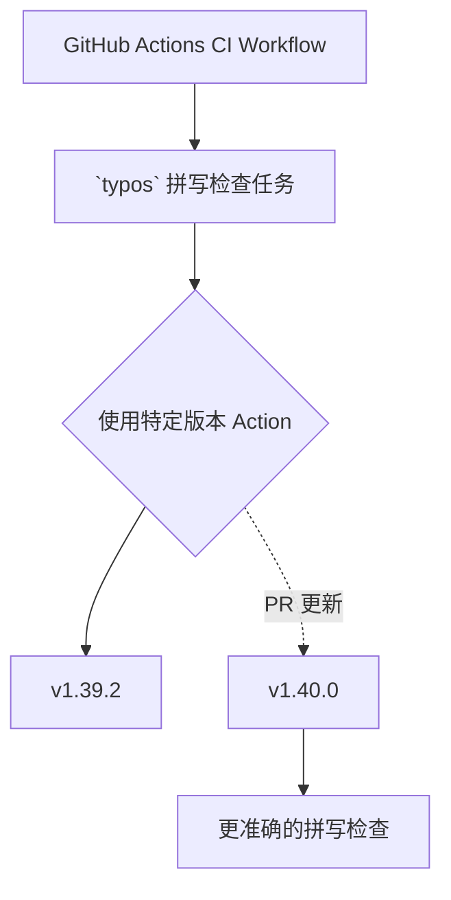

+++
title = "#21993 Bump crate-ci/typos from 1.39.2 to 1.40.0"
date = "2025-12-01T00:00:00"
draft = false
template = "pull_request_page.html"
in_search_index = false

[extra]
current_language = "zh-cn"
available_languages = {"en" = { name = "English", url = "/pull_request/bevy/2025-12/pr-21993-en-20251201" }, "zh-cn" = { name = "中文", url = "/pull_request/bevy/2025-12/pr-21993-zh-cn-20251201" }}
labels = ["C-Dependencies"]
+++

# Title

## Basic Information
- **Title**: Bump crate-ci/typos from 1.39.2 to 1.40.0
- **PR Link**: https://github.com/bevyengine/bevy/pull/21993
- **Author**: app/dependabot
- **Status**: MERGED
- **Labels**: C-Dependencies
- **Created**: 2025-12-01T06:33:41Z
- **Merged**: 2025-12-01T07:22:18Z
- **Merged By**: mockersf

## Description Translation
将 `crate-ci/typos` 从 1.39.2 版本更新至 1.40.0。
<details>
<summary>Release notes</summary>
<p><em>Sourced from <a href="https://github.com/crate-ci/typos/releases">crate-ci/typos's releases</a>.</em></p>
<blockquote>
<h2>v1.40.0</h2>
<h2>[1.40.0] - 2025-11-26</h2>
<h3>Features</h3>
<ul>
<li>Updated the dictionary with the <a href="https://redirect.github.com/crate-ci/typos/issues/1405">November 2025</a> changes</li>
</ul>
</blockquote>
</details>
<details>
<summary>Changelog</summary>
<p><em>Sourced from <a href="https://github.com/crate-ci/typos/blob/master/CHANGELOG.md">crate-ci/typos's changelog</a>.</em></p>
<blockquote>
<h2>[1.40.0] - 2025-11-26</h2>
<h3>Features</h3>
<ul>
<li>Updated the dictionary with the <a href="https://redirect.github.com/crate-ci/typos/issues/1405">November 2025</a> changes</li>
</ul>
</blockquote>
</details>
<details>
<summary>Commits</summary>
<ul>
<li><a href="https://github.com/crate-ci/typos/commit/2d0ce569feab1f8752f1dde43cc2f2aa53236e06"><code>2d0ce56</code></a> chore: Release</li>
<li><a href="https://github.com/crate-ci/typos/commit/efbd900f8db9952781b6bd1ad83baa38ebd153e3"><code>efbd900</code></a> chore: Release</li>
<li><a href="https://github.com/crate-ci/typos/commit/863fd15db8bf16bfe9117ec1a83ea7b6e802e9f3"><code>863fd15</code></a> docs: Update changelog</li>
<li><a href="https://github.com/crate-ci/typos/commit/9a27b16791dd73549457a07f247bc4920f787919"><code>9a27b16</code></a> Merge pull request <a href="https://redirect.github.com/crate-ci/typos/issues/1432">#1432</a> from epage/nov</li>
<li><a href="https://github.com/crate-ci/typos/commit/3dbd9d4eacab7f22586ea581e4d403c3ca9dbbb7"><code>3dbd9d4</code></a> feat(dict): November additions</li>
<li><a href="https://github.com/crate-ci/typos/commit/a1a16c7b7c25d1c27cc750525aada8b9ae68b716"><code>a1a16c7</code></a> Merge pull request <a href="https://redirect.github.com/crate-ci/typos/issues/1427">#1427</a> from deining/bump-github-action</li>
<li><a href="https://github.com/crate-ci/typos/commit/cb8d2e78ff23c82fca05340ed256b04513d022b9"><code>cb8d2e7</code></a> docs: Bump GitHub checkout action in 'github-action.md'</li>
<li><a href="https://github.com/crate-ci/typos/commit/9f99fb8dfe87b8a3441863fb2e5d5da88a2aa9a2"><code>9f99fb8</code></a> docs(ref): Clarify extend-words / extend-identifiers</li>
<li>See full diff in <a href="https://github.com/crate-ci/typos/compare/v1.39.2...v1.40.0">compare view</a></li>
</ul>
</details>
<br />


[](https://docs.github.com/en/github/managing-security-vulnerabilities/about-dependabot-security-updates#about-compatibility-scores)

Dependabot 将自动解决此 PR 中的任何冲突，只要你不亲自修改它。你也可以通过评论 `@dependabot rebase` 来手动触发 rebase。

[//]: # (dependabot-automerge-start)
[//]: # (dependabot-automerge-end)

---

<details>
<summary>Dependabot commands and options</summary>
<br />

You can trigger Dependabot actions by commenting on this PR:
- `@dependabot rebase` will rebase this PR
- `@dependabot recreate` will recreate this PR, overwriting any edits that have been made to it
- `@dependabot merge` will merge this PR after your CI passes on it
- `@dependabot squash and merge` will squash and merge this PR after your CI passes on it
- `@dependabot cancel merge` will cancel a previously requested merge and block automerging
- `@dependabot reopen` will reopen this PR if it is closed
- `@dependabot close` will close this PR and stop Dependabot recreating it. You can achieve the same result by closing it manually
- `@dependabot show <dependency name> ignore conditions` will show all of the ignore conditions of the specified dependency
- `@dependabot ignore this major version` will close this PR and stop Dependabot creating any more for this major version (unless you reopen the PR or upgrade to it yourself)
- `@dependabot ignore this minor version` will close this PR and stop Dependabot creating any more for this minor version (unless you reopen the PR or upgrade to it yourself)
- `@dependabot ignore this dependency` will close this PR and stop Dependabot creating any more for this dependency (unless you reopen the PR or upgrade to it yourself)


</details>

## The Story of This Pull Request

这是一个由自动化工具 `dependabot` 创建的依赖更新 PR，只做了一个简单的修改：将 Bevy 项目中使用的拼写检查工具 `typos` 从版本 `1.39.2` 升级到 `1.40.0`。虽然改动微小，但它展示了大型项目如何通过自动化流程维护代码质量工具的时效性。

**起因与目标**。对于像 Bevy 这样的开源游戏引擎，代码库的拼写正确性不仅关乎文档的可读性，也直接影响代码注释、变量名和提交信息的质量。`typos` 是一个集成在 CI (Continuous Integration) 流程中的 GitHub Action，它能自动扫描代码库中的常见拼写错误。为了确保检查的有效性和准确性，保持该工具处于最新版本是必要的。这个 PR 的目标就是将 `typos` 更新到其最新的次要版本。

**解决方案与实现**。Dependabot 检测到依赖项有新版本可用后，自动提交了这个 PR。更新内容非常具体：仅修改了 CI 配置文件中 `typos` Action 的版本标签。根据 `typos` 的发布说明，`1.40.0` 版本的主要变更是一项功能更新：更新了其内置的字典，包含了2025年11月的新增词汇。这意味着升级后，CI 检查将能识别更多新的或之前可能被误判为拼写错误的正确单词，从而提高检查的准确度，减少误报。

**技术细节与影响**。实现本身极其简单，只涉及一行配置的更改，如下图所示。从工程角度看，这类依赖的持续更新有几个好处。首先，它能确保项目享受到工具的最新改进和错误修复。其次，及时更新次要版本可以平滑升级路径，避免未来因版本差距过大而进行破坏性更新时产生复杂的问题。最后，这体现了良好的项目维护习惯，依赖关系清单的时效性也是项目健康度的一个指标。这个 PR 在创建后不到一小时内就被项目维护者合并，也说明了这类低风险、高收益的更新在成熟项目中被接受的效率很高。

总而言之，这个 PR 是一个典型的维护性更新。它没有引入新功能或修复具体缺陷，而是通过升级一个支撑性工具，持续巩固了代码质量保障体系的基础。在大型协作项目中，这类看似微小的自动化维护工作，对于长期保持代码库的整洁和专业性至关重要。

## Visual Representation



## Key Files Changed

**1. `.github/workflows/ci.yml`**
   - **变更说明**：将 `crate-ci/typos` GitHub Action 的版本从 `v1.39.2` 更新至 `v1.40.0`。这是在 CI 流水线中定义拼写检查任务的步骤。
   - **代码片段**：
```yaml
# 文件: .github/workflows/ci.yml
# Before:
      - name: Check for typos
        uses: crate-ci/typos@v1.39.2

# After:
      - name: Check for typos
        uses: crate-ci/typos@v1.40.0
```
   - **与 PR 目标的关联**：这是本次 PR 的核心和唯一变更。通过修改这一行，项目后续的所有 CI 运行都将使用更新后的 `typos` 工具进行拼写检查。

## Further Reading
1.  **`typos` 项目主页** (https://github.com/crate-ci/typos): 了解该工具的全部功能、配置选项和工作原理。
2.  **GitHub Actions 文档** (https://docs.github.com/en/actions): 学习如何像 Bevy 一样在 CI/CD 流程中配置和使用第三方 Action。
3.  **Dependabot 文档** (https://docs.github.com/en/code-security/dependabot): 了解如何为你的项目配置自动化依赖更新，以保持依赖项的健康状态。