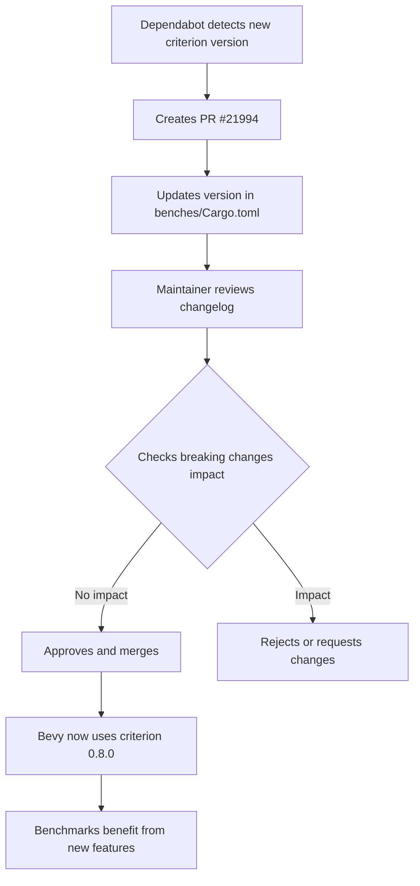

+++
title = "#21994 Update criterion requirement from 0.7.0 to 0.8.0"
date = "2025-12-01T00:00:00"
draft = false
template = "pull_request_page.html"
in_search_index = true

[taxonomies]
list_display = ["show"]

[extra]
current_language = "en"
available_languages = {"en" = { name = "English", url = "/pull_request/bevy/2025-12/pr-21994-en-20251201" }, "zh-cn" = { name = "中文", url = "/pull_request/bevy/2025-12/pr-21994-zh-cn-20251201" }}
labels = ["C-Dependencies"]
+++

# Title
Update criterion requirement from 0.7.0 to 0.8.0

## Basic Information
- **Title**: Update criterion requirement from 0.7.0 to 0.8.0
- **PR Link**: https://github.com/bevyengine/bevy/pull/21994
- **Author**: app/dependabot
- **Status**: MERGED
- **Labels**: C-Dependencies
- **Created**: 2025-12-01T06:35:18Z
- **Merged**: 2025-12-01T07:26:13Z
- **Merged By**: mockersf

## Description Translation
Updates the requirements on [criterion](https://github.com/criterion-rs/criterion.rs) to permit the latest version.
<details>
<summary>Changelog</summary>
<p><em>Sourced from <a href="https://github.com/criterion-rs/criterion.rs/blob/master/CHANGELOG.md">criterion's changelog</a>.</em></p>
<blockquote>
<h2><a href="https://github.com/criterion-rs/criterion.rs/compare/criterion-v0.7.0...criterion-v0.8.0">0.8.0</a> - 2025-11-29</h2>
<h3>BREAKING</h3>
<ul>
<li>Drop async-std support</li>
</ul>
<h3>Changed</h3>
<ul>
<li>Bump MSRV to 1.86, stable to 1.91.1</li>
</ul>
<h3>Added</h3>
<ul>
<li>Add ability to plot throughput on summary page.</li>
<li>Add support for reporting throughput in elements and bytes - <code>Throughput::ElementsAndBytes</code> allows the text summary to report throughput in both units simultaneously.</li>
<li>Add alloca-based memory layout randomisation to mitigate memory effects on measurements.</li>
<li>Add doc comment to benchmark runner in criterion_group macro (removes linter warnings)</li>
</ul>
<h3>Fixed</h3>
<ul>
<li>Fix plotting NaN bug</li>
</ul>
<h3>Other</h3>
<ul>
<li>Remove Master API Docs links temporarily while we restore the docs publishing.</li>
</ul>
<h2>[0.7.0] - 2025-07-25</h2>
<ul>
<li>Bump version of criterion-plot to align dependencies.</li>
</ul>
<h2>[0.6.0] - 2025-05-17</h2>
<h3>Changed</h3>
<ul>
<li>MSRV bumped to 1.80</li>
<li>The <code>real_blackbox</code> feature no longer has any impact. Criterion always uses <code>std::hint::black_box()</code> now.
Users of <code>criterion::black_box()</code> should switch to <code>std::hint::black_box()</code>.</li>
<li><code>clap</code> dependency unpinned.</li>
</ul>
<h3>Fixed</h3>
<ul>
<li>gnuplot version is now correctly detected when using certain Windows binaries/configurations that used to fail</li>
</ul>
<h3>Added</h3>
<ul>
<li>Async benchmarking with Tokio may be done via a <code>tokio::runtime::Handle</code>, not only a <code>tokio::runtime::Runtime</code></li>
</ul>
<h2>[0.5.1] - 2023-05-26</h2>
<h3>Fixed</h3>
<ul>
<li>Quick mode (--quick) no longer crashes with measured times over 5 seconds when --noplot is not active</li>
</ul>
<h2>[0.5.0] - 2023-05-23</h2>
<!-- raw HTML omitted -->
</blockquote>
<p>... (truncated)</p>
</details>
<details>
<summary>Commits</summary>
<ul>
<li><a href="https://github.com/criterion-rs/criterion.rs/commit/b49ade728c064f49cb2a70b0368658a15cf21833"><code>b49ade7</code></a> chore: release v0.8.0</li>
<li>See full diff in <a href="https://github.com/criterion-rs/criterion.rs/compare/criterion-plot-v0.7.0...criterion-v0.8.0">compare view</a></li>
</ul>
</details>
<br />


Dependabot will resolve any conflicts with this PR as long as you don't alter it yourself. You can also trigger a rebase manually by commenting `@dependabot rebase`.

[//]: # (dependabot-automerge-start)
[//]: # (dependabot-automerge-end)

---

<details>
<summary>Dependabot commands and options</summary>
<br />

You can trigger Dependabot actions by commenting on this PR:
- `@dependabot rebase` will rebase this PR
- `@dependabot recreate` will recreate this PR, overwriting any edits that have been made to it
- `@dependabot merge` will merge this PR after your CI passes on it
- `@dependabot squash and merge` will squash and merge this PR after your CI passes on it
- `@dependabot cancel merge` will cancel a previously requested merge and block automerging
- `@dependabot reopen` will reopen this PR if it is closed
- `@dependabot close` will close this PR and stop Dependabot recreating it. You can achieve the same result by closing it manually
- `@dependabot show <dependency name> ignore conditions` will show all of the ignore conditions of the specified dependency
- `@dependabot ignore this major version` will close this PR and stop Dependabot creating any more for this major version (unless you reopen the PR or upgrade to it yourself)
- `@dependabot ignore this minor version` will close this PR and stop Dependabot creating any more for this minor version (unless you reopen the PR or upgrade to it yourself)
- `@dependabot ignore this dependency` will close this PR and stop Dependabot creating any more for this dependency (unless you reopen the PR or upgrade to it yourself)


</details>

## The Story of This Pull Request

This PR is a routine dependency update that follows the standard process for maintaining a Rust project's dependencies. Dependabot, an automated dependency management tool, detected that a newer version of the criterion benchmarking library was available and created this PR to update the dependency specification.

The core change is straightforward: updating the criterion dependency version from 0.7.0 to 0.8.0 in the `benches/Cargo.toml` file. This is a minor version bump according to semantic versioning, which typically indicates backward-compatible new functionality. However, the changelog reveals that this version includes some breaking changes, most notably the removal of async-std support and an increase in the minimum supported Rust version (MSRV) to 1.86.

For Bevy's benchmarking setup, the removal of async-std support is not problematic because Bevy doesn't use async-std for its benchmarking. The MSRV bump is more significant because it requires Rust 1.86 or newer for building and running benchmarks. This aligns with Rust's typical release cycle where dependencies gradually increase their minimum requirements as new language features become stable and widely adopted.

The criterion 0.8.0 release brings several improvements that benefit Bevy's benchmarking workflow. The addition of throughput plotting on the summary page and the new `Throughput::ElementsAndBytes` enum variant allows benchmarks to report throughput in multiple units simultaneously. This is particularly useful for graphics and game engine benchmarks where operations might be measured both in terms of elements processed and bytes transferred.

Another notable improvement is the alloca-based memory layout randomization, which helps mitigate memory effects on measurements. This addresses a common issue in microbenchmarking where memory alignment and layout can introduce measurement noise. By randomizing memory layouts, criterion provides more robust and reliable benchmark results.

The fix for the plotting NaN bug is also important, as NaN values in benchmark results can cause visualization issues and potentially crash the reporting system. This fix ensures that Bevy's benchmark reports remain stable even when edge cases occur.

From an engineering perspective, this update follows the standard practice of keeping dependencies current to benefit from security patches, bug fixes, and performance improvements. The PR was created automatically by Dependabot, reviewed by a maintainer, and merged quickly (within about 50 minutes), indicating that the change was low-risk and compatible with Bevy's existing codebase.

The merge by mockersf suggests that the maintainer verified the compatibility of the new criterion version with Bevy's benchmarking infrastructure. Given that only the version number changed and no code modifications were required in Bevy's benchmark files, the update was likely validated by ensuring that existing benchmarks continued to compile and run successfully.

## Visual Representation



## Key Files Changed

List the most significant files changed in this PR:
- `benches/Cargo.toml` (+1/-1)

**File: benches/Cargo.toml**

1. **What changed and why**: Updated the criterion dependency version from 0.7.0 to 0.8.0 to use the latest version of the benchmarking library with its improvements and fixes.

2. **Code snippets showing the key modifications**:

```toml
# File: benches/Cargo.toml
# Before:
criterion = { version = "0.7.0", features = ["html_reports"] }

# After:
criterion = { version = "0.8.0", features = ["html_reports"] }
```

3. **How these changes relate to the overall purpose of the PR**: This single line change updates the entire benchmarking infrastructure to use the newer criterion version. The `html_reports` feature flag is preserved, ensuring that Bevy continues to generate HTML benchmark reports.

## Further Reading

1. **Criterion.rs Documentation**: https://bheisler.github.io/criterion.rs/book/index.html
2. **Semantic Versioning**: https://semver.org/
3. **Rust Dependency Management with Cargo**: https://doc.rust-lang.org/cargo/guide/dependencies.html
4. **Benchmarking Best Practices**: https://github.com/bheisler/criterion.rs/blob/master/book/src/user_guide/benchmarking.md
5. **Dependabot Documentation**: https://docs.github.com/en/code-security/dependabot/dependabot-version-updates/about-dependabot-version-updates

# Full Code Diff
diff --git a/benches/Cargo.toml b/benches/Cargo.toml
index f569def4edbfd..8940f1eed7105 100644
--- a/benches/Cargo.toml
+++ b/benches/Cargo.toml
@@ -10,7 +10,7 @@ autobenches = false
 [dependencies]
 # The primary crate that runs and analyzes our benchmarks. This is a regular dependency because the
 # `bench!` macro refers to it in its documentation.
-criterion = { version = "0.7.0", features = ["html_reports"] }
+criterion = { version = "0.8.0", features = ["html_reports"] }
 
 [dev-dependencies]
 # Bevy crates