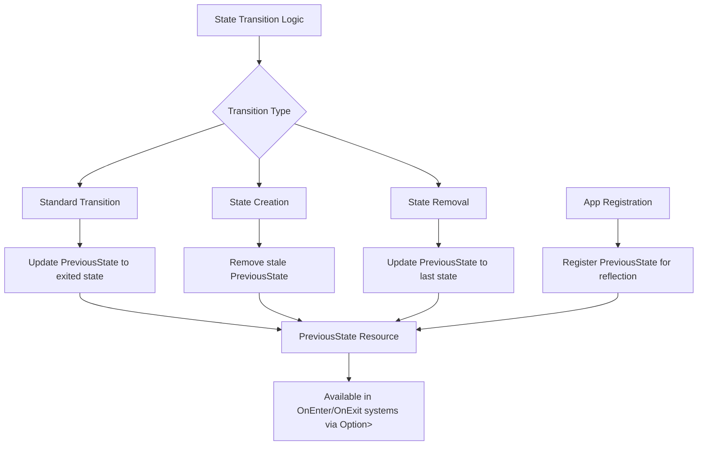

+++
title = "#21995 Add PreviousState Resource accessible in OnEnter"
date = "2025-12-17T00:00:00"
draft = false
template = "pull_request_page.html"
in_search_index = true

[taxonomies]
list_display = ["show"]

[extra]
current_language = "en"
available_languages = {"en" = { name = "English", url = "/pull_request/bevy/2025-12/pr-21995-en-20251217" }, "zh-cn" = { name = "中文", url = "/pull_request/bevy/2025-12/pr-21995-zh-cn-20251217" }}
labels = ["C-Feature", "D-Straightforward", "A-States"]
+++

# Title

## Basic Information
- **Title**: Add PreviousState Resource accessible in OnEnter
- **PR Link**: https://github.com/bevyengine/bevy/pull/21995
- **Author**: Br3nnabee
- **Status**: MERGED
- **Labels**: C-Feature, S-Ready-For-Final-Review, D-Straightforward, A-States
- **Created**: 2025-12-01T09:10:57Z
- **Merged**: 2025-12-17T21:40:21Z
- **Merged By**: alice-i-cecile

## Description Translation
The PR description is already in English, so it is included exactly as-is:

# Objective

- Adds a `PreviousState` resource to track the last active state, making it accessible during state transitions (e.g., in `OnEnter` schedules).
- Fixes #21882.

## Solution

- Added a new `PreviousState<S: States>` resource.
- Updated `internal_apply_state_transition` to manage the lifecycle of `PreviousState`:
    - Standard Transition: Updates `PreviousState` to the exited state.
    - Creation: If a state is initialized (transition from None), any existing `PreviousState` is removed.
    - Removal: If a state is removed, `PreviousState` is updated to preserve the last known state.
- Registered `PreviousState` in `AppExtStates` for reflection and general access.
- Ensured `PreviousState` is available for `OnEnter` systems by using `ApplyDeferred` ordering in `setup_state_transitions_in_world`.

## Testing

- Added a temporary local unit test previous_state_is_tracked_correctly which verifies that `PreviousState` is created, updated, and persisted correctly across multiple state transitions.
- The implementation covered scenarios including standard transitions, state initialization (where no previous state exists), and state removal.
- Don't think I handled all edge cases, would appreciate a second look.

---

## Showcase
You can now access the state you just transitioned from directly in your systems!
```
fn handle_state_refresh<S: FreelyMutableState>(
    prev_state: Option<Res<PreviousState<S>>>, 
    mut next_state: ResMut<NextState<S>>
) {
    if let Some(prev) = prev_state {
        println!("We just came from {:?}", prev.0);
        // Example: revert to previous state
        next_state.set(prev.0.clone());
    }
}

app.add_systems(OnEnter(GameState::Refresh), handle_state_refresh::<GameState>);
```
<sub>*This is my first contribution, would highly appreciate some feedback!*</sub>

## The Story of This Pull Request

This pull request addresses a common requirement in Bevy's state management system: the need to access the previous state value during state transitions. Before this change, developers had to manually track the previous state using custom resources or events, which was error-prone and duplicated across projects.

The core problem was that while Bevy's state system provides clean abstractions for `State<T>` (current state) and `NextState<T>` (queued state transitions), there was no built-in way to know what state you were transitioning *from*. This gap became particularly noticeable when writing systems that run in `OnEnter` schedules, where you might need to perform cleanup or setup based on the previous state.

The developer approached this by creating a new resource type `PreviousState<S>`, which mirrors the existing `State<S>` and `NextState<S>` resources in the state system. This required modifying the core state transition logic in `internal_apply_state_transition` to manage the lifecycle of this new resource across three scenarios:

1. **Standard transitions**: When moving from state A to state B, `PreviousState` should be updated to store A.
2. **State initialization**: When a state is created for the first time (transitioning from `None` to a concrete state), any stale `PreviousState` from prior transitions to `None` should be removed.
3. **State removal**: When removing a state (transitioning to `None`), `PreviousState` should be updated to preserve the last known state.

The implementation needed to ensure `PreviousState` is available during the same frame as the state transition, particularly for systems running in `OnEnter` schedules. This required careful ordering with `ApplyDeferred` in the state transition setup to ensure commands inserting/updating the resource are processed before `OnEnter` systems run.

A key design decision was making `PreviousState` optional in system parameters. Since it doesn't exist until after the first transition, systems must use `Option<Res<PreviousState<S>>>` to access it. This follows the same pattern as other optional resources in Bevy and provides clear ergonomics for developers.

The changes affect multiple layers of the state system:
- **Core resource definition** in `resources.rs`
- **Transition logic** in `transitions.rs` and `state_set.rs`
- **Registration** for reflection in `app.rs`
- **System parameter handling** in `freely_mutable_state.rs`

This implementation maintains consistency with Bevy's existing patterns while adding a valuable piece of state tracking that many applications need. The fact that it handles edge cases like state initialization and removal shows thoughtful consideration of the complete state lifecycle.

## Visual Representation



## Key Files Changed

### 1. `crates/bevy_state/src/state/resources.rs` (+57/-0)
This file defines the new `PreviousState<S>` resource struct with its documentation and implementation.

```rust
/// The previous state of [`State<S>`].
///
/// This resource holds the state value that was active immediately **before** the
/// most recent state transition. It is primarily useful for logic that runs
/// during state exit or transition schedules ([`OnExit`](crate::state::OnExit), [`OnTransition`](crate::state::OnTransition)).
///
/// It is inserted into the world only after the first state transition occurs. It will
/// remain present even if the primary state is removed (e.g., when a
/// [`SubStates`](crate::state::SubStates) or [`ComputedStates`](crate::state::ComputedStates) instance ceases to exist).
///
/// Use `Option<Res<PreviousState<S>>>` to access it, as it will not exist
/// before the first transition.
#[derive(Resource, Debug, Clone, PartialEq, Eq)]
#[cfg_attr(
    feature = "bevy_reflect",
    derive(bevy_reflect::Reflect),
    reflect(Resource, Debug, PartialEq)
)]
pub struct PreviousState<S: States>(pub(crate) S);

impl<S: States> PreviousState<S> {
    /// Get the previous state.
    pub fn get(&self) -> &S {
        &self.0
    }
}

impl<S: States> Deref for PreviousState<S> {
    type Target = S;

    fn deref(&self) -> &Self::Target {
        &self.0
    }
}
```

This change creates a new resource type that mirrors the `State<S>` resource pattern, with proper documentation and ergonomic access methods.

### 2. `crates/bevy_state/src/state/transitions.rs` (+26/-2)
This file contains the core state transition logic that was modified to manage the `PreviousState` resource lifecycle.

```rust
pub(crate) fn internal_apply_state_transition<S: States>(
    mut event: MessageWriter<StateTransitionEvent<S>>,
    mut commands: Commands,
    current_state: Option<ResMut<State<S>>>,
    mut previous_state: Option<ResMut<PreviousState<S>>>,
    new_state: Option<S>,
    allow_same_state_transitions: bool,
) {
    match new_state {
        Some(entered) => {
            match current_state {
                Some(mut resource) => {
                    let exited = resource.get().clone();
                    // ... existing transition logic ...
                    
                    // Update PreviousState
                    if let Some(ref mut previous_state) = previous_state {
                        previous_state.0 = exited;
                    } else {
                        commands.insert_resource(PreviousState(exited));
                    }
                }
                None => {
                    // ... existing initialization logic ...
                    
                    // Remove stale PreviousState when state is initialized
                    if previous_state.is_some() {
                        commands.remove_resource::<PreviousState<S>>();
                    }
                }
            };
        }
        None => {
            if let Some(resource) = current_state {
                let exited = resource.get().clone();
                commands.remove_resource::<State<S>>();
                // ... existing removal logic ...
                
                // Update PreviousState
                if let Some(ref mut previous_state) = previous_state {
                    previous_state.0 = exited;
                } else {
                    commands.insert_resource(PreviousState(exited));
                }
            }
        }
    }
}
```

These changes add `previous_state` parameter handling to the transition function and implement the three lifecycle scenarios described in the PR.

### 3. `crates/bevy_state/src/state/state_set.rs` (+10/-4)
This file handles state sets (tuples of states) and needed updates to pass the `previous_state` parameter through the state set machinery.

```rust
// Multiple locations updated to add previous_state parameter
internal_apply_state_transition(message, commands, current_state, previous_state, new_state, false);
```

The changes ensure that the state set system properly propagates the `previous_state` parameter to the underlying transition logic.

### 4. `crates/bevy_state/src/app.rs` (+5/-2)
This file registers the `PreviousState` type for reflection so it can be used with Bevy's reflection system.

```rust
// In AppExtStates implementation for SubStates
self.register_type::<PreviousState<S>>();

// In AppExtStates implementation for FreelyMutableState  
self.register_type::<PreviousState<S>>();
```

These changes ensure `PreviousState` is properly registered alongside other state resources for reflection support.

### 5. `crates/bevy_state/src/lib.rs` (+2/-2)
This file updates the prelude module to export `PreviousState` so it's easily accessible to users.

```rust
pub mod prelude {
    // ...
    pub use crate::state::{
        // ...
        PreviousState,
    };
}
```

This makes the new type available through Bevy's standard prelude import pattern.

## Further Reading

1. **Bevy States Documentation**: The official Bevy documentation on states provides background on the state system this PR extends.
2. **Bevy ECS Resources**: Understanding how resources work in Bevy's ECS is fundamental to using `PreviousState` effectively.
3. **State Machine Patterns**: General state machine patterns in game development help understand why tracking previous state is valuable.
4. **Bevy Reflection System**: The registration changes relate to Bevy's reflection system for editor support and serialization.