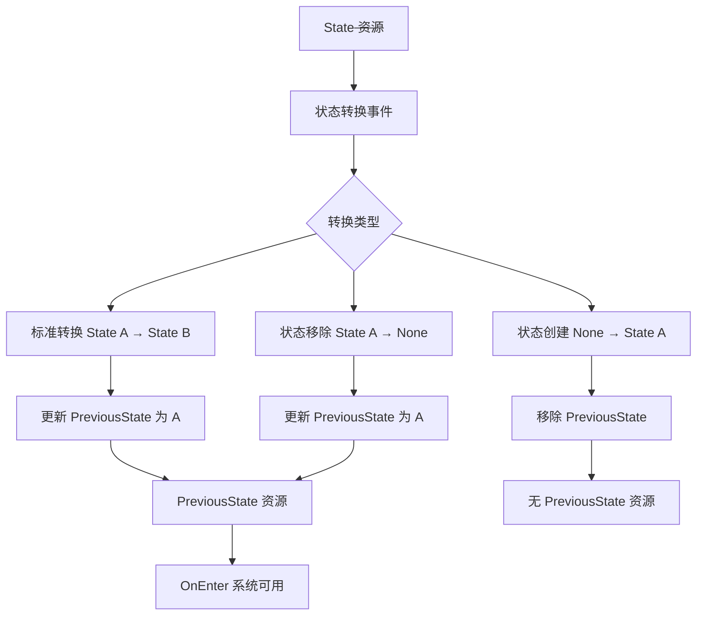

+++
title = "#21995 Add PreviousState Resource accessible in OnEnter"
date = "2025-12-17T00:00:00"
draft = false
template = "pull_request_page.html"
in_search_index = false

[extra]
current_language = "zh-cn"
available_languages = {"en" = { name = "English", url = "/pull_request/bevy/2025-12/pr-21995-en-20251217" }, "zh-cn" = { name = "中文", url = "/pull_request/bevy/2025-12/pr-21995-zh-cn-20251217" }}
+++

# Title

## 基本信息
- **标题**: Add PreviousState Resource accessible in OnEnter
- **PR 链接**: https://github.com/bevyengine/bevy/pull/21995
- **作者**: Br3nnabee
- **状态**: 已合并
- **标签**: C-功能, S-待最终审核, D-直接明了, A-状态管理
- **创建时间**: 2025-12-01T09:10:57Z
- **合并时间**: 2025-12-17T21:40:21Z
- **合并人**: alice-i-cecile

## 描述翻译

### 目标
- 添加一个 `PreviousState` 资源来跟踪上一个活跃状态，使其在状态转换期间（例如在 `OnEnter` 调度中）可访问。
- 修复 #21882 问题。

### 解决方案
- 添加了一个新的 `PreviousState<S: States>` 资源。
- 更新 `internal_apply_state_transition` 以管理 `PreviousState` 的生命周期：
    - 标准转换：将 `PreviousState` 更新为退出的状态。
    - 创建：如果状态被初始化（从 None 转换），则移除任何现有的 `PreviousState`。
    - 移除：如果状态被移除，更新 `PreviousState` 以保留最后已知的状态。
- 在 `AppExtStates` 中注册 `PreviousState` 以便反射和通用访问。
- 通过在 `setup_state_transitions_in_world` 中使用 `ApplyDeferred` 排序，确保 `PreviousState` 在 `OnEnter` 系统中可用。

### 测试
- 添加了一个临时的本地单元测试 `previous_state_is_tracked_correctly`，该测试验证了 `PreviousState` 在多个状态转换中被正确创建、更新和持久化。
- 实现覆盖了包括标准转换、状态初始化（不存在先前状态时）和状态移除的场景。
- 不确定是否处理了所有边界情况，希望得到二次审查。

---

### 演示
现在你可以直接在系统中访问你刚刚转换自的状态！
```rust
fn handle_state_refresh<S: FreelyMutableState>(
    prev_state: Option<Res<PreviousState<S>>>, 
    mut next_state: ResMut<NextState<S>>
) {
    if let Some(prev) = prev_state {
        println!("We just came from {:?}", prev.0);
        // 示例：恢复到之前的状态
        next_state.set(prev.0.clone());
    }
}

app.add_systems(OnEnter(GameState::Refresh), handle_state_refresh::<GameState>);
```

<sub>*这是我的第一次贡献，非常希望得到一些反馈！*</sub>

## 本次 PR 的技术分析

### 问题背景
在 Bevy 的状态管理系统中，开发者经常需要在状态转换时访问之前的（previous）状态值。例如，在进入新状态时，可能需要根据之前的状态来决定某些初始化逻辑。然而，在 PR 修改之前，系统只能在 `StateTransitionEvent` 中获取退出（exited）和进入（entered）状态，但该事件仅在 `OnTransition` 调度中可用。对于在 `OnEnter` 调度中运行的系统，无法直接获取刚刚离开的状态。

Issue #21882 指出了这个限制：当需要根据前一个状态执行某些操作时，开发者需要自行记录状态历史，这增加了代码复杂性。

### 解决方案设计
开发者选择添加一个新的 `PreviousState<S>` 资源来解决这个问题。这个资源的设计有几个关键考虑：
1. 生命周期管理：该资源仅在第一次状态转换后才被插入世界（world）中，避免在初始状态时存在无效数据
2. 三种转换场景的处理：
   - 标准转换（State A → State B）：记录 A 作为 PreviousState
   - 状态创建（None → State A）：移除可能存在的 PreviousState
   - 状态移除（State A → None）：记录 A 作为 PreviousState
3. 资源访问模式：由于资源可能不存在，系统应使用 `Option<Res<PreviousState<S>>>` 来访问

### 实现细节
核心实现在 `transitions.rs` 的 `internal_apply_state_transition` 函数中。这个函数现在接收 `previous_state: Option<ResMut<PreviousState<S>>>` 参数，并根据转换类型更新该资源：

```rust
// 处理标准转换：State A → State B
if let Some(ref mut previous_state) = previous_state {
    previous_state.0 = exited;
} else {
    commands.insert_resource(PreviousState(exited));
}

// 处理状态初始化：None → State A
if previous_state.is_some() {
    commands.remove_resource::<PreviousState<S>>();
}

// 处理状态移除：State A → None
if let Some(ref mut previous_state) = previous_state {
    previous_state.0 = exited;
} else {
    commands.insert_resource(PreviousState(exited));
}
```

这个实现确保了 `PreviousState` 资源的正确生命周期管理。当状态从 None 初始化时，任何现有的 `PreviousState` 都会被移除，因为在这种情况下"上一个状态"的概念是不明确的。

### 系统集成
为了让 `PreviousState` 资源在整个状态系统中可用，开发者需要更新多个组件：

1. **FreelyMutableState 系统**（`freely_mutable_state.rs`）：修改了 `apply_state_transition` 函数，传递 `previous_state` 参数
2. **StateSet 系统**（`state_set.rs`）：更新了状态集的转换逻辑，确保嵌套状态也能正确传播 `previous_state`
3. **调度设置**（`transitions.rs`）：在 `setup_state_transitions_in_world` 中添加了 `ApplyDeferred` 排序，确保 `PreviousState` 在 `OnEnter` 系统执行前就已更新

```rust
// 确保 PreviousState 在 OnEnter 系统前可用
schedule.add_systems(
    (
        apply_state_transition::<S>.in_set(StateTransitionSystems),
        apply_deferred
            .after(StateTransitionSystems)
            .before(run_enter::<S>),
    )
        .chain(),
);
```

### 技术考量
这个实现有几个值得注意的技术特点：

1. **可选资源模式**：通过使用 `Option<Res<PreviousState<S>>>`，系统可以安全地处理资源不存在的情况，这是一种在 Bevy 中处理动态资源的常见模式
2. **状态移除时的持久性**：即使主状态被移除（例如 `SubStates` 或 `ComputedStates` 实例不再存在），`PreviousState` 仍然保留，这为状态恢复提供了可能
3. **反射支持**：通过 `AppExtStates` trait 注册 `PreviousState` 以支持反射，确保该资源可以与其他 Bevy 功能（如序列化、编辑器集成）协同工作

### 影响与改进
这个 PR 为主流状态管理添加了一个重要的功能。现在开发者可以：
- 在 `OnEnter` 系统中访问上一个状态
- 实现状态回退逻辑
- 根据前一个状态执行条件初始化

从实现质量来看，这个 PR 展示了良好的关注点分离：状态转换逻辑集中在 `internal_apply_state_transition` 中，而 `PreviousState` 资源的管理作为该逻辑的自然扩展。

## 组件关系图



## 关键文件变更

### 1. `crates/bevy_state/src/state/resources.rs` (+57/-0)
添加了 `PreviousState` 资源的定义和实现。

```rust
// 新添加的 PreviousState 结构体
#[derive(Resource, Debug, Clone, PartialEq, Eq)]
#[cfg_attr(
    feature = "bevy_reflect",
    derive(bevy_reflect::Reflect),
    reflect(Resource, Debug, PartialEq)
)]
pub struct PreviousState<S: States>(pub(crate) S);

impl<S: States> PreviousState<S> {
    /// 获取上一个状态
    pub fn get(&self) -> &S {
        &self.0
    }
}

impl<S: States> Deref for PreviousState<S> {
    type Target = S;

    fn deref(&self) -> &Self::Target {
        &self.0
    }
}
```

### 2. `crates/bevy_state/src/state/transitions.rs` (+26/-2)
修改了状态转换的核心逻辑以管理 `PreviousState` 资源。

```rust
// 修改后的函数签名，添加了 previous_state 参数
pub(crate) fn internal_apply_state_transition<S: States>(
    mut event: MessageWriter<StateTransitionEvent<S>>,
    mut commands: Commands,
    current_state: Option<ResMut<State<S>>>,
    mut previous_state: Option<ResMut<PreviousState<S>>>,  // 新增参数
    new_state: Option<S>,
    allow_same_state_transitions: bool,
) {
    // ... 状态转换逻辑
}
```

### 3. `crates/bevy_state/src/state/state_set.rs` (+10/-4)
更新了状态集系统以传递 `PreviousState` 资源。

```rust
// 在状态集转换闭包中添加 previous_state 参数
|mut event: MessageWriter<StateTransitionEvent<T>>,
 commands: Commands,
 current_state: Option<ResMut<State<T>>>,
 previous_state: Option<ResMut<PreviousState<T>>>,  // 新增
 state_set: Option<Res<State<S::RawState>>>| {
    // ... 状态集转换逻辑
}
```

### 4. `crates/bevy_state/src/app.rs` (+5/-2)
在应用扩展中注册 `PreviousState` 以便反射支持。

```rust
impl AppExtStates for SubApp {
    fn init_state<S: States + FreelyMutableState>(&mut self) -> &mut Self {
        self.register_type::<S>();
        self.register_type::<State<S>>();
        self.register_type::<NextState<S>>();
        self.register_type::<PreviousState<S>>();  // 新增注册
        // ... 其他注册
        self
    }
}
```

### 5. `crates/bevy_state/src/lib.rs` (+2/-2)
将 `PreviousState` 添加到预导出模块中，方便开发者使用。

```rust
pub mod prelude {
    // ... 其他导出
    pub use crate::state::{
        last_transition, ComputedStates, EnterSchedules, ExitSchedules, NextState, OnEnter,
        OnExit, OnTransition, PreviousState, State,  // 新增 PreviousState
        // ... 其他导出
    };
}
```

## 进一步阅读
- [Bevy 状态系统文档](https://docs.rs/bevy_state/latest/bevy_state/)
- [Bevy ECS 资源系统](https://docs.rs/bevy_ecs/latest/bevy_ecs/system/trait.Resource.html)
- [状态模式在游戏开发中的应用](https://gameprogrammingpatterns.com/state.html)