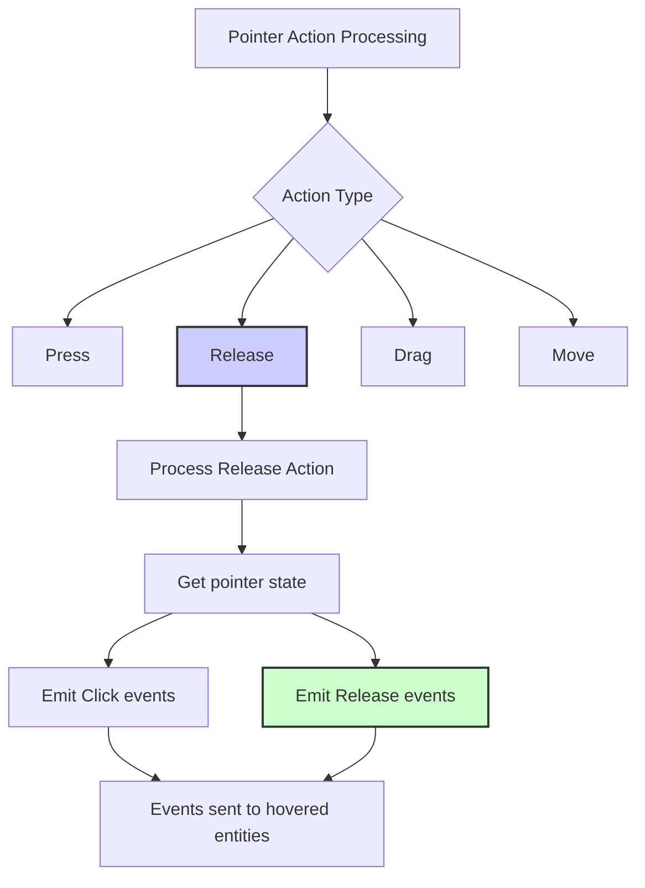

+++
title = "#21996 Fix comment in `pointer_events`"
date = "2025-12-07T00:00:00"
draft = false
template = "pull_request_page.html"
in_search_index = true

[taxonomies]
list_display = ["show"]

[extra]
current_language = "en"
available_languages = {"en" = { name = "English", url = "/pull_request/bevy/2025-12/pr-21996-en-20251207" }, "zh-cn" = { name = "中文", url = "/pull_request/bevy/2025-12/pr-21996-zh-cn-20251207" }}
labels = ["C-Docs", "D-Trivial", "A-Picking"]
+++

# Fix comment in `pointer_events`

## Basic Information
- **Title**: Fix comment in `pointer_events`
- **PR Link**: https://github.com/bevyengine/bevy/pull/21996
- **Author**: ickshonpe
- **Status**: MERGED
- **Labels**: C-Docs, D-Trivial, S-Ready-For-Final-Review, A-Picking
- **Created**: 2025-12-01T10:59:02Z
- **Merged**: 2025-12-07T23:15:57Z
- **Merged By**: mockersf

## Description Translation
**Objective**

Comment from `bevy_picking::events::pointer_events`:
```
                // Emit Click and Up events on all the previously hovered entities.
```

The event is named `Release`, not `Up`.

**Solution**

Replace `Up` with `Release`.

## The Story of This Pull Request

This pull request addresses a straightforward but important documentation issue in the Bevy game engine's picking system. The change is minimal - a single word correction in a code comment - but it demonstrates the importance of maintaining accurate documentation, especially in systems where event naming and behavior are critical for understanding the codebase.

The issue was discovered in the `pointer_events` function within Bevy's picking system. This system handles mouse and touch interactions, translating raw input events into higher-level pointer events that game logic can respond to. The function processes different pointer actions - press, release, drag, etc. - and emits corresponding events to entities in the scene.

In the specific section of code handling `PointerAction::Release`, there was an inconsistency between the actual event name and the documentation. The code comment stated "Emit Click and Up events", but the event being emitted is actually named `Release`, not `Up`. This might seem like a minor discrepancy, but in a codebase used by many developers, such inconsistencies can lead to confusion, especially for those trying to understand the event system by reading through the source code.

The correction is important because:
1. **Event naming consistency**: Bevy uses specific event names throughout its API, and `Release` is the established term for pointer release events
2. **Code comprehension**: Developers reading the comment while debugging or learning the system would be misled
3. **Documentation accuracy**: Accurate comments help maintain code quality and reduce the learning curve for new contributors

The fix itself is simple - changing "Up" to "Release" in the comment. However, this small change helps maintain the overall quality of the codebase. Accurate documentation, even at the level of inline comments, is particularly important in game engines where multiple systems interact and where developers often need to understand event flow for implementing game mechanics.

From an engineering perspective, this type of fix is what makes open-source projects more maintainable. It's a classic example of "fixing the documentation to match the code," which is just as important as fixing code to match requirements. While trivial in implementation, it contributes to the overall health of the project by reducing potential confusion points for developers working with the picking system.

The picking system in Bevy is responsible for translating raw input events (mouse clicks, touch events) into game-relevant interactions with entities in the scene. This involves raycasting to determine which entities are under the pointer, tracking state changes (hover, press, release), and emitting appropriate events. The comment in question appears in the logic that handles what happens when a pointer button is released after being pressed - specifically, it emits `Click` and `Release` events to all previously hovered entities. Accurate documentation of this behavior helps developers understand when and where these events are triggered.

## Visual Representation



## Key Files Changed

**crates/bevy_picking/src/events.rs** - This file contains the event handling logic for Bevy's picking system. The change is a documentation fix in the `pointer_events` function.

### Key Modification:
The change corrects a comment in the code that handles the `PointerAction::Release` case. The comment was incorrectly referring to an "Up" event when the actual event name is "Release".

**Code Before:**
```rust
// Emit Click and Up events on all the previously hovered entities.
```

**Code After:**
```rust
// Emit Click and Release events on all the previously hovered entities.
```

This change aligns the comment with the actual code behavior. The function emits `PointerClick` and `PointerRelease` events, not "Up" events. The correction ensures that developers reading the code won't be confused by mismatched terminology when trying to understand the event flow in the picking system.

## Further Reading

1. **Bevy Picking System Documentation**: For a comprehensive understanding of Bevy's picking system and event handling
2. **Event-Driven Architecture**: Understanding how event systems work in game engines
3. **Code Documentation Best Practices**: The importance of maintaining accurate comments and documentation in large codebases
4. **Input Handling in Game Engines**: How modern game engines process and abstract user input events
5. **Rust Documentation Standards**: Rust-specific documentation practices and conventions