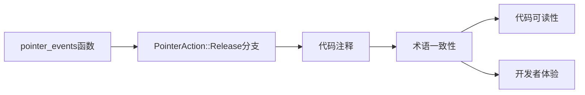

+++
title = "#21996 修复 `pointer_events` 中的注释"
date = "2025-12-07T00:00:00"
draft = false
template = "pull_request_page.html"
in_search_index = false

[extra]
current_language = "zh-cn"
available_languages = {"en" = { name = "English", url = "/pull_request/bevy/2025-12/pr-21996-en-20251207" }, "zh-cn" = { name = "中文", url = "/pull_request/bevy/2025-12/pr-21996-zh-cn-20251207" }}
+++

# Fix comment in `pointer_events`

## Basic Information
- **标题**: 修复 `pointer_events` 中的注释
- **PR链接**: https://github.com/bevyengine/bevy/pull/21996
- **作者**: ickshonpe
- **状态**: 已合并
- **标签**: C-Docs, D-Trivial, S-Ready-For-Final-Review, A-Picking
- **创建时间**: 2025-12-01T10:59:02Z
- **合并时间**: 2025-12-07T23:15:57Z
- **合并者**: mockersf

## 描述翻译

### 目标

来自 `bevy_picking::events::pointer_events` 的注释：
```
                // Emit Click and Up events on all the previously hovered entities.
```

事件名称是 `Release`，而不是 `Up`。

### 解决方案

将 `Up` 替换为 `Release`。

## 这个Pull Request的故事

这是一个小而重要的文档修复，体现了开源项目中即使是最小的细节也会影响代码的可读性和可维护性。这个PR关注的是Bevy引擎中处理指针事件（pointer events）模块的一个注释错误。

问题的核心在于代码注释与实际代码实现之间存在术语不匹配。在指针事件系统中，当用户释放鼠标按钮时，系统会触发 `PointerAction::Release` 事件。然而，相关注释错误地使用了 `Up` 这个术语，这可能会给阅读代码的开发者带来困惑。

从技术角度分析这个问题：在输入事件处理中，通常有两种术语约定：
- `Press`/`Release`：描述按钮的按下和释放动作
- `Down`/`Up`：描述按钮的状态

Bevy的指针事件系统选择了 `Press`/`Release` 的术语约定。`PointerAction` 枚举中的变体包括 `Press`、`Release`、`Move` 等，都遵循这一约定。注释中使用 `Up` 不仅与代码不一致，也与整个系统的术语约定不符。

这个看似微小的修正实际上很重要，原因有几个：
1. **代码自文档化**：准确的注释是代码自文档化的基础，特别是在像Bevy这样的大型开源项目中
2. **开发者体验**：新开发者或贡献者阅读代码时，术语一致性有助于他们快速理解系统的工作方式
- **代码维护**：在未来的代码重构或功能添加中，准确的注释可以减少误解

查看具体的代码上下文，这个注释位于处理 `PointerAction::Release` 的分支中。该分支负责处理指针按钮释放时的逻辑，包括为之前悬停的实体发射 `Click` 和 `Release` 事件。修正后的注释准确反映了这一行为。

虽然这个修改本身很简单，但它体现了开源项目中一个重要的工作文化：对细节的关注。当多个开发者阅读和维护同一段代码时，即使是注释中的术语不一致也可能导致误解或错误的假设。

从工程角度看，这个修改也展示了好的代码审查流程如何运作。提交者（ickshonpe）发现了这个不一致性，提出了简单的修复，然后经过审查和合并（由mockersf完成）。整个流程中，社区成员共同努力保持代码质量。

这个PR被标记为"D-Trivial"（琐碎），因为它只涉及注释修改而不影响功能，但正是这样的琐碎修正累积起来，才构成了高质量的代码库。它也被标记为"C-Docs"（文档）和"A-Picking"（拾取系统），准确反映了修改的性质和影响范围。

## 视觉表示



## 关键文件更改

### `crates/bevy_picking/src/events.rs`

**变更说明**：
这个文件包含了指针事件系统的核心逻辑。唯一的修改是修复了一个注释中的术语错误，将"Up"更正为"Release"，以匹配实际的事件名称。

**代码片段**：
```rust
// 修改前：
// Emit Click and Up events on all the previously hovered entities.

// 修改后：
// Emit Click and Release events on all the previously hovered entities.
```

**与PR目的的关系**：
这个修改直接实现了PR的目标：修正注释中的术语不一致性，使其准确反映代码实际发射的`Release`事件，而不是错误的`Up`事件。

## 完整代码差异
```diff
diff --git a/crates/bevy_picking/src/events.rs b/crates/bevy_picking/src/events.rs
index 4528001f0e429..3866d44a42318 100644
--- a/crates/bevy_picking/src/events.rs
+++ b/crates/bevy_picking/src/events.rs
@@ -617,7 +617,7 @@ pub fn pointer_events(
             PointerAction::Release(button) => {
                 let state = pointer_state.get_mut(pointer_id, button);
 
-                // Emit Click and Up events on all the previously hovered entities.
+                // Emit Click and Release events on all the previously hovered entities.
                 for (hovered_entity, hit) in previous_hover_map
                     .get(&pointer_id)
                     .iter()
```

## 进一步阅读

对于想要了解更多相关概念的读者，建议参考以下资源：

1. **Bevy引擎文档**：了解Bevy的输入系统架构
   - [Bevy Input System](https://bevyengine.org/learn/book/input/)

2. **代码注释最佳实践**：学习如何编写有效的代码注释
   - [Google's Engineering Practices Documentation on Code Comments](https://google.github.io/eng-practices/review/developer/comments.html)

3. **事件驱动编程模式**：理解事件系统的设计原理
   - [Event-Driven Architecture Patterns](https://learn.microsoft.com/en-us/azure/architecture/patterns/event-driven)

4. **开源项目贡献指南**：了解如何为开源项目做出贡献，包括文档改进
   - [First Contributions GitHub Repository](https://github.com/firstcontributions/first-contributions)