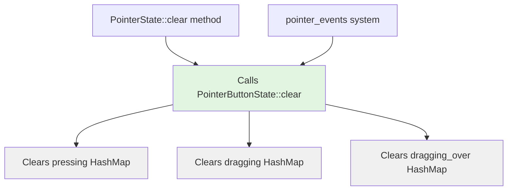

+++
title = "#21997 `PointerbuttonState::clear`"
date = "2025-12-02T00:00:00"
draft = false
template = "pull_request_page.html"
in_search_index = true

[taxonomies]
list_display = ["show"]

[extra]
current_language = "en"
available_languages = {"en" = { name = "English", url = "/pull_request/bevy/2025-12/pr-21997-en-20251202" }, "zh-cn" = { name = "中文", url = "/pull_request/bevy/2025-12/pr-21997-zh-cn-20251202" }}
labels = ["D-Trivial", "C-Code-Quality", "A-Picking"]
+++

# Title

## Basic Information
- **Title**: `PointerbuttonState::clear`
- **PR Link**: https://github.com/bevyengine/bevy/pull/21997
- **Author**: ickshonpe
- **Status**: MERGED
- **Labels**: D-Trivial, C-Code-Quality, S-Needs-Review, A-Picking
- **Created**: 2025-12-01T12:23:20Z
- **Merged**: 2025-12-01T23:37:45Z
- **Merged By**: mockersf

## Description Translation

# Objective

To clear the `PointerButtonState`, `clear` is called on each of its individual fields holding the button state data. Instead add a `clear` method to `PointerButtonState`.

## Solution

Add a `clear` method to `PointerButtonState` to clear its data.

## The Story of This Pull Request

This PR addresses a code quality issue in Bevy's picking system, specifically in how pointer button state is cleared. The picking system tracks pointer interactions like clicks and drags, and manages state for different pointer buttons across various UI elements.

The problem was that when clearing the `PointerButtonState` struct, the code was manually calling `.clear()` on each of its three internal collections: `pressing`, `dragging`, and `dragging_over`. This approach worked but violated the DRY (Don't Repeat Yourself) principle and made the code less maintainable. Every time the state needed to be cleared, the same three lines of code had to be written.

The author identified that this pattern appeared in two places in the codebase: in the `PointerState::clear` method and in the `pointer_events` system function. Both locations were clearing the same three fields in the same way. This repetition meant that if the internal structure of `PointerButtonState` ever changed (for example, adding a fourth collection), developers would need to remember to update both locations.

The solution implemented was straightforward and followed good software engineering practices: add a `clear` method to the `PointerButtonState` struct that encapsulates the clearing logic. This method clears all three internal collections in one operation. The existing code was then refactored to call this new method instead of manually clearing each field.

This change demonstrates several important software engineering concepts:

1. **Encapsulation**: By adding a method to the struct that handles its own state management, we keep the clearing logic close to the data it operates on. This follows the principle that a type should be responsible for managing its own internal state.

2. **Single Source of Truth**: With the `clear` method in place, there's now only one place in the codebase that knows exactly how to clear a `PointerButtonState`. If the internal structure changes in the future, only this method needs to be updated.

3. **Improved API Design**: The `PointerButtonState` struct now has a more complete and intuitive API. Users of this struct don't need to know about its internal field structure to clear it; they can simply call the `clear` method.

4. **Reduced Cognitive Load**: Developers reading the code no longer need to parse three lines of clearing logic; they can see `state.clear()` and immediately understand what's happening.

The implementation is minimal but effective. The `clear` method is added to the `impl PointerButtonState` block, and it simply calls `.clear()` on each of the three HashMap fields. The existing code in two locations is updated to use this new method.

This change also has the benefit of making the code more self-documenting. The method is documented with a clear comment: "Clears all press and drag data tracked for this button on its pointer." This gives developers a quick understanding of what the method does without needing to examine the implementation details.

From a performance perspective, there's no change - the same operations are executed, just through a different code path. The compiler will likely inline the method calls, resulting in identical machine code to the previous implementation.

The PR was labeled as "trivial" (D-Trivial) and "code quality" (C-Code-Quality), which accurately reflects its nature. It's a small, focused improvement that makes the codebase more maintainable without changing any functionality. The picking system (A-Picking) benefits from cleaner, more maintainable code that will be easier to work with in the future.

## Visual Representation



## Key Files Changed

**File: `crates/bevy_picking/src/events.rs`** (+11/-6)

This file contains the event handling and state management for Bevy's picking system. The changes focus on the `PointerButtonState` struct, which tracks the state of pointer buttons (like mouse buttons) during picking operations.

**Key Changes:**

1. **Added `clear` method to `PointerButtonState`**:
   - A new method was added to the `impl PointerButtonState` block
   - The method clears all three internal state collections

2. **Refactored existing code to use the new method**:
   - Updated `PointerState::clear` method to call `state.clear()` instead of clearing each field individually
   - Updated `pointer_events` system function to use the new method

**Code Snippets:**

```rust
// Before (no clear method existed, and clearing was done manually):
// In PointerState::clear method:
state.pressing.clear();
state.dragging.clear();
state.dragging_over.clear();

// In pointer_events system:
state.pressing.clear();
state.dragging.clear();
state.dragging_over.clear();

// After (with the new clear method):
impl PointerButtonState {
    /// Clears all press and drag data tracked for this button on its pointer.
    pub fn clear(&mut self) {
        self.pressing.clear();
        self.dragging.clear();
        self.dragging_over.clear();
    }
}

// In PointerState::clear method:
state.clear();

// In pointer_events system:
state.clear();
```

## Further Reading

For developers interested in learning more about the concepts demonstrated in this PR:

1. **DRY Principle**: The "Don't Repeat Yourself" principle is a fundamental software development concept that encourages reducing repetition of code patterns.
   
2. **Encapsulation in Rust**: The Rust programming language emphasizes encapsulation through its module system and visibility controls (`pub` keyword). This PR demonstrates good encapsulation practice.

3. **Bevy's ECS Architecture**: Understanding how Bevy's Entity Component System works can help contextualize how the picking system fits into the larger framework. The `pointer_events` system is part of Bevy's ECS-based architecture.

4. **Code Refactoring Patterns**: This PR is an example of the "Extract Method" refactoring pattern, where repeated code is extracted into a single method.

5. **Rust HashMap API**: The `.clear()` method used in this PR is part of Rust's standard library HashMap API, which removes all entries from the map.

# Full Code Diff
```
diff --git a/crates/bevy_picking/src/events.rs b/crates/bevy_picking/src/events.rs
index 4528001f0e429..4fb10121efde8 100644
--- a/crates/bevy_picking/src/events.rs
+++ b/crates/bevy_picking/src/events.rs
@@ -351,6 +351,15 @@ pub struct PointerButtonState {
     pub dragging_over: HashMap<Entity, HitData>,
 }
 
+impl PointerButtonState {
+    /// Clears all press and drag data tracked for this button on its pointer.
+    pub fn clear(&mut self) {
+        self.pressing.clear();
+        self.dragging.clear();
+        self.dragging_over.clear();
+    }
+}
+
 /// State for all pointers.
 #[derive(Debug, Clone, Default, Resource)]
 pub struct PointerState {
@@ -379,9 +388,7 @@ impl PointerState {
     pub fn clear(&mut self, pointer_id: PointerId) {
         for button in PointerButton::iter() {
             if let Some(state) = self.pointer_buttons.get_mut(&(pointer_id, button)) {
-                state.pressing.clear();
-                state.dragging.clear();
-                state.dragging_over.clear();
+                state.clear();
             }
         }
     }
@@ -699,9 +706,7 @@ pub fn pointer_events(
                 }
 
                 // Finally, we can clear the state of everything relating to presses or drags.
-                state.pressing.clear();
-                state.dragging.clear();
-                state.dragging_over.clear();
+                state.clear();
             }
             // Moved
             PointerAction::Move { delta } => {
```