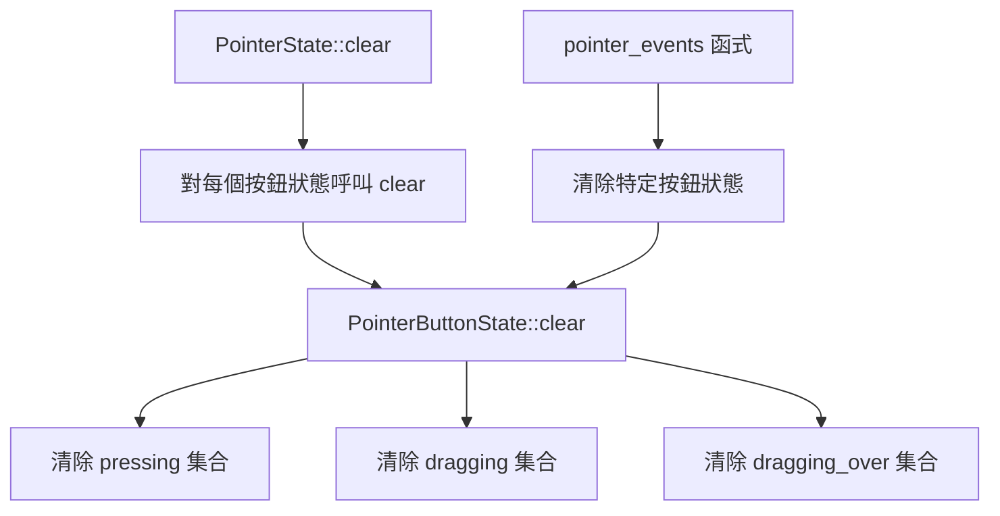

+++
title = "#21997 PointerbuttonState::clear"
date = "2025-12-02T00:00:00"
draft = false
template = "pull_request_page.html"
in_search_index = false

[extra]
current_language = "zh-cn"
available_languages = {"en" = { name = "English", url = "/pull_request/bevy/2025-12/pr-21997-en-20251202" }, "zh-cn" = { name = "中文", url = "/pull_request/bevy/2025-12/pr-21997-zh-cn-20251202" }}
+++

# Title: PointerbuttonState::clear

## 基本資訊
- **標題**: `PointerbuttonState::clear`
- **PR 連結**: https://github.com/bevyengine/bevy/pull/21997
- **作者**: ickshonpe
- **狀態**: 已合併
- **標籤**: D-Trivial, C-Code-Quality, S-Needs-Review, A-Picking
- **建立時間**: 2025-12-01T12:23:20Z
- **合併時間**: 2025-12-01T23:37:45Z
- **合併者**: mockersf

## 描述翻譯

**目標**

要清除 `PointerButtonState` 的內容，原本需要分別對其保存按鈕狀態資料的各個欄位呼叫 `clear` 方法。現在改為在 `PointerButtonState` 上新增一個 `clear` 方法。

**解決方案**

為 `PointerButtonState` 新增一個 `clear` 方法來清除其資料。

## 本次 Pull Request 的故事

這個 Pull Request 是一個關於程式碼品質 (code quality) 的簡單改進，目的是消除重複的程式碼並提高可維護性。問題的核心在於 `PointerButtonState` 結構體的清除邏輯分散在多處。

在現有程式碼中，`PointerButtonState` 包含了三個欄位：`pressing`、`dragging` 和 `dragging_over`。每當需要清除一個指標 (pointer) 的按鈕狀態時，都需要分別對這三個欄位呼叫 `.clear()` 方法。這個清除邏輯在程式碼中出現了兩次：一次在 `PointerState::clear` 方法中，另一次在 `pointer_events` 函式內部。這種重複不僅增加了程式碼行數，也提高了未來維護的複雜度。如果需要修改清除邏輯（例如增加新的欄位），就必須在多個地方進行相同的修改，容易遺漏並導致錯誤。

解決方案很直接：將清除這三個欄位的邏輯封裝到 `PointerButtonState` 結構體自身的一個方法中。這種封裝 (encapsulation) 是物件導向程式設計 (object-oriented programming) 和軟體工程中的一個基本原則。它將資料和操作該資料的行為放在一起，使得呼叫端的程式碼更簡潔，意圖更清晰，並且將實現細節隱藏起來。

具體的實作是在 `PointerButtonState` 的 `impl` 區塊中新增一個 `clear` 方法。這個方法接收一個可變的 `self` 引用（`&mut self`），並依次對三個內部集合呼叫 `clear`。如此一來，原本呼叫三個 `clear` 的地方，現在只需呼叫一個 `state.clear()`。

這個改動雖然小，但帶來了幾個好處：
1.  **消除重複**：清除邏輯現在只存在於一個地方。
2.  **提高可讀性**：`state.clear()` 比三行獨立的清除操作更能明確表達意圖。
3.  **增強可維護性**：未來若 `PointerButtonState` 的內部結構發生變化（例如新增或刪除需要清除的欄位），只需修改這個 `clear` 方法即可，無需搜尋和修改所有使用到的地方。

從工程角度來看，這是一個典型的 "提取方法" (extract method) 重構。它不改變任何外部行為（功能保持不變），只改善內部結構。這類重構有助於保持程式碼庫的整潔，降低技術負債 (technical debt)，並為未來的開發奠定更好的基礎。

## 視覺化表示



## 主要變更的檔案

- `crates/bevy_picking/src/events.rs` (+11/-6)

### 檔案詳情

**crates/bevy_picking/src/events.rs**
這個檔案包含了 Bevy 引擎中與點擊 (picking) 相關的事件處理邏輯。主要的變更是為 `PointerButtonState` 結構體新增了一個 `clear` 方法，並在兩個原本重複清除邏輯的地方改用這個新方法。

**變更內容：**

1.  **新增 `PointerButtonState::clear` 方法**：
    ```rust
    impl PointerButtonState {
        /// Clears all press and drag data tracked for this button on its pointer.
        pub fn clear(&mut self) {
            self.pressing.clear();
            self.dragging.clear();
            self.dragging_over.clear();
        }
    }
    ```
    *變更說明*：在 `PointerButtonState` 的實現區塊中，新增了一個公開的 `clear` 方法。該方法負責清除結構體內部所有三個 `HashMap` 類型的欄位。這個方法將原本分散的清除操作集中到一處。

2.  **在 `PointerState::clear` 方法中改用新的 `clear`**：
    ```rust
    // 修改前：
    if let Some(state) = self.pointer_buttons.get_mut(&(pointer_id, button)) {
        state.pressing.clear();
        state.dragging.clear();
        state.dragging_over.clear();
    }

    // 修改後：
    if let Some(state) = self.pointer_buttons.get_mut(&(pointer_id, button)) {
        state.clear();
    }
    ```
    *變更說明*：`PointerState::clear` 方法會遍歷所有按鈕，並清除每個按鈕的狀態。修改後，它直接呼叫新增的 `state.clear()` 方法，使程式碼更簡潔。

3.  **在 `pointer_events` 函式中改用新的 `clear`**：
    ```rust
    // 修改前：
    // Finally, we can clear the state of everything relating to presses or drags.
    state.pressing.clear();
    state.dragging.clear();
    state.dragging_over.clear();

    // 修改後：
    // Finally, we can clear the state of everything relating to presses or drags.
    state.clear();
    ```
    *變更說明*：在處理指標事件的函式中，當需要清除狀態時，也改為呼叫統一的 `state.clear()` 方法。

這些修改與本次 PR 的目標完全一致：通過為 `PointerButtonState` 增加一個 `clear` 方法來封裝清除邏輯，消除程式碼重複，提升程式碼品質。

## 延伸閱讀

- **重構：改善既有程式的設計 (Refactoring: Improving the Design of Existing Code)** by Martin Fowler：這本書是重構技術的經典，其中「提取方法」是常用的技巧之一。
- **Rust 程式設計語言 (The Rust Programming Language)**：關於 Rust 的 `impl` 區塊和方法語法的官方說明。
- **DRY 原則 (Don't Repeat Yourself)**：一個基本的軟體開發原則，旨在減少重複的資訊和邏輯。
- **封裝 (Encapsulation)**：物件導向程式設計的基本概念之一，將資料和操作資料的方法綁定在一起。