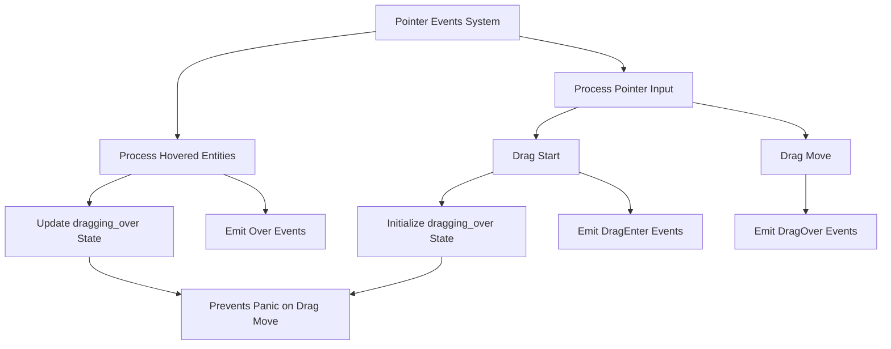

+++
title = "#21999 Fix dragging-over panic"
date = "2025-12-03T00:00:00"
draft = false
template = "pull_request_page.html"
in_search_index = true

[taxonomies]
list_display = ["show"]

[extra]
current_language = "en"
available_languages = {"en" = { name = "English", url = "/pull_request/bevy/2025-12/pr-21999-en-20251203" }, "zh-cn" = { name = "中文", url = "/pull_request/bevy/2025-12/pr-21999-zh-cn-20251203" }}
labels = ["C-Bug", "P-Crash", "C-Code-Quality", "P-Regression", "M-Migration-Guide", "A-Picking"]
+++

# Title: Fix dragging-over panic

## Basic Information
- **Title**: Fix dragging-over panic
- **PR Link**: https://github.com/bevyengine/bevy/pull/21999
- **Author**: ickshonpe
- **Status**: MERGED
- **Labels**: C-Bug, P-Crash, C-Code-Quality, S-Ready-For-Final-Review, P-Regression, M-Migration-Guide, A-Picking
- **Created**: 2025-12-01T15:40:09Z
- **Merged**: 2025-12-03T01:28:36Z
- **Merged By**: alice-i-cecile

## Description

### Objective

Problems:

* If a drag starts over a hovered entity, `picking_events` doesn't add the hovered entity to the `dragging_over` map in `PointerButtonState`. This causes a panic when the pointer is moved and `picking_events` tries to update the non-existant `dragging_over` state for the hovered entity.

* `DragEnter` isn't dispatched on `DragStart`. This doesn't seem ideal. The drag isn't crossing a geometric boundary, but it is causing the dragged over entities to enter into a dragged over state.

Fixes #21998

### Solution

* Update the `dragging_state` for all hovered entities every frame, before handling any `PointerInput`s.
* Reworked the `DragEnter` dispatch logic.  `DragEnter` now also fires when a drag starts over an already hovered entity.

### Testing

The examples using drag events should no longer panic:

```
cargo run --example standard_widgets --features="experimental_bevy_ui_widgets"
```

```
cargo run --example ui_drag_and_drop
```

## The Story of This Pull Request

This PR fixes a crash in Bevy's picking system that occurred during drag operations. The issue manifested when a user started dragging over an entity that was already being hovered, causing the system to panic when trying to update state for a non-existent entry in the `dragging_over` map.

The problem originated from a timing issue in how `dragging_over` state was managed. In the original implementation, when a drag started, the system would track the entity being dragged but would only add other hovered entities to the `dragging_over` map when those entities first became hovered during the drag operation. This meant that if an entity was already hovered when the drag started, it wouldn't be added to the `dragging_over` map, leading to a panic later when the system tried to update its state.

The fix involved two key changes to the event handling logic in `pointer_events`. First, the code was restructured to consistently update `dragging_over` state for all hovered entities on every frame, rather than only when entities became newly hovered. This ensures that the state map is always properly populated, regardless of when the drag started relative to hover events.

Second, the `DragEnter` event dispatch logic was modified to fire not only when a dragged pointer enters a new entity's bounds, but also when a drag starts over an entity that's already being hovered. This change aligns with user expectations - if an entity is under the pointer when dragging begins, it should receive a `DragEnter` event since it's now being dragged over.

The implementation separates concerns more cleanly: updating `dragging_over` state now happens in a dedicated loop that runs before processing pointer inputs, while event dispatch remains in the appropriate input handling sections. This separation prevents the state management bugs that caused the original panic.

A migration guide was added because this change affects the timing of `DragEnter` events. Systems that rely on `DragEnter` events may now receive them in scenarios where they previously didn't, specifically when a drag starts over an already-hovered entity. Developers need to be aware that their drag-and-drop logic might need adjustments to handle these additional events.

The fix demonstrates good defensive programming practices: by ensuring state is always properly initialized before use, and by aligning event semantics with user expectations rather than just technical boundaries.

## Visual Representation



## Key Files Changed

### `crates/bevy_picking/src/events.rs` (+53/-22)

This file contains the core logic for handling pointer events in Bevy's picking system. The changes restructure how dragging state is managed to prevent panics and ensure proper event dispatch.

**Key Changes:**

1. **Restructured hover processing loop**: The code that processes hovered entities was reorganized to first update `dragging_over` state for all hovered entities, then emit events based on state changes.

**Before:**
```rust
// If the entity is hovered...
for (pointer_id, hovered_entity, hit) in hover_map
    .iter()
    .flat_map(|(id, hashmap)| hashmap.iter().map(|data| (*id, *data.0, data.1.clone())))
{
    // ...but was not hovered last frame...
    if !previous_hover_map
        .get(&pointer_id)
        .iter()
        .any(|e| e.contains_key(&hovered_entity))
    {
        // Possibly send DragEnter events
        for button in PointerButton::iter() {
            let state = pointer_state.get_mut(pointer_id, button);
            
            for drag_target in state.dragging.keys() {
                state.dragging_over.insert(hovered_entity, hit.clone());
                // ... send DragEnter event
            }
        }
    }
}
```

**After:**
```rust
// Iterate all currently hovered entities for each pointer
for (pointer_id, hovered_entity, hit) in hover_map
    .iter()
    .flat_map(|(id, hashmap)| hashmap.iter().map(|data| (*id, *data.0, data.1.clone())))
{
    // For each button update its `dragging_over` state and possibly emit DragEnter events.
    for button in PointerButton::iter() {
        let state = pointer_state.get_mut(pointer_id, button);
        
        // Only update the `dragging_over` state if there is at least one entity being dragged.
        // Only emit DragEnter events for this `hovered_entity`, if it had no previous `dragging_over` state.
        if !state.dragging.is_empty()
            && state
                .dragging_over
                .insert(hovered_entity, hit.clone())
                .is_none()
        {
            for drag_target in state.dragging.keys() {
                // ... send DragEnter event
            }
        }
    }
}
```

2. **Added DragEnter dispatch on DragStart**: When a drag starts, the system now immediately adds all currently hovered entities (except the dragged entity itself) to the `dragging_over` state and emits `DragEnter` events for them.

```rust
// Insert dragging over state and emit DragEnter for hovered entities.
for (hovered_entity, hit) in hover_map
    .get(&pointer_id)
    .iter()
    .flat_map(|h| h.iter().map(|(entity, data)| (*entity, data.to_owned())))
    .filter(|(hovered_entity, _)| *hovered_entity != *press_target)
{
    // Inserting the `dragging_over` state here ensures the `DragEnter` event won't be dispatched twice.
    state.dragging_over.insert(hovered_entity, hit.clone());
    let drag_enter_event = Pointer::new(
        pointer_id,
        location.clone(),
        DragEnter {
            button,
            dragged: *press_target,
            hit: hit.clone(),
        },
        hovered_entity,
    );
    commands.trigger(drag_enter_event.clone());
    message_writers.drag_enter_events.write(drag_enter_event);
}
```

3. **Removed redundant state update in DragOver**: The `DragOver` event handling no longer updates the `dragging_over` state since it's now handled in the hover processing loop.

**Before:**
```rust
*state.dragging_over.get_mut(&hovered_entity).unwrap() = hit.clone();
```

**After:**
```rust
// Just emit the event, state was already updated in the hover loop
```

### `release-content/migration-guides/dragenter-now-fires-on-drag-starts.md` (+6/-0)

This new file documents a behavioral change that developers need to be aware of when upgrading.

```markdown
---
title: "DragEnter now fires on drag starts"
pull_requests: [21999]
---

`DragEnter` now also fires when a drag starts over an already hovered entity.
```

## Further Reading

- [Bevy Picking System Documentation](https://docs.rs/bevy_picking/latest/bevy_picking/) - Official documentation for Bevy's picking system
- [Entity Component System Pattern](https://en.wikipedia.org/wiki/Entity_component_system) - Background on the ECS architecture used by Bevy
- [Event-Driven Programming](https://en.wikipedia.org/wiki/Event-driven_programming) - Principles behind Bevy's event system
- [Defensive Programming Techniques](https://en.wikipedia.org/wiki/Defensive_programming) - Programming practices that help prevent crashes like the one fixed in this PR