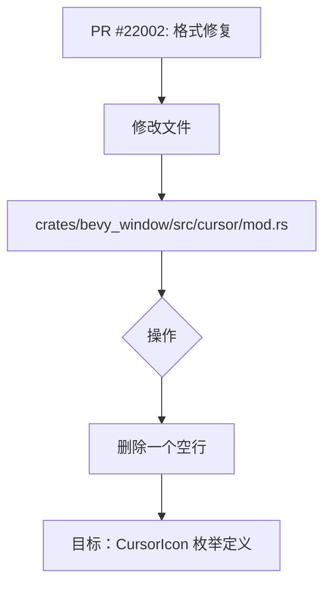

+++
title = "#22002 remove newline between `CursorIcon` struct and its attributes"
date = "2025-12-07T00:00:00"
draft = false
template = "pull_request_page.html"
in_search_index = false

[extra]
current_language = "zh-cn"
available_languages = {"en" = { name = "English", url = "/pull_request/bevy/2025-12/pr-22002-en-20251207" }, "zh-cn" = { name = "中文", url = "/pull_request/bevy/2025-12/pr-22002-zh-cn-20251207" }}
+++

# Title

## 基本信忓
- **标题**: remove newline between `CursorIcon` struct and its attributes
- **PR链接**: https://github.com/bevyengine/bevy/pull/22002
- **作者**: databasedav
- **状态**: MERGED
- **标签**: D-Trivial, S-Ready-For-Final-Review
- **创建时间**: 2025-12-02T04:23:54Z
- **合并时间**: 2025-12-07T19:15:28Z
- **合并者**: mockersf

## 描述翻译
这个Pull Request的目标是修复一个格式问题：`CursorIcon`枚举（enum）及其属性（attributes）之间存在一个多余的空行。

解决方案很简单：直接删除这个空行。

## 这个Pull Request的故事

这个PR的故事很短，但它触及了所有代码库维护中一个共同且重要的方面：代码格式和一致性。

**问题与上下文**
在 `bevy_window` 模块的 `cursor` 子模块中，`CursorIcon` 枚举的定义上方有一个属性宏（attribute macro）。在这个宏和枚举定义之间，存在一个多余的空行。虽然在功能上没有任何影响，但这种不一致的格式可能会影响代码的可读性，尤其是在一个大型、协作的项目中。保持一致的代码风格是降低认知负担、提高代码审查效率以及维护整体代码健康度的关键实践之一。这个问题被标记为“D-Trivial”（琐碎的），因为它不涉及任何逻辑、性能或安全性的变更。

**解决方案与实现**
解决方案非常直接，正如PR标题和描述所示：删除那个多余的空行。开发者没有引入任何复杂的重构，而是选择了最简洁、最精确的修复方式。

具体的改动只涉及一个文件中的一行代码。在 `crates/bevy_window/src/cursor/mod.rs` 文件中，删除了 `#[derive(...)]` 属性宏与 `pub enum CursorIcon {` 声明之间的一个空行。

```rust
// 修改前：
#[cfg_attr(feature = "custom_cursor", derive(Reflect), reflect(Component, Debug, Default, PartialEq, Clone))]
-
pub enum CursorIcon {
```

```rust
// 修改后：
#[cfg_attr(feature = “custom_cursor”, derive(Reflect), reflect(Component, Debug, Default, PartialEq, Clone))]
pub enum CursorIcon {
```

**技术洞见**
这个改动虽然微小，但体现了良好的软件工程习惯：
1.  **属性宏的放置**：在 Rust 中，属性宏（例如 `#[derive(...)]`, `#[cfg(...)]`, `#[cfg_attr(...)]`）通常紧挨着它们所修饰的项（item，如 struct, enum, fn）。移除中间的空行符合这一惯例，使得宏和其作用目标在视觉上关联更紧密。
2.  **`cfg_attr`的使用**：此处的宏是 `#[cfg_attr(...)]`，它是一个条件编译的属性。它仅在 `custom_cursor` 特性（feature）启用时，才会展开为内部的 `#[derive(Reflect)]` 和 `#[reflect(...)]` 属性。保持其格式整洁，对于理解代码的条件编译逻辑有帮助。
3.  **琐碎改动的重要性**：在开源项目中，鼓励贡献者修复此类琐碎问题（如拼写错误、格式问题）有助于新人熟悉贡献流程，并能积少成多地提升代码库的整体质量。

**影响**
这个变更的直接影响纯粹是美学上的：代码看起来更整洁、更符合惯例。它不会改变编译后的二进制文件，也不会影响API或运行时行为。然而，它的间接影响是积极的：它维护了代码风格的一致性标准。在像 Bevy 这样活跃的开源项目中，数以千计的文件和贡献者，强制执行一致的风格（通常通过工具如 `rustfmt`）至关重要。这个手动修复可以被看作是对自动化工具可能遗漏的边缘情况的一种补充，或者是代码在格式化工具规则确立前的遗留状态。

## 视觉呈现



## 关键文件变更

**`crates/bevy_window/src/cursor/mod.rs` (+0/-1)**
此文件是 PR 中唯一修改的文件。改动位于定义 `CursorIcon` 枚举的代码区域。
1.  **变更描述及原因**：删除了 `#[cfg_attr(...)]` 属性宏与 `pub enum CursorIcon {` 之间的一个空行。原因是为了使代码格式更紧凑、更符合 Rust 代码中属性宏通常紧贴修饰项的惯例。
2.  **代码片段**：
    ```rust
    // 变更前（第24-27行）:
    #[cfg_attr(feature = "custom_cursor", derive(Reflect), reflect(Component, Debug, Default, PartialEq, Clone))]
    -
    pub enum CursorIcon {
    ```
    ```rust
    // 变更后:
    #[cfg_attr(feature = "custom_cursor", derive(Reflect), reflect(Component, Debug, Default, PartialEq, Clone))]
    pub enum CursorIcon {
    ```
3.  **与PR目标的关联**：这个精确的删除操作直接实现了PR的目标——移除多余的空行。

## 延伸阅读

*   **Rust 编码风格指南**: 了解 Rust 社区的官方格式约定，可以使用 `rustfmt` 工具自动执行。
    *   链接：https://rust-lang.github.io/api-guidelines/ （参见“Coding conventions”部分）
*   **Rust `#[cfg]` 和 `#[cfg_attr]` 属性**: 深入理解 Rust 的条件编译机制。
    *   Rust 参考手册：https://doc.rust-lang.org/reference/conditional-compilation.html
*   **Bevy 引擎贡献指南**: 了解向 Bevy 项目提交 PR 的流程和规范，其中可能包含代码风格的详细要求。
    *   链接：https://github.com/bevyengine/bevy/blob/main/CONTRIBUTING.md

# Full Code Diff
diff --git a/crates/bevy_window/src/cursor/mod.rs b/crates/bevy_window/src/cursor/mod.rs
index 257950d7f645f..bf9bd5c30449f 100644
--- a/crates/bevy_window/src/cursor/mod.rs
+++ b/crates/bevy_window/src/cursor/mod.rs
@@ -24,7 +24,6 @@ pub use crate::cursor::{CustomCursor, CustomCursorImage};
     derive(Reflect),
     reflect(Component, Debug, Default, PartialEq, Clone)
 )]
-
 pub enum CursorIcon {
     #[cfg(feature = "custom_cursor")]
     /// Custom cursor image.