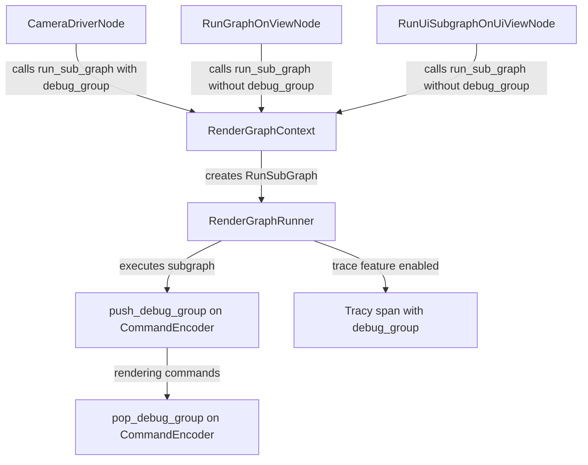

+++
title = "#22003 Add debug_group to render graph"
date = "2025-12-02T00:00:00"
draft = false
template = "pull_request_page.html"
in_search_index = true

[taxonomies]
list_display = ["show"]

[extra]
current_language = "en"
available_languages = {"en" = { name = "English", url = "/pull_request/bevy/2025-12/pr-22003-en-20251202" }, "zh-cn" = { name = "中文", url = "/pull_request/bevy/2025-12/pr-22003-zh-cn-20251202" }}
labels = ["C-Feature", "A-Rendering", "D-Modest"]
+++

# Title
Add debug_group to render graph

## Basic Information
- **Title**: Add debug_group to render graph
- **PR Link**: https://github.com/bevyengine/bevy/pull/22003
- **Author**: IceSentry
- **Status**: MERGED
- **Labels**: C-Feature, A-Rendering, D-Modest, S-Needs-Review
- **Created**: 2025-12-02T05:42:55Z
- **Merged**: 2025-12-02T17:58:12Z
- **Merged By**: mockersf

## Description Translation

# Objective

- Debugging an application with multiple cameras can be really annoying because it's hard to know at a glance which pass is associated with which camera.
- wgpu exposes a feature to set debug_group that will add labels around groups of passes and draw commands

## Solution

- Expose the debug_group feature to the render graph. 
	- Each sub graph can now specify a debug group
- Add a new debug group label to each camera with the camera order and entity id
- I also added the new debug_group to the tracy span so you can more easily see which span is associated with which camera

## Testing

- I tested the  3d_scene and split_screen examples

---

## Showcase

Here's what it looked like before


Here's what the split_screen example looks like inside nvidia nsight with the new debug group labels. You can clearly see each camera clearly identified.


## The Story of This Pull Request

Debugging rendering issues in applications with multiple cameras has always been challenging in Bevy. When developers use tools like NVIDIA Nsight Graphics or RenderDoc to profile their game, they would see a long list of render passes without clear indications of which camera each pass belongs to. This made it difficult to isolate performance problems or rendering artifacts to specific cameras in multi-camera setups like split-screen games or scenes with multiple viewports.

The core issue was that while wgpu (WebGPU API) provides a `push_debug_group` and `pop_debug_group` API for labeling command buffers, Bevy's render graph system wasn't exposing this functionality to the higher-level render graph API. Developers couldn't easily add descriptive labels to groups of render passes.

The solution implemented in this PR exposes wgpu's debug group functionality through Bevy's render graph system. The approach was straightforward: extend the render graph context to accept an optional debug group string when running subgraphs, then pass this string through to the wgpu command encoder. The implementation follows the existing patterns in the codebase for optional parameters.

The first key change was in the `RunSubGraph` struct in `context.rs`, where a new `debug_group` field was added. This field is optional, maintaining backward compatibility for nodes that don't need debug labeling. The `run_sub_graph` method signature was updated to accept this parameter.

In `graph_runner.rs`, the main logic for executing render graphs was modified to use the debug group. When a debug group string is provided, the code calls `push_debug_group` on the command encoder at the start of graph execution and `pop_debug_group` at the end. This creates a labeled scope in the GPU command buffer that profiling tools can display. Additionally, the Tracy span (used for CPU profiling) was enhanced to include the debug group information when available, providing correlation between CPU and GPU profiling data.

The most practical application of this feature was added in `camera_driver_node.rs`, where each camera's render graph execution now gets a descriptive debug label formatted as "Camera {order} ({entity})". This provides immediate visibility in profiling tools, showing exactly which camera entity and rendering order corresponds to each group of render passes.

For nodes that don't need specific debug labels, like `RunGraphOnViewNode` and `RunUiSubgraphOnUiViewNode`, the changes maintain the existing behavior by passing `None` for the debug group parameter. This demonstrates the backward-compatible nature of the API extension.

The impact of this change is significant for developers debugging multi-camera rendering. Previously, they would see indistinguishable render pass groups in profiling tools. Now, each camera's rendering work is clearly labeled, making it much easier to identify which camera is causing performance issues or rendering artifacts. The integration with Tracy spans also helps correlate CPU-side render graph execution with GPU command buffer execution.

From a technical perspective, this implementation shows a clean pattern for exposing low-level GPU debugging features through a high-level render graph abstraction. The optional parameter approach ensures minimal impact on existing code while providing valuable debugging capabilities when needed. The changes also demonstrate proper resource management by ensuring `pop_debug_group` is called even if graph execution encounters errors.

## Visual Representation



## Key Files Changed

### `crates/bevy_render/src/renderer/graph_runner.rs` (+20/-3)
This file contains the main execution logic for render graphs. The changes add support for debug groups in graph execution:

```rust
// Before:
let span = if let Some(label) = &sub_graph {
    info_span!("run_graph", name = format!("{label:?}"))
} else {
    info_span!("run_graph", name = "main_graph")
};

// After:
let span = if let Some(render_label) = &sub_graph {
    let name = format!("{render_label:?}");
    if let Some(debug_group) = debug_group.as_ref() {
        info_span!("run_graph", name = name, debug_group = debug_group)
    } else {
        info_span!("run_graph", name = name)
    }
} else {
    info_span!("run_graph", name = "main_graph")
};
```

The key addition is the push/pop debug group calls around graph execution:
```rust
if let Some(debug_group) = debug_group.as_ref() {
    render_context
        .command_encoder()
        .push_debug_group(debug_group);
}

// ... graph execution logic ...

if debug_group.is_some() {
    render_context.command_encoder().pop_debug_group();
}
```

### `crates/bevy_render/src/render_graph/camera_driver_node.rs` (+9/-1)
This file drives camera rendering. The change adds a descriptive debug label for each camera:

```rust
// Before:
graph.run_sub_graph(camera.render_graph, vec![], Some(sorted_camera.entity))?;

// After:
graph.run_sub_graph(
    camera.render_graph,
    vec![],
    Some(sorted_camera.entity),
    Some(format!(
        "Camera {} ({})",
        sorted_camera.order, sorted_camera.entity
    )),
)?;
```

### `crates/bevy_render/src/render_graph/context.rs` (+3/-0)
This file defines the render graph context API. The change extends the `RunSubGraph` struct and `run_sub_graph` method to support debug groups:

```rust
pub struct RunSubGraph {
    pub sub_graph: InternedRenderSubGraph,
    pub inputs: Vec<SlotValue>,
    pub view_entity: Option<Entity>,
    pub debug_group: Option<String>,  // New field
}

pub fn run_sub_graph(
    &mut self,
    name: impl RenderSubGraph,
    inputs: Vec<SlotValue>,
    view_entity: Option<Entity>,
    debug_group: Option<String>,  // New parameter
) -> Result<(), RunSubGraphError> {
    // ... existing code ...
    self.sender.send_blocking(RunSubGraph {
        sub_graph: name,
        inputs,
        view_entity,
        debug_group,  // Passed through
    });
}
```

### `crates/bevy_render/src/render_graph/node.rs` (+1/-1)
This file contains node implementations. The change updates `RunGraphOnViewNode` to pass `None` for debug_group:

```rust
// Before:
graph.run_sub_graph(self.sub_graph, vec![], Some(graph.view_entity()))?;

// After:
graph.run_sub_graph(self.sub_graph, vec![], Some(graph.view_entity()), None)?;
```

### `crates/bevy_ui_render/src/lib.rs` (+1/-1)
This file contains UI rendering logic. Similar to other nodes, it updates to pass `None` for debug_group:

```rust
// Before:
graph.run_sub_graph(SubGraphUi, vec![], Some(ui_camera_view.0))?;

// After:
graph.run_sub_graph(SubGraphUi, vec![], Some(ui_camera_view.0), None)?;
```

## Further Reading

1. **wgpu Debug Groups Documentation**: [wgpu::CommandEncoder::push_debug_group](https://docs.rs/wgpu/latest/wgpu/struct.CommandEncoder.html#method.push_debug_group)
2. **NVIDIA Nsight Graphics**: [Official documentation on debugging GPU applications](https://developer.nvidia.com/nsight-graphics)
3. **RenderDoc**: [Using RenderDoc for graphics debugging](https://renderdoc.org/docs/index.html)
4. **Bevy Render Graph Documentation**: [Official Bevy render graph documentation](https://bevyengine.org/learn/book/rendering/render-graph/)
5. **Tracy Profiler**: [CPU/GPU profiling tool integration](https://github.com/wolfpld/tracy)