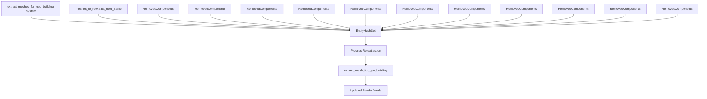

+++
title = "#22004 Fix shadow caster/receiver toggle not working"
date = "2025-12-14T00:00:00"
draft = false
template = "pull_request_page.html"
in_search_index = true

[taxonomies]
list_display = ["show"]

[extra]
current_language = "en"
available_languages = {"en" = { name = "English", url = "/pull_request/bevy/2025-12/pr-22004-en-20251214" }, "zh-cn" = { name = "中文", url = "/pull_request/bevy/2025-12/pr-22004-zh-cn-20251214" }}
labels = ["C-Bug", "A-Rendering", "D-Straightforward"]
+++

# Title

## Basic Information
- **Title**: Fix shadow caster/receiver toggle not working
- **PR Link**: https://github.com/bevyengine/bevy/pull/22004
- **Author**: momoluna444
- **Status**: MERGED
- **Labels**: C-Bug, A-Rendering, S-Ready-For-Final-Review, D-Straightforward
- **Created**: 2025-12-02T05:59:04Z
- **Merged**: 2025-12-14T23:22:16Z
- **Merged By**: alice-i-cecile

## Description Translation

# Objective

Fixes #21582

## Solution

In the original implementation of `extract_meshes_for_gpu_building`, we didn't account for the case where components are removed. This patch adds fixes for all affected components.

## Testing

The example `shadow_caster_receiver` works now.

## The Story of This Pull Request

This PR addresses a specific bug in Bevy's rendering system where toggling shadow caster and shadow receiver components at runtime wasn't working correctly. The issue (#21582) reported that when you remove components like `NotShadowCaster` or `NotShadowReceiver` from entities, the rendering system doesn't properly update to reflect these changes.

The problem occurred in the `extract_meshes_for_gpu_building` system, which is responsible for extracting mesh data from the ECS world and preparing it for GPU rendering. This system handles various components that affect how meshes are rendered, including shadow-related components, visibility ranges, skinned meshes, and others.

The core issue was that the extraction system only tracked entities that needed re-extraction from the `meshes_to_reextract_next_frame` resource and entities that had their `Mesh3d` component removed. However, it didn't account for entities that had other relevant components removed. When components like `NotShadowCaster` were removed at runtime, the extraction system wouldn't re-evaluate those entities, leaving them in their previous state in the render world.

The solution involved adding queries for `RemovedComponents` of all the components that affect mesh extraction. The system now tracks removals of:
- `PreviousGlobalTransform`
- `Lightmap`
- `Aabb`
- `MeshTag`
- `NoFrustumCulling`
- `NotShadowReceiver`
- `TransmittedShadowReceiver`
- `NotShadowCaster`
- `NoAutomaticBatching`
- `VisibilityRange`
- `SkinnedMesh`

The implementation creates a local `EntityHashSet` called `reextract_entities` that collects all entities needing re-extraction. This includes both entities from `meshes_to_reextract_next_frame` and entities that have had any of the tracked components removed. By using a hash set, we ensure each entity is only processed once even if multiple components were removed from it.

Here's the key change in how entities are collected for re-extraction:

```rust
let iters = meshes_to_reextract_next_frame
    .iter()
    .map(|&e| *e)
    .chain(removed_previous_global_transform_query.read())
    .chain(removed_lightmap_query.read())
    .chain(removed_aabb_query.read())
    .chain(removed_mesh_tag_query.read())
    .chain(removed_no_frustum_culling_query.read())
    .chain(removed_not_shadow_receiver_query.read())
    .chain(removed_transmitted_receiver_query.read())
    .chain(removed_not_shadow_caster_query.read())
    .chain(removed_no_automatic_batching_query.read())
    .chain(removed_visibility_range_query.read())
    .chain(removed_skinned_mesh_query.read());

reextract_entities.extend_from_iter(iters);
```

The system then iterates through all entities in `reextract_entities` and calls `extract_mesh_for_gpu_building` for each one, ensuring the render world is updated with the current component state.

This approach is straightforward and aligns with Bevy's ECS patterns. Each `RemovedComponents` query efficiently tracks which entities had a specific component removed since the last time the system ran. By chaining all these queries together, we get a complete list of entities that need re-evaluation.

One important consideration is that we need to clear the `reextract_entities` hash set at the beginning of each run to prevent accumulating entities across frames. This is done with `reextract_entities.clear()` at the start of the system.

The fix is minimal and focused - it doesn't change the overall architecture or add unnecessary complexity. It simply ensures that all relevant component removals are tracked, which was the missing piece in the original implementation. This type of fix is common in ECS-based systems where you need to handle both component additions and removals to keep derived data structures in sync.

The impact is that shadow toggling now works correctly at runtime. Developers can dynamically add or remove `NotShadowCaster` and `NotShadowReceiver` components, and the rendering system will properly update. This is important for games that need dynamic shadow behavior, like characters entering/excluding shadows or objects that can be toggled between shadow casting states.

## Visual Representation



## Key Files Changed

### `crates/bevy_pbr/src/render/mesh.rs` (+49/-2)

This file contains the `extract_meshes_for_gpu_building` system which was modified to handle component removals properly.

**Key changes:**

1. **Added 12 new `RemovedComponents` queries** to track removal of various components that affect mesh extraction.
2. **Added a local `EntityHashSet`** to collect all entities needing re-extraction.
3. **Modified the entity collection logic** to include entities from all removed component queries.

**Code snippet showing the main change:**

```rust
// Before (simplified):
for &mesh_entity in &**meshes_to_reextract_next_frame {
    if let Ok(query_row) = all_meshes_query.get(*mesh_entity) {
        extract_mesh_for_gpu_building(...);
    }
}

// After:
let iters = meshes_to_reextract_next_frame
    .iter()
    .map(|&e| *e)
    .chain(removed_previous_global_transform_query.read())
    .chain(removed_lightmap_query.read())
    .chain(removed_aabb_query.read())
    .chain(removed_mesh_tag_query.read())
    .chain(removed_no_frustum_culling_query.read())
    .chain(removed_not_shadow_receiver_query.read())
    .chain(removed_transmitted_receiver_query.read())
    .chain(removed_not_shadow_caster_query.read())
    .chain(removed_no_automatic_batching_query.read())
    .chain(removed_visibility_range_query.read())
    .chain(removed_skinned_mesh_query.read());

reextract_entities.extend_from_iter(iters);

let mut queue = render_mesh_instance_queues.borrow_local_mut();
for entity in &reextract_entities {
    if let Ok(query_row) = all_meshes_query.get(*entity) {
        extract_mesh_for_gpu_building(...);
    }
}
```

## Further Reading

1. **Bevy ECS Documentation**: Understanding `RemovedComponents` queries and change detection in Bevy's ECS system.
2. **Bevy Rendering Pipeline**: How extraction systems work in Bevy's render graph architecture.
3. **Shadow Mapping Techniques**: Technical details of how shadow casting and receiving works in modern rendering engines.
4. **Entity-Component-System Patterns**: Best practices for handling component additions and removals in ECS architectures.