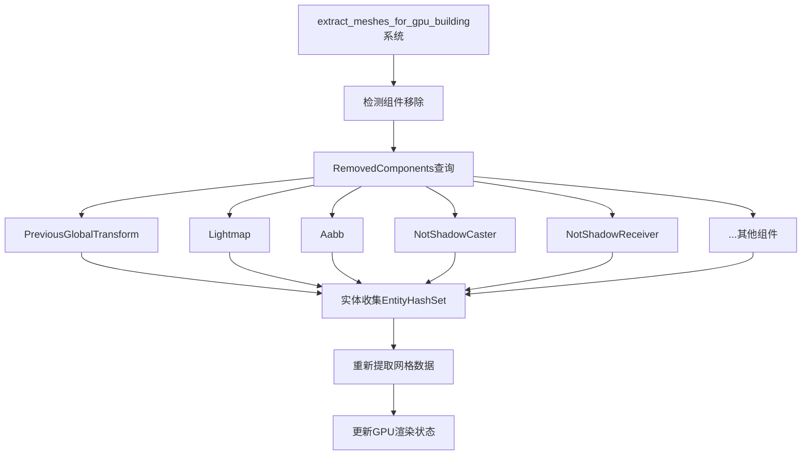

+++
title = "#22004 Fix shadow caster/receiver toggle not working"
date = "2025-12-14T00:00:00"
draft = false
template = "pull_request_page.html"
in_search_index = false

[extra]
current_language = "zh-cn"
available_languages = {"en" = { name = "English", url = "/pull_request/bevy/2025-12/pr-22004-en-20251214" }, "zh-cn" = { name = "中文", url = "/pull_request/bevy/2025-12/pr-22004-zh-cn-20251214" }}
+++

# Title

## 基本信息
- **标题**: Fix shadow caster/receiver toggle not working
- **PR链接**: https://github.com/bevyengine/bevy/pull/22004
- **作者**: momoluna444
- **状态**: 已合并
- **标签**: C-Bug, A-Rendering, S-Ready-For-Final-Review, D-Straightforward
- **创建时间**: 2025-12-02T05:59:04Z
- **合并时间**: 2025-12-14T23:22:16Z
- **合并者**: alice-i-cecile

## 描述翻译

# 目标

修复 #21582

## 解决方案

在`extract_meshes_for_gpu_building`的原始实现中，我们没有考虑到组件被移除的情况。这个补丁为所有受影响的组件添加了修复。

## 测试

示例`shadow_caster_receiver`现在可以正常工作了。

## 该Pull Request的故事

这个PR修复了一个关于阴影投射器（shadow caster）和阴影接收器（shadow receiver）切换功能失效的bug。问题出现在渲染管道的网格提取阶段，系统未能正确处理组件被移除的情况。

问题的核心在于Bevy的渲染管线中负责提取网格数据的系统`extract_meshes_for_gpu_building`。这个系统负责收集所有需要渲染的网格数据，并处理与阴影投射相关的组件状态。然而，原始实现只处理了组件添加和更新的情况，当组件被移除时（例如，将`NotShadowCaster`组件从实体中移除以重新启用阴影投射），系统不会重新提取网格数据，导致阴影状态无法正确更新。

从技术角度看，这是典型的"状态同步"问题。渲染系统需要确保CPU端的ECS状态与GPU端的渲染数据保持同步。当组件的移除操作发生时，系统必须能够检测到这种变化并相应地更新渲染数据。

修复方案直接而有效。开发者扩展了`extract_meshes_for_gpu_building`函数的参数列表，添加了对多个组件类型的`RemovedComponents`查询：

```rust
(
    mut removed_previous_global_transform_query,
    mut removed_lightmap_query,
    mut removed_aabb_query,
    // ... 其他组件类型
): (
    Extract<RemovedComponents<PreviousGlobalTransform>>,
    Extract<RemovedComponents<Lightmap>>,
    Extract<RemovedComponents<Aabb>>,
    // ... 其他组件类型
)
```

关键的实现细节在于如何收集所有需要重新提取的实体。原始代码只从`meshes_to_reextract_next_frame`资源中获取实体列表。修复后的代码创建了一个本地的`EntityHashSet`来合并多个来源的实体：

```rust
let iters = meshes_to_reextract_next_frame
    .iter()
    .map(|&e| *e)
    .chain(removed_previous_global_transform_query.read())
    .chain(removed_lightmap_query.read())
    // ... 其他组件类型的chain调用
    .chain(removed_skinned_mesh_query.read());

reextract_entities.extend_from_iter(iters);
```

这种方法使用了链式迭代器（chained iterators）来合并多个实体来源，然后将其扩展到哈希集合中。这样做的优势是：
1. 自动去重：使用`EntityHashSet`确保每个实体只被处理一次
2. 性能优化：避免了多次重复提取同一实体
3. 代码清晰：通过迭代器链清晰表达了数据来源

修复后，当用户动态修改实体的阴影属性时，系统能够正确检测到组件移除事件，并重新提取网格数据，确保阴影渲染状态得到及时更新。

从架构角度看，这个修复展示了Bevy ECS系统如何处理状态变化的完整生命周期。`RemovedComponents`查询提供了检测组件移除的标准机制，而渲染系统需要确保利用这些信息来保持渲染状态的同步。

这个修复虽然代码改动不大，但解决了实际使用中的重要问题。在游戏开发中，动态调整物体的阴影属性是常见需求，比如在白天/夜晚切换、物体状态变化等场景中。修复确保了这个功能能够可靠工作。

## 可视化表示



## 关键文件更改

### `crates/bevy_pbr/src/render/mesh.rs` (+49/-2)

这个文件包含了主要的修复代码。修改集中在`extract_meshes_for_gpu_building`函数中，添加了对组件移除事件的检测和处理。

**主要修改点：**

1. **导入必要的类型**：
```rust
use bevy_ecs::{
    entity::EntityHashSet,
    // ...
    relationship::RelationshipSourceCollection,
    // ...
};
```

2. **添加RemovedComponents查询参数**：
```rust
(
    mut removed_previous_global_transform_query,
    mut removed_lightmap_query,
    mut removed_aabb_query,
    mut removed_mesh_tag_query,
    mut removed_no_frustum_culling_query,
    mut removed_not_shadow_receiver_query,
    mut removed_transmitted_receiver_query,
    mut removed_not_shadow_caster_query,
    mut removed_no_automatic_batching_query,
    mut removed_visibility_range_query,
    mut removed_skinned_mesh_query,
): (
    Extract<RemovedComponents<PreviousGlobalTransform>>,
    Extract<RemovedComponents<Lightmap>>,
    Extract<RemovedComponents<Aabb>>,
    Extract<RemovedComponents<MeshTag>>,
    Extract<RemovedComponents<NoFrustumCulling>>,
    Extract<RemovedComponents<NotShadowReceiver>>,
    Extract<RemovedComponents<TransmittedShadowReceiver>>,
    Extract<RemovedComponents<NotShadowCaster>>,
    Extract<RemovedComponents<NoAutomaticBatching>>,
    Extract<RemovedComponents<VisibilityRange>>,
    Extract<RemovedComponents<SkinnedMesh>>,
)
```

3. **添加本地EntityHashSet用于实体收集**：
```rust
mut reextract_entities: Local<EntityHashSet>,
```

4. **扩展实体收集逻辑**：
```rust
let iters = meshes_to_reextract_next_frame
    .iter()
    .map(|&e| *e)
    .chain(removed_previous_global_transform_query.read())
    .chain(removed_lightmap_query.read())
    .chain(removed_aabb_query.read())
    .chain(removed_mesh_tag_query.read())
    .chain(removed_no_frustum_culling_query.read())
    .chain(removed_not_shadow_receiver_query.read())
    .chain(removed_transmitted_receiver_query.read())
    .chain(removed_not_shadow_caster_query.read())
    .chain(removed_no_automatic_batching_query.read())
    .chain(removed_visibility_range_query.read())
    .chain(removed_skinned_mesh_query.read());

reextract_entities.extend_from_iter(iters);
```

5. **更新循环使用新的实体集合**：
```rust
for entity in &reextract_entities {
    if let Ok(query_row) = all_meshes_query.get(*entity) {
        // 重新提取网格数据
    }
}
```

## 进一步阅读

对于想要深入了解相关概念的读者，建议参考：

1. **Bevy官方文档 - ECS查询**：了解`RemovedComponents`查询的工作原理
2. **Bevy渲染管线文档**：理解网格提取和GPU数据构建的完整流程
3. **GitHub Issue #21582**：查看原始bug报告和讨论
4. **Rust迭代器模式**：学习Rust中迭代器链和集合操作的最佳实践

# Full Code Diff
<details>
<summary>展开查看完整代码差异</summary>

```diff
diff --git a/crates/bevy_pbr/src/render/mesh.rs b/crates/bevy_pbr/src/render/mesh.rs
index 6e4b3b8aebd8d..4f384dcfeb0e5 100644
--- a/crates/bevy_pbr/src/render/mesh.rs
+++ b/crates/bevy_pbr/src/render/mesh.rs
@@ -17,8 +17,10 @@ use bevy_core_pipeline::{
 use bevy_derive::{Deref, DerefMut};
 use bevy_diagnostic::FrameCount;
 use bevy_ecs::{
+    entity::EntityHashSet,
     prelude::*,
     query::{QueryData, ROQueryItem},
+    relationship::RelationshipSourceCollection,
     system::{lifetimeless::*, SystemParamItem, SystemState},
 };
 use bevy_image::{BevyDefault, ImageSampler, TextureFormatPixelInfo};
@@ -1476,11 +1478,39 @@ pub fn extract_meshes_for_gpu_building(
             )>,
         >,
     >,
+    (
+        mut removed_previous_global_transform_query,
+        mut removed_lightmap_query,
+        mut removed_aabb_query,
+        mut removed_mesh_tag_query,
+        mut removed_no_frustum_culling_query,
+        mut removed_not_shadow_receiver_query,
+        mut removed_transmitted_receiver_query,
+        mut removed_not_shadow_caster_query,
+        mut removed_no_automatic_batching_query,
+        mut removed_visibility_range_query,
+        mut removed_skinned_mesh_query,
+    ): (
+        Extract<RemovedComponents<PreviousGlobalTransform>>,
+        Extract<RemovedComponents<Lightmap>>,
+        Extract<RemovedComponents<Aabb>>,
+        Extract<RemovedComponents<MeshTag>>,
+        Extract<RemovedComponents<NoFrustumCulling>>,
+        Extract<RemovedComponents<NotShadowReceiver>>,
+        Extract<RemovedComponents<TransmittedShadowReceiver>>,
+        Extract<RemovedComponents<NotShadowCaster>>,
+        Extract<RemovedComponents<NoAutomaticBatching>>,
+        Extract<RemovedComponents<VisibilityRange>>,
+        Extract<RemovedComponents<SkinnedMesh>>,
+    ),
     all_meshes_query: Extract<Query<GpuMeshExtractionQuery>>,
     mut removed_meshes_query: Extract<RemovedComponents<Mesh3d>>,
     gpu_culling_query: Extract<Query<(), (With<Camera>, Without<NoIndirectDrawing>)>>,
     meshes_to_reextract_next_frame: ResMut<MeshesToReextractNextFrame>,
+    mut reextract_entities: Local<EntityHashSet>,
 ) {
+    reextract_entities.clear();
+
     let any_gpu_culling = !gpu_culling_query.is_empty();
 
     for render_mesh_instance_queue in render_mesh_instance_queues.iter_mut() {
@@ -1518,9 +1548,26 @@ pub fn extract_meshes_for_gpu_building(
     // because the material hadn't yet been loaded. We reextract such materials
     // on subsequent frames so that `collect_meshes_for_gpu_building` will check
     // to see if their materials have been prepared.
+    let iters = meshes_to_reextract_next_frame
+        .iter()
+        .map(|&e| *e)
+        .chain(removed_previous_global_transform_query.read())
+        .chain(removed_lightmap_query.read())
+        .chain(removed_aabb_query.read())
+        .chain(removed_mesh_tag_query.read())
+        .chain(removed_no_frustum_culling_query.read())
+        .chain(removed_not_shadow_receiver_query.read())
+        .chain(removed_transmitted_receiver_query.read())
+        .chain(removed_not_shadow_caster_query.read())
+        .chain(removed_no_automatic_batching_query.read())
+        .chain(removed_visibility_range_query.read())
+        .chain(removed_skinned_mesh_query.read());
+
+    reextract_entities.extend_from_iter(iters);
+
     let mut queue = render_mesh_instance_queues.borrow_local_mut();
-    for &mesh_entity in &**meshes_to_reextract_next_frame {
-        if let Ok(query_row) = all_meshes_query.get(*mesh_entity) {
+    for entity in &reextract_entities {
+        if let Ok(query_row) = all_meshes_query.get(*entity) {
             extract_mesh_for_gpu_building(
                 query_row,
                 &render_visibility_ranges,
```
</details>