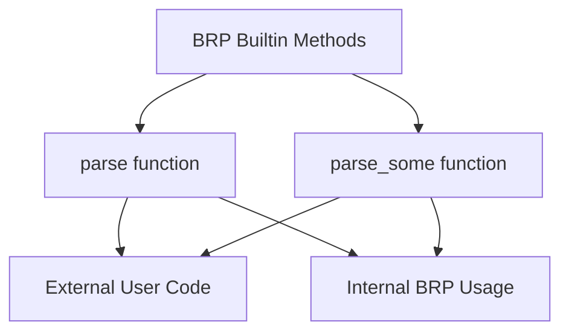

+++
title = "#22005 Make BRP builtins utilities `parse` and `parse_some` public"
date = "2025-12-15T00:00:00"
draft = false
template = "pull_request_page.html"
in_search_index = true

[taxonomies]
list_display = ["show"]

[extra]
current_language = "en"
available_languages = {"en" = { name = "English", url = "/pull_request/bevy/2025-12/pr-22005-en-20251215" }, "zh-cn" = { name = "中文", url = "/pull_request/bevy/2025-12/pr-22005-zh-cn-20251215" }}
labels = ["D-Trivial", "C-Usability", "A-Networking"]
+++

# Title

## Basic Information
- **Title**: Make BRP builtins utilities `parse` and `parse_some` public
- **PR Link**: https://github.com/bevyengine/bevy/pull/22005
- **Author**: Nilirad
- **Status**: MERGED
- **Labels**: D-Trivial, C-Usability, S-Ready-For-Final-Review, A-Networking
- **Created**: 2025-12-02T10:04:45Z
- **Merged**: 2025-12-15T02:38:26Z
- **Merged By**: alice-i-cecile

## Description Translation
# Objective

Builtin BRP methods make constant use of `parse` and `parse_some` in parsing utilities. Making them public allows users to use them in their own code.

## Solution

Make both functions `pub`.

## Testing

I think testing is not necessary, especially since doc strings do not link anywhere.

## The Story of This Pull Request

This pull request addresses a straightforward but practical usability issue in Bevy's remote networking module. The change is minimal but demonstrates an important principle in library design: when internal utility functions provide general-purpose functionality that could benefit external users, exposing them can improve developer ergonomics and reduce code duplication.

In the `bevy_remote` crate, specifically within the BRP (Bevy Remote Protocol) builtin methods implementation, two helper functions were being used extensively for parsing JSON data received over the network. These functions, `parse` and `parse_some`, handle the common task of deserializing `serde_json::Value` objects into typed Rust structures while converting parsing errors into the BRP error format consistently.

The core issue was that these utility functions, despite being well-designed for general JSON parsing with proper error handling, were marked as private (`fn`). This meant that developers implementing custom BRP methods or working with BRP data outside the builtin methods couldn't reuse this logic. They would need to reimplement similar parsing logic, potentially introducing inconsistencies in error handling or code duplication across the codebase.

The implementation approach is elegantly simple: change the visibility modifier from the default private to public by adding the `pub` keyword to both function signatures. This change maintains backward compatibility while expanding the API surface for users. The functions already existed and were well-tested through their use in the builtin methods, so no additional testing was deemed necessary.

Looking at the technical details, `parse` handles direct deserialization of a `Value` into a generic type `T` that implements `Deserialize`, converting `serde_json` errors into `BrpError` with appropriate error codes. The `parse_some` function builds on this by handling optional values, returning an error when `None` is encountered rather than silently accepting missing parameters.

The impact of this change is practical for developers working with Bevy's networking layer. By exposing these utility functions, the Bevy team acknowledges that good internal abstractions often have value beyond their original scope. Developers can now write cleaner, more consistent parsing code in their custom BRP implementations, using the same error handling patterns as the builtin methods.

This PR also highlights an important aspect of Rust crate design: thoughtful consideration of what should be public API. While not every internal helper should be exposed, utility functions that encapsulate common patterns with proper error handling and are already stable through internal use are good candidates for public exposure.

## Visual Representation



## Key Files Changed

`crates/bevy_remote/src/builtin_methods.rs` (+2/-2)

This file contains the BRP builtin methods implementation. The changes are minimal but significant for API usability:

1. **parse function**: Changed from private to public utility for deserializing JSON values with BRP error handling
2. **parse_some function**: Changed from private to public utility for handling optional JSON values

```rust
// File: crates/bevy_remote/src/builtin_methods.rs
// Before:
fn parse<T: for<'de> Deserialize<'de>>(value: Value) -> Result<T, BrpError> {
    serde_json::from_value(value).map_err(|err| BrpError {
        code: error_codes::INVALID_PARAMS,
        message: err.to_string(),
    })
}

// After:
pub fn parse<T: for<'de> Deserialize<'de>>(value: Value) -> Result<T, BrpError> {
    serde_json::from_value(value).map_err(|err| BrpError {
        code: error_codes::INVALID_PARAMS,
        message: err.to_string(),
    })
}
```

```rust
// File: crates/bevy_remote/src/builtin_methods.rs
// Before:
fn parse_some<T: for<'de> Deserialize<'de>>(value: Option<Value>) -> Result<T, BrpError> {
    match value {
        Some(value) => parse(value),
        None => Err(BrpError {
            code: error_codes::INVALID_PARAMS,
            message: "missing params".to_string(),
        }),
    }
}

// After:
pub fn parse_some<T: for<'de> Deserialize<'de>>(value: Option<Value>) -> Result<T, BrpError> {
    match value {
        Some(value) => parse(value),
        None => Err(BrpError {
            code: error_codes::INVALID_PARAMS,
            message: "missing params".to_string(),
        }),
    }
}
```

These changes make both functions available to external users while maintaining their existing behavior and error handling patterns.

## Further Reading

- [Bevy Networking Documentation](https://bevyengine.org/learn/quick-start/ecs/networking/) - Overview of Bevy's networking capabilities
- [serde_json Documentation](https://docs.serde.rs/serde_json/) - JSON serialization/deserialization library used in these functions
- [Rust Visibility and Privacy](https://doc.rust-lang.org/book/ch07-02-defining-modules-to-control-scope-and-privacy.html) - Understanding `pub` vs private visibility
- [Bevy Remote Protocol](https://github.com/bevyengine/bevy/tree/main/crates/bevy_remote) - Source code for the remote module

# Full Code Diff
```diff
diff --git a/crates/bevy_remote/src/builtin_methods.rs b/crates/bevy_remote/src/builtin_methods.rs
index abe8881731fc0..7c3164cb82e15 100644
--- a/crates/bevy_remote/src/builtin_methods.rs
+++ b/crates/bevy_remote/src/builtin_methods.rs
@@ -463,7 +463,7 @@ pub struct BrpQueryRow {
 }
 
 /// A helper function used to parse a `serde_json::Value`.
-fn parse<T: for<'de> Deserialize<'de>>(value: Value) -> Result<T, BrpError> {
+pub fn parse<T: for<'de> Deserialize<'de>>(value: Value) -> Result<T, BrpError> {
     serde_json::from_value(value).map_err(|err| BrpError {
         code: error_codes::INVALID_PARAMS,
         message: err.to_string(),
@@ -472,7 +472,7 @@ fn parse<T: for<'de> Deserialize<'de>>(value: Value) -> Result<T, BrpError> {
 }
 
 /// A helper function used to parse a `serde_json::Value` wrapped in an `Option`.
-fn parse_some<T: for<'de> Deserialize<'de>>(value: Option<Value>) -> Result<T, BrpError> {
+pub fn parse_some<T: for<'de> Deserialize<'de>>(value: Option<Value>) -> Result<T, BrpError> {
     match value {
         Some(value) => parse(value),
         None => Err(BrpError {
```