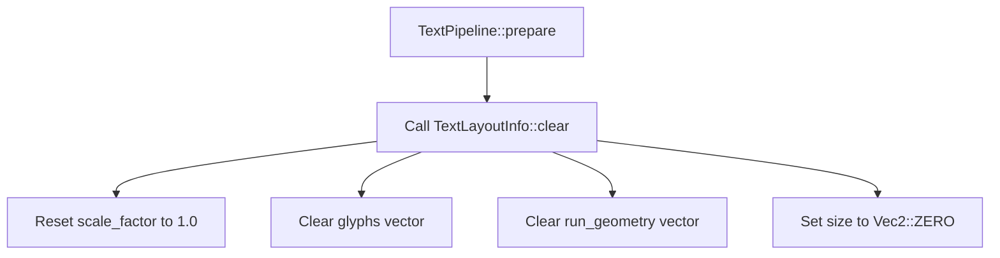

+++
title = "#22006 `TextLayoutInfo::clear`"
date = "2025-12-07T00:00:00"
draft = false
template = "pull_request_page.html"
in_search_index = true

[taxonomies]
list_display = ["show"]

[extra]
current_language = "en"
available_languages = {"en" = { name = "English", url = "/pull_request/bevy/2025-12/pr-22006-en-20251207" }, "zh-cn" = { name = "中文", url = "/pull_request/bevy/2025-12/pr-22006-zh-cn-20251207" }}
labels = ["D-Trivial", "A-Text"]
+++

# Title

## Basic Information
- **Title**: `TextLayoutInfo::clear`
- **PR Link**: https://github.com/bevyengine/bevy/pull/22006
- **Author**: ickshonpe
- **Status**: MERGED
- **Labels**: D-Trivial, S-Ready-For-Final-Review, A-Text
- **Created**: 2025-12-02T13:17:49Z
- **Merged**: 2025-12-07T19:04:50Z
- **Merged By**: mockersf

## Description Translation
**Objective**

Bevy text cosmic text cleanup, add a `clear` method to `TextLayoutInfo`.

**Solution**

Add a `clear` method to `TextLayoutInfo` instead of manual resetting each field

## The Story of This Pull Request

This PR addresses a small but meaningful code quality issue in Bevy's text rendering pipeline. The problem was straightforward: in the `TextPipeline::prepare` method, the code was manually clearing three fields of a `TextLayoutInfo` struct whenever text needed to be re-rendered. This manual approach, while functional, violated the DRY (Don't Repeat Yourself) principle and made the code harder to maintain.

The context here involves Bevy's text rendering system using Cosmic Text. When text needs to be prepared for rendering, the pipeline must clear any existing layout information before computing new layout data. The original implementation did this by individually clearing two vectors and resetting a size field:

```rust
layout_info.glyphs.clear();
layout_info.run_geometry.clear();
layout_info.size = Default::default();
```

This approach had several issues. First, it required the caller to know exactly which fields needed to be cleared. Second, if the `TextLayoutInfo` struct's internal representation changed in the future (for example, adding new fields that also need clearing), every call site would need to be updated. Third, it missed resetting the `scale_factor` field to its default value of 1.0, which could lead to subtle bugs if the struct was being reused.

The solution was simple but effective: add a `clear` method to the `TextLayoutInfo` struct that encapsulates all the clearing logic in one place. The implementation is straightforward:

```rust
pub fn clear(&mut self) {
    self.scale_factor = 1.;
    self.glyphs.clear();
    self.run_geometry.clear();
    self.size = Vec2::ZERO;
}
```

This method does three things: resets `scale_factor` to 1.0, clears both vectors (which retains their allocated capacity for future use), and sets the size to `Vec2::ZERO`. The method is then called from the single location in `TextPipeline::prepare` where the manual clearing was happening.

The engineering trade-off here is minimal. Adding a method adds a small amount of API surface area, but the benefits in terms of code maintainability and correctness outweigh this. The method is `pub` (public), which is appropriate since `TextLayoutInfo` is a public struct and other parts of the codebase might want to reuse this clearing logic.

An important technical detail to note is how the method handles the vectors. It uses `clear()` rather than reassigning to empty vectors. This is intentional: `clear()` retains the allocated capacity of the vectors, which can improve performance when the struct is reused multiple times for text rendering operations of similar size. This is a common optimization pattern in Rust when dealing with reusable buffers.

The impact of this change is primarily about code quality and maintainability. While there's no direct performance improvement (the operations are the same), the change makes the code more robust. If new fields are added to `TextLayoutInfo` in the future that need clearing, they can be added to the `clear` method, and all callers will automatically get the correct behavior. This prevents the bug where `scale_factor` wasn't being reset in the original manual clearing code.

The PR also demonstrates good Rust patterns: encapsulating related operations in methods on the struct they operate on, using `Vec::clear()` for performance when reusing allocations, and providing explicit default values (`Vec2::ZERO` instead of `Default::default()`) for clarity.

## Visual Representation



## Key Files Changed

**crates/bevy_text/src/pipeline.rs** (+11/-3)

This file contains the text rendering pipeline implementation. The changes are minimal but significant:

1. **Added `clear` method to `TextLayoutInfo`**: A new method that encapsulates all the logic for resetting the struct's fields to their default state.

2. **Updated `TextPipeline::prepare`**: Replaced three lines of manual field clearing with a single call to the new `clear` method.

**Key code changes:**

```rust
// Before in TextPipeline::prepare:
layout_info.glyphs.clear();
layout_info.run_geometry.clear();
layout_info.size = Default::default();

// After in TextPipeline::prepare:
layout_info.clear();

// New method added to TextLayoutInfo:
impl TextLayoutInfo {
    /// Clear the layout, retaining capacity
    pub fn clear(&mut self) {
        self.scale_factor = 1.;
        self.glyphs.clear();
        self.run_geometry.clear();
        self.size = Vec2::ZERO;
    }
}
```

The changes relate to the overall purpose of the PR by centralizing the clearing logic, fixing the missing `scale_factor` reset, and improving code maintainability.

## Further Reading

- [Rust Vec::clear() documentation](https://doc.rust-lang.org/std/vec/struct.Vec.html#method.clear) - Explains how `clear()` retains capacity
- [DRY Principle](https://en.wikipedia.org/wiki/Don%27t_repeat_yourself) - Software development principle about avoiding code duplication
- [Bevy Text Rendering](https://bevyengine.org/learn/quick-start/ui/text/) - Bevy's documentation on text rendering
- [Cosmic Text](https://github.com/pop-os/cosmic-text) - The text shaping library used by Bevy