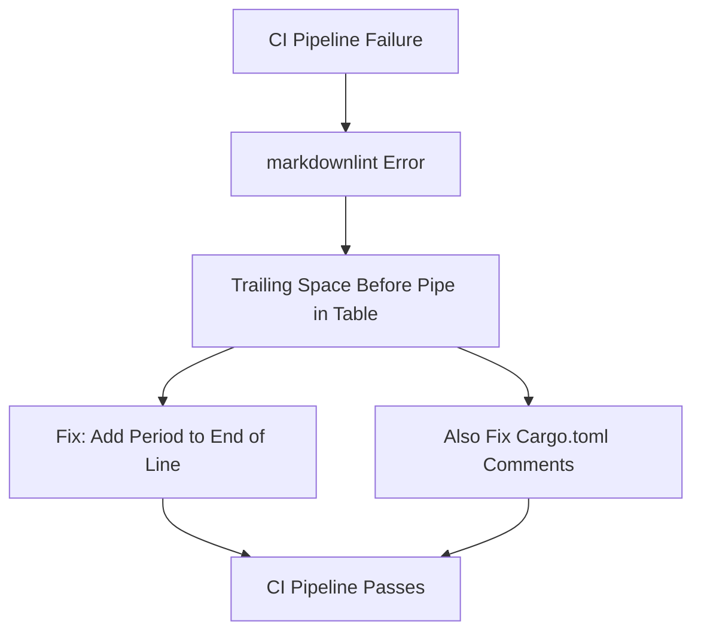

+++
title = "#22008 Fix cargo features lint"
date = "2025-12-02T00:00:00"
draft = false
template = "pull_request_page.html"
in_search_index = true

[taxonomies]
list_display = ["show"]

[extra]
current_language = "en"
available_languages = {"en" = { name = "English", url = "/pull_request/bevy/2025-12/pr-22008-en-20251202" }, "zh-cn" = { name = "中文", url = "/pull_request/bevy/2025-12/pr-22008-zh-cn-20251202" }}
labels = ["C-Docs", "D-Trivial", "A-Build-System"]
+++

# Title
Fix cargo features lint

## Basic Information
- **Title**: Fix cargo features lint
- **PR Link**: https://github.com/bevyengine/bevy/pull/22008
- **Author**: Zeophlite
- **Status**: MERGED
- **Labels**: C-Docs, D-Trivial, A-Build-System, S-Ready-For-Final-Review
- **Created**: 2025-12-02T14:38:18Z
- **Merged**: 2025-12-02T17:26:51Z
- **Merged By**: james7132

## Description Translation

# Objective

`markdownlint` fails on `docs/cargo_features.md` as it doesn't like the space before the pipe at the end of this line

## Solution

- Add a `.`

## Testing

- CI

## The Story of This Pull Request

The Bevy project uses `markdownlint` as part of its continuous integration pipeline to ensure documentation consistency and quality. This tool enforces Markdown formatting rules that help maintain readable and well-structured documentation. When the CI pipeline runs, it checks all Markdown files in the repository against these predefined rules.

In this specific case, the CI pipeline was failing because of a formatting issue in `docs/cargo_features.md`. The `markdownlint` tool detected a violation of the MD013 rule, which specifies that lines in tables should not have trailing spaces before table cell separators (the pipe character `|`). Specifically, three lines in the documentation table had a space character before the closing pipe, which violated this rule.

The developer identified the root cause: the documentation for three renderer features (`2d_bevy_render`, `3d_bevy_render`, and `ui_bevy_render`) had descriptions that ended with a space followed by the table cell separator. The fix was straightforward - add a period to the end of each description line, which both fixed the trailing space issue and improved the grammatical correctness of the documentation.

This fix demonstrates an important aspect of maintaining large projects: even minor formatting issues in documentation can break CI pipelines. While the change itself is small, it ensures that the documentation validation pipeline continues to function correctly, which helps maintain overall code quality. The developer also took the opportunity to fix the same issue in `Cargo.toml` comments, showing attention to consistency across the codebase.

The implementation was minimal and focused. By adding a single period to each of the problematic lines, the developer resolved the linting error without changing any functional code. This approach shows good judgment - when dealing with linting failures, the best solution is often the simplest one that addresses the specific violation while maintaining or improving code quality.

From an engineering perspective, this PR highlights several best practices:

1. **CI pipeline hygiene**: Keeping CI pipelines green is important for developer productivity. When CI fails, it becomes harder to merge new changes and identify real issues.

2. **Documentation quality**: Consistent formatting in documentation improves readability and maintainability. Tools like `markdownlint` help enforce these standards automatically.

3. **Attention to detail**: The developer noticed that the same issue existed in both the documentation and the `Cargo.toml` comments, and fixed both locations for consistency.

The changes were reviewed and merged quickly (within approximately 3 hours), indicating that this was a straightforward fix that clearly addressed the problem. The labels applied to the PR (`C-Docs`, `D-Trivial`, `A-Build-System`) accurately reflect its nature as a documentation fix related to the build system.

## Visual Representation



## Key Files Changed

### `docs/cargo_features.md`

This file contains documentation about Bevy's cargo features. The changes fix markdown lint errors by adding periods to the end of three table cell descriptions that previously had trailing spaces before the pipe character.

**Before:**
```markdown
|2d_bevy_render|Bevy's built-in 2D renderer, built on top of `bevy_render` |
|3d_bevy_render|Bevy's built-in 3D renderer, built on top of `bevy_render` |
|ui_bevy_render|Bevy's built-in UI renderer, built on top of `bevy_render` |
```

**After:**
```markdown
|2d_bevy_render|Bevy's built-in 2D renderer, built on top of `bevy_render`.|
|3d_bevy_render|Bevy's built-in 3D renderer, built on top of `bevy_render`.|
|ui_bevy_render|Bevy's built-in UI renderer, built on top of `bevy_render`.|
```

### `Cargo.toml`

The same documentation issue existed in the comments for feature definitions in `Cargo.toml`. The developer fixed these comments for consistency with the documentation file.

**Before:**
```toml
# COLLECTION: Bevy's built-in 2D renderer, built on top of `bevy_render` 
# COLLECTION: Bevy's built-in 3D renderer, built on top of `bevy_render` 
# COLLECTION: Bevy's built-in UI renderer, built on top of `bevy_render` 
```

**After:**
```toml
# COLLECTION: Bevy's built-in 2D renderer, built on top of `bevy_render`.
# COLLECTION: Bevy's built-in 3D renderer, built on top of `bevy_render`.
# COLLECTION: Bevy's built-in UI renderer, built on top of `bevy_render`.
```

## Further Reading

1. [markdownlint Rules Documentation](https://github.com/DavidAnson/markdownlint/blob/main/doc/Rules.md#md013) - Details about the MD013 rule that was violated in this PR
2. [Bevy's Contributing Guide](https://github.com/bevyengine/bevy/blob/main/CONTRIBUTING.md) - Information about Bevy's development practices and CI requirements
3. [Cargo Features Documentation](https://doc.rust-lang.org/cargo/reference/features.html) - Official Rust documentation on Cargo features
4. [Markdown Table Syntax](https://www.markdownguide.org/extended-syntax/#tables) - Guide to Markdown table formatting
5. [Bevy's CI Configuration](https://github.com/bevyengine/bevy/tree/main/.github/workflows) - The GitHub Actions workflows that run Bevy's CI pipeline