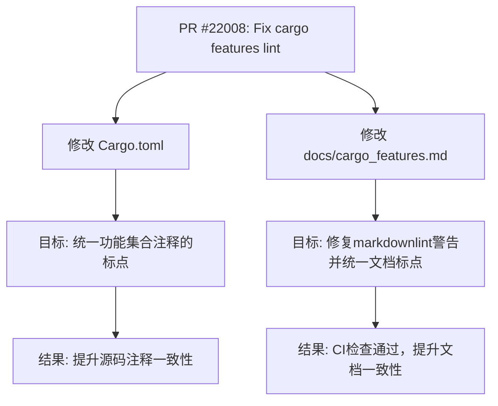

+++
title = "#22008 Fix cargo features lint"
date = "2025-12-02T00:00:00"
draft = false
template = "pull_request_page.html"
in_search_index = false

[extra]
current_language = "zh-cn"
available_languages = {"en" = { name = "English", url = "/pull_request/bevy/2025-12/pr-22008-en-20251202" }, "zh-cn" = { name = "中文", url = "/pull_request/bevy/2025-12/pr-22008-zh-cn-20251202" }}
labels = ["C-Docs", "D-Trivial", "A-Build-System"]
+++

# Title

## Basic Information
- **Title**: Fix cargo features lint
- **PR Link**: https://github.com/bevyengine/bevy/pull/22008
- **Author**: Zeophlite
- **Status**: MERGED
- **Labels**: C-Docs, D-Trivial, A-Build-System, S-Ready-For-Final-Review
- **Created**: 2025-12-02T14:38:18Z
- **Merged**: 2025-12-02T17:26:51Z
- **Merged By**: james7132

## Description Translation
# 目标
`markdownlint` 在检查 `docs/cargo_features.md` 时失败，因为它不接受此行末尾管道符前的空格。

## 解决方案
- 添加一个 `.`

## 测试
- CI

## The Story of This Pull Request

这个PR源于一个非常具体且微小的自动化检查失败。开发者 `Zeophlite` 在贡献代码或运行项目质量检查时，发现持续集成（CI）流程中的 `markdownlint` 工具对项目文档文件 `docs/cargo_features.md` 报错。`markdownlint` 是一套用于确保Markdown文件格式一致性和可读性的静态分析规则集。

问题的根源在于文档中一个描述性表格的某一单元格内，行尾的管道符 `|` 之前存在一个多余的空格字符。对于注重格式严格性的linter工具来说，这种看似无害的空格可能违反了其配置的样式规则（例如，为了确保行末无多余空格，或者保持表格格式的整洁性）。尽管这并不影响文档的渲染效果或功能，但它破坏了自动化检查流程，导致CI构建失败。在一个大型开源项目中，保持CI状态为绿色（即所有检查通过）是重要的，因为它保证了代码库的总体健康度，并确保新的贡献不会引入意外的格式问题。

解决方案极其简单且直接：在引发问题的三个表格单元格描述的末尾添加一个句号。这不仅消除了 `markdownlint` 所警告的“行尾空格前无标点”之类的问题（通过提供一个合法的标点来“终结”该行文本），同时也意外地带来了一致性方面的改进。开发者注意到，在 `Cargo.toml` 文件中，对应功能集合的定义注释也存在着类似的不一致——有的注释行以句号结尾，有的则没有。因此，修复方案被自然地扩展为两部分：
1.  在 `docs/cargo_features.md` 的表格中，为 `2d_bevy_render`, `3d_bevy_render`, `ui_bevy_render` 三行的描述末尾添加句号。
2.  在 `Cargo.toml` 中，同步地为 `2d_bevy_render`, `3d_bevy_render`, `ui_bevy_render` 这三个功能集合的注释行末尾添加句号。

这个改动是一个典型的“琐碎（Trivial）”修复，标注为 `D-Trivial` 和 `S-Ready-For-Final-Review`。它不涉及任何业务逻辑、性能优化或架构调整，纯粹是关于项目维护和代码质量工具链的遵从性。PR在创建后约3小时内被核心维护者 `james7132` 合并，这反映了对这类保持项目整洁性贡献的高效处理。

从工程实践的角度看，这个PR强调了几个要点：
*   **工具链的重要性**：像 `markdownlint` 这样的自动化工具在大型协作项目中对于维护代码和文档风格的一致性至关重要。
*   **细节的重要性**：即使是一个空格或一个标点符号的差异，也可能中断自动化流程，因此细心是必要的。
*   **一致性是持续的过程**：修复一个问题时，顺便检查并修复相关部分的不一致（如同时更新 `Cargo.toml` 中的注释），这是一种良好的习惯，有助于防止“破窗效应”。
*   **维护性贡献的价值**：并非所有贡献都需要是复杂的功能开发。修复lint警告、更新文档和保持代码整洁同样是宝贵的，它们降低了项目的维护负担并提升了整体质量。

## Visual Representation

此PR修改了两个文件中的关联部分，其关系可表示如下：



## Key Files Changed

**1. `Cargo.toml`**
*   **修改原因**：与文档中的修复保持一致性。当在文档中发现相关描述的标点不统一时，开发者追溯到了这些描述的源头——`Cargo.toml` 中功能集合的注释，并对其进行了同样的修正。
*   **关键修改**：为三个功能集合的注释行末尾添加了句号。

```toml
# File: Cargo.toml
# 修改前：
# COLLECTION: Bevy's built-in 2D renderer, built on top of `bevy_render`
# COLLECTION: Bevy's built-in 3D renderer, built on top of `bevy_render`
# COLLECTION: Bevy's built-in UI renderer, built on top of `bevy_render`

# 修改后：
# COLLECTION: Bevy's built-in 2D renderer, built on top of `bevy_render`.
# COLLECTION: Bevy's built-in 3D renderer, built on top of `bevy_render`.
# COLLECTION: Bevy's built-in UI renderer, built on top of `bevy_render`.
```

**2. `docs/cargo_features.md`**
*   **修改原因**：直接解决PR描述中指出的问题——`markdownlint` 因行末格式问题而失败。
*   **关键修改**：在功能说明表格中，为三行的描述末尾添加了句号。

```markdown
# File: docs/cargo_features.md
# 修改前：
|2d_bevy_render|Bevy's built-in 2D renderer, built on top of `bevy_render` |
|3d_bevy_render|Bevy's built-in 3D renderer, built on top of `bevy_render` |
|ui_bevy_render|Bevy's built-in UI renderer, built on top of `bevy_render` |

# 修改后：
|2d_bevy_render|Bevy's built-in 2D renderer, built on top of `bevy_render`.|
|3d_bevy_render|Bevy's built-in 3D renderer, built on top of `bevy_render`.|
|ui_bevy_render|Bevy's built-in UI renderer, built on top of `bevy_render`.|
```

## Further Reading

1.  **markdownlint**: 了解这个强大的Markdown风格检查器和lint工具。其GitHub仓库（[github.com/DavidAnson/markdownlint](https://github.com/DavidAnson/markdownlint)）提供了完整的规则说明和配置方法。
2.  **Bevy Engine Contribution Guide**: 对于想向Bevy贡献代码的开发者，阅读官方贡献指南可以帮助理解项目的工作流程、代码风格要求和CI检查标准。
3.  **Cargo Features Specification**: Rust官方文档中关于`Cargo.toml`的`[features]`章节，对于理解Bevy如何使用功能集合来管理可选依赖和模块化架构很有帮助。