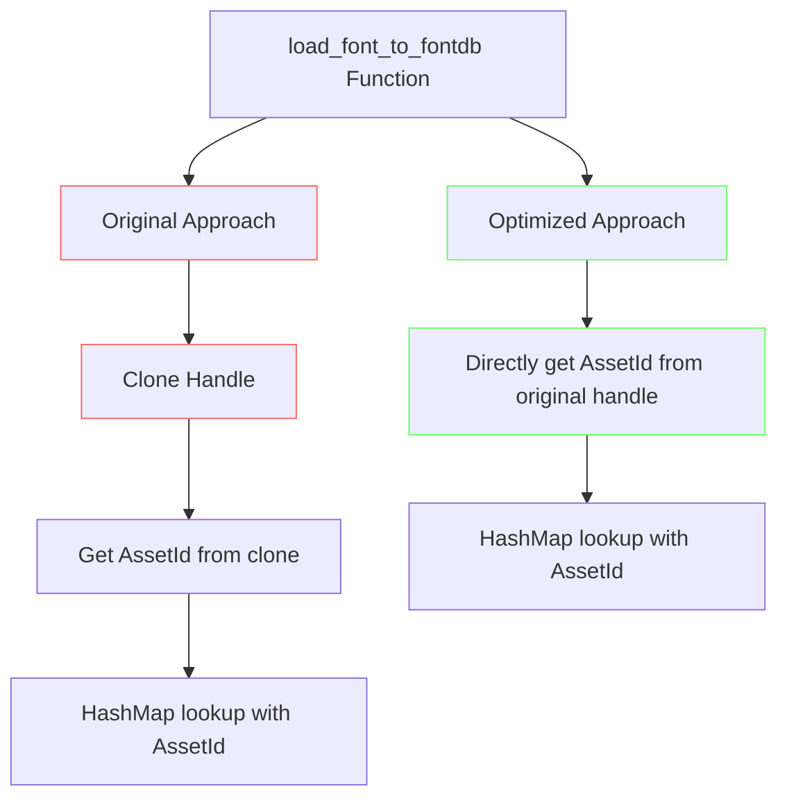

+++
title = "#22009 remove unnecessary clone from `load_font_to_fontdb`"
date = "2025-12-02T00:00:00"
draft = false
template = "pull_request_page.html"
in_search_index = true

[taxonomies]
list_display = ["show"]

[extra]
current_language = "en"
available_languages = {"en" = { name = "English", url = "/pull_request/bevy/2025-12/pr-22009-en-20251202" }, "zh-cn" = { name = "中文", url = "/pull_request/bevy/2025-12/pr-22009-zh-cn-20251202" }}
labels = ["D-Trivial", "C-Performance", "C-Code-Quality", "A-Text"]
+++

# Title
## remove unnecessary clone from `load_font_to_fontdb`

## Basic Information
- **Title**: remove unnecessary clone from `load_font_to_fontdb`
- **PR Link**: https://github.com/bevyengine/bevy/pull/22009
- **Author**: ickshonpe
- **Status**: MERGED
- **Labels**: D-Trivial, C-Performance, C-Code-Quality, A-Text
- **Created**: 2025-12-02T16:40:45Z
- **Merged**: 2025-12-02T17:28:27Z
- **Merged By**: james7132

## Description Translation
# Objective

`load_font_to_fontdb` clones the font handle needlessly.

## Solution

Just call id() on it.

## The Story of This Pull Request

This PR addresses a simple but impactful performance optimization in Bevy's text rendering system. The issue was found in the `load_font_to_fontdb` function within the text pipeline module, which handles font loading and caching for text rendering.

The problem was straightforward: the function was unnecessarily cloning a `Handle<Font>` object when it only needed the underlying `AssetId<Font>` for hash map lookup operations. In Bevy's asset system, `Handle<T>` is a reference-counted handle to an asset, and cloning it involves atomic reference counting operations that carry overhead.

Here's the issue in the original code:
```rust
let font_handle = text_font.font.clone();  // Unnecessary clone
let (face_id, family_name) = map_handle_to_font_id
    .entry(font_handle.id())  // We only need the id()
    .or_insert_with(|| {
        // Loading logic
    });
```

The developer recognized that the clone operation was redundant because:
1. The code immediately calls `.id()` on the cloned handle
2. The hash map key is `AssetId<Font>`, not `Handle<Font>`
3. The original `text_font.font` handle remains unchanged and could be used directly

The solution was to eliminate the intermediate clone and directly extract the `AssetId`:
```rust
let font_id = text_font.font.id();  // No clone needed
let (face_id, family_name) = map_handle_to_font_id.entry(font_id).or_insert_with(|| {
    // Loading logic now uses font_id directly
});
```

This change demonstrates several important engineering principles. First, it shows attention to micro-optimizations in performance-critical paths - text rendering is a common operation in games and applications, and even small overheads can accumulate. Second, it exemplifies the importance of understanding the underlying data structures: by recognizing that the hash map key was `AssetId<Font>` rather than `Handle<Font>`, the developer could avoid unnecessary work.

The implementation change is minimal but effective. The function now directly accesses the `AssetId` from the original handle, bypassing the atomic reference counting operations involved in cloning. This reduces memory allocation and atomic operations in a function that may be called frequently during text rendering operations.

From an architectural perspective, this change reinforces the pattern of using `AssetId` as the canonical identifier for assets in cache and lookup structures, rather than the heavier `Handle` wrapper. This is consistent with Bevy's design philosophy where `AssetId` serves as the lightweight, copyable identifier for assets, while `Handle` manages ownership and lifecycle.

The impact of this change is a direct performance improvement in text rendering. While individual atomic operations might seem negligible, they can add up in games with complex UI systems or dynamic text elements. The change also improves code clarity by removing unnecessary indirection - the new code more directly expresses the intent of getting an asset ID for cache lookup.

This PR is a good example of how small, focused optimizations can improve both performance and code quality without changing external behavior. It requires no API changes and maintains backward compatibility while eliminating unnecessary overhead.

## Visual Representation



## Key Files Changed

- `crates/bevy_text/src/pipeline.rs` (+17/-19)

The changes are focused on a single function in the text pipeline module:

**File**: `crates/bevy_text/src/pipeline.rs`

**Before**:
```rust
pub fn load_font_to_fontdb(
    font_system: &mut FontSystem,
    text_font: &TextFont,
    map_handle_to_font_id: &mut HashMap<AssetId<Font>, (cosmic_text::fontdb::ID, Arc<str>)>,
    fonts: &Assets<Font>,
) -> FontFaceInfo {
    let font_handle = text_font.font.clone();  // Unnecessary clone
    let (face_id, family_name) = map_handle_to_font_id
        .entry(font_handle.id())
        .or_insert_with(|| {
            let font = fonts.get(font_handle.id()).expect(
                "Tried getting a font that was not available, probably due to not being loaded yet",
            );
            let data = Arc::clone(&font.data);
            let ids = font_system
                .db_mut()
                .load_font_source(cosmic_text::fontdb::Source::Binary(data));

            // TODO: it is assumed this is the right font face
            let face_id = *ids.last().unwrap();
            let face = font_system.db().face(face_id).unwrap();

            let family_name = Arc::from(face.families[0].0.as_str());
            (face_id, family_name)
        });
    
    // Rest of function...
}
```

**After**:
```rust
pub fn load_font_to_fontdb(
    font_system: &mut FontSystem,
    text_font: &TextFont,
    map_handle_to_font_id: &mut HashMap<AssetId<Font>, (cosmic_text::fontdb::ID, Arc<str>)>,
    fonts: &Assets<Font>,
) -> FontFaceInfo {
    let font_id = text_font.font.id();  // Direct ID extraction
    let (face_id, family_name) = map_handle_to_font_id.entry(font_id).or_insert_with(|| {
        let font = fonts.get(font_id).expect(
            "Tried getting a font that was not available, probably due to not being loaded yet",
        );
        let data = Arc::clone(&font.data);
        let ids = font_system
            .db_mut()
            .load_font_source(cosmic_text::fontdb::Source::Binary(data));

        // TODO: it is assumed this is the right font face
        let face_id = *ids.last().unwrap();
        let face = font_system.db().face(face_id).unwrap();

        let family_name = Arc::from(face.families[0].0.as_str());
        (face_id, family_name)
    });
    
    // Rest of function remains the same...
}
```

The key changes are:
1. Removed the unnecessary `text_font.font.clone()` call
2. Directly extract `font_id` using `text_font.font.id()`
3. Updated all subsequent references to use `font_id` instead of `font_handle.id()`
4. The function's logic and behavior remain identical, only the implementation is optimized

## Further Reading

For more information about the concepts and patterns in this PR:

1. **Bevy Asset System**: The official Bevy documentation on assets and handles: https://bevyengine.org/learn/book/features/assets/
2. **Rust Atomic Operations**: Understanding reference counting and atomic operations in Rust: https://doc.rust-lang.org/std/sync/atomic/
3. **Performance Optimization Patterns**: Common micro-optimization patterns in game engines
4. **Cosmic Text**: The text rendering library used by Bevy: https://github.com/pop-os/cosmic-text
5. **Bevy Text Rendering**: Documentation on Bevy's text rendering system and pipeline architecture