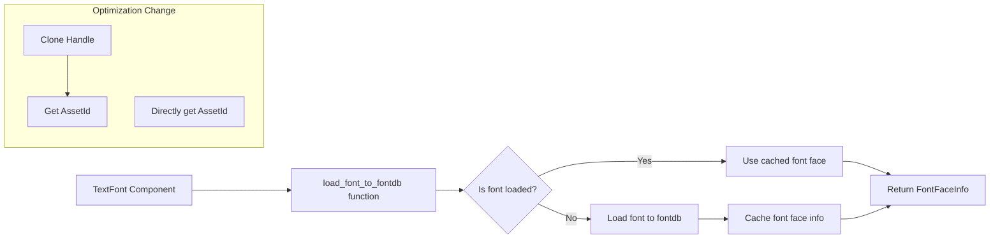

+++
title = "#22009 remove unnecessary clone from `load_font_to_fontdb`"
date = "2025-12-02T00:00:00"
draft = false
template = "pull_request_page.html"
in_search_index = false

[extra]
current_language = "zh-cn"
available_languages = {"en" = { name = "English", url = "/pull_request/bevy/2025-12/pr-22009-en-20251202" }, "zh-cn" = { name = "中文", url = "/pull_request/bevy/2025-12/pr-22009-zh-cn-20251202" }}
labels = ["D-Trivial", "C-Performance", "C-Code-Quality", "A-Text"]
+++

# Title
remove unnecessary clone from `load_font_to_fontdb`

## Basic Information
- **Title**: remove unnecessary clone from `load_font_to_fontdb`
- **PR Link**: https://github.com/bevyengine/bevy/pull/22009
- **Author**: ickshonpe
- **Status**: MERGED
- **Labels**: D-Trivial, C-Performance, C-Code-Quality, A-Text
- **Created**: 2025-12-02T16:40:45Z
- **Merged**: 2025-12-02T17:28:27Z
- **Merged By**: james7132

## Description Translation
**目标**

`load_font_to_fontdb` 函数中不必要的克隆了字体句柄。

**解决方案**

直接调用其 id() 方法。

## The Story of This Pull Request

这是一个关于性能优化的简单但有效的案例。在 Bevy 游戏引擎的文本渲染模块中，开发者发现了一个不必要的内存分配操作，并通过一个直接的修改来消除它。

问题出现在 `load_font_to_fontdb` 函数中。这个函数负责将字体资源加载到 cosmic_text 的字体数据库（fontdb）中，并缓存加载结果。原始实现中，代码首先克隆了整个 `Handle<Font>` 句柄，然后才调用 `id()` 方法来获取字体资源的标识符（AssetId）。对于不熟悉 Rust 或 Bevy 的开发者来说，这可能看起来无害，但实际上这个克隆操作涉及引用计数的增加（如果 Handle 是 Arc 或类似类型），这在热路径中会带来不必要的开销。

从技术角度看，`Handle<T>` 在 Bevy 中通常封装了指向资产的智能指针，克隆它会增加引用计数并可能分配内存。然而，对于这个特定的用例，我们真正需要的是资产的标识符（`AssetId<Font>`），这是一个可以廉价复制的小型值，不需要克隆整个句柄。

修改方案很直接：跳过克隆步骤，直接调用 `text_font.font.id()` 来获取资产 ID。这个改变虽然微小，但体现了良好的性能意识。在游戏引擎中，文本渲染是常见操作，特别是对于 UI 系统，即使是微小的优化在多次调用时也能累积起来产生显著影响。

值得注意的是，这个修改不仅提高了性能，还使代码更加简洁。通过消除中间变量 `font_handle`，代码更清晰地表达了意图：我们只需要资产的 ID，而不需要句柄本身。这种简化使代码更容易阅读和维护。

在实现细节方面，修改后的代码保持了相同的逻辑流。缓存映射 `map_handle_to_font_id` 仍然使用资产 ID 作为键，当字体尚未加载时，会执行相同的加载逻辑。唯一的变化是我们如何获取这个 ID。

从工程角度看，这个 PR 展示了一个重要的优化原则：避免不必要的内存分配和复制。在系统编程中，特别是在游戏引擎这样的性能敏感环境中，即使是看似微小的优化也可能对整体性能产生积极影响。

## Visual Representation



## Key Files Changed

**crates/bevy_text/src/pipeline.rs** (+17/-19)

这个文件包含了文本渲染管道的实现。具体的修改位于 `load_font_to_fontdb` 函数中，该函数负责将字体加载到文本渲染系统中。

**关键修改：**

```rust
// 修改前：
let font_handle = text_font.font.clone();
let (face_id, family_name) = map_handle_to_font_id
    .entry(font_handle.id())
    .or_insert_with(|| {
        let font = fonts.get(font_handle.id()).expect(
            "Tried getting a font that was not available, probably due to not being loaded yet",
        );
        // ... 其余代码
    });

// 修改后：
let font_id = text_font.font.id();
let (face_id, family_name) = map_handle_to_font_id.entry(font_id).or_insert_with(|| {
    let font = fonts.get(font_id).expect(
        "Tried getting a font that was not available, probably due to not being loaded yet",
    );
    // ... 其余代码（相同）
});
```

**修改说明：**
1. 移除了不必要的 `text_font.font.clone()` 调用
2. 直接调用 `text_font.font.id()` 获取资产 ID
3. 使用 `font_id` 变量直接作为缓存映射的键和字体查找的参数

这个修改减少了内存分配（如果 Handle 实现涉及引用计数）并使代码更加简洁。虽然性能提升可能很小，但在频繁调用的函数中，这样的优化是值得的。

## Further Reading

1. **Bevy Asset System**: 了解 Bevy 的资产管理系统如何处理 `Handle<T>` 和 `AssetId<T>` 对于理解这个优化很重要。Bevy 文档中的资产章节详细介绍了这些概念。

2. **Rust 性能优化**: 关于 Rust 中避免不必要克隆和分配的通用模式，可以参考 Rust 性能模式相关的资料。

3. **cosmic_text**: 这个 PR 涉及将字体加载到 cosmic_text 字体数据库中。了解 cosmic_text（Bevy 的文本渲染后端）的工作原理有助于理解整个文本渲染管道。

4. **游戏引擎优化**: 游戏引擎中常见的微优化技术，特别是在热路径中减少分配和复制的策略。