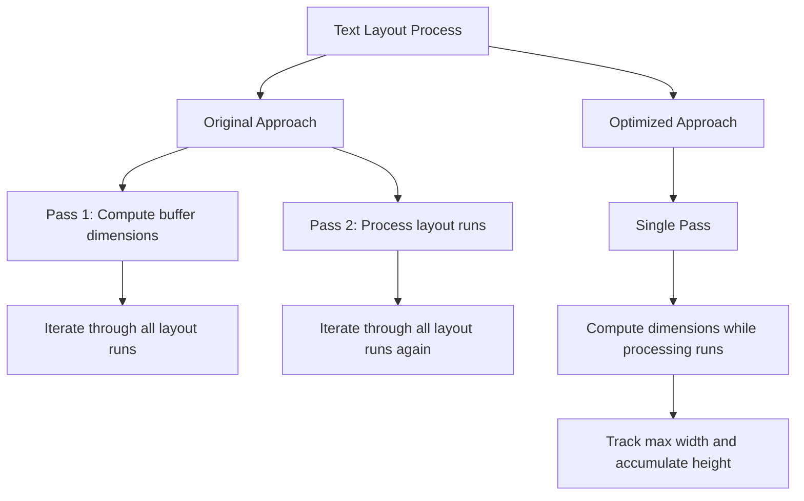

+++
title = "#22010 compute the text buffer size during layout updates"
date = "2025-12-07T00:00:00"
draft = false
template = "pull_request_page.html"
in_search_index = true

[taxonomies]
list_display = ["show"]

[extra]
current_language = "en"
available_languages = {"en" = { name = "English", url = "/pull_request/bevy/2025-12/pr-22010-en-20251207" }, "zh-cn" = { name = "中文", url = "/pull_request/bevy/2025-12/pr-22010-zh-cn-20251207" }}
labels = ["D-Trivial", "C-Performance", "A-Text"]
+++

# Title
**PR #22010: compute the text buffer size during layout updates**

## Basic Information
- **Title**: compute the text buffer size during layout updates
- **PR Link**: https://github.com/bevyengine/bevy/pull/22010
- **Author**: ickshonpe
- **Status**: MERGED
- **Labels**: D-Trivial, C-Performance, S-Ready-For-Final-Review, A-Text
- **Created**: 2025-12-02T17:21:25Z
- **Merged**: 2025-12-07T18:51:37Z
- **Merged By**: mockersf

## Description Translation

# Objective

`queue_text` does a second pass to compute the size of the text buffer, this could be moved inside the layout update loop instead.

## Solution

Do the buffer size computation inside the update loop.

## The Story of This Pull Request

This PR addresses a straightforward performance optimization in Bevy's text rendering system. The core issue was that the text layout computation was performing redundant work by making two passes over the same data: one to calculate the dimensions of the text buffer, and another to process the actual layout runs.

The problem stemmed from the architectural approach used in `TextPipeline`. When queueing text for rendering, the system needed to determine the size of the text bounding box to properly allocate space in the UI. The original implementation used a separate helper function `buffer_dimensions` that iterated through all layout runs to calculate the maximum width and total height. This calculation happened before the main layout processing loop, effectively iterating over the same data twice.

The developer recognized this inefficiency and implemented a more optimal approach. Instead of having a separate pass for dimension calculation, they moved the computation directly into the existing loop that processes layout runs. This is a classic optimization pattern: reducing algorithmic complexity by combining multiple passes over the same data into a single pass.

The implementation change is minimal but effective. In both `queue_text` and `queue_text_atlas` methods, the code now initializes a `Vec2::ZERO` for the box size and updates it incrementally while iterating through each layout run. For each run, the maximum line width is tracked for the x-dimension, and line heights are accumulated for the y-dimension.

One important technical detail is the addition of `.ceil()` to the final size calculation in `queue_text`. This ensures pixel-aligned dimensions, which is crucial for UI rendering where fractional pixel sizes can cause blurry text or incorrect alignment. The developer maintained consistency with the previous behavior by applying this rounding only where necessary.

The optimization demonstrates good understanding of Bevy's text pipeline architecture. By moving the dimension calculation into the existing loop, the PR eliminates redundant iteration while preserving all existing functionality. This is particularly valuable in a game engine context where text rendering happens frequently and performance matters.

## Visual Representation



## Key Files Changed

**File: `crates/bevy_text/src/pipeline.rs`**

This file contains the core text rendering pipeline in Bevy. The changes optimize the layout computation by eliminating a redundant pass over text layout data.

**Key Changes:**

1. **Removed separate dimension calculation pass** - The `buffer_dimensions` function call was eliminated in favor of inline computation.

2. **Integrated dimension tracking into layout loop** - The box size is now calculated incrementally while processing each layout run.

**Code Changes:**

Before (simplified):
```rust
let buffer = &mut computed.buffer;
let box_size = buffer_dimensions(buffer);  // Separate pass

let result = buffer.layout_runs().try_for_each(|run| {
    // Process layout runs
    // ... existing layout processing code
});

layout_info.size = box_size;
```

After:
```rust
let buffer = &mut computed.buffer;
let mut box_size = Vec2::ZERO;  // Initialize zero size

let result = buffer.layout_runs().try_for_each(|run| {
    // Compute dimensions while processing
    box_size.x = box_size.x.max(run.line_w);
    box_size.y += run.line_height;
    
    // ... existing layout processing code
});

layout_info.size = box_size.ceil();  // Apply ceiling for pixel alignment
```

The same pattern was applied in both `queue_text` and `queue_text_atlas` methods, ensuring consistent optimization across the text rendering pipeline.

## Further Reading

1. **Bevy Text Rendering Documentation**: The official Bevy documentation covers text rendering and the text pipeline architecture in detail.

2. **Algorithmic Complexity Optimization**: Resources on reducing O(n) operations by combining multiple passes over the same data into single passes.

3. **Rust Iterator Patterns**: The `try_for_each` method used in this code is part of Rust's iterator API, which provides efficient ways to process collections.

4. **GPU Text Rendering**: For deeper understanding of why text rendering performance matters, research on GPU-based text rendering techniques and the challenges of real-time text layout.

5. **Bevy Performance Guidelines**: The Bevy engine's performance optimization patterns and best practices for systems programming in Rust.