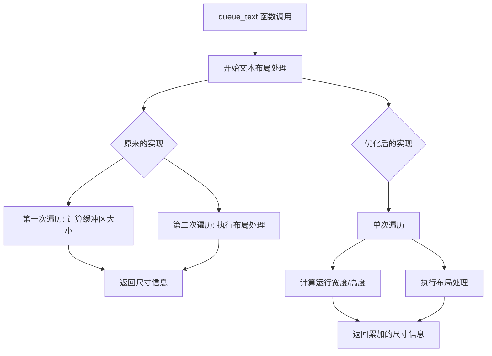

+++
title = "#22010 compute the text buffer size during layout updates"
date = "2025-12-07T00:00:00"
draft = false
template = "pull_request_page.html"
in_search_index = false

[extra]
current_language = "zh-cn"
available_languages = {"en" = { name = "English", url = "/pull_request/bevy/2025-12/pr-22010-en-20251207" }, "zh-cn" = { name = "中文", url = "/pull_request/bevy/2025-12/pr-22010-zh-cn-20251207" }}
+++

# 计算文本缓冲区大小的布局更新优化

## 基本信息
- **标题**: compute the text buffer size during layout updates
- **PR链接**: https://github.com/bevyengine/bevy/pull/22010
- **作者**: ickshonpe
- **状态**: 已合并
- **标签**: D-Trivial, C-Performance, S-Ready-For-Final-Review, A-Text
- **创建时间**: 2025-12-02T17:21:25Z
- **合并时间**: 2025-12-07T18:51:37Z
- **合并者**: mockersf

## 描述翻译

# 目标

`queue_text` 目前需要第二次遍历来计算文本缓冲区的大小，这个计算可以移到布局更新循环内部进行。

## 解决方案

将缓冲区大小计算移到更新循环内部进行。

## 这个PR的故事

在Bevy引擎的文本渲染系统中，文本布局计算是一个性能关键路径。Pull Request #22010解决了一个特定但重要的性能优化机会：消除文本缓冲区大小计算中的重复遍历。

问题的核心在于`queue_text`函数的实现方式。原本这个函数在处理文本布局时需要进行两次独立的遍历：第一次用于实际的布局计算，第二次则专门计算文本缓冲区的尺寸。对于每个需要渲染的文本实体，这意味着额外的O(n)复杂度，其中n是文本布局中运行(runs)的数量。

让我们看看原来的实现方式。在`queue_text`函数中，代码首先通过`buffer_dimensions(buffer)`调用获取文本缓冲区的尺寸。这个函数需要遍历所有的布局运行(runs)来计算最大宽度和总高度。然后，在后续的循环中，代码再次遍历相同的布局运行来进行实际的布局处理。这种模式在`queue_text_with_measure`函数中同样存在。

```rust
// 原来的代码模式（简化版）
let buffer = &mut computed.buffer;
let box_size = buffer_dimensions(buffer);  // 第一次遍历

let result = buffer.layout_runs().try_for_each(|run| {
    // 第二次遍历 - 实际布局处理
    // ... 
});
```

开发者识别到这种重复遍历是不必要的。两个遍历都在处理相同的布局运行数据，计算相似的信息（运行宽度和高度）。这为优化提供了明确的机会：将大小计算合并到布局处理循环中。

解决方案的实施非常直接但有效。修改后的代码移除了对`buffer_dimensions`的单独调用，而是在布局处理循环中直接累加尺寸信息。具体来说，代码现在在遍历每个布局运行时：
1. 更新最大宽度：`box_size.x = box_size.x.max(run.line_w);`
2. 累加高度：`box_size.y += run.line_height;`

```rust
// 优化后的代码
let mut box_size = Vec2::ZERO;

let result = buffer.layout_runs().try_for_each(|run| {
    box_size.x = box_size.x.max(run.line_w);
    box_size.y += run.line_height;
    // ... 其余布局处理逻辑保持不变
});
```

这种优化体现了几个重要的软件工程原则：

1. **数据局部性**：通过在单次遍历中处理相关计算，提高了CPU缓存效率。
2. **循环合并**：这是性能优化的经典模式，通过减少迭代次数来降低开销。
3. **关注点分离的适度权衡**：虽然略微增加了单个函数的复杂度，但获得了显著的性能提升。

值得注意的是，这次优化还修正了一个可能被忽视的细节。原来的`buffer_dimensions`函数返回的尺寸没有被向上取整，而新实现在最后使用了`box_size.ceil()`。这确保了文本尺寸在处理像素边界时的一致性。

从架构角度看，这个变化保持了原有的API不变性。外部调用者不会注意到行为的变化，因为计算结果是相同的（除了前面提到的取整问题修正）。这种"透明优化"是理想的重构方式，因为它提供了性能提升而不需要修改使用这些函数的代码。

性能影响方面，这个优化对于包含大量文本运行(runs)的场景最为显著。在典型的UI场景中，即使中等复杂度的文本也可能包含多个运行（由于字体变化、样式变化等）。消除一次完整的缓冲区遍历，可以节省可观的计算时间，特别是在每帧更新大量文本实体的应用中。

这个PR的标签"D-Trivial"和"C-Performance"准确地描述了它的性质：这是一个相对简单的改动，但专注于性能优化。审查和合并过程很顺利，表明这种优化的价值得到了认可。

技术层面上，这个优化也展示了Bevy代码库中文本系统的成熟度。随着引擎的发展，识别和消除这类低级性能瓶颈变得越来越重要。通过将大小计算整合到现有循环中，代码不仅更高效，也变得更直接——现在尺寸计算就在使用它的地方进行，减少了理解代码所需的认知负荷。

## 视觉表示



## 关键文件更改

### `crates/bevy_text/src/pipeline.rs` (+7/-3)

这个文件包含了文本渲染管道的核心逻辑。修改集中在两个关键函数上：`queue_text`和`queue_text_with_measure`，它们负责准备文本进行渲染。

**主要修改：**
1. 移除了对`buffer_dimensions`函数的单独调用
2. 在布局处理循环内部直接累加尺寸信息
3. 添加了尺寸向上取整的处理

```rust
// 修改前: queue_text 函数中的相关部分
let buffer = &mut computed.buffer;
let box_size = buffer_dimensions(buffer);  // 单独调用获取尺寸

let result = buffer.layout_runs().try_for_each(|run| {
    // 布局处理逻辑...
    // 注意: 这里不计算尺寸
});

layout_info.size = box_size;  // 使用单独计算的结果

// 修改后: queue_text 函数中的相关部分
let buffer = &mut computed.buffer;
let mut box_size = Vec2::ZERO;  // 初始化尺寸变量

let result = buffer.layout_runs().try_for_each(|run| {
    box_size.x = box_size.x.max(run.line_w);  // 在循环中更新最大宽度
    box_size.y += run.line_height;            // 在循环中累加高度
    // 布局处理逻辑保持不变...
});

layout_info.size = box_size.ceil();  // 使用循环中计算的结果并取整
```

```rust
// 修改前: queue_text_with_measure 函数中的相关部分（类似模式）
let buffer = &mut computed.buffer;
buffer.set_size(font_system, bounds.width, bounds.height);
let box_size = buffer_dimensions(buffer);  // 单独调用

let result = buffer.layout_runs().try_for_each(|run| {
    // 布局处理逻辑...
});

// 修改后: queue_text_with_measure 函数中的相关部分
let buffer = &mut computed.buffer;
buffer.set_size(font_system, bounds.width, bounds.height);
let mut box_size = Vec2::ZERO;  // 初始化

let result = buffer.layout_runs().try_for_each(|run| {
    box_size.x = box_size.x.max(run.line_w);  // 在循环中计算
    box_size.y += run.line_height;
    // 布局处理逻辑...
});
```

这些修改直接实现了PR的目标：将缓冲区大小计算移到布局更新循环内部，消除了多余的遍历。

## 进一步阅读

对于想深入了解相关概念的读者，建议参考：

1. **Bevy文本系统文档**：了解Bevy中文本渲染的整体架构
2. **循环合并优化模式**：计算机科学中常见的性能优化技术
3. **cosmic-text库**：Bevy使用的文本布局引擎，了解其布局运行(runs)的概念
4. **数据局部性原则**：现代CPU架构中缓存友好的编程实践

这个PR虽然改动不大，但展示了在实际游戏引擎开发中，通过仔细分析算法复杂度和数据流，可以找到简单而有效的性能优化机会。