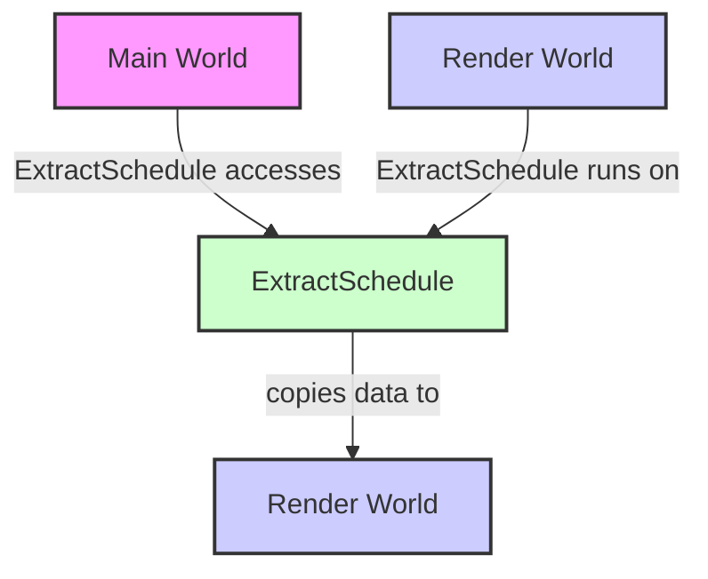

+++
title = "#22012 Clarify docs for `ExtractSchedule`"
date = "2025-12-05T00:00:00"
draft = false
template = "pull_request_page.html"
in_search_index = true

[taxonomies]
list_display = ["show"]

[extra]
current_language = "en"
available_languages = {"en" = { name = "English", url = "/pull_request/bevy/2025-12/pr-22012-en-20251205" }, "zh-cn" = { name = "中文", url = "/pull_request/bevy/2025-12/pr-22012-zh-cn-20251205" }}
labels = ["C-Docs", "D-Trivial", "A-Rendering"]
+++

# Title

## Basic Information
- **Title**: Clarify docs for `ExtractSchedule`
- **PR Link**: https://github.com/bevyengine/bevy/pull/22012
- **Author**: bilsen
- **Status**: MERGED
- **Labels**: C-Docs, D-Trivial, A-Rendering
- **Created**: 2025-12-02T19:27:59Z
- **Merged**: 2025-12-05T18:38:10Z
- **Merged By**: james7132

## Description Translation
The previous docs incorrectly states that the `ExtractSchedule` is run on the main world. Also some small additional changes.

## The Story of This Pull Request

This PR addresses a documentation inaccuracy in Bevy's render system that could lead to developer confusion about the execution context of the `ExtractSchedule`. The issue was straightforward but significant: the documentation incorrectly stated which world the schedule operates on, which could mislead developers trying to understand or extend the extraction pipeline.

The problem stemmed from a misstatement in the doc comments for the `ExtractSchedule` struct. Originally, the documentation claimed that "This schedule is run on the main world, but its buffers are not applied until it is returned to the render world." This was incorrect and could cause developers to write extraction systems with wrong assumptions about their execution context. In Bevy's ECS architecture, understanding which world a system operates in is critical for proper data access and system design.

The solution approach was simple but important: correct the documentation to accurately reflect the execution model. The developer identified the specific lines that needed fixing and proposed clear, accurate replacements. This is a documentation-only change, so no code logic was modified, but the correction prevents potential misunderstandings.

The implementation consists of three key changes to the documentation. First, the opening description was rephrased from "Schedule which extract data from the main world and inserts it into the render world" to "Schedule in which data from the main world is 'extracted' into the render world." This change uses more passive phrasing that better matches the extraction metaphor and focuses on the schedule's purpose rather than its mechanism.

The most important correction addresses the execution context. The line "This schedule is run on the main world, but its buffers are not applied until it is returned to the render world" was replaced with "This schedule is run on the render world, but it also has access to the main world." This accurately describes how extraction works in Bevy: the schedule executes in the render world context but can access data from the main world through specific mechanisms.

To provide practical guidance, the documentation now includes a reference: "See [`MainWorld`] and [`Extract`] for details on how to access main world data from this schedule." This directs developers to the relevant APIs for implementing extraction systems, making the documentation more actionable.

From a technical perspective, this correction is important because Bevy's extraction phase follows a specific pattern. The `ExtractSchedule` runs on the render world but has access to the main world through the `Extract` system parameter and the `MainWorld` resource. This allows extraction systems to read data from the main world and copy it into the render world without mutating the main world. Understanding this execution context is essential for writing correct extraction systems that don't accidentally mutate the wrong world or assume incorrect data availability.

The impact of this change is primarily educational. While it doesn't alter any runtime behavior, it prevents developers from making incorrect assumptions about where their extraction systems run. This is particularly important for new contributors or developers extending the rendering pipeline, who might otherwise write systems that assume they're operating in the main world context.

This documentation fix highlights an important pattern in Bevy's architecture: the separation between the main world (where game logic runs) and the render world (where rendering data is prepared). The extraction phase bridges these two worlds by copying necessary data, and understanding which world provides the execution context for this copying is fundamental to working with Bevy's rendering system effectively.

## Visual Representation



## Key Files Changed

### `crates/bevy_render/src/lib.rs` (+3/-3)

This file contains the documentation for the `ExtractSchedule` struct in Bevy's render module. The changes correct inaccurate information about which world the schedule runs on and improve the overall clarity of the documentation.

**Key changes:**
```rust
// File: crates/bevy_render/src/lib.rs
// Before:
/// Schedule which extract data from the main world and inserts it into the render world.
///
/// This step should be kept as short as possible to increase the "pipelining potential" for
/// running the next frame while rendering the current frame.
///
/// This schedule is run on the main world, but its buffers are not applied
/// until it is returned to the render world.

// After:
/// Schedule in which data from the main world is 'extracted' into the render world.
///
/// This step should be kept as short as possible to increase the "pipelining potential" for
/// running the next frame while rendering the current frame.
///
/// This schedule is run on the render world, but it also has access to the main world.
/// See [`MainWorld`] and [`Extract`] for details on how to access main world data from this schedule.
```

The changes include:
1. Rephrasing the first line to use more descriptive language ("is 'extracted'" instead of "extract")
2. Correcting the crucial detail about which world the schedule runs on (render world vs main world)
3. Adding practical guidance to reference `MainWorld` and `Extract` for implementation details

These changes directly address the PR's goal of clarifying the documentation for `ExtractSchedule` and correcting the misconception about execution context.

## Further Reading

1. **Bevy's ECS Architecture**: Understanding Bevy's Entity Component System and how systems interact with different worlds is fundamental. The official Bevy Book's ECS chapter provides a good foundation.

2. **Extraction Pattern in Game Engines**: The pattern of extracting data from a game world to a render world is common in game engine architecture. Research on "data-oriented design" and "entity component systems" provides context for why this separation exists.

3. **Bevy's Render Graph**: The `ExtractSchedule` is part of Bevy's render graph system. The render graph documentation explains how different rendering phases connect and execute.

4. **System Parameters in Bevy**: Understanding how `Extract` and `MainWorld` work as system parameters helps when writing extraction systems. The Bevy documentation on system parameters shows how to access different resources and components.

5. **Schedule Execution in Bevy**: Bevy's schedule system determines when and where systems run. The documentation on schedules and stages explains the execution order and context.