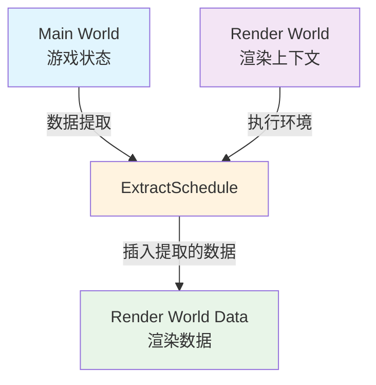

+++
title = "#22012 Clarify docs for `ExtractSchedule"
date = "2025-12-05T00:00:00"
draft = false
template = "pull_request_page.html"
in_search_index = false

[extra]
current_language = "zh-cn"
available_languages = {"en" = { name = "English", url = "/pull_request/bevy/2025-12/pr-22012-en-20251205" }, "zh-cn" = { name = "中文", url = "/pull_request/bevy/2025-12/pr-22012-zh-cn-20251205" }}
+++

# Title

## 基本信息
- **标题**: Clarify docs for `ExtractSchedule`
- **PR链接**: https://github.com/bevyengine/bevy/pull/22012
- **作者**: bilsen
- **状态**: 已合并
- **标签**: C-Docs, D-Trivial, A-Rendering
- **创建时间**: 2025-12-02T19:27:59Z
- **合并时间**: 2025-12-05T18:38:10Z
- **合并者**: james7132

## 描述翻译
之前的文档错误地声明 `ExtractSchedule` 在主世界 (main world) 上运行。同时进行了一些小的附加修改。

## 这个Pull Request的故事

这个PR主要解决一个文档准确性的问题，涉及Bevy渲染引擎中一个关键调度阶段 (`ExtractSchedule`) 的执行上下文描述。核心问题很简单：文档中关于这个调度在哪个世界执行的描述是错误的。

在Bevy的架构中，存在两个主要的世界：主世界 (main world) 和渲染世界 (render world)。主世界包含完整的游戏状态，而渲染世界专门用于渲染相关的数据和系统。`ExtractSchedule` 是渲染管道中的一个关键阶段，负责从主世界中提取数据并转移到渲染世界中。

原来的文档存在一个事实性错误，声称 `ExtractSchedule` 在主世界上运行。这在技术上是错误的，并且会误导开发者对这个调度执行上下文的理解。这个错误的描述可能导致开发者错误地假设他们可以在 `ExtractSchedule` 中直接访问主世界的完整特性，而实际上需要特定的机制来跨世界访问数据。

开发者 bilsen 提交了这个修正，做了三处关键的文档调整：

1. **重新表述了调度描述**：从 "Schedule which extract data from the main world and inserts it into the render world" 改为 "Schedule in which data from the main world is 'extracted' into the render world"。这个改变更准确地描述了调度的目的——它是一个数据被提取的过程，而不只是简单地将数据插入渲染世界。

2. **修正了执行上下文**：最重要的修正是明确说明 `ExtractSchedule` 实际上在渲染世界上运行，而不是主世界。这个区别很重要，因为它影响了开发者可以在这个调度中访问哪些资源和组件。

3. **添加了实用的指引**：新的文档增加了对 `MainWorld` 和 `Extract` 的引用，为开发者提供了如何在这个调度中访问主世界数据的明确指引。这解决了开发者可能遇到的实际问题：既然这个调度在渲染世界上运行，我该如何访问主世界的数据？

从技术实现的角度看，这个修正虽然简单，但对Bevy渲染管道的正确理解很重要。`ExtractSchedule` 作为渲染管道的一部分，确实在渲染世界的上下文中执行，但它通过特殊的系统参数（如 `Extract`）和资源（如 `MainWorld`）获得对主世界的受限访问权限。这种架构设计允许数据提取的同时保持两个世界的隔离。

这个PR体现了文档维护的重要性——即使是很小的文档错误也可能导致开发者对系统行为产生误解。特别是对于像Bevy这样的游戏引擎，渲染管道的各个阶段如何交互是一个核心概念，准确的文档对于开发者正确使用引擎功能至关重要。

## 可视化表示



## 关键文件更改

### `crates/bevy_render/src/lib.rs` (+3/-3)

这个文件包含了Bevy渲染模块的主要定义。修改的部分是 `ExtractSchedule` 结构体的文档注释。

**修改内容**：
```rust
// 修改前:
/// Schedule which extract data from the main world and inserts it into the render world.
///
/// This step should be kept as short as possible to increase the "pipelining potential" for
/// running the next frame while rendering the current frame.
///
/// This schedule is run on the main world, but its buffers are not applied
/// until it is returned to the render world.
#[derive(ScheduleLabel, PartialEq, Eq, Debug, Clone, Hash, Default)]
pub struct ExtractSchedule;

// 修改后:
/// Schedule in which data from the main world is 'extracted' into the render world.
///
/// This step should be kept as short as possible to increase the "pipelining potential" for
/// running the next frame while rendering the current frame.
///
/// This schedule is run on the render world, but it also has access to the main world.
/// See [`MainWorld`] and [`Extract`] for details on how to access main world data from this schedule.
#[derive(ScheduleLabel, PartialEq, Eq, Debug, Clone, Hash, Default)]
pub struct ExtractSchedule;
```

**修改说明**：
1. 第一行文档从描述调度"做什么"改为更准确地描述调度"是什么地方发生什么"
2. 关键的修正：将执行上下文从"在主世界上运行"改为"在渲染世界上运行，但可以访问主世界"
3. 添加了实用指引：指向 `MainWorld` 和 `Extract`，帮助开发者了解如何在实际代码中访问主世界数据

这些修改确保了文档准确地反映了 `ExtractSchedule` 的实际行为，避免了开发者对这个重要渲染阶段执行上下文的误解。

## 延伸阅读

- [Bevy Render Pipeline Documentation](https://bevy-cheatbook.github.io/programming/render-pipelines.html) - Bevy渲染管道的详细说明
- [Bevy Schedules and Stages](https://bevy-cheatbook.github.io/programming/schedules.html) - Bevy调度系统的概念解释
- [Bevy ECS: Worlds and Resources](https://bevy-cheatbook.github.io/programming/worlds-resources.html) - 关于Bevy中World和Resource的详细说明
- [Extraction Pattern in Game Engines](https://en.wikipedia.org/wiki/Entity_component_system#Data-oriented_design) - ECS架构中数据提取模式的一般概念

# 完整代码差异
diff --git a/crates/bevy_render/src/lib.rs b/crates/bevy_render/src/lib.rs
index 11b6ceb63bce4..b1e7837b3ec04 100644
--- a/crates/bevy_render/src/lib.rs
+++ b/crates/bevy_render/src/lib.rs
@@ -247,13 +247,13 @@ impl Render {
     }
 }
 
-/// Schedule which extract data from the main world and inserts it into the render world.
+/// Schedule in which data from the main world is 'extracted' into the render world.
 ///
 /// This step should be kept as short as possible to increase the "pipelining potential" for
 /// running the next frame while rendering the current frame.
 ///
-/// This schedule is run on the main world, but its buffers are not applied
-/// until it is returned to the render world.
+/// This schedule is run on the render world, but it also has access to the main world.
+/// See [`MainWorld`] and [`Extract`] for details on how to access main world data from this schedule.
 #[derive(ScheduleLabel, PartialEq, Eq, Debug, Clone, Hash, Default)]
 pub struct ExtractSchedule;