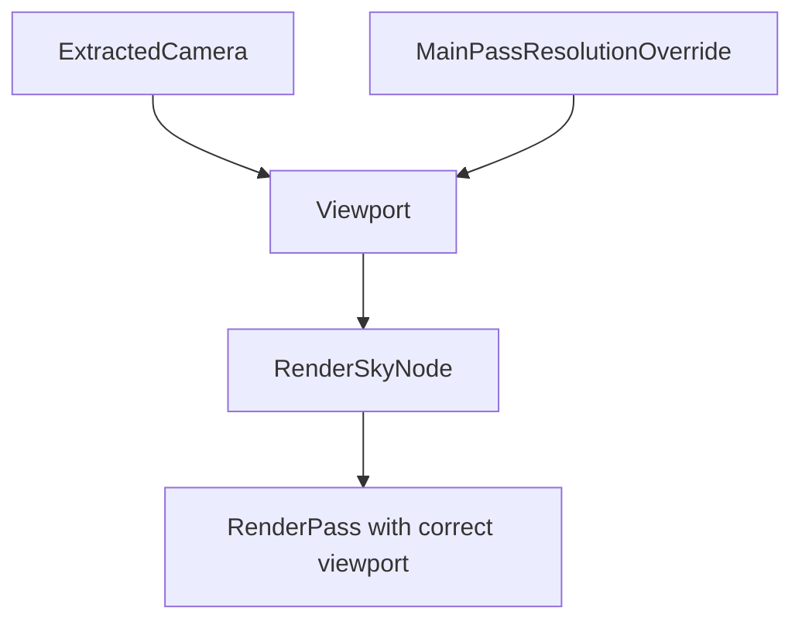

+++
title = "#22013 Support MainPassResolutionOverride for Atmosphere"
date = "2025-12-15T00:00:00"
draft = false
template = "pull_request_page.html"
in_search_index = true

[taxonomies]
list_display = ["show"]

[extra]
current_language = "en"
available_languages = {"en" = { name = "English", url = "/pull_request/bevy/2025-12/pr-22013-en-20251215" }, "zh-cn" = { name = "中文", url = "/pull_request/bevy/2025-12/pr-22013-zh-cn-20251215" }}
labels = ["A-Rendering", "D-Straightforward"]
+++

# Support MainPassResolutionOverride for Atmosphere

## Basic Information
- **Title**: Support MainPassResolutionOverride for Atmosphere
- **PR Link**: https://github.com/bevyengine/bevy/pull/22013
- **Author**: jannik4
- **Status**: MERGED
- **Labels**: A-Rendering, S-Ready-For-Final-Review, D-Straightforward
- **Created**: 2025-12-02T23:28:25Z
- **Merged**: 2025-12-14T22:32:54Z
- **Merged By**: alice-i-cecile

## Description
The PR description is already in English.

# Objective

Fixes #21973

## Solution

Use `MainPassResolutionOverride` in `RenderSkyNode`.

## Testing

Tested with DLSS upscaling.

## The Story of This Pull Request

This PR addresses a specific integration issue between the atmosphere rendering system and dynamic resolution scaling in Bevy's rendering pipeline. The problem was that the sky/atmosphere rendering node wasn't respecting the `MainPassResolutionOverride` component, which is used to control resolution scaling for techniques like DLSS, FSR, or other upscaling methods.

When using dynamic resolution scaling, different parts of the rendering pipeline need to render at potentially different resolutions. The `MainPassResolutionOverride` component allows cameras to specify an alternative resolution for the main render pass, which is particularly useful for upscaling techniques that render at a lower resolution and then upscale. However, the atmosphere rendering system was ignoring this override and rendering at the native viewport resolution, causing visual artifacts or performance issues when upscaling was enabled.

The solution approach was straightforward: modify the `RenderSkyNode` to query for and apply the `MainPassResolutionOverride` if present. This required several specific changes to the node's implementation:

First, the necessary imports were added to bring in the required types from the camera module:
```rust
use bevy_camera::{MainPassResolutionOverride, Viewport};
use bevy_render::camera::ExtractedCamera;
```

The `ViewQuery` for `RenderSkyNode` was expanded to include two new components:
- `Read<ExtractedCamera>`: to access the camera's viewport information
- `Option<Read<MainPassResolutionOverride>>`: to optionally get the resolution override

The key implementation change happens in the `run` method. Instead of directly creating a render pass, the code now uses `render_context.begin_tracked_render_pass()` which provides better diagnostics. More importantly, it checks for a viewport override:

```rust
if let Some(viewport) =
    Viewport::from_viewport_and_override(camera.viewport.as_ref(), resolution_override)
{
    render_sky_pass.set_camera_viewport(&viewport);
}
```

The `Viewport::from_viewport_and_override` method handles the logic of combining the camera's base viewport with any resolution override. If an override is present, it creates a new viewport with the overridden dimensions; otherwise, it uses the camera's original viewport.

This change ensures that the atmosphere rendering aligns with the rest of the rendering pipeline when using dynamic resolution scaling. The technical implementation follows established patterns in Bevy's rendering system, where other render nodes already handle `MainPassResolutionOverride` in similar ways.

The impact of this change is that users can now enable DLSS or other upscaling techniques without breaking atmosphere rendering. This fixes visual artifacts that would occur when the sky was rendered at a different resolution than the main pass. The performance implications are positive as well, since the atmosphere can now benefit from the same resolution scaling as other rendering effects.

## Visual Representation



## Key Files Changed

### `crates/bevy_pbr/src/atmosphere/node.rs` (+20/-11)

This file contains the `RenderSkyNode` implementation which renders atmospheric effects. The changes modify this node to support dynamic resolution scaling through the `MainPassResolutionOverride` component.

#### Key modifications:

1. **Added imports** for the necessary types:
```rust
use bevy_camera::{MainPassResolutionOverride, Viewport};
use bevy_render::camera::ExtractedCamera;
```

2. **Updated the ViewQuery** to include camera and resolution override components:
```rust
type ViewQuery = (
    Read<ExtractedCamera>,
    // ... existing components
    Option<Read<MainPassResolutionOverride>>,
);
```

3. **Modified the run method** to apply the viewport override:
```rust
// Before (simplified):
let mut render_sky_pass =
    render_context
        .command_encoder()
        .begin_render_pass(&RenderPassDescriptor {
            // ... setup
        });

// After:
let mut render_sky_pass = render_context.begin_tracked_render_pass(RenderPassDescriptor {
    // ... setup
});

if let Some(viewport) =
    Viewport::from_viewport_and_override(camera.viewport.as_ref(), resolution_override)
{
    render_sky_pass.set_camera_viewport(&viewport);
}
```

These changes ensure that the atmosphere rendering respects the same resolution overrides as the main render pass, fixing compatibility with upscaling techniques like DLSS.

## Further Reading

1. [Bevy Rendering Documentation](https://bevyengine.org/learn/book/getting-started/rendering/) - Overview of Bevy's rendering system
2. [Dynamic Resolution Scaling in Games](https://en.wikipedia.org/wiki/Dynamic_resolution_scaling) - Background on resolution scaling techniques
3. [DLSS Technical Overview](https://www.nvidia.com/en-us/geforce/technologies/dlss/) - NVIDIA's Deep Learning Super Sampling technology
4. [Bevy Camera Components](https://docs.rs/bevy/latest/bevy/camera/index.html) - Documentation on Bevy's camera system and components