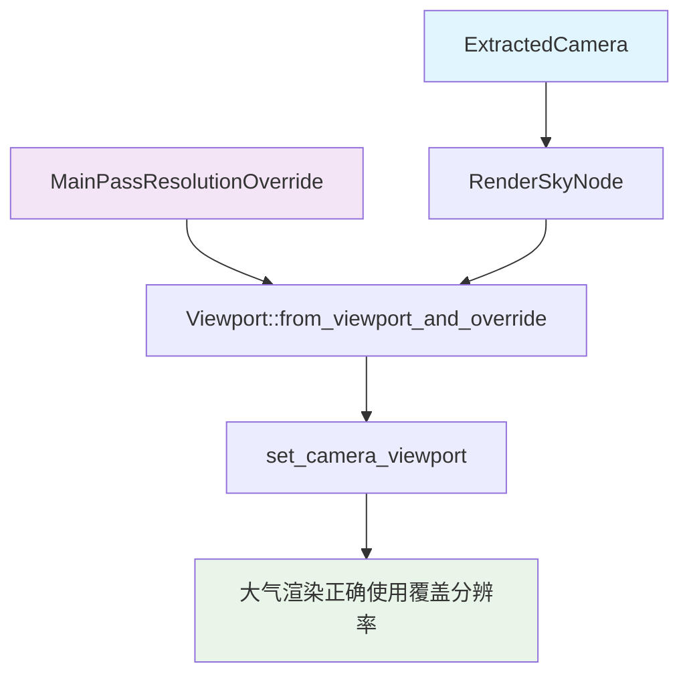

+++
title = "#22013 Support MainPassResolutionOverride for Atmosphere"
date = "2025-12-15T00:00:00"
draft = false
template = "pull_request_page.html"
in_search_index = false

[extra]
current_language = "zh-cn"
available_languages = {"en" = { name = "English", url = "/pull_request/bevy/2025-12/pr-22013-en-20251215" }, "zh-cn" = { name = "中文", url = "/pull_request/bevy/2025-12/pr-22013-zh-cn-20251215" }}
+++

# Title

## 基本信息
- **标题**: Support MainPassResolutionOverride for Atmosphere
- **PR 链接**: https://github.com/bevyengine/bevy/pull/22013
- **作者**: jannik4
- **状态**: 已合并
- **标签**: A-Rendering, S-Ready-For-Final-Review, D-Straightforward
- **创建时间**: 2025-12-02T23:28:25Z
- **合并时间**: 2025-12-14T22:32:54Z
- **合并者**: alice-i-cecile

## 描述翻译
此 PR 修复了 #21973 中的问题，通过在 `RenderSkyNode` 中使用 `MainPassResolutionOverride` 来支持大气渲染的分辨率覆盖功能。已通过 DLSS 上采样技术进行测试验证。

## 这个 Pull Request 的技术分析

### 问题和背景

这个 PR 解决了一个在 Bevy 渲染引擎中大气渲染与分辨率覆盖系统不兼容的问题。在游戏开发中，现代渲染技术如 DLSS (深度学习超级采样) 和 FSR (FidelityFX Super Resolution) 通常会在低于屏幕分辨率的缓冲区中渲染场景，然后通过后期处理进行上采样。为了实现这种优化，Bevy 提供了 `MainPassResolutionOverride` 组件，允许摄像机在渲染主通道时使用不同的分辨率。

然而，在实现 #21973 中发现，大气渲染系统 (`RenderSkyNode`) 没有正确使用这个分辨率覆盖设置。具体来说，当使用 DLSS 等上采样技术时，大气渲染仍然以原生屏幕分辨率运行，导致渲染管线不一致，可能产生视觉错误或性能问题。

### 解决方案

开发者的解决方案是在 `RenderSkyNode` 中集成 `MainPassResolutionOverride` 支持。这是一个直接而高效的修复方案，通过修改渲染节点的查询参数和执行逻辑，使其能够读取并应用摄像机的分辨率覆盖设置。

从技术角度看，这个解决方案涉及几个关键更改：

1. **扩展查询参数**：向 `RenderSkyNode` 的视图查询中添加了两个新组件
2. **添加视口支持**：在渲染过程中检查并应用分辨率覆盖
3. **更新渲染 API 调用**：改用更现代的渲染 API 方法

### 具体实现

实现的核心是修改 `RenderSkyNode` 的 `ViewQuery` 类型和执行方法。首先，我们看查询参数的扩展：

```rust
// 修改前的查询参数
type ViewQuery = (
    Read<AtmosphereBindGroups>,
    Read<ViewTarget>,
    Read<DynamicUniformIndex<GpuAtmosphere>>,
    Read<SkyBindGroups>,
    Read<DeferredLightingPipelineId>,
    Read<ViewUniformOffset>,
    Read<ViewLightsUniformOffset>,
    Read<RenderSkyPipelineId>,
);

// 修改后的查询参数
type ViewQuery = (
    Read<ExtractedCamera>,                    // 新增：用于获取摄像机视口
    Read<AtmosphereBindGroups>,
    Read<ViewTarget>,
    Read<DynamicUniformIndex<GpuAtmosphere>>,
    Read<SkyBindGroups>,
    Read<DeferredLightingPipelineId>,
    Read<ViewUniformOffset>,
    Read<ViewLightsUniformOffset>,
    Read<RenderSkyPipelineId>,
    Option<Read<MainPassResolutionOverride>>, // 新增：分辨率覆盖的选项
);
```

这些新增的查询参数允许渲染节点访问摄像机信息和可能存在的分辨率覆盖设置。

在执行逻辑中，关键的修改体现在渲染通道的设置阶段：

```rust
// 修改后的执行方法部分代码
if let Some(viewport) =
    Viewport::from_viewport_and_override(camera.viewport.as_ref(), resolution_override)
{
    render_sky_pass.set_camera_viewport(&viewport);
}

render_sky_pass.set_render_pipeline(render_sky_pipeline);
```

这里使用了 `Viewport::from_viewport_and_override` 方法，这是一个智能的视口构建函数。它接受基础的摄像机视口和可能的分辨率覆盖设置，然后返回正确的视口配置：
- 如果存在 `MainPassResolutionOverride`，则使用覆盖的分辨率
- 如果不存在覆盖，则使用摄像机的原生视口

另一个值得注意的修改是渲染通道创建方式的更新：

```rust
// 修改前：使用基础的命令编码器API
let mut render_sky_pass =
    render_context
        .command_encoder()
        .begin_render_pass(&RenderPassDescriptor {
            // ... 参数
        });

// 修改后：使用追踪渲染通道API
let mut render_sky_pass = render_context.begin_tracked_render_pass(RenderPassDescriptor {
    // ... 参数
});
```

从 `begin_render_pass` 改为 `begin_tracked_render_pass` 是一个额外的改进，提供了更好的诊断跟踪能力，虽然这并非分辨率覆盖功能的核心需求，但符合 Bevy 代码库的现代化趋势。

### 技术细节和设计考量

这个实现有几个值得注意的技术细节：

1. **Option 包装器的使用**：`Option<Read<MainPassResolutionOverride>>` 表明分辨率覆盖是可选的，这保持了向后兼容性。如果没有设置覆盖组件，大气渲染会继续使用默认行为。

2. **视口计算的职责分离**：`Viewport::from_viewport_and_override` 方法封装了视口计算的逻辑，遵循了单一职责原则。渲染节点不需要了解视口计算的细节，只需传递相关参数。

3. **与现有架构的集成**：这个修改保持了与 Bevy 渲染图的现有架构一致。`RenderSkyNode` 继续作为视图节点工作，只是现在能够响应更广泛的摄像机配置。

从性能角度看，这个修改的开销很小。添加两个额外的查询组件在 ECS (实体组件系统) 中的开销是微不足道的，而视口计算是每个帧执行一次的简单操作。

### 影响和意义

这个 PR 的合并带来了几个重要的改进：

1. **视觉一致性**：大气渲染现在与场景的其他部分使用相同的分辨率，避免了因分辨率不匹配可能产生的视觉伪影。

2. **性能优化**：对于使用上采样技术的项目，大气渲染现在也能受益于降低的内部渲染分辨率，减少了像素着色器的计算量。

3. **API 一致性**：`RenderSkyNode` 现在与其他使用 `MainPassResolutionOverride` 的渲染节点行为一致，减少了开发者的认知负担。

4. **现代化改进**：顺便进行的 API 更新 (`begin_tracked_render_pass` 和 `set_render_pipeline`) 使代码与 Bevy 的其他部分保持同步，为未来的维护和改进提供了更好的基础。

### 潜在问题和未来考虑

虽然这个 PR 解决了当前的问题，但开发者在实现时需要注意：

1. **测试覆盖**：作者提到已经用 DLSS 进行了测试，但对于其他上采样技术 (如 FSR、XeSS) 和不同的分辨率缩放比例，可能还需要进一步的验证。

2. **多摄像机场景**：在复杂的多摄像机设置中，需要确保每个 `RenderSkyNode` 实例都正确关联到对应的摄像机和分辨率覆盖设置。Bevy 的渲染图架构通常能正确处理这种关联。

3. **扩展性考虑**：随着 Bevy 渲染系统的发展，可能会有更复杂的分辨率管理需求。当前的实现为未来的扩展提供了良好的基础。

## 可视化表示



## 主要文件变更

### `crates/bevy_pbr/src/atmosphere/node.rs` (+20/-11)

这个文件包含了大气渲染节点 (`RenderSkyNode`) 的实现。主要更改包括：

1. **导入新增**：添加了对 `MainPassResolutionOverride` 和 `Viewport` 类型的引用
2. **查询参数扩展**：在视图查询中增加了摄像机和分辨率覆盖的读取
3. **视口处理逻辑**：在渲染执行中添加了视口覆盖的检查和设置

关键代码变更：

```rust
// 新增导入
use bevy_camera::{MainPassResolutionOverride, Viewport};
use bevy_render::camera::ExtractedCamera;

// 查询参数变更
impl ViewNode for RenderSkyNode {
    type ViewQuery = (
        Read<ExtractedCamera>,                    // 新增
        Read<AtmosphereBindGroups>,
        Read<ViewTarget>,
        Read<DynamicUniformIndex<GpuAtmosphere>>,
        Read<SkyBindGroups>,
        Read<DeferredLightingPipelineId>,
        Read<ViewUniformOffset>,
        Read<ViewLightsUniformOffset>,
        Read<RenderSkyPipelineId>,
        Option<Read<MainPassResolutionOverride>>, // 新增
    );

    fn run<'w>(
        &self,
        _graph: &mut RenderGraphContext,
        render_context: &mut RenderContext<'w>,
        (
            camera,                            // 新增参数
            atmosphere_bind_groups,
            view_target,
            atmosphere_uniforms_offset,
            sky_bind_groups,
            deferred_lighting_pipeline_id,
            view_uniforms_offset,
            lights_uniforms_offset,
            render_sky_pipeline_id,
            resolution_override,               // 新增参数
        ): QueryItem<'w, '_, Self::ViewQuery>,
        world: &'w World,
    ) -> Result<(), NodeRunError> {
        // ... 其他代码
        
        // 新增视口处理逻辑
        if let Some(viewport) =
            Viewport::from_viewport_and_override(camera.viewport.as_ref(), resolution_override)
        {
            render_sky_pass.set_camera_viewport(&viewport);
        }
        
        // ... 其他代码
    }
}
```

这些变更确保大气渲染节点能够正确处理分辨率覆盖设置，使其与渲染管线的其他部分保持一致。

## 进一步阅读

对于想深入了解相关概念的开发者，建议参考以下资源：

1. **Bevy 官方文档**：
   - [Bevy 渲染图架构](https://bevyengine.org/learn/quick-start/getting-started/rendering/)
   - [摄像机系统](https://bevyengine.org/learn/quick-start/getting-started/camera/)

2. **现代渲染技术**：
   - [DLSS 技术白皮书](https://www.nvidia.com/en-us/geforce/technologies/dlss/)
   - [FSR 技术文档](https://gpuopen.com/fidelityfx-superresolution/)

3. **相关源代码**：
   - `bevy_crate::camera::MainPassResolutionOverride` 的实现
   - `bevy_render::viewport::Viewport` 结构体及其方法
   - Bevy 中其他使用分辨率覆盖的渲染节点（如 deferred lighting 节点）

4. **渲染图概念**：
   - [Vulkan 渲染通道](https://vulkan-tutorial.com/Drawing_a_triangle/Graphics_pipeline_basics/Render_passes) (相关概念)
   - [现代图形 API 中的视口和剪裁](https://learn.microsoft.com/en-us/windows/win32/direct3d11/d3d10-graphics-programming-guide-rasterizer-stage-getting-started)

通过研究这些资料，开发者可以更全面地理解分辨率覆盖在现代渲染管线中的作用，以及如何在 Bevy 的 ECS 和渲染图框架中正确实现这一功能。