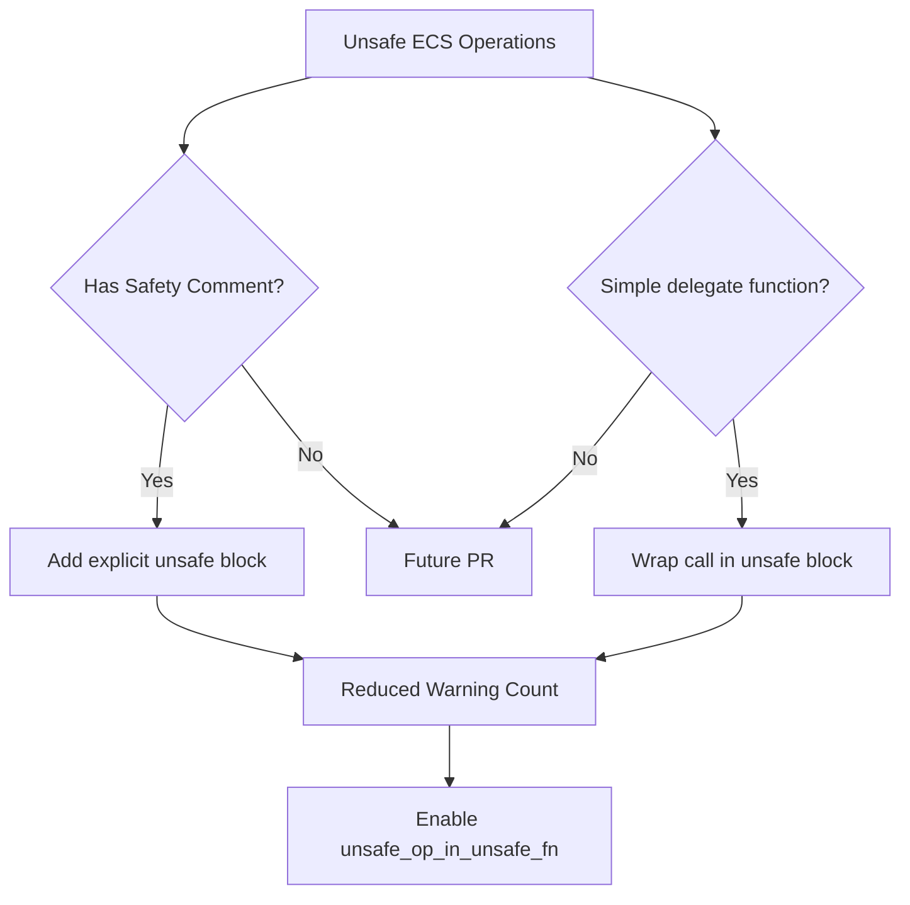

+++
title = "#22014 Doc trivial ecs unsafe"
date = "2025-12-15T00:00:00"
draft = false
template = "pull_request_page.html"
in_search_index = true

[taxonomies]
list_display = ["show"]

[extra]
current_language = "en"
available_languages = {"en" = { name = "English", url = "/pull_request/bevy/2025-12/pr-22014-en-20251215" }, "zh-cn" = { name = "中文", url = "/pull_request/bevy/2025-12/pr-22014-zh-cn-20251215" }}
labels = ["C-Docs", "A-ECS", "D-Straightforward", "D-Unsafe"]
+++

# Title
Doc trivial ecs unsafe

## Basic Information
- **Title**: Doc trivial ecs unsafe
- **PR Link**: https://github.com/bevyengine/bevy/pull/22014
- **Author**: hymm
- **Status**: MERGED
- **Labels**: C-Docs, A-ECS, S-Ready-For-Final-Review, D-Straightforward, D-Unsafe
- **Created**: 2025-12-02T23:36:48Z
- **Merged**: 2025-12-15T02:40:43Z
- **Merged By**: alice-i-cecile

## Description Translation
# Objective

- Trying to doc most of the unsafe in the ecs crate so we can turn on `unsafe_op_in_unsafe_fn`.

## Solution

- Unfortunately reviewing the unsafe docs will probably not be trivial if we try to do it all in one pr. There are 400+ warnings when you turn on the lint. So we need to break it up as much as possible as reviewing the safety contracts in some cases isn't the easiest.
- This pr includes two types of unsafe blocks.
  1. Blocks that already had safety comments, but were missing the `unsafe {}` block.
  2. Unsafe functions that have the same safety contract as their unsafe parent function and are very short. (Usually just the call to the function).

## The Story of This Pull Request

The Bevy ECS codebase contains a significant amount of unsafe Rust code necessary for performance and implementing core systems. However, the project had been running with the `unsafe_op_in_unsafe_fn` lint disabled, which meant that unsafe operations inside unsafe functions didn't require explicit unsafe blocks. This made it harder to visually identify which specific operations within an unsafe function were actually unsafe.

The goal was to enable this lint to improve code safety and maintainability, but doing so revealed over 400 warnings. Attempting to fix all of them in a single PR would have been overwhelming for reviewers, as each unsafe block requires careful analysis of its safety contract. The developer therefore adopted a pragmatic approach: break the work into manageable chunks starting with the simplest cases.

This PR represents the first step in that process, focusing on two specific categories of warnings that could be addressed with minimal risk:

First, the PR fixes instances where safety comments existed but the corresponding `unsafe {}` block was missing. These were essentially documentation errors where the code already communicated why an operation was safe, but didn't follow Rust's explicit unsafe block requirement for the `unsafe_op_in_unsafe_fn` lint.

Second, the PR addresses unsafe functions that delegate to another unsafe function with identical safety requirements. These are typically one-line functions that just call a parent unsafe function. Wrapping these calls in explicit unsafe blocks makes it clear they're propagating the same safety contract.

The implementation approach is straightforward but systematic. For each warning, the developer examined the existing safety comment and the function's implementation to verify that the safety requirements were properly documented and that adding the explicit unsafe block wouldn't change the function's behavior. This required understanding the ECS system's internal invariants and how different components interact.

One important consideration was handling edge cases like zero-length tuples in macros. The PR includes `#[allow(unused_unsafe)]` annotations with clear explanations for these cases, demonstrating attention to detail while maintaining the macro's generality. For example:

```rust
#[allow(
    unused_unsafe,
    reason = "Zero-length tuples will generate a function body equivalent to `()`; however, this macro is meant for all applicable tuples, and as such it makes no sense to rewrite it just for that case."
)]
// SAFETY: Caller ensures requirements for calling `apply_effect` are met.
unsafe {
    $( $name::apply_effect($alias, entity); )*
}
```

The changes span the entire ECS crate, touching systems, queries, storage, bundles, and world access patterns. Each modification follows the same pattern: identify an unsafe operation, verify the existing safety documentation is correct, and wrap it in an explicit unsafe block. The consistency of this approach makes the PR easy to review despite touching many files.

This work is foundational for enabling stricter unsafe code linting in Bevy. By starting with the simplest cases, the developer establishes a pattern for future PRs while immediately reducing the warning count. The changes also improve the code's readability by making unsafe operations more explicit, which helps developers quickly identify which parts of the code require careful safety analysis.

## Visual Representation



## Key Files Changed

### `crates/bevy_ecs/src/system/system_param.rs` (+51/-19)
This file contains the system parameter implementations, which extensively use unsafe code for performance. The changes mainly add explicit unsafe blocks around calls to `validate_param` and `get_param` methods in various system parameter implementations (tuples, Option, Result, Vec, etc.).

**Key modification:**
```rust
// Before:
#[inline]
unsafe fn get_param(
    state: &'s mut Self::State,
    system_meta: &SystemMeta,
    world: UnsafeWorldCell<'world>,
    change_tick: Tick,
) -> Self::Item<'world, 'state> {
    T::validate_param(state, system_meta, world)
        .ok()
        .map(|()| T::get_param(state, system_meta, world, change_tick))
}

// After:
#[inline]
unsafe fn get_param(
    state: &'s mut Self::State,
    system_meta: &SystemMeta,
    world: UnsafeWorldCell<'world>,
    change_tick: Tick,
) -> Self::Item<'world, 'state> {
    // SAFETY: Upheld by caller
    unsafe {
        T::validate_param(state, system_meta, world)
            .ok()
            .map(|()| T::get_param(state, system_meta, world, change_tick))
    }
}
```

### `crates/bevy_ecs/src/world/entity_access/world_mut.rs` (+20/-11)
This file handles mutable world access for entities. The changes add unsafe blocks around operations that fetch or manipulate entity components, ensuring that each unsafe operation is explicitly marked.

**Key modification:**
```rust
// Before:
pub unsafe fn insert_by_id(
    &mut self,
    component_id: ComponentId,
    component: OwningPtr<'_>,
) -> &mut Self {
    self.insert_by_id_with_caller(
        component_id,
        component,
        InsertMode::Replace,
        MaybeLocation::caller(),
        RelationshipHookMode::Run,
    )
}

// After:
pub unsafe fn insert_by_id(
    &mut self,
    component_id: ComponentId,
    component: OwningPtr<'_>,
) -> &mut Self {
    // SAFETY: Upheld by caller
    unsafe {
        self.insert_by_id_with_caller(
            component_id,
            component,
            InsertMode::Replace,
            MaybeLocation::caller(),
            RelationshipHookMode::Run,
        )
    }
}
```

### `crates/bevy_ecs/src/system/commands/mod.rs` (+17/-11)
The commands system uses unsafe code for efficient command queue management. The changes wrap unsafe system parameter operations in explicit blocks.

**Key modification:**
```rust
// Before:
#[inline]
unsafe fn get_param(
    state: &'s mut Self::State,
    system_meta: &SystemMeta,
    world: UnsafeWorldCell<'w>,
    change_tick: bevy_ecs::change_detection::Tick,
) -> Self::Item<'w, 's> {
    let params = <__StructFieldsAlias as bevy_ecs::system::SystemParam>::get_param(
        &mut state.state,
        system_meta,
        world,
        change_tick,
    );
    Commands {
        queue: InternalQueue::CommandQueue(params.0),
        allocator: params.1,
    }
}

// After:
#[inline]
unsafe fn get_param(
    state: &'s mut Self::State,
    system_meta: &SystemMeta,
    world: UnsafeWorldCell<'w>,
    change_tick: bevy_ecs::change_detection::Tick,
) -> Self::Item<'w, 's> {
    // SAFETY: Upheld by caller
    let params = unsafe {
        <__StructFieldsAlias as bevy_ecs::system::SystemParam>::get_param(
            &mut state.state,
            system_meta,
            world,
            change_tick,
        )
    };
    Commands {
        queue: InternalQueue::CommandQueue(params.0),
        allocator: params.1,
    }
}
```

### `crates/bevy_ecs/src/component/required.rs` (+13/-10)
This file manages component requirement relationships. The changes add unsafe blocks around scope operations that require careful validation of component IDs.

**Key modification:**
```rust
// Before:
// SAFETY: the caller guarantees that `requiree` is valid in `self`.
self.required_components_scope(requiree, |this, required_components| {
    // SAFETY: the caller guarantees that `required` is valid for type `R` in `self`
    unsafe { required_components.register_by_id(required, this, constructor) };
});

// After:
// SAFETY: the caller guarantees that `requiree` is valid in `self`.
unsafe {
    self.required_components_scope(requiree, |this, required_components| {
        // SAFETY: the caller guarantees that `required` is valid for type `R` in `self`
        required_components.register_by_id(required, this, constructor);
    });
}
```

### `crates/bevy_ecs/src/bundle/impls.rs` (+14/-2)
This file implements bundle functionality using macros. The changes add unsafe blocks within tuple implementations, with special handling for zero-length tuples.

**Key modification:**
```rust
// Before:
// SAFETY: Caller ensures requirements for calling `get_components` are met.
$( $name::get_components($alias, func); )*

// After:
#[allow(
    unused_unsafe,
    reason = "Zero-length tuples will generate a function body equivalatent to (); however, this macro is meant for all applicable tuples, and as such it makes no sense to rewrite it just for that case."
)]
// SAFETY: Caller ensures requirements for calling `get_components` are met.
unsafe {
    $( $name::get_components($alias, func); )*
}
```

## Further Reading

1. Rustonomicon: https://doc.rust-lang.org/nomicon/
2. Rust Unsafe Code Guidelines: https://rust-lang.github.io/unsafe-code-guidelines/
3. Bevy ECS Architecture: https://bevyengine.org/learn/book/plugins/ecs/
4. Rust `unsafe_op_in_unsafe_fn` lint documentation: https://doc.rust-lang.org/rustc/lints/listing/allowed-by-default.html#unsafe-op-in-unsafe-fn

# Full Code Diff
*(Note: The full diff is included in the original request but omitted here for brevity. The key changes are documented above.)*