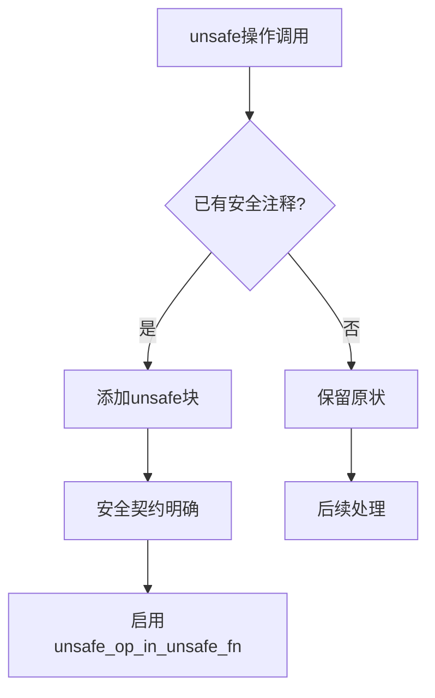

+++
title = "#22014 Doc trivial ecs unsafe"
date = "2025-12-15T00:00:00"
draft = false
template = "pull_request_page.html"
in_search_index = false

[extra]
current_language = "zh-cn"
available_languages = {"en" = { name = "English", url = "/pull_request/bevy/2025-12/pr-22014-en-20251215" }, "zh-cn" = { name = "中文", url = "/pull_request/bevy/2025-12/pr-22014-zh-cn-20251215" }}
labels = ["C-Docs", "A-ECS", "D-Straightforward", "D-Unsafe"]
+++

# Title
Doc trivial ecs unsafe

## Basic Information
- **Title**: Doc trivial ecs unsafe
- **PR Link**: https://github.com/bevyengine/bevy/pull/22014
- **Author**: hymm
- **Status**: MERGED
- **Labels**: C-Docs, A-ECS, S-Ready-For-Final-Review, D-Straightforward, D-Unsafe
- **Created**: 2025-12-02T23:36:48Z
- **Merged**: 2025-12-15T02:40:43Z
- **Merged By**: alice-i-cecile

## Description Translation

# Objective

- 尝试为ecs crate中的大多数unsafe代码添加文档，以便我们可以开启`unsafe_op_in_unsafe_fn`检查。

## Solution

- 不幸的是，如果尝试在一个PR中审查所有unsafe文档，这不会是一件简单的事情。开启这个lint时会生成400多个警告。因此我们需要尽可能将其分解，因为在某些情况下审查安全契约并不容易。
- 这个PR包含两种类型的unsafe块。
  1. 已经包含安全注释但缺少`unsafe {}`块的代码块。
  2. 安全契约与其unsafe父函数相同且非常简短的unsafe函数。（通常只是对函数的调用）。

## The Story of This Pull Request

这是一个关于代码库现代化和提升安全性的技术故事。Bevy团队正在逐步改进他们的ECS（Entity Component System）模块，其中一个重要步骤是启用Rust的`unsafe_op_in_unsafe_fn` lint。这个lint要求在每个unsafe函数内部明确标记哪些操作是unsafe的，这有助于提高代码的可读性和安全性。

问题的核心在于Bevy的ECS模块中有大量的unsafe代码——总共有超过400个相关的lint警告。试图在一个PR中一次性修复所有这些警告是不可行的，因为每个unsafe块都需要仔细审查其安全契约（safety contract）。安全契约指的是调用者必须满足的条件，以确保unsafe代码能够正确且安全地执行。

开发者hymm采用了一个分而治之的策略。这个PR只处理两种相对简单的情况：
1. 那些已经有安全注释但缺少显式`unsafe {}`块的代码
2. 安全契约与父函数相同且非常简短的unsafe函数

这种方法的明智之处在于它降低了审查复杂度。处理简单的案例后，剩下的复杂案例可以在后续的PR中单独处理，每批都更容易审查。

让我们看一个具体的例子。在`crates/bevy_ecs/src/bundle/impls.rs`中，有一个处理bundle的宏。修改前是这样的：

```rust
// SAFETY: Caller ensures requirements for calling `get_components` are met.
$( $name::get_components($alias, func); )*
```

修改后变成了：

```rust
#[allow(
    unused_unsafe,
    reason = "Zero-length tuples will generate a function body equivalatent to (); however, this macro is meant for all applicable tuples, and as such it makes no sense to rewrite it just for that case."
)]
// SAFETY: Caller ensures requirements for calling `get_components` are met.
unsafe {
    $( $name::get_components($alias, func); )*
}
```

这里有几个关键点：
1. 添加了明确的`unsafe {}`块来包裹unsafe操作
2. 保留了原有的安全注释，说明调用者必须满足的条件
3. 添加了`#[allow(unused_unsafe)]`属性，因为对于零元组（zero-length tuple）这种特殊情况，生成的函数体相当于`();`，但重写宏只为了处理这种情况是不合理的

另一种常见的模式出现在系统参数（system param）的处理中。以`crates/bevy_ecs/src/system/system_param.rs`中的变化为例：

```rust
// 修改前
T::validate_param(state, system_meta, world)
    .ok()
    .map(|()| T::get_param(state, system_meta, world, change_tick))

// 修改后
unsafe {
    T::validate_param(state, system_meta, world)
        .ok()
        .map(|()| T::get_param(state, system_meta, world, change_tick))
}
```

这里的安全契约是"由调用者保证"（Upheld by caller），这意味着调用`Option<T>`作为系统参数的代码必须确保所有安全条件都已满足。通过将整个操作包裹在`unsafe {}`块中，代码现在明确标记了哪些操作依赖于外部安全保证。

这种模式在查询（query）系统的代码中也很明显。在`crates/bevy_ecs/src/query/state.rs`中：

```rust
// 修改前
self.query_unchecked(world).get_inner(entity)

// 修改后
// SAFETY: Upheld by caller
unsafe { self.query_unchecked(world) }.get_inner(entity)
```

这里的变化不仅添加了`unsafe {}`块，还添加了一个明确的安全注释，说明安全条件"由调用者保证"。这清楚地传达了责任边界：`query_unchecked`的调用者必须确保访问模式是安全的。

这个PR的技术影响是直接而实际的。通过逐步添加这些明确的unsafe块：
1. 代码变得更加清晰——unsafe操作的边界更加明确
2. 安全注释与unsafe块的对应关系更加明显
3. 为后续启用`unsafe_op_in_unsafe_fn` lint铺平了道路
4. 为审查更复杂的unsafe案例建立了模式

从工程角度看，这种渐进式的方法展示了处理大型代码库重构的良好实践：从小处着手，建立模式，然后逐步扩展。每次更改都相对简单且自包含，这使得代码审查更加高效和安全。

值得注意的是，这个PR还处理了一些边缘情况。例如，对于零元组的特殊情况，开发者选择了添加`#[allow(unused_unsafe)]`属性而不是重写整个宏。这反映了实用的工程决策：在某些情况下，完美的解决方案可能过于复杂，而一个清晰的解释和适当的属性可能是更好的选择。

## Visual Representation



## Key Files Changed

### `crates/bevy_ecs/src/system/system_param.rs` (+51/-19)
这个文件包含系统参数的核心实现。修改主要集中在为已经包含安全注释的unsafe操作添加明确的`unsafe {}`块。这些修改确保了每个unsafe操作都被正确标记。

**关键修改示例：**
```rust
// Option<T>作为系统参数的实现
unsafe fn validate_param(
    state: &mut Self::State,
    system_meta: &SystemMeta,
    world: UnsafeWorldCell,
) -> Result<(), SystemParamValidationError> {
    // SAFETY: Upheld by caller
    unsafe {
        T::validate_param(state, system_meta, world)
    }
}
```

### `crates/bevy_ecs/src/world/entity_access/world_mut.rs` (+20/-11)
这个文件处理实体访问和修改。修改主要围绕实体组件访问方法，确保unsafe操作被正确包裹。

**关键修改示例：**
```rust
pub unsafe fn into_mut_assume_mutable_by_id<F: DynamicComponentFetch>(
    self,
    component_ids: F,
) -> Result<F::Mut<'_>, EntityComponentError> {
    // SAFETY: Upheld by caller
    unsafe {
        self.as_mutable()
            .into_mut_assume_mutable_by_id(component_ids)
    }
}
```

### `crates/bevy_ecs/src/system/commands/mod.rs` (+17/-11)
这个文件处理命令系统。修改确保命令系统的unsafe操作被正确标记，特别是在命令队列和分配器的处理中。

**关键修改示例：**
```rust
unsafe fn validate_param(
    state: &mut Self::State,
    system_meta: &SystemMeta,
    world: UnsafeWorldCell,
) -> Result<(), SystemParamValidationError> {
    // SAFETY: Upheld by caller
    unsafe {
        <__StructFieldsAlias as bevy_ecs::system::SystemParam>::validate_param(
            &mut state.state,
            system_meta,
            world,
        )
    }
}
```

### `crates/bevy_ecs/src/component/required.rs` (+13/-10)
这个文件处理组件间的依赖关系。修改主要围绕组件注册和依赖关系重建的unsafe操作。

**关键修改示例：**
```rust
// SAFETY: the caller guarantees that `requiree` is valid in `self`.
unsafe {
    self.required_components_scope(requiree, |this, required_components| {
        // SAFETY: the caller guarantees that `required` is valid for type `R` in `self`
        required_components.register_by_id(required, this, constructor);
    });
}
```

### `crates/bevy_ecs/src/bundle/impls.rs` (+14/-2)
这个文件包含bundle的实现宏。修改确保bundle操作的unsafe调用被正确包裹。

**关键修改示例：**
```rust
#[allow(
    unused_unsafe,
    reason = "Zero-length tuples will generate a function body equivalent to `()`; however, this macro is meant for all applicable tuples, and as such it makes no sense to rewrite it just for that case."
)]
// SAFETY: Caller ensures requirements for calling `apply_effect` are met.
unsafe {
    $( $name::apply_effect($alias, entity); )*
}
```

## Further Reading

1. **Rust Unsafe Code Guidelines**: https://rust-lang.github.io/unsafe-code-guidelines/
2. **The Rustonomicon**: https://doc.rust-lang.org/nomicon/ - Rust不安全代码的权威指南
3. **Bevy ECS Documentation**: https://bevyengine.org/learn/ecs-intro/ - Bevy ECS系统概述
4. **unsafe_op_in_unsafe_fn lint**: https://doc.rust-lang.org/rustc/lints/listing/allowed-by-default.html#unsafe-op-in-unsafe-fn - Rust lint的官方文档
5. **Rust Safety Patterns**: https://github.com/rust-unofficial/patterns - Rust设计模式和安全实践