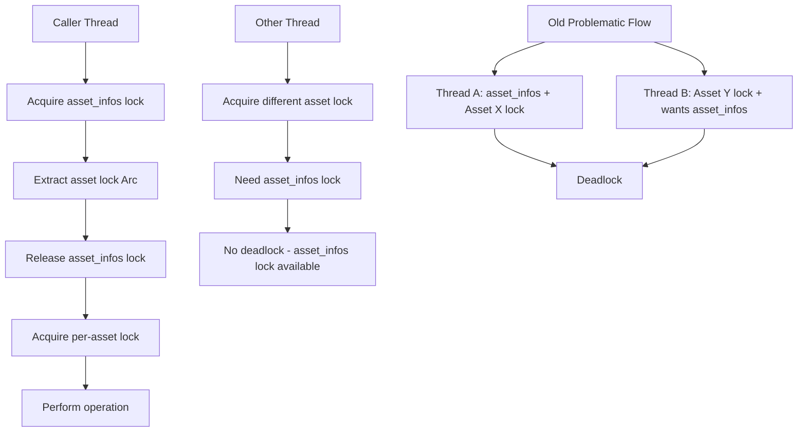

+++
title = "#22017 Release the asset infos lock before acquiring the file transaction lock."
date = "2025-12-07T00:00:00"
draft = false
template = "pull_request_page.html"
in_search_index = true

[taxonomies]
list_display = ["show"]

[extra]
current_language = "en"
available_languages = {"en" = { name = "English", url = "/pull_request/bevy/2025-12/pr-22017-en-20251207" }, "zh-cn" = { name = "中文", url = "/pull_request/bevy/2025-12/pr-22017-zh-cn-20251207" }}
labels = ["C-Bug", "A-Assets", "D-Modest"]
+++

# Release the asset infos lock before acquiring the file transaction lock.

## Basic Information
- **Title**: Release the asset infos lock before acquiring the file transaction lock.
- **PR Link**: https://github.com/bevyengine/bevy/pull/22017
- **Author**: andriyDev
- **Status**: MERGED
- **Labels**: C-Bug, A-Assets, S-Ready-For-Final-Review, D-Modest
- **Created**: 2025-12-03T08:30:50Z
- **Merged**: 2025-12-07T18:51:37Z
- **Merged By**: mockersf

## Description Translation
# Objective

- Fix the first flake related to #22001.
- We had a double lock problem. We would first lock `asset_infos`, then lock one of the assets within `asset_infos` **and then dropped the `asset_infos` lock**. This means however that if a process needs to access `asset_infos` (which is necessary for loading nested assets during processing), we'll have one thread trying to lock 1) asset_infos, 2) per-asset lock, and we'll have another thread trying to lock 1) per-asset lock (we've already dropped the asset_infos lock), 2) asset_infos. A classic deadlock!

## Solution

- Before locking the per-asset lock, we clone the `Arc<RwLock>` out of the `asset_infos`, drop the `asset_infos`, and only then lock the per-asset lock. This ensures that we never hang on the `asset_infos` lock when just trying to fetch a single asset.
- Make all the access to `asset_infos` "short" - they get what they need out of `asset_infos` and then drop the lock as soon as possible.
- I also used `?` to cleanup some methods in `ProcessorAssetInfos`, where previously it was "remove the asset info, then have one big `if let` after it". Now we just return early if the value is none.
- I also happened to fix a weird case where the new path in a rename wasn't guarded by a transaction lock. Now it is!

## Testing

- Running without this fix I get "Ran out of loops" from the `only_reprocesses_wrong_hash_on_startup` test quite quickly (after a minute or so). With this fix, I now only get the assertion failure problem. If I also skip that assertion, the test hasn't flaked for a while! Yay, no more deadlock!

## The Story of This Pull Request

This PR addresses a deadlock issue in Bevy's asset processor that was causing intermittent test failures. The problem stemmed from how the code managed two types of locks: the global `asset_infos` lock that protects the collection of all asset metadata, and individual `file_transaction_lock` instances for each asset that control access to that asset's files.

The deadlock occurred because of an ordering issue in lock acquisition. In the original implementation, several methods would:

1. Acquire a write lock on `asset_infos`
2. Retrieve a specific asset's `file_transaction_lock` (an `Arc<RwLock<()>>`) from the map
3. Immediately acquire a lock on that per-asset lock while still holding the `asset_infos` lock

This created a scenario where Thread A could hold `asset_infos` and try to lock Asset X's file lock, while Thread B could hold Asset Y's file lock and try to lock `asset_infos`. Since both threads need resources the other holds, they deadlock.

The solution is straightforward but required careful refactoring: separate the two locking operations so they never overlap. Instead of holding `asset_infos` while locking individual assets, the code now:

1. Quickly acquires `asset_infos`, clones out the needed per-asset lock(s), and immediately releases `asset_infos`
2. Only then acquires locks on the individual assets

This change required modifying four key methods that previously held both locks simultaneously: `handle_removed_asset`, `handle_renamed_asset`, `process_asset`, and `get_transaction_lock`. Each method follows the same pattern: create a small scope for the `asset_infos` lock, extract what's needed (usually cloning an `Arc`), then release the global lock before acquiring per-asset locks.

Additionally, the PR improved the `ProcessorAssetInfos` methods `remove` and `rename` to return the transaction locks they were managing, which was necessary for the callers to follow the new locking pattern. These methods were also cleaned up to use early returns with the `?` operator instead of nested `if let` statements, making the code more readable.

An important side fix was discovered during this refactoring: the rename operation wasn't properly acquiring a transaction lock for the new asset path. This could have led to race conditions when assets were renamed while being processed. The fix ensures both old and new paths are properly locked during rename operations.

The implementation demonstrates a classic concurrency principle: minimize lock scope and avoid holding multiple locks simultaneously when possible. By separating the global map lock from individual resource locks, the code eliminates the deadlock condition while maintaining the necessary synchronization guarantees.

## Visual Representation



## Key Files Changed

### `crates/bevy_asset/src/processor/mod.rs` (+131/-102)

This file contains the core asset processing logic. The changes refactor locking patterns to prevent deadlocks.

**Key changes in `handle_removed_asset`:**
```rust
// Before:
async fn handle_removed_asset(&self, source: &AssetSource, path: PathBuf) {
    let asset_path = AssetPath::from(path).with_source(source.id());
    debug!("Removing processed {asset_path} because source was removed");
    let mut infos = self.data.processing_state.asset_infos.write().await;
    if let Some(info) = infos.get(&asset_path) {
        // we must wait for uncontested write access to the asset source to ensure existing readers / writers
        // can finish their operations
        let _write_lock = info.file_transaction_lock.write();
        self.remove_processed_asset_and_meta(source, asset_path.path())
            .await;
    }
    infos.remove(&asset_path).await;
}

// After:
async fn handle_removed_asset(&self, source: &AssetSource, path: PathBuf) {
    let asset_path = AssetPath::from(path).with_source(source.id());
    debug!("Removing processed {asset_path} because source was removed");
    let lock = {
        // Scope the infos lock so we don't hold up other processing for too long.
        let mut infos = self.data.processing_state.asset_infos.write().await;
        infos.remove(&asset_path).await
    };
    let Some(lock) = lock else {
        return;
    };

    // we must wait for uncontested write access to the asset source to ensure existing
    // readers/writers can finish their operations
    let _write_lock = lock.write();
    self.remove_processed_asset_and_meta(source, asset_path.path())
        .await;
}
```

**Key changes in `handle_renamed_asset`:**
```rust
// Before (partial):
if let Some(info) = infos.get(&old) {
    // we must wait for uncontested write access to the asset source to ensure existing readers / writers
    // can finish their operations
    let _write_lock = info.file_transaction_lock.write();
    processed_writer
        .rename(old.path(), new.path())
        .await
        .unwrap();
    processed_writer
        .rename_meta(old.path(), new.path())
        .await
        .unwrap();
}
infos.rename(&old, &new, new_task_sender).await;

// After:
let result = {
    // Scope the infos lock so we don't hold up other processing for too long.
    let mut infos = self.data.processing_state.asset_infos.write().await;
    infos.rename(&old, &new, new_task_sender).await
};
let Some((old_lock, new_lock)) = result else {
    return;
};
// we must wait for uncontested write access to both assets to ensure existing
// readers/writers can finish their operations
let _old_write_lock = old_lock.write();
let _new_write_lock = new_lock.write();
processed_writer
    .rename(old.path(), new.path())
    .await
    .unwrap();
```

**Key changes in `ProcessorAssetInfos::remove` return type:**
```rust
// Before:
async fn remove(&mut self, asset_path: &AssetPath<'static>) {
    let info = self.infos.remove(asset_path);
    if let Some(info) = info {
        // ... complex logic
    }
}

// After:
async fn remove(
    &mut self,
    asset_path: &AssetPath<'static>,
) -> Option<Arc<async_lock::RwLock<()>>> {
    let info = self.infos.remove(asset_path)?;
    // ... simplified logic using early returns
    Some(info.file_transaction_lock)
}
```

## Further Reading

- [Rustonomicon: Deadlocks](https://doc.rust-lang.org/nomicon/races.html#deadlocks) - Understanding deadlock scenarios in concurrent systems
- [Async Rust: Locks and Channels](https://rust-lang.github.io/async-book/06_multiple_futures/03_channels.html) - Patterns for safe concurrency in async Rust
- [Bevy Assets Documentation](https://bevyengine.org/learn/advanced-topics/assets/) - How Bevy's asset system works
- [The Dining Philosophers Problem](https://en.wikipedia.org/wiki/Dining_philosophers_problem) - Classic computer science problem illustrating deadlock scenarios