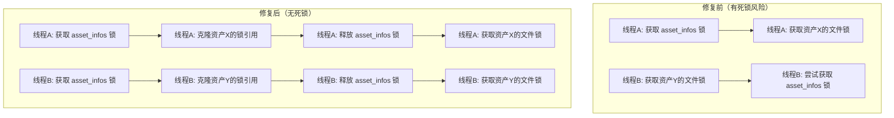

+++
title = "#22017 Release the asset infos lock before acquiring the file transaction lock."
date = "2025-12-07T00:00:00"
draft = false
template = "pull_request_page.html"
in_search_index = false

[extra]
current_language = "zh-cn"
available_languages = {"en" = { name = "English", url = "/pull_request/bevy/2025-12/pr-22017-en-20251207" }, "zh-cn" = { name = "中文", url = "/pull_request/bevy/2025-12/pr-22017-zh-cn-20251207" }}
+++

# Release the asset infos lock before acquiring the file transaction lock.

## Basic Information
- **标题**: Release the asset infos lock before acquiring the file transaction lock.
- **PR链接**: https://github.com/bevyengine/bevy/pull/22017
- **作者**: andriyDev
- **状态**: 已合并
- **标签**: C-Bug, A-Assets, S-Ready-For-Final-Review, D-Modest
- **创建时间**: 2025-12-03T08:30:50Z
- **合并时间**: 2025-12-07T18:51:37Z
- **合并人**: mockersf

## 描述翻译

### 目标
- 修复与 #22001 相关的第一个不稳定测试问题。
- 我们遇到了一个双重锁问题。我们首先锁定 `asset_infos`，然后锁定 `asset_infos` 中的一个资产，**然后释放了 `asset_infos` 锁**。然而，这意味着如果一个进程需要访问 `asset_infos`（在处理过程中加载嵌套资产时必须这样做），就会出现一个线程尝试锁定 1) asset_infos，2) 每个资产的锁，而另一个线程尝试锁定 1) 每个资产的锁（我们已经释放了 asset_infos 锁），2) asset_infos。这是一个典型的死锁！

### 解决方案
- 在锁定每个资产的锁之前，我们首先从 `asset_infos` 中克隆出 `Arc<RwLock>`，然后释放 `asset_infos` 锁，最后才锁定每个资产的锁。这确保了我们永远不会在仅尝试获取单个资产时卡在 `asset_infos` 锁上。
- 使所有对 `asset_infos` 的访问都变得"短暂"——它们从 `asset_infos` 中获取所需内容后立即释放锁。
- 我还使用了 `?` 运算符来清理 `ProcessorAssetInfos` 中的一些方法，之前这些方法是"移除资产信息，然后在其后有一个大的 `if let` 语句"。现在，如果值为 `None`，我们直接提前返回。
- 我顺便修复了一个奇怪的情况，即重命名中的新路径没有受到事务锁的保护。现在它有了！

### 测试
- 在没有此修复的情况下运行，我很快（大约一分钟后）就从 `only_reprocesses_wrong_hash_on_startup` 测试中得到了"循环耗尽"的错误。使用此修复后，我现在只遇到了断言失败的问题。如果我也跳过那个断言，该测试已经有一段时间没有出现不稳定情况了！太好了，不再有死锁了！

## 该PR的故事

这次代码修改的核心是解决一个在资产处理系统中出现的经典死锁问题。问题发生在 `AssetProcessor` 模块中，特别是当多个线程同时操作资产信息映射和单个资产的读写锁时。

### 问题与背景

在 Bevy 的资产处理器中，`asset_infos` 是一个存储所有资产处理状态的中心化数据结构，由一个读写锁保护。同时，每个资产都有一个自己的 `file_transaction_lock` 用于协调对该资产文件的读写操作。

原来的代码模式存在一个典型的死锁场景：

1. 线程A：先获取 `asset_infos` 写锁，然后获取特定资产的 `file_transaction_lock` 写锁
2. 线程B：先获取同一个资产的 `file_transaction_lock` 读锁，然后需要获取 `asset_infos` 读锁来查找依赖关系

当这两个操作交错发生时，就会出现死锁。线程A持有 `asset_infos` 锁并等待资产锁，线程B持有资产锁并等待 `asset_infos` 锁。

这种死锁在嵌套资产加载时特别容易发生，因为处理嵌套资产需要在持有资产锁的同时查询 `asset_infos` 来查找依赖项。

### 解决方案

修复的核心思想是确保锁的获取顺序在所有代码路径上保持一致。具体来说，我们采用了以下策略：

1. **缩短锁的作用域**：只在绝对需要的时候持有 `asset_infos` 锁，获取必要信息后立即释放
2. **分离锁获取**：先从 `asset_infos` 中克隆出资产的锁（Arc），然后释放 `asset_infos` 锁，最后再获取资产锁
3. **统一锁顺序**：确保所有代码路径都遵循先获取 `asset_infos` 锁（短暂），再获取资产锁的顺序

### 实现细节

在代码层面，这个修复涉及几个关键函数的重构：

**`process_asset` 函数**：
```rust
let _transaction_lock = {
    let lock = {
        let mut infos = self.data.processing_state.asset_infos.write().await;
        let info = infos.get_or_insert(asset_path.clone());
        // Clone out the transaction lock first and then lock after we've dropped the
        // asset_infos. Otherwise, trying to lock a single path can block all other paths to
        // (leading to deadlocks).
        info.file_transaction_lock.clone()
    };
    lock.write_arc().await
};
```

这里的模式很清晰：在 `asset_infos` 锁的作用域内，我们克隆出资产的 `file_transaction_lock`，然后退出作用域释放 `asset_infos` 锁，最后在外部作用域中获取资产的写锁。

**`handle_removed_asset` 和 `handle_renamed_asset` 函数**：
这两个函数采用了类似的模式，但更复杂一些，因为它们需要处理 `ProcessorAssetInfos` 结构体返回的锁：

```rust
let result = {
    // Scope the infos lock so we don't hold up other processing for too long.
    let mut infos = self.data.processing_state.asset_infos.write().await;
    infos.rename(&old, &new, new_task_sender).await
};
let Some((old_lock, new_lock)) = result else {
    return;
};
// we must wait for uncontested write access to both assets to ensure existing
// readers/writers can finish their operations
let _old_write_lock = old_lock.write();
let _new_write_lock = new_lock.write();
```

**`ProcessorAssetInfos` 结构体的修改**：
`remove` 和 `rename` 方法现在返回资产的锁，而不是在方法内部获取锁。这允许调用者在释放 `asset_infos` 锁后才获取这些锁：

```rust
async fn remove(
    &mut self,
    asset_path: &AssetPath<'static>,
) -> Option<Arc<async_lock::RwLock<()>>> {
    // ... 处理逻辑保持不变 ...
    Some(info.file_transaction_lock)  // 返回锁而不是获取它
}
```

### 技术洞察

这个修复展示了几个重要的并发编程原则：

1. **锁顺序的重要性**：避免死锁的关键是确保所有线程以相同的顺序获取锁
2. **锁粒度**：尽可能减少锁的作用域，只持有锁完成必要操作
3. **所有权分离**：通过克隆 `Arc` 来分离锁的所有权和获取时机，避免了必须同时持有多个锁的情况

值得注意的是，这个修复还暴露了一个之前未受保护的操作：在重命名操作中，新路径的文件操作没有受到事务锁的保护。在修复死锁的同时，作者也修复了这个安全问题，确保了对新路径的读写操作也受到适当的锁保护。

### 影响

这个修复直接解决了测试中的不稳定问题。在修复前，`only_reprocesses_wrong_hash_on_startup` 测试会因死锁而失败（"Ran out of loops"）。修复后，死锁问题消失，测试可以正常运行。

更重要的是，这个修复提高了资产处理系统的整体健壮性。通过消除潜在的死锁点，系统在并发负载下的可靠性得到了提升，特别是在处理复杂资产依赖关系时。

## 可视化表示



## 主要更改文件

### `crates/bevy_asset/src/processor/mod.rs` (+131/-102)

这个文件包含了所有关键的修改。主要变化集中在以下几个函数：

**1. `handle_removed_asset` 函数**
```rust
// 修改前：
let mut infos = self.data.processing_state.asset_infos.write().await;
if let Some(info) = infos.get(&asset_path) {
    let _write_lock = info.file_transaction_lock.write();
    self.remove_processed_asset_and_meta(source, asset_path.path())
        .await;
}
infos.remove(&asset_path).await;

// 修改后：
let lock = {
    let mut infos = self.data.processing_state.asset_infos.write().await;
    infos.remove(&asset_path).await
};
let Some(lock) = lock else {
    return;
};
let _write_lock = lock.write();
self.remove_processed_asset_and_meta(source, asset_path.path())
    .await;
```

**2. `handle_renamed_asset` 函数**
```rust
// 修改前：
let mut infos = self.data.processing_state.asset_infos.write().await;
if let Some(info) = infos.get(&old) {
    let _write_lock = info.file_transaction_lock.write();
    // ... 重命名操作 ...
}
infos.rename(&old, &new, new_task_sender).await;

// 修改后：
let result = {
    let mut infos = self.data.processing_state.asset_infos.write().await;
    infos.rename(&old, &new, new_task_sender).await
};
let Some((old_lock, new_lock)) = result else {
    return;
};
let _old_write_lock = old_lock.write();
let _new_write_lock = new_lock.write();
// ... 重命名操作 ...
```

**3. `process_asset` 函数**
```rust
// 修改前：
let _transaction_lock = {
    let mut infos = self.data.processing_state.asset_infos.write().await;
    let info = infos.get_or_insert(asset_path.clone());
    info.file_transaction_lock.write_arc().await
};

// 修改后：
let _transaction_lock = {
    let lock = {
        let mut infos = self.data.processing_state.asset_infos.write().await;
        let info = infos.get_or_insert(asset_path.clone());
        info.file_transaction_lock.clone()
    };
    lock.write_arc().await
};
```

**4. `asset_file_transaction_lock` 方法**
```rust
// 修改前：
let infos = self.asset_infos.read().await;
let info = infos
    .get(path)
    .ok_or_else(|| AssetReaderError::NotFound(path.path().to_owned()))?;
Ok(info.file_transaction_lock.read_arc().await)

// 修改后：
let lock = {
    let infos = self.asset_infos.read().await;
    let info = infos
        .get(path)
        .ok_or_else(|| AssetReaderError::NotFound(path.path().to_owned()))?;
    info.file_transaction_lock.clone()
};
Ok(lock.read_arc().await)
```

**5. `ProcessorAssetInfos` 结构体的 `remove` 和 `rename` 方法**
这些方法的签名被修改为返回锁而不是在内部获取锁，从而允许调用者在释放 `asset_infos` 锁后控制锁的获取时机。

## 进一步阅读

1. **Rust并发编程**：
   - 《Rust程序设计》中的并发章节
   - Rust官方文档中的 `std::sync` 模块

2. **死锁预防**：
   - 操作系统教材中的死锁章节，特别是关于锁顺序和死锁预防策略的部分
   - 多线程编程中的常见陷阱和解决方案

3. **Bevy资产系统**：
   - Bevy官方文档中的资产处理系统部分
   - 相关的PR和issue，了解资产系统的演进历史

4. **异步Rust**：
   - `async_lock` crate的文档，了解其提供的读写锁实现
   - Tokio或async-std的同步原语文档