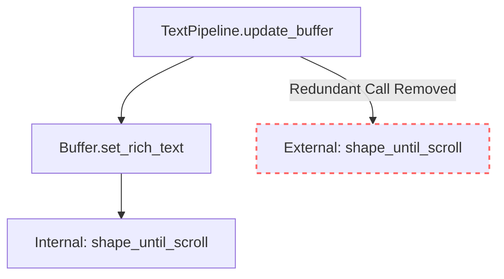

+++
title = "#22020 Remove redundant `shape_until_scroll`"
date = "2025-12-04T00:00:00"
draft = false
template = "pull_request_page.html"
in_search_index = true

[taxonomies]
list_display = ["show"]

[extra]
current_language = "en"
available_languages = {"en" = { name = "English", url = "/pull_request/bevy/2025-12/pr-22020-en-20251204" }, "zh-cn" = { name = "中文", url = "/pull_request/bevy/2025-12/pr-22020-zh-cn-20251204" }}
labels = ["D-Trivial", "C-Code-Quality", "A-Text"]
+++

# Title
Remove redundant `shape_until_scroll`

## Basic Information
- **Title**: Remove redundant `shape_until_scroll`
- **PR Link**: https://github.com/bevyengine/bevy/pull/22020
- **Author**: ickshonpe
- **Status**: MERGED
- **Labels**: D-Trivial, C-Code-Quality, A-Text, S-Needs-Review
- **Created**: 2025-12-03T09:46:21Z
- **Merged**: 2025-12-04T03:02:48Z
- **Merged By**: cart

## Description Translation
# Objective

In `TextPipeline::update_buffer` the `shape_until_scroll` call is redundant.
The preceding line that calls `set_rich_text`, calls `shape_until_scroll` itself before returning.

## Solution

Remove the `shape_until_scroll` call.

## Testing

The `testbed_ui` screenshot CI will fail with no text rendered if this is incorrect.

## The Story of This Pull Request

This pull request addresses a minor code quality issue in Bevy's text rendering system. The problem was straightforward: redundant function execution in a critical path of the text pipeline.

In `TextPipeline::update_buffer`, there was a logical issue where `shape_until_scroll` was being called twice for the same text buffer. The first call happens implicitly inside `set_rich_text`, and then immediately after that call returns, the same function was being called explicitly. This creates unnecessary CPU work for every text update operation, however small that overhead might be.

The situation arose because the `set_rich_text` method on the cosmic-text `Buffer` type internally calls `shape_until_scroll` before returning. The Bevy code calling this method didn't account for this implementation detail and added its own explicit call, creating the duplication.

The fix is minimal but important for code clarity and eliminating wasted cycles. By removing the redundant call, we ensure that text shaping happens exactly once per update, not twice. This maintains the same functional behavior since the second call was essentially a no-op - the text was already shaped by the first call, so the second call would find no work to do.

The testing approach for this change relies on Bevy's existing CI infrastructure. Since text rendering is critical to the UI system, the screenshot comparison tests for `testbed_ui` would immediately fail if text stopped rendering correctly. This provides a robust safety net for what might otherwise be a risky change in a core rendering component.

This type of optimization is typical in performance-critical systems like game engines. Even small inefficiencies can accumulate across frames and across many UI elements. The fix demonstrates good attention to detail and understanding of the underlying text rendering library's API contracts.

## Visual Representation



## Key Files Changed

**File: `crates/bevy_text/src/pipeline.rs`** (+0/-2)

This file contains the core text processing logic for Bevy's text rendering system. The change removes a redundant function call that was executing text shaping operations twice per update.

**Code Change:**
```rust
// File: crates/bevy_text/src/pipeline.rs
// Before (lines around 221):
        buffer.set_rich_text(
            &text.sections,
            text.alignment.into(),
            text.linebreak_behavior,
            bounds,
            Some(justify.into()),
        );

        buffer.shape_until_scroll(font_system, false);

// After:
        buffer.set_rich_text(
            &text.sections,
            text.alignment.into(),
            text.linebreak_behavior,
            bounds,
            Some(justify.into()),
        );

        // Workaround for alignment not working for unbounded text.
```

The removed line `buffer.shape_until_scroll(font_system, false);` was redundant because `set_rich_text` already calls this function internally before returning. The PR eliminates this unnecessary duplicate work while maintaining identical functional behavior.

## Further Reading

1. **cosmic-text library documentation**: The underlying text shaping library used by Bevy: https://github.com/pop-os/cosmic-text
2. **Text shaping concepts**: Understanding how text layout works in game engines: https://en.wikipedia.org/wiki/Text_shaping
3. **Bevy Text System**: Official Bevy documentation on text rendering: https://bevyengine.org/learn/books/unofficial-bevy-cheat-book/features/text.html
4. **Performance optimization in game engines**: General principles of eliminating redundant operations in real-time systems