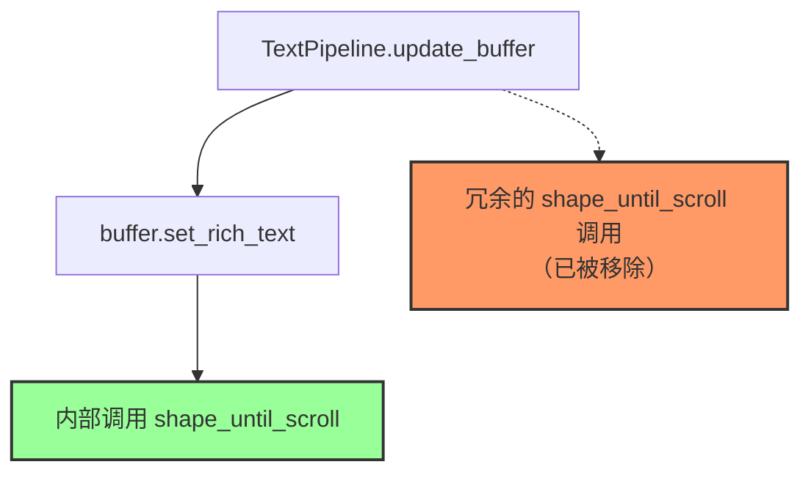

+++
title = "#22020 Remove redundant `shape_until_scroll`"
date = "2025-12-04T00:00:00"
draft = false
template = "pull_request_page.html"
in_search_index = false

[extra]
current_language = "zh-cn"
available_languages = {"en" = { name = "English", url = "/pull_request/bevy/2025-12/pr-22020-en-20251204" }, "zh-cn" = { name = "中文", url = "/pull_request/bevy/2025-12/pr-22020-zh-cn-20251204" }}
labels = ["D-Trivial", "C-Code-Quality", "A-Text"]
+++

# Title
Remove redundant `shape_until_scroll`

## Basic Information
- **Title**: Remove redundant `shape_until_scroll`
- **PR Link**: https://github.com/bevyengine/bevy/pull/22020
- **Author**: ickshonpe
- **Status**: MERGED
- **Labels**: D-Trivial, C-Code-Quality, A-Text, S-Needs-Review
- **Created**: 2025-12-03T09:46:21Z
- **Merged**: 2025-12-04T03:02:48Z
- **Merged By**: cart

## Description Translation
### 目标（Objective）
在 `TextPipeline::update_buffer` 中，`shape_until_scroll` 的调用是多余的。
因为前一行调用 `set_rich_text` 时，在返回前已经自己调用了 `shape_until_scroll`。

### 解决方案（Solution）
移除多余的 `shape_until_scroll` 调用。

### 测试（Testing）
如果这个修改有误，`testbed_ui` 的 CI 截图测试将会失败（因为文本不会被渲染）。

## The Story of This Pull Request

这个 PR 解决的是一个典型的代码冗余问题。在 Bevy 引擎的文本渲染管线中，开发者在进行代码审查时发现了一个不必要的函数调用，这个调用虽然不会造成功能错误，但会带来不必要的性能开销。

### 问题背景

在 `TextPipeline::update_buffer` 方法中，代码首先调用了 `buffer.set_rich_text` 来设置富文本内容，然后紧接着又调用了 `buffer.shape_until_scroll`。问题的关键在于 `set_rich_text` 方法内部已经调用了 `shape_until_scroll`，因此外部的这次调用是完全多余的。

这种冗余调用会导致 CPU 时间的浪费，因为文本整形（shaping）操作在文本渲染中是计算密集型的步骤。虽然单次调用的开销可能不大，但考虑到文本更新可能频繁发生（特别是在 UI 密集的应用中），这种冗余操作的累积效应会降低整体性能。

### 解决方案的实现

开发者识别到这个问题后，采取了一个直接有效的解决方案：直接删除这个冗余的函数调用。这是一个典型的 "删除死代码" 类型的修复，不需要添加新的逻辑，只需要移除不需要的代码。

从代码修改来看，这个修复非常简洁：

```rust
// 在调用 set_rich_text 后...
buffer.shape_until_scroll(font_system, false); // 这行被删除
```

删除这行代码后，文本整形操作仍然会在 `set_rich_text` 内部执行，确保了文本正确渲染，但避免了重复操作。

### 技术细节和验证

这个修复的关键在于理解文本渲染管线的工作原理。`set_rich_text` 方法负责设置文本内容并执行初步的文本整形，而 `shape_until_scroll` 方法则负责根据滚动位置进一步调整文本布局。由于 `set_rich_text` 已经完成了必要的文本整形工作，外部的重复调用是无效的。

为了验证这个修改的正确性，PR 作者指出现有的 `testbed_ui` CI 测试会提供足够的保障。如果这个修改破坏了文本渲染功能，CI 测试中的截图比较就会失败，因为文本不会被正确渲染。这种依赖现有测试用例的验证方式是一个典型的实践，既确保了代码质量，又避免了编写专门的测试代码。

### 性能影响

从性能角度来看，这个修复减少了一个不必要的文本整形操作。文本整形涉及复杂的布局计算，包括字符定位、换行处理等。在 Bevy 中，`shape_until_scroll` 方法需要处理字体系统、文本对齐、边界计算等多个参数。虽然这个调用的参数 `false` 表示不处理滚动，但方法内部仍然会执行一些计算。

删除这个冗余调用可以带来以下好处：
1. 减少 CPU 时间消耗
2. 降低函数调用开销
3. 避免潜在的竞争条件（虽然在这个场景中可能性较小）

### 代码质量提升

除了性能改善外，这个修复还提升了代码的可读性和维护性。冗余代码往往会让其他开发者困惑，他们可能会试图理解为什么需要两次调用，或者在未来修改时保留这种冗余模式。通过消除这种不必要的调用，代码变得更加清晰和直接。

## Visual Representation



## Key Files Changed

### 1. `crates/bevy_text/src/pipeline.rs`

**修改内容**: 在 `TextPipeline::update_buffer` 方法中移除了冗余的 `shape_until_scroll` 调用。

**修改前后的代码对比**:

```rust
// File: crates/bevy_text/src/pipeline.rs
// Before:
pub fn update_buffer(
    &self,
    // ... 参数省略
) {
    // ... 前面的代码
    
    buffer.set_rich_text(
        font_system,
        &rich_text,
        font_size,
        line_height,
        line_spacing,
        leading,
        justify.into(),
    );

    buffer.shape_until_scroll(font_system, false); // 这一行被移除

    // 处理无边界的文本对齐问题
    if bounds.width.is_none() && justify != Justify::Left {
        // ...
    }
    
    // ... 后面的代码
}

// After:
pub fn update_buffer(
    &self,
    // ... 参数省略
) {
    // ... 前面的代码
    
    buffer.set_rich_text(
        font_system,
        &rich_text,
        font_size,
        line_height,
        line_spacing,
        leading,
        justify.into(),
    );

    // buffer.shape_until_scroll(font_system, false); // 这行已被移除

    // 处理无边界的文本对齐问题
    if bounds.width.is_none() && justify != Justify::Left {
        // ...
    }
    
    // ... 后面的代码
}
```

**与 PR 目标的关系**: 这个修改直接实现了 PR 的目标，移除了冗余的 `shape_until_scroll` 调用。虽然修改的代码量很小（仅删除了一行），但它解决了性能问题并提升了代码质量。

## Further Reading

对于想要了解更多相关概念的开发者，可以参考以下资源：

1. **Bevy 文本渲染系统**: 了解 Bevy 引擎如何处理文本渲染和布局
   - [Bevy 官方文档 - Text](https://docs.rs/bevy/latest/bevy/text/index.html)
   - [Bevy Cheatbook - UI](https://bevy-cheatbook.github.io/features/ui.html)

2. **文本整形（Text Shaping）**: 理解文本整形的概念和技术
   - [HarfBuzz 文档](https://harfbuzz.github.io/what-is-harfbuzz.html) - 一个流行的文本整形引擎
   - [Freetype 和 HarfBuzz](https://freetype.org/freetype2/docs/text-rendering-general.html) - 文本渲染的一般概念

3. **代码优化和性能分析**: 学习如何识别和移除冗余代码
   - [性能优化模式](https://gameprogrammingpatterns.com/optimization-patterns.html) - 游戏开发中的优化模式
   - [Rust 性能指南](https://nnethercote.github.io/perf-book/) - Rust 代码的性能优化技巧

4. **相关 PR 和 Issue**: 
   - [cosmic-text 对齐问题](https://github.com/pop-os/cosmic-text/issues/343) - PR 中提到的一个底层库的问题，用于处理无边界文本的对齐

# Full Code Diff
```diff
diff --git a/crates/bevy_text/src/pipeline.rs b/crates/bevy_text/src/pipeline.rs
index 9fa918ba73ac0..649cd2d5aa8dc 100644
--- a/crates/bevy_text/src/pipeline.rs
+++ b/crates/bevy_text/src/pipeline.rs
@@ -221,8 +221,6 @@ impl TextPipeline {
             Some(justify.into()),
         );
 
-        buffer.shape_until_scroll(font_system, false);
-
         // Workaround for alignment not working for unbounded text.
         // See https://github.com/pop-os/cosmic-text/issues/343
         if bounds.width.is_none() && justify != Justify::Left {
```