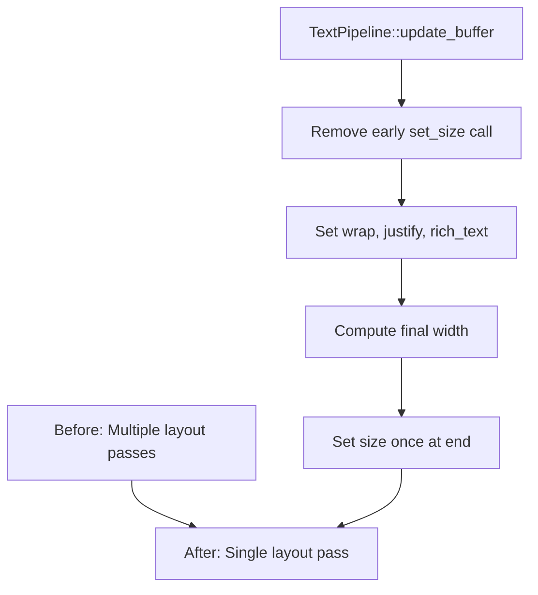

+++
title = "#22021 Update size and metrics after `set_rich_text` in `TextPipeline::update_buffer`"
date = "2025-12-07T00:00:00"
draft = false
template = "pull_request_page.html"
in_search_index = true

[taxonomies]
list_display = ["show"]

[extra]
current_language = "en"
available_languages = {"en" = { name = "English", url = "/pull_request/bevy/2025-12/pr-22021-en-20251207" }, "zh-cn" = { name = "中文", url = "/pull_request/bevy/2025-12/pr-22021-zh-cn-20251207" }}
labels = ["D-Trivial", "C-Performance", "A-Text"]
+++

# Title
Update size and metrics after `set_rich_text` in `TextPipeline::update_buffer`

## Basic Information
- **Title**: Update size and metrics after `set_rich_text` in `TextPipeline::update_buffer`
- **PR Link**: https://github.com/bevyengine/bevy/pull/22021
- **Author**: ickshonpe
- **Status**: MERGED
- **Labels**: D-Trivial, C-Performance, S-Ready-For-Final-Review, A-Text
- **Created**: 2025-12-03T11:45:24Z
- **Merged**: 2025-12-07T18:45:59Z
- **Merged By**: mockersf

## Description Translation
**Objective**

Rearrange the order that cosmic text's properties are set for improved performance.

**Solution**

Update size and metrics after `set_rich_text` in `TextPipeline::update_buffer`

**Testing**

yellow = this PR, red = main:

```
cargo run --example many_glyphs --features=trace_tracy,debug --release -- --recompute-text 
```


## The Story of This Pull Request

This PR addresses a performance optimization in Bevy's text rendering system. The issue was in the `TextPipeline::update_buffer` method, which handles text layout computation using the cosmic-text library.

Before this change, the method was setting the buffer size first, then configuring text properties like wrapping and justification, then setting the rich text content, and finally conditionally adjusting the size again for certain edge cases. The problem with this approach was that setting the buffer size early could cause unnecessary re-layouts when subsequent operations like `set_rich_text` modify the text content.

The core insight is that `set_rich_text` can trigger layout computations internally. If we set the size before the text content is established, we might cause cosmic-text to perform layout work twice: once when the text is set, and potentially again when we adjust sizing for the unbounded text workaround. This is particularly relevant for the case where text width is unbounded and justification isn't left-aligned, which requires measuring the text after layout to apply proper alignment.

The solution reorders the operations to set all text properties first, then set the buffer size once at the end. This eliminates redundant layout passes. The implementation also streamlines the conditional logic for the unbounded text workaround by computing the width in a single expression rather than having a separate conditional block.

The performance improvement is demonstrated in the benchmark images showing reduced time spent in text measurement and layout operations. This is a classic optimization pattern: batch related operations to minimize expensive recalculations, especially when working with layout engines that may internally cache or recompute based on property changes.

## Visual Representation



## Key Files Changed

**File**: `crates/bevy_text/src/pipeline.rs`

**Changes**: The PR modifies the `TextPipeline::update_buffer` method to rearrange the order of operations when configuring cosmic-text buffers. The key change is moving the `buffer.set_size` call to after `buffer.set_rich_text` and consolidating the unbounded text workaround logic.

**Before**:
```rust
// Update the buffer.
let buffer = &mut computed.buffer;
buffer.set_size(font_system, bounds.width, bounds.height);

buffer.set_wrap(
    font_system,
    match wrap {
        TextWrap::NoWrap => Wrap::None,
        TextWrap::Word => Wrap::Word,
        TextWrap::Character => Wrap::Glyph,
    },
);

buffer.set_justify(font_system, match justify {
    Justify::Left => cosmic_text::Justify::Left,
    Justify::Center => cosmic_text::Justify::Center,
    Justify::Right => cosmic_text::Justify::Right,
});

buffer.set_rich_text(font_system, spans, &settings, metrics);

// Workaround for alignment not working for unbounded text.
// See https://github.com/pop-os/cosmic-text/issues/343
if bounds.width.is_none() && justify != Justify::Left {
    let dimensions = buffer_dimensions(buffer);
    // `set_size` causes a re-layout to occur.
    buffer.set_size(font_system, Some(dimensions.x), bounds.height);
}
```

**After**:
```rust
// Update the buffer.
let buffer = &mut computed.buffer;

buffer.set_wrap(
    font_system,
    match wrap {
        TextWrap::NoWrap => Wrap::None,
        TextWrap::Word => Wrap::Word,
        TextWrap::Character => Wrap::Glyph,
    },
);

buffer.set_justify(font_system, match justify {
    Justify::Left => cosmic_text::Justify::Left,
    Justify::Center => cosmic_text::Justify::Center,
    Justify::Right => cosmic_text::Justify::Right,
});

buffer.set_rich_text(font_system, spans, &settings, metrics);

// Workaround for alignment not working for unbounded text.
// See https://github.com/pop-os/cosmic-text/issues/343
let width = (bounds.width.is_none() && justify != Justify::Left)
    .then(|| buffer_dimensions(buffer).x)
    .or(bounds.width);
buffer.set_size(font_system, width, bounds.height);
```

**Analysis**: The change removes the initial `set_size` call and moves it to the end after all text properties are set. The conditional workaround for unbounded text is integrated into the final `set_size` call using a more concise expression that computes the appropriate width. This ensures cosmic-text only performs layout calculations once, after all text properties are configured.

## Further Reading

1. [Cosmic-text GitHub repository](https://github.com/pop-os/cosmic-text) - The text layout library used by Bevy
2. [Bevy Text Rendering Documentation](https://docs.rs/bevy_text/latest/bevy_text/) - Official Bevy text rendering API docs
3. [Performance Optimization Patterns in Game Engines](https://gameprogrammingpatterns.com/optimization-patterns.html) - Common optimization techniques relevant to engine development
4. [Layout Engine Internals](https://en.wikipedia.org/wiki/Text_layout) - General concepts about text layout and performance considerations