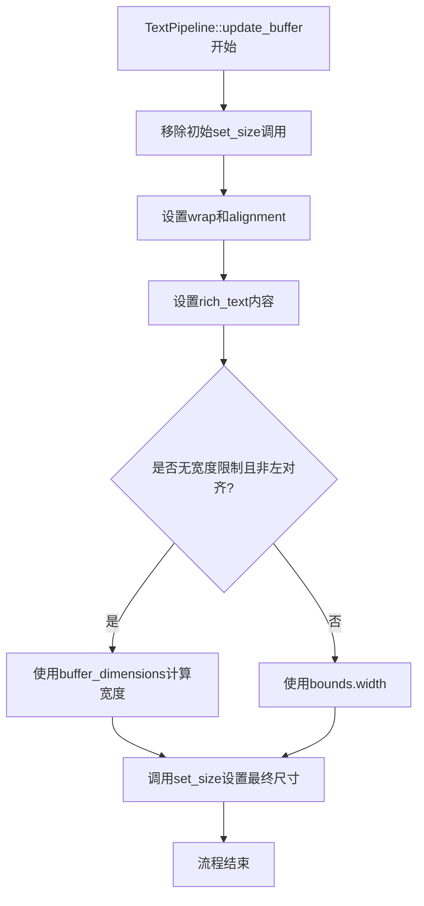

+++
title = "#22021 Update size and metrics after `set_rich_text` in `TextPipeline::update_buffer`"
date = "2025-12-07T00:00:00"
draft = false
template = "pull_request_page.html"
in_search_index = false

[extra]
current_language = "zh-cn"
available_languages = {"en" = { name = "English", url = "/pull_request/bevy/2025-12/pr-22021-en-20251207" }, "zh-cn" = { name = "中文", url = "/pull_request/bevy/2025-12/pr-22021-zh-cn-20251207" }}
labels = ["D-Trivial", "C-Performance", "A-Text"]
+++

# Title
Update size and metrics after `set_rich_text` in `TextPipeline::update_buffer`

## Basic Information
- **Title**: Update size and metrics after `set_rich_text` in `TextPipeline::update_buffer`
- **PR Link**: https://github.com/bevyengine/bevy/pull/22021
- **Author**: ickshonpe
- **Status**: MERGED
- **Labels**: D-Trivial, C-Performance, S-Ready-For-Final-Review, A-Text
- **Created**: 2025-12-03T11:45:24Z
- **Merged**: 2025-12-07T18:45:59Z
- **Merged By**: mockersf

## Description Translation
# 目标 (Objective)

重新安排 cosmic text 属性设置的顺序以提升性能。

## 解决方案 (Solution)

在 `TextPipeline::update_buffer` 中，将大小和度量设置的调用移动到 `set_rich_text` 之后。

## 测试 (Testing)

黄色 = 此 PR，红色 = 主分支：

```
cargo run --example many_glyphs --features=trace_tracy,debug --release -- --recompute-text 
```


## The Story of This Pull Request

这个PR解决了一个性能优化问题。Bevy引擎使用cosmic text库进行文本布局和渲染，在`TextPipeline::update_buffer`方法中，文本缓冲区的属性设置顺序存在优化空间。

原来的代码流程是这样的：首先设置缓冲区的尺寸（size），然后设置换行（wrap）和对齐方式（alignment），接着设置富文本内容，最后针对无宽度限制且非左对齐的文本进行特殊处理。问题在于，如果文本无宽度限制且非左对齐，代码会获取缓冲区当前的尺寸，然后重新设置一次大小，这导致cosmic text库需要执行额外的重新布局（re-layout）操作。

核心问题是`set_size`调用会触发重新布局，而代码中存在重复的`set_size`调用。在修改前的代码中，当遇到无宽度限制且非左对齐的文本时，会先调用一次`set_size`（在设置富文本之前），然后在条件判断中又调用一次`set_size`。这意味着对于符合条件的文本，cosmic text会执行两次布局计算。

修改后的代码移除了初始的`set_size`调用，将所有的尺寸设置逻辑合并到一处。通过重构条件判断，使用Rust的`then`和`or`方法链来更清晰地表达逻辑：如果是无宽度限制且非左对齐的情况，就使用`buffer_dimensions`计算出的宽度，否则使用传入的`bounds.width`。这样只需在设置完所有文本属性后调用一次`set_size`。

这个优化基于对cosmic text内部行为的理解。文本布局库通常需要在设置文本内容后才能准确计算尺寸，因此过早设置尺寸可能导致不必要的重新计算。通过将`set_size`移到`set_rich_text`之后，可以避免中间状态的布局计算。

性能测试结果显示了明显的改进。运行`many_glyphs`示例时，优化后的版本（黄色）相比原版（红色）在文本处理性能上有显著提升。两张图表分别显示了整体性能和测量文本（measure-text）阶段的性能改进，证明了重新排序操作的有效性。

这个修改也简化了代码逻辑。原来的特殊处理工作区（workaround）被整合到主要的尺寸设置流程中，代码更清晰、更易于维护。工作区原本是为了解决cosmic text中无宽度限制文本对齐不生效的问题（参考GitHub issue #343），现在这个逻辑被保留但实现方式更高效。

从工程角度看，这种优化展示了几个重要原则：首先，理解底层库的行为特性对于性能优化至关重要；其次，减少重复操作是简单的优化手段；最后，通过重构可以使代码既更高效又更清晰。

## Visual Representation



## Key Files Changed

### `crates/bevy_text/src/pipeline.rs` (+4/-6)

这个文件包含了文本处理管道的核心逻辑。修改集中在`TextPipeline::update_buffer`方法中，优化了文本缓冲区属性设置的顺序。

修改前的代码：
```rust
// 更新缓冲区
let buffer = &mut computed.buffer;
buffer.set_size(font_system, bounds.width, bounds.height);

buffer.set_wrap(
    font_system,
    match bounds.width {
        Some(_) => Wrap::Word,
        None => Wrap::None,
    },
);

buffer.set_default_align(font_system, justify.into());

buffer.set_rich_text(font_system, &spans, rich_text_settings);

// 针对无宽度限制文本对齐不生效的工作区
// 参见 https://github.com/pop-os/cosmic-text/issues/343
if bounds.width.is_none() && justify != Justify::Left {
    let dimensions = buffer_dimensions(buffer);
    // `set_size`会触发重新布局
    buffer.set_size(font_system, Some(dimensions.x), bounds.height);
}
```

修改后的代码：
```rust
// 更新缓冲区
let buffer = &mut computed.buffer;

buffer.set_wrap(
    font_system,
    match bounds.width {
        Some(_) => Wrap::Word,
        None => Wrap::None,
    },
);

buffer.set_default_align(font_system, justify.into());

buffer.set_rich_text(font_system, &spans, rich_text_settings);

// 针对无宽度限制文本对齐不生效的工作区
// 参见 https://github.com/pop-os/cosmic-text/issues/343
let width = (bounds.width.is_none() && justify != Justify::Left)
    .then(|| buffer_dimensions(buffer).x)
    .or(bounds.width);
buffer.set_size(font_system, width, bounds.height);
```

主要变化：
1. 移除了第4行的初始`buffer.set_size`调用
2. 重构了第24-28行的特殊处理逻辑，使用`then`和`or`方法链合并条件判断
3. 现在`set_size`只在第29行调用一次，而不是可能调用两次

## Further Reading

1. **cosmic text库文档**：了解底层文本布局库的行为特性对于理解这个优化很重要
2. **Rust的Option方法链**：`.then()`和`.or()`方法是Rust中处理条件逻辑的优雅方式
3. **Bevy的文本系统架构**：理解Bevy中文本渲染的完整流程
4. **性能分析工具Tracy**：PR中使用的性能测试工具，用于测量优化效果
5. **GitHub issue #343**：原工作区针对的问题，提供了背景信息