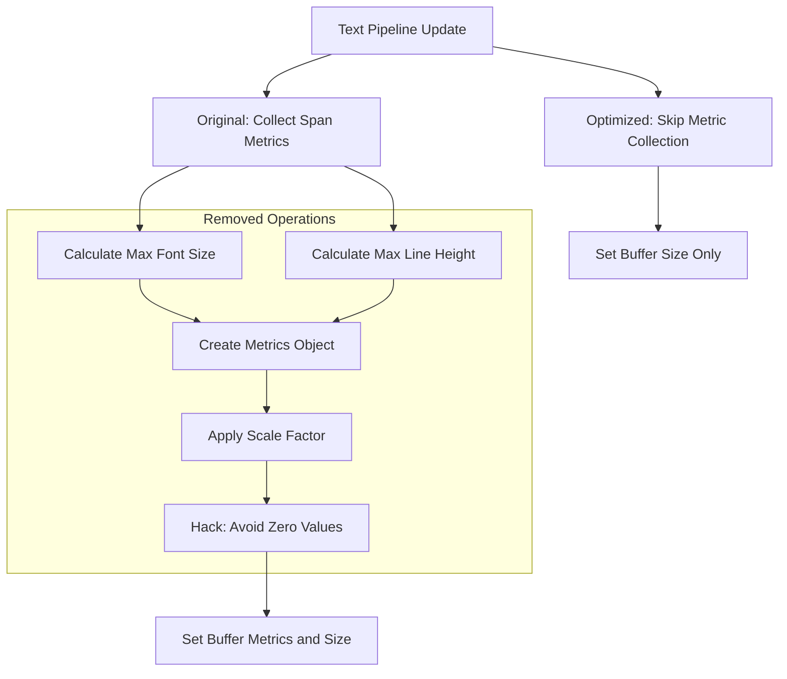

+++
title = "#22022 Ignore text buffer metrics"
date = "2025-12-04T00:00:00"
draft = false
template = "pull_request_page.html"
in_search_index = true

[taxonomies]
list_display = ["show"]

[extra]
current_language = "en"
available_languages = {"en" = { name = "English", url = "/pull_request/bevy/2025-12/pr-22022-en-20251204" }, "zh-cn" = { name = "中文", url = "/pull_request/bevy/2025-12/pr-22022-zh-cn-20251204" }}
labels = ["C-Performance", "C-Code-Quality", "A-Text", "D-Straightforward"]
+++

# Title
## Ignore text buffer metrics

## Basic Information
- **Title**: Ignore text buffer metrics
- **PR Link**: https://github.com/bevyengine/bevy/pull/22022
- **Author**: ickshonpe
- **Status**: MERGED
- **Labels**: C-Performance, C-Code-Quality, A-Text, D-Straightforward, S-Needs-Review
- **Created**: 2025-12-03T13:39:37Z
- **Merged**: 2025-12-04T02:57:54Z
- **Merged By**: cart

## Description Translation

# Objective

Since we set explicit font size and line height attributes for every text section, the `Metrics` values passed to the text buffer don't matter. We can just initialize the buffer with some dummy value and then ignore it.

## Solution

* Initialize the text buffer to some dummy values.
* Remove the code that collects and sets the metrics during text updates.

## The Story of This Pull Request

This PR addresses a performance optimization opportunity in Bevy's text rendering system. The core issue was that the text pipeline was performing unnecessary calculations for metrics that weren't actually being used in the final rendering output.

The problem stemmed from how the text pipeline interacted with the underlying `cosmic-text` library. In the original implementation, the code was collecting font metrics (maximum font size and line height) across all text spans, then using these values to configure the text buffer's metrics. However, this calculation was redundant because each text section already has explicitly defined font size and line height attributes that the text renderer uses directly.

Here's what the original code was doing in `pipeline.rs`:

```rust
let mut max_font_size: f32 = 0.;
let mut max_line_height: f32 = 0.0;
// ... collecting spans and calculating max values

let mut metrics = Metrics::new(max_font_size, max_line_height).scale(scale_factor as f32);
metrics.font_size = metrics.font_size.max(0.000001);
metrics.line_height = metrics.line_height.max(0.000001);

// Later in the code:
buffer.set_metrics_and_size(font_system, metrics, bounds.width, bounds.height);
```

The unnecessary work included:
1. Iterating through all text spans to find the maximum font size and line height
2. Creating a `Metrics` object with these values
3. Applying scaling to the metrics
4. Applying a hack to avoid zero values (which would cause a panic)

The key insight was recognizing that these metrics were only used for initializing the text buffer, but since each text span specifies its own font properties explicitly, the buffer's initial metrics don't affect the final rendered text. The `cosmic-text` library uses the font properties specified per span when actually rendering, not the initial buffer metrics.

The solution was straightforward: remove all the metric collection and calculation code, and simply call `buffer.set_size()` instead of `buffer.set_metrics_and_size()`. This eliminated the computational overhead of tracking maximum values across spans and the various calculations that followed.

Additionally, the default `CosmicBuffer` initialization was updated to use arbitrary dummy values (20.0 for both font size and line height) instead of the previous near-zero values that required special handling:

```rust
// Before:
Self(Buffer::new_empty(Metrics::new(0.0, 0.000001)))

// After:
Self(Buffer::new_empty(Metrics::new(20.0, 20.0)))
```

This change not only improves performance by eliminating unnecessary calculations but also simplifies the codebase. The removal of the hack to avoid zero values (the `max(0.000001)` calls) makes the code cleaner and easier to maintain.

From an architectural perspective, this optimization highlights an important principle: when working with layered rendering systems, it's valuable to understand which configuration parameters actually affect the final output versus which are just initialization artifacts. In this case, the buffer metrics were initialization-only parameters that didn't propagate to the actual text rendering.

The impact of this change is primarily performance-related - text updates should be slightly faster due to fewer calculations. There's no functional change to how text is rendered, as the per-span font properties remain the authoritative source for rendering decisions.

## Visual Representation



## Key Files Changed

### `crates/bevy_text/src/pipeline.rs` (+1/-14)

This file contained the main optimization. The changes removed the metric collection and calculation logic:

**Before:**
```rust
let mut max_font_size: f32 = 0.;
let mut max_line_height: f32 = 0.0;

// ... inside span processing loop:
max_font_size = max_font_size.max(text_font.font_size);
max_line_height = max_line_height.max(line_height.eval(text_font.font_size));

// ... later:
let mut metrics = Metrics::new(max_font_size, max_line_height).scale(scale_factor as f32);
metrics.font_size = metrics.font_size.max(0.000001);
metrics.line_height = metrics.line_height.max(0.000001);

// ... when updating buffer:
buffer.set_metrics_and_size(font_system, metrics, bounds.width, bounds.height);
```

**After:**
```rust
// Removed all metric collection code
// ...
// When updating buffer:
buffer.set_size(font_system, bounds.width, bounds.height);
```

### `crates/bevy_text/src/text.rs` (+1/-1)

This file contained a minor change to use sensible default values instead of near-zero values that required special handling:

**Before:**
```rust
impl Default for CosmicBuffer {
    fn default() -> Self {
        Self(Buffer::new_empty(Metrics::new(0.0, 0.000001)))
    }
}
```

**After:**
```rust
impl Default for CosmicBuffer {
    fn default() -> Self {
        Self(Buffer::new_empty(Metrics::new(20.0, 20.0)))
    }
}
```

## Further Reading

1. **cosmic-text library documentation**: Understanding how cosmic-text handles text layout and rendering would provide context for why these metrics were unnecessary.
2. **Bevy Text Rendering System**: The Bevy engine's text rendering architecture and how it integrates with different backends.
3. **Performance Optimization in Game Engines**: General principles for identifying and eliminating redundant calculations in real-time rendering systems.
4. **Rust Zero-Cost Abstractions**: How Rust's type system and compiler optimizations can help eliminate runtime overhead when properly structured.