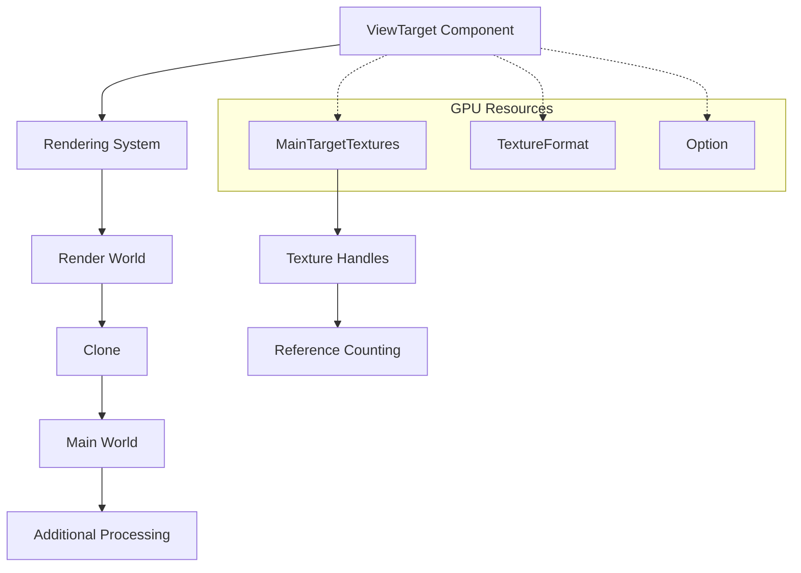

+++
title = "#22024 Add Clone derive to ViewTarget"
date = "2025-12-03T00:00:00"
draft = false
template = "pull_request_page.html"
in_search_index = true

[taxonomies]
list_display = ["show"]

[extra]
current_language = "en"
available_languages = {"en" = { name = "English", url = "/pull_request/bevy/2025-12/pr-22024-en-20251203" }, "zh-cn" = { name = "中文", url = "/pull_request/bevy/2025-12/pr-22024-zh-cn-20251203" }}
labels = ["C-Feature", "D-Trivial", "A-Rendering"]
+++

# Add Clone derive to ViewTarget

## Basic Information
- **Title**: Add Clone derive to ViewTarget
- **PR Link**: https://github.com/bevyengine/bevy/pull/22024
- **Author**: tychedelia
- **Status**: MERGED
- **Labels**: C-Feature, D-Trivial, A-Rendering, S-Ready-For-Final-Review
- **Created**: 2025-12-03T22:05:47Z
- **Merged**: 2025-12-03T22:54:48Z
- **Merged By**: alice-i-cecile

## Description Translation
For esoteric reasons we need to send this to the MainWorld for processing. All the fields are GPU resources or Arc'd so it can be trivially cloned.

## The Story of This Pull Request

The developer was working with Bevy's rendering system and encountered a scenario where a `ViewTarget` component needed to be sent to the `MainWorld` for additional processing. `ViewTarget` represents the target for a camera view in the rendering pipeline, containing texture resources and format information that define where a camera renders its output.

The problem was straightforward: the `ViewTarget` struct lacked the `Clone` trait derivation, making it impossible to create copies when moving between different ECS (Entity Component System) worlds in Bevy. This limitation became apparent when certain rendering operations required transferring the view target data from the render world to the main world. Without clone capability, the developer would need to either manually implement cloning or restructure the code to avoid copying.

The solution was to add `Clone` to the derive macro for `ViewTarget`. This approach was chosen because all the struct's fields—`main_textures: MainTargetTextures`, `main_texture_format: TextureFormat`, `out_texture: Option<Texture>`—are either GPU resources that support cloning (creating new handles, not copying GPU data) or simple value types that are trivially clonable. GPU resources in Bevy are typically reference-counted or handle-based, so cloning them creates new references to the same underlying resources rather than duplicating the actual GPU data.

The implementation is minimal and safe. By adding `Clone` to the derive list, Rust's compiler automatically generates a clone implementation that calls `.clone()` on each field. Since the fields already implement `Clone` appropriately, this doesn't introduce any performance issues or memory safety concerns. The existing `Component` derive is retained, so `ViewTarget` continues to function as an ECS component.

This change enables developers to move `ViewTarget` instances between worlds without complex workarounds. The term "esoteric reasons" in the PR description suggests there are specific rendering scenarios or custom rendering pipelines that require accessing `ViewTarget` in the main world, perhaps for post-processing effects, screen-space operations, or custom compositing that needs to happen outside the standard render graph.

The impact is modest but meaningful for developers building advanced rendering features. It provides flexibility in system architecture without requiring unsafe code or manual trait implementations. The change is backward-compatible and doesn't affect existing code—it only adds capabilities.

## Visual Representation



## Key Files Changed

**File:** `crates/bevy_render/src/view/mod.rs`

**Description:** Added the `Clone` derive to the `ViewTarget` struct to enable cloning instances for transfer between ECS worlds.

**Code Change:**
```rust
// Before:
#[derive(Component)]
pub struct ViewTarget {
    main_textures: MainTargetTextures,
    main_texture_format: TextureFormat,
    out_texture: Option<Texture>,
}

// After:
#[derive(Component, Clone)]
pub struct ViewTarget {
    main_textures: MainTargetTextures,
    main_texture_format: TextureFormat,
    out_texture: Option<Texture>,
}
```

**Explanation:** The change adds `Clone` to the derive macro list. The struct's fields all implement `Clone`: `MainTargetTextures` likely contains `Arc`-wrapped or handle-based GPU resources, `TextureFormat` is an enum or simple type, and `Option<Texture>` where `Texture` is a GPU resource handle. This enables safe cloning that creates new references to the same GPU resources.

## Further Reading

1. [Rust Clone trait documentation](https://doc.rust-lang.org/std/clone/trait.Clone.html)
2. [Bevy ECS Worlds and Resources](https://bevyengine.org/learn/book/getting-started/ecs/)
3. [Bevy Rendering: ViewTarget and Camera systems](https://github.com/bevyengine/bevy/blob/main/crates/bevy_render/src/view/mod.rs)
4. [Derive macros in Rust](https://doc.rust-lang.org/reference/procedural-macros.html#derive-macros)

## Full Code Diff
```diff
diff --git a/crates/bevy_render/src/view/mod.rs b/crates/bevy_render/src/view/mod.rs
index 0226f22c770b8..040d0ce7bc3cc 100644
--- a/crates/bevy_render/src/view/mod.rs
+++ b/crates/bevy_render/src/view/mod.rs
@@ -601,7 +601,7 @@ pub struct ViewUniformOffset {
     pub offset: u32,
 }
 
-#[derive(Component)]
+#[derive(Component, Clone)]
 pub struct ViewTarget {
     main_textures: MainTargetTextures,
     main_texture_format: TextureFormat,
```