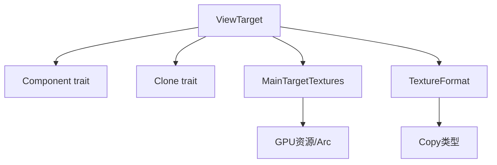

+++
title = "#22024 Add Clone derive to ViewTarget"
date = "2025-12-03T00:00:00"
draft = false
template = "pull_request_page.html"
in_search_index = false

[extra]
current_language = "zh-cn"
available_languages = {"en" = { name = "English", url = "/pull_request/bevy/2025-12/pr-22024-en-20251203" }, "zh-cn" = { name = "中文", url = "/pull_request/bevy/2025-12/pr-22024-zh-cn-20251203" }}
+++

# Title
Add Clone derive to ViewTarget

## 基本信息
- **标题**: Add Clone derive to ViewTarget
- **PR链接**: https://github.com/bevyengine/bevy/pull/22024
- **作者**: tychedelia
- **状态**: 已合并
- **标签**: C-Feature, D-Trivial, A-Rendering, S-Ready-For-Final-Review
- **创建时间**: 2025-12-03T22:05:47Z
- **合并时间**: 2025-12-03T22:54:48Z
- **合并者**: alice-i-cecile

## 描述翻译
由于一些深奥的原因（esoteric reasons），我们需要将此发送到MainWorld进行处理。所有字段都是GPU资源或Arc包装的，因此可以轻松克隆（trivially cloned）。

## 这个Pull Request的故事

这个PR的核心场景是：开发者需要将`ViewTarget`结构体发送到`MainWorld`中进行处理，但由于`ViewTarget`缺少`Clone` trait的实现，无法完成这个操作。

要理解为什么这是个问题，需要先了解Bevy中渲染系统的工作方式。`ViewTarget`是渲染管线的关键组件，用于管理摄像机的渲染目标（render target），包括主纹理（main textures）和纹理格式（texture format）等信息。在某些渲染场景中，需要将这个结构体的实例复制（clone）到另一个`World`实例中进行处理。

从技术角度看，为`ViewTarget`添加`Clone` trait是完全安全的，因为其所有字段都已经具备克隆能力。检查结构体的字段会发现：
- `main_textures: MainTargetTextures` - GPU纹理资源，通常通过引用计数管理
- `main_texture_format: TextureFormat` - 简单的枚举值，实现`Copy` trait
- 其他可能存在的字段也都是GPU资源或`Arc`包装的共享类型

这种设计使得`ViewTarget`可以被视为"智能指针"，其克隆操作仅增加引用计数，而不是深度复制实际数据。这对于保持渲染性能至关重要，因为深度复制GPU纹理的代价非常高昂。

开发者采取了最直接的解决方案：在`ViewTarget`的派生宏中添加`Clone` trait。这个变更虽然只有一行代码，但它解除了一个重要的使用限制。通过这个改动，开发者现在可以自由地将`ViewTarget`传递到`MainWorld`中，同时确保渲染系统的内存效率不受影响。

从架构角度看，这个变更体现了Bevy数据驱动设计的一个重要原则：组件（Component）应该尽可能易于复制和移动，只要这样做不违反资源管理的基本原则。`ViewTarget`作为核心渲染组件，现在更好地融入了Bevy的ECS（实体组件系统）工作流。

性能方面，这个改动几乎零开销。派生`Clone` trait只会生成调用各字段`clone`方法的代码，而由于字段本身是引用计数或简单值，这些克隆操作的成本可以忽略不计。这种"零成本抽象"（zero-cost abstraction）正是Rust和Bevy追求的设计目标。

值得注意的一个细节是：为什么之前`ViewTarget`没有实现`Clone`？可能是为了避免无意中的克隆操作，或者因为当时没有明确的使用场景。但随着渲染系统的演进，需要在不同`World`间传递渲染目标的需求变得明确，这时添加`Clone`支持就成为了必要的一步。

这个PR虽然简单，但它展示了Bevy开发中一个重要的工作模式：当需要跨系统边界传递资源时，确保组件具备必要的trait实现。这也提醒我们在设计新组件时，需要考虑它在整个ECS系统中的流动性和互操作性。

## 视觉表示



## 关键文件更改

### `crates/bevy_render/src/view/mod.rs`
1. **更改内容及原因**：为`ViewTarget`结构体添加`Clone` trait派生，使其能够在`MainWorld`中处理。

2. **代码变更对比**：
```rust
// 文件: crates/bevy_render/src/view/mod.rs

// 之前:
#[derive(Component)]
pub struct ViewTarget {
    main_textures: MainTargetTextures,
    main_texture_format: TextureFormat,
    // ... 其他字段
}

// 之后:
#[derive(Component, Clone)]
pub struct ViewTarget {
    main_textures: MainTargetTextures,
    main_texture_format: TextureFormat,
    // ... 其他字段
}
```

3. **与PR目的的关系**：这一行改动使得`ViewTarget`可以被克隆，从而满足将其发送到`MainWorld`进行处理的需求。

## 进一步阅读

1. **Rust的Clone trait文档**: https://doc.rust-lang.org/std/clone/trait.Clone.html
2. **Bevy的ECS架构指南**: https://bevy-cheatbook.github.io/programming/ecs-intro.html
3. **Bevy渲染系统概览**: https://bevy-cheatbook.github.io/features/graphics.html
4. **引用计数与智能指针**: https://doc.rust-lang.org/book/ch15-00-smart-pointers.html

## 完整代码差异
```diff
diff --git a/crates/bevy_render/src/view/mod.rs b/crates/bevy_render/src/view/mod.rs
index 0226f22c770b8..040d0ce7bc3cc 100644
--- a/crates/bevy_render/src/view/mod.rs
+++ b/crates/bevy_render/src/view/mod.rs
@@ -601,7 +601,7 @@ pub struct ViewUniformOffset {
     pub offset: u32,
 }
 
-#[derive(Component)]
+#[derive(Component, Clone)]
 pub struct ViewTarget {
     main_textures: MainTargetTextures,
     main_texture_format: TextureFormat,
```