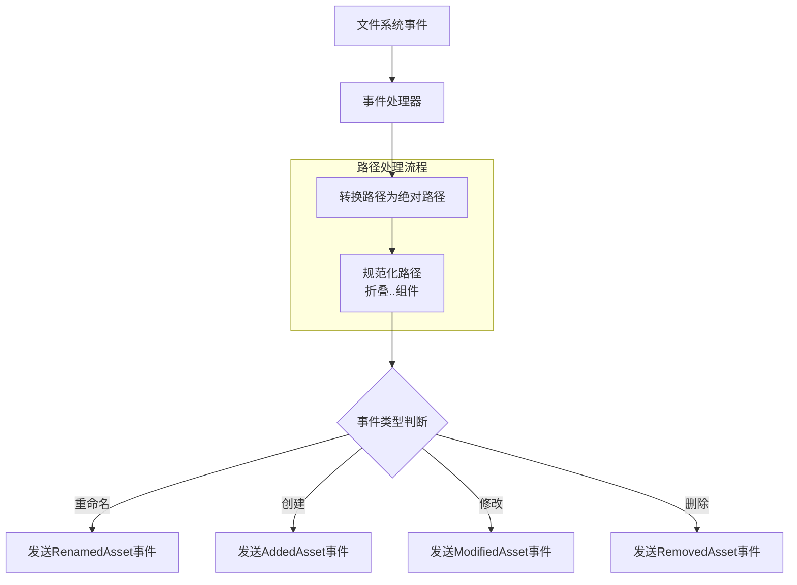

+++
title = "#22026 Replace path canonicalize with our own version."
date = "2025-12-15T00:00:00"
draft = false
template = "pull_request_page.html"
in_search_index = false

[extra]
current_language = "zh-cn"
available_languages = {"en" = { name = "English", url = "/pull_request/bevy/2025-12/pr-22026-en-20251215" }, "zh-cn" = { name = "中文", url = "/pull_request/bevy/2025-12/pr-22026-zh-cn-20251215" }}
+++

# Title
## 基本信息
- **标题**: Replace path canonicalize with our own version.
- **PR链接**: https://github.com/bevyengine/bevy/pull/22026
- **作者**: andriyDev
- **状态**: 已合并
- **标签**: C-Bug, A-Assets, S-Ready-For-Final-Review, D-Straightforward
- **创建时间**: 2025-12-04T05:47:53Z
- **合并时间**: 2025-12-14T22:32:54Z
- **合并人**: alice-i-cecile

## 描述翻译
### 目标
- 重命名文件时不会向资产系统发送重命名事件，意味着重命名的文件不会被检测到！
- 在#18023中，我们使用规范化（canonicalize）文件路径来处理相对路径的资产文件夹。然而`canonicalize`只有在路径实际存在时才有效！重命名时旧路径不再存在，因此`canonicalize`会失败，我们只能静默地`continue`。

### 解决方案
- 不使用`canonicalize`，而是使用`std::path::absolute`编写我们自己的实现，它使用环境的当前目录创建绝对路径（但不折叠`..`），然后使用我们的`normalize_path`将`..`折叠为"规范路径"。
    - 优点是不与文件系统交互，因此**任何**路径都能被解析——包括已重命名的文件（即使该文件路径已不存在）。
    - 缺点是不再解析符号链接——我不认为这是大问题，因为我们的行为在这种情况下可能没有意义（符号链接可能会让我们走出资产目录，得到我们不知道如何处理的文件路径）。

### 测试
- 运行了`asset_processing`示例。确保重命名资产或目录会触发重命名事件。
- 尝试将`asset_processing`示例改为使用像#18022那样的相对路径。能正确检测到更改！
- 通过确保我们的嵌入式着色器之一能够热重载，检查了embedded_watcher功能仍正常工作。

## 这个PR的故事

这个PR的核心问题是资产系统的文件监视功能中存在一个严重的盲点：重命名文件时无法正确检测。问题的根源在于早期为实现相对路径支持而引入的`canonicalize`调用。

在PR#18023中，开发团队为处理相对路径引入了`canonicalize`，这是一个合理的解决方案，因为它能解析路径中的所有符号链接和`..`组件，生成唯一的规范路径。然而，这个设计有一个关键缺陷：`canonicalize`需要路径在文件系统中实际存在才能工作。当用户重命名文件时，操作系统会先发送一个"文件被移除"事件（使用旧路径），然后发送"文件被创建"事件（使用新路径）。在处理旧路径的事件时，该路径已经不存在，`canonicalize`失败，导致整个事件被静默跳过。

这种情况下的静默失败特别有问题，因为重命名是文件操作中的常见场景。资产系统无法检测重命名意味着用户可能认为他们的更改没有生效，或者需要手动重新加载资产。这在开发工作流中造成了不连贯的体验。

开发者选择的解决方案是避免使用依赖于文件系统状态的方法，转而采用纯粹的路径处理。核心思想是：我们需要的是路径的规范化表示，而不是文件系统级别的规范路径。`std::path::absolute`函数提供了第一步：它将相对路径转换为绝对路径，基于当前工作目录，但不访问文件系统。然后，Bevy现有的`normalize_path`函数负责折叠`..`和`.`组件。

这种方法的权衡很明确：我们失去了符号链接解析的能力。但考虑到资产监视的上下文，这实际上是合理的。符号链接如果指向资产目录外部，可能会产生不可预测的行为。更重要的是，重命名检测的可靠性提升明显超过了符号链接支持的价值。

实现过程涉及两个关键修改点。首先，在`FileWatcher::new`中，将`canonicalize`替换为新函数`make_absolute_path`：

```rust
// Before:
let root = normalize_path(&path).canonicalize()?;

// After:
let root = make_absolute_path(&path)?;
```

新的`make_absolute_path`函数清晰表达了设计意图：

```rust
fn make_absolute_path(path: &Path) -> Result<PathBuf, std::io::Error> {
    // We use `normalize` + `absolute` instead of `canonicalize` to avoid reading the filesystem to
    // resolve the path. This also means that paths that no longer exist can still become absolute
    // (e.g., a file that was renamed will have the "old" path no longer exist).
    Ok(normalize_path(&std::path::absolute(path)?))
}
```

第二个重要修改是在事件处理循环中。之前，每个事件处理器（`FilesystemEventHandler::get_path`）都尝试对每个路径进行`canonicalize`。现在，我们改为在处理事件的开始时，一次性将所有路径转换为绝对路径：

```rust
// 新增的路径转换逻辑
let paths = event
    .paths
    .iter()
    .map(PathBuf::as_path)
    .map(|p| {
        make_absolute_path(p).expect("paths from the debouncer are valid")
    })
    .collect::<Vec<_>>();
```

这个改变有几个好处：一是减少了重复的文件系统调用（现在完全没有）；二是保证了事件处理过程中路径的一致性；三是简化了后续的事件处理逻辑，因为所有路径都已经过预处理。

相应地，`FilesystemEventHandler::get_path`方法也简化了，不再需要尝试`canonicalize`：

```rust
// Before:
let absolute_path = absolute_path.canonicalize().ok()?;
Some(get_asset_path(&self.root, &absolute_path))

// After:
Some(get_asset_path(&self.root, absolute_path))
```

整个PR的架构调整体现了良好的工程实践：识别问题根本原因、选择最小化解决方案、确保向后兼容性。测试策略也很全面：既验证了重命名功能，也确保相对路径支持和嵌入式资源的热重载不受影响。

这个修复的核心技术洞察是：在文件监视的上下文中，我们需要的"规范路径"概念与文件系统的"规范路径"概念不同。我们不需要知道文件在磁盘上的确切位置（这可能通过符号链接指向其他地方），我们只需要一个稳定、唯一的标识符来跟踪文件。通过将路径规范化为绝对形式并折叠`..`，我们得到了这样的标识符，而不依赖于文件系统的瞬时状态。

从工程角度看，这个PR还展示了错误处理的微妙之处。原先的`canonicalize`失败导致静默跳过，这掩盖了问题。新的实现在路径转换失败时会panic（通过`expect`），但这被认为是可接受的，因为如果从文件监视器接收的路径无法转换为绝对路径，那么一定是更根本的系统问题。

## 视觉表示



## 关键文件更改

### `crates/bevy_asset/src/io/file/file_watcher.rs` (+52/-55)

这个文件包含了资产系统文件监视器的实现。主要修改包括：

1. **新增`make_absolute_path`函数**：替代`canonicalize`的纯路径处理实现
2. **修改`FileWatcher::new`**：使用新的路径处理方法
3. **重构事件处理循环**：提前转换所有事件路径为绝对路径
4. **简化`FilesystemEventHandler::get_path`**：移除冗余的`canonicalize`调用

关键代码变更：

```rust
// 新增的辅助函数
fn make_absolute_path(path: &Path) -> Result<PathBuf, std::io::Error> {
    // We use `normalize` + `absolute` instead of `canonicalize` to avoid reading the filesystem to
    // resolve the path. This also means that paths that no longer exist can still become absolute
    // (e.g., a file that was renamed will have the "old" path no longer exist).
    Ok(normalize_path(&std::path::absolute(path)?))
}

// 修改后的FileWatcher初始化
impl FileWatcher {
    pub fn new(
        path: PathBuf,
        sender: Sender<AssetSourceEvent>,
        debounce_wait_time: Duration,
    ) -> Result<Self, notify::Error> {
        let root = make_absolute_path(&path)?;  // 替换了canonicalize
        // ... 其余代码不变
    }
}

// 事件处理中的路径预处理（新增代码）
let paths = event
    .paths
    .iter()
    .map(PathBuf::as_path)
    .map(|p| {
        make_absolute_path(p).expect("paths from the debouncer are valid")
    })
    .collect::<Vec<_>>();

// 简化后的事件处理器方法
impl FilesystemEventHandler for FileEventHandler {
    fn get_path(&self, absolute_path: &Path) -> Option<(PathBuf, bool)> {
        // 移除了canonicalize调用
        Some(get_asset_path(&self.root, absolute_path))
    }
    // ... 其余代码不变
}
```

这些更改直接解决了重命名检测失败的问题，同时保持了代码的简洁性和性能。通过集中处理路径转换逻辑，减少了代码重复，并提高了事件处理的一致性和可靠性。

## 延伸阅读

1. **Rust标准库路径处理**：
   - `std::path::absolute` - Rust 1.60+新增的路径处理函数
   - `std::fs::canonicalize` - 传统的文件系统规范路径函数

2. **文件系统监视模式**：
   - `notify` crate - Rust中跨平台的文件系统通知库
   - 防抖动（debouncing）技术 - 处理高频文件系统事件的最佳实践

3. **资产系统设计**：
   - Bevy Asset System架构文档
   - 热重载（Hot Reloading）原理和实现

4. **相关PR历史**：
   - #18023 - 最初引入`canonicalize`的PR
   - #18022 - 相对路径支持的讨论和实现

这些资源有助于深入理解本PR解决的问题背景和所采用的技术方案，特别是对于需要实现类似文件监视功能的开发者有参考价值。