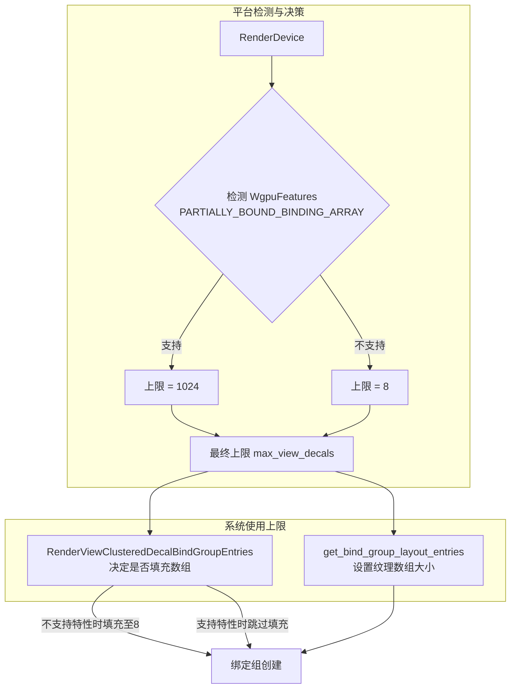

+++
title = "#22028 Increase the number of supported clustered decals if the `PARTIALLY_BOUND_BINDING_ARRAY` `wgpu` feature is present."
date = "2025-12-08T00:00:00"
draft = false
template = "pull_request_page.html"
in_search_index = false

[extra]
current_language = "zh-cn"
available_languages = {"en" = { name = "English", url = "/pull_request/bevy/2025-12/pr-22028-en-20251208" }, "zh-cn" = { name = "中文", url = "/pull_request/bevy/2025-12/pr-22028-zh-cn-20251208" }}
labels = ["A-Rendering"]
+++

# Title
Increase the number of supported clustered decals if the `PARTIALLY_BOUND_BINDING_ARRAY` `wgpu` feature is present.

## Basic Information
- **Title**: Increase the number of supported clustered decals if the `PARTIALLY_BOUND_BINDING_ARRAY` `wgpu` feature is present.
- **PR Link**: https://github.com/bevyengine/bevy/pull/22028
- **Author**: pcwalton
- **Status**: MERGED
- **Labels**: A-Rendering, S-Ready-For-Final-Review
- **Created**: 2025-12-04T16:50:53Z
- **Merged**: 2025-12-08T00:29:56Z
- **Merged By**: mockersf

## Description Translation
当前用于集群贴图 (clustered decal) 的代码编写于 `wgpu` 支持 `PARTIALLY_BOUND_BINDING_ARRAY` 特性之前。因此，场景中最多只允许存在 8 个集群贴图，这是为了避免即使该类型的贴图不存在时也要支付高昂的性能开销。这个限制使得 Bevy 当前的集群贴图支持对于许多使用场景（例如弹孔）来说是不够的。本补丁在 `wgpu` 特性包含 `PARTIALLY_BOUND_BINDING_ARRAY` 的情况下，将这个限制从 8 提高到了 1024。

## The Story of This Pull Request

这个 PR 解决了一个由现代图形 API 特性支持情况引发的历史性限制问题。Bevy 渲染引擎中的集群贴图系统最初设计时，`wgpu` 还没有支持 `PARTIALLY_BOUND_BINDING_ARRAY` 这个 WebGPU 特性。这个特性直接影响了如何高效地实现绑定数组 (binding arrays)。

在没有 `PARTIALLY_BOUND_BINDING_ARRAY` 支持的平台上，着色器中的绑定数组必须被完全填充。也就是说，如果你声明了一个最多包含 N 个纹理的数组，即使在渲染时只使用了其中一小部分，GPU 驱动也必须为所有 N 个纹理槽分配资源并建立绑定。这导致了固定的、不可避免的性能开销，即使场景中一个贴图都没有。

为了避免这种“空载开销”，原实现采用了一个保守的策略：将集群贴图的最大数量 `MAX_VIEW_DECALS` 硬编码为一个很小的值——8。这是一个权衡：它限制了贴图的功能性（例如无法渲染大量弹孔或贴花），但保证了在所有硬件上都不会有严重的性能损失。正如作者在代码注释中指出的，这是一个临时性的绕过方案，期待未来 `wgpu` 支持相关特性后再进行优化。

随着 `wgpu` 对 `PARTIALLY_BOUND_BINDING_ARRAY` 特性的支持，情况发生了变化。当这个特性可用时，绑定数组可以是“部分绑定”的。这意味着着色器可以声明一个大的数组，但驱动只对实际被使用的纹理槽进行资源绑定和验证。这移除了之前导致限制的核心障碍：现在可以使用一个大的最大值，而不会在没有贴图时产生性能惩罚。

这个 PR 的实现方法很直接。它移除了硬编码的常量 `MAX_VIEW_DECALS`，并用一个运行时函数 `max_view_decals` 来替代。这个函数根据 `RenderDevice` 所报告的 `wgpu` 特性集来动态决定上限：

- 如果支持 `PARTIALLY_BOUND_BINDING_ARRAY`，则返回 1024。
- 否则，退回原来的限制 8。

`max_view_decals` 的逻辑封装了平台差异。选择 1024 这个值是一个经过考量的工程决策。作者在注释中解释，这个数字是“武断地确定的”，旨在满足大多数用例（如墙上的弹孔），同时作为一个安全阀，防止在出现极端大量贴图时着色器变得太慢。它是一个合理的上限，在功能性和潜在的性能影响之间取得了平衡。

这个改变的影响波及到两个关键的地方：
1.  **绑定组布局创建** (`get_bind_group_layout_entries`): 绑定布局现在需要知道动态的最大值，以正确设置纹理绑定的数量 (`count`)。
2.  **绑定组条目准备** (`RenderViewClusteredDecalBindGroupEntries`): 这里有一个平台特定的填充逻辑。在不支持 `PARTIALLY_BOUND_BINDING_ARRAY` 的平台上，`texture_views` 向量仍然需要被填充到最大长度（8），以满足驱动要求。而在支持该特性的平台上，这个填充步骤被完全跳过，避免了不必要的资源引用。

通过这种方式，PR 实现了一个优雅的、条件性的优化：在支持新特性的现代硬件/驱动上，显著提升了集群贴图系统的功能上限；在不支持的旧平台上，则保持原有的、保守但安全的行为。这体现了渐进增强 (progressive enhancement) 的思路，同时也向后兼容。

从更广的视角看，这个 PR 展示了图形渲染代码如何与底层 API 的特定能力紧密耦合，以及随着 API 发展，上层引擎如何通过条件编译或运行时检测来利用新特性，从而解除历史限制，提升功能性和性能。它是一个将底层硬件能力差异抽象化，并为上层应用提供统一但更强大接口的典型案例。

## Visual Representation



## Key Files Changed

### `crates/bevy_pbr/src/decal/clustered.rs` (+33/-12)

这个文件包含了集群贴图系统的核心逻辑。PR 所做的修改主要集中在移除硬编码的限制，并引入一个基于平台能力动态计算上限的机制。

**主要改动：**
1.  删除了硬编码常量 `MAX_VIEW_DECALS`。
2.  添加了 `max_view_decals` 函数，根据 `PARTIALLY_BOUND_BINDING_ARRAY` 特性支持情况返回 1024 或 8。
3.  修改了 `get_bind_group_layout_entries` 函数，使用 `max_view_decals` 的结果来设置绑定数组的纹理数量。
4.  修改了 `RenderViewClusteredDecalBindGroupEntries` 结构体的构建逻辑，使其只在必要时（即不支持 `PARTIALLY_BOUND_BINDING_ARRAY` 时）才将纹理数组填充到最大长度。

**关键代码片段：**

```rust
// 之前：
/// The maximum number of decals that can be present in a view.
///
/// This number is currently relatively low in order to work around the lack of
/// first-class binding arrays in `wgpu`. When that feature is implemented, this
/// limit can be increased.
pub(crate) const MAX_VIEW_DECALS: usize = 8;

// 之后：
// 常量被移除，由函数 `max_view_decals` 替代。
```

```rust
// 新增函数：
/// Returns the maximum number of decals that can be in the scene, taking
/// platform limitations into account.
fn max_view_decals(render_device: &RenderDevice) -> u32 {
    // If the current `wgpu` platform doesn't support partially-bound binding
    // arrays, limit the number of decals to a low number. If we didn't do this,
    // then on such platforms we'd pay the maximum overhead even if there are no
    // decals are in the scene.
    if render_device
        .features()
        .contains(WgpuFeatures::PARTIALLY_BOUND_BINDING_ARRAY)
    {
        // This number was determined arbitrarily as a reasonable value that
        // would encompass most use cases (e.g. bullet holes in walls) while
        // offering a failsafe to prevent shaders becoming too slow if there are
        // extremely large numbers of decals.
        1024
    } else {
        8
    }
}
```

```rust
// 绑定组布局创建逻辑的修改：
// 之前（使用常量）：
binding_types::texture_2d(TextureSampleType::Float { filterable: true })
    .count(NonZero::<u32>::new(MAX_VIEW_DECALS as u32).unwrap()),

// 之后（使用动态函数）：
binding_types::texture_2d(TextureSampleType::Float { filterable: true })
    .count(NonZero::<u32>::new(max_view_decals(render_device)).unwrap()),
```

```rust
// 绑定组条目准备逻辑的修改：
// 之前（总是填充）：
// Pad out the binding array to its maximum length, which is
// required on some platforms.
while texture_views.len() < MAX_VIEW_DECALS {
    texture_views.push(&*fallback_image.d2.texture_view);
}

// 之后（有条件填充）：
// If required on this platform, pad out the binding array to its
// maximum length.
if !render_device
    .features()
    .contains(WgpuFeatures::PARTIALLY_BOUND_BINDING_ARRAY)
{
    let max_view_decals = max_view_decals(render_device);
    while texture_views.len() < max_view_decals as usize {
        texture_views.push(&*fallback_image.d2.texture_view);
    }
}
```

这些修改共同实现了 PR 的目标：在支持 `PARTIALLY_BOUND_BINDING_ARRAY` 的平台上，将集群贴图的数量上限从 8 大幅提升到 1024，从而满足更丰富的使用场景需求。

## Further Reading
1.  **WebGPU Specification - Partially Bound Binding Arrays**: 了解 `PARTIALLY_BOUND_BINDING_ARRAY` 特性的官方定义和其背后的原理。
2.  **`wgpu` Documentation on Features**: 查阅 `wgpu` 库文档中关于特性集的说明，了解如何检测和使用特定特性。
3.  **Bevy Rendering Architecture**: 深入研究 Bevy 的渲染器架构，特别是其 ECS 如何与渲染管线、绑定组和资源管理进行交互。
4.  **Clustered Shading/Decaling Techniques**: 学习集群着色和集群贴图的基本原理，这是现代延迟渲染和 Forward+ 渲染中常见的技术，用于高效处理大量灯光或贴图对象。