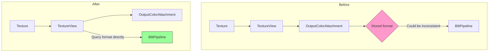

+++
title = "#22031 Support non-sRGB image formats for `RenderTarget::Image`"
date = "2025-12-09T00:00:00"
draft = false
template = "pull_request_page.html"
in_search_index = true

[taxonomies]
list_display = ["show"]

[extra]
current_language = "en"
available_languages = {"en" = { name = "English", url = "/pull_request/bevy/2025-12/pr-22031-en-20251209" }, "zh-cn" = { name = "中文", url = "/pull_request/bevy/2025-12/pr-22031-zh-cn-20251209" }}
labels = ["C-Bug", "A-Rendering"]
+++

# Title

## Basic Information
- **Title**: Support non-sRGB image formats for `RenderTarget::Image`
- **PR Link**: https://github.com/bevyengine/bevy/pull/22031
- **Author**: bonsairobo
- **Status**: MERGED
- **Labels**: C-Bug, A-Rendering, S-Ready-For-Final-Review
- **Created**: 2025-12-05T01:03:33Z
- **Merged**: 2025-12-09T18:56:05Z
- **Merged By**: alice-i-cecile

## Description Translation

# Objective

- Fixes #15201 

## Solution

- It seems there was some confusion where `OutputColorAttachment::format` could be different from the actual underlying texture format (of `OutputColorAttachment::view`). This would eventually lead to a texture format mismatch on the `BlitPipeline`. I removed the `OutputColorAttachment::format` field to resolve this conflict.
- Sim. for `ManualTextureView`.

## Testing

- The repro steps provided by #15201 no longer cause a WGPU validation error.
- I tested the `pbr` example on native and WebGPU and it still works as before.

## Future Work

Although the WGPU validation error is fixed, when using a non-sRGB texture format for the GPU image in the `headless_renderer` example, the output image seems to have incorrect gamma. I think this is because the example does a byte-for-byte copy from the GPU image to the CPU image without any gamma correction; and the `image` crate saves the image assuming a nonlinear color space.

I don't think we need to fix this as part of this PR, but it might be nice for `bevy_image::Image::try_into_dynamic` to eventually handle the gamma correction when saving linear color images.

<details>
<summary>Here you can see a comparison</summary>
With sRGB


No sRGB

</details>

## The Story of This Pull Request

This pull request addresses a texture format mismatch bug that prevented Bevy from properly supporting non-sRGB image formats as render targets. The issue (#15201) was reported by users attempting to render to linear color space textures, which triggered WGPU validation errors.

The core problem was a data duplication issue in the rendering system. Two key data structures, `OutputColorAttachment` and `ManualTextureView`, stored texture format information separately from the actual texture view. This created a situation where the stored `format` field could become inconsistent with the actual format of the underlying texture. When the system tried to use these mismatched formats in the BlitPipeline, it caused validation failures.

Looking at the code, the inconsistency stemmed from how format information was propagated through the system. For example, in `OutputColorAttachment`, the constructor took both a `TextureView` and a `TextureFormat`:

```rust
// Before:
pub fn new(view: TextureView, format: TextureFormat) -> Self {
    Self {
        view,
        format,
        is_first_call: Arc::new(AtomicBool::new(true)),
    }
}
```

This design assumed the caller would always provide the correct format, but there was no guarantee this format matched the actual texture's format. Similarly, `ManualTextureView` had a `format` field initialized with a default value that might not match its associated texture.

The fix was straightforward: eliminate the duplicate format storage and always retrieve the format directly from the texture when needed. This required removing the `format` field from both structures and updating all call sites to query the format from the texture view instead.

The implementation changed several key areas:

1. **Data Structure Simplification**: Removed `format` fields and simplified constructors
2. **Format Retrieval**: Updated code to use `texture_view.texture().format()` instead of stored formats
3. **API Updates**: Changed constructors to only accept the texture view since the format can be derived from it

This change ensures that the system always uses the correct texture format, eliminating the possibility of mismatch. However, the author noted that while the validation error was fixed, rendering to non-sRGB textures still produced incorrect gamma in the `headless_renderer` example. This was identified as a separate issue related to gamma correction during image saving, not a problem with the texture format handling itself.

The fix demonstrates an important engineering principle: avoid duplicating derived state. When information can be reliably derived from existing data (like getting a texture's format from the texture itself), storing it separately creates maintenance overhead and risks inconsistencies. By removing the duplicate format fields, the code becomes simpler and more robust.

## Visual Representation



## Key Files Changed

1. **crates/bevy_render/src/texture/manual_texture_view.rs** (+3/-10)
   - Removed the `format` field from `ManualTextureView` struct
   - Replaced `with_default_format()` constructor with simpler `new()`
   - Updated documentation to reflect the change

   ```rust
   // Before:
   pub struct ManualTextureView {
       pub texture_view: TextureView,
       pub size: UVec2,
       pub format: TextureFormat,
   }
   
   pub fn with_default_format(texture_view: TextureView, size: UVec2) -> Self {
       Self {
           texture_view,
           size,
           format: TextureFormat::bevy_default(),
       }
   }
   
   // After:
   pub struct ManualTextureView {
       pub texture_view: TextureView,
       pub size: UVec2,
   }
   
   pub fn new(texture_view: TextureView, size: UVec2) -> Self {
       Self { texture_view, size }
   }
   ```

2. **crates/bevy_render/src/texture/texture_attachment.rs** (+2/-4)
   - Removed `format` field from `OutputColorAttachment` struct
   - Simplified constructor to only take a `TextureView`

   ```rust
   // Before:
   pub struct OutputColorAttachment {
       pub view: TextureView,
       pub format: TextureFormat,
       is_first_call: Arc<AtomicBool>,
   }
   
   pub fn new(view: TextureView, format: TextureFormat) -> Self {
       Self {
           view,
           format,
           is_first_call: Arc::new(AtomicBool::new(true)),
       }
   }
   
   // After:
   pub struct OutputColorAttachment {
       pub view: TextureView,
       is_first_call: Arc<AtomicBool>,
   }
   
   pub fn new(view: TextureView) -> Self {
       Self {
           view,
           is_first_call: Arc::new(AtomicBool::new(true)),
       }
   }
   ```

3. **crates/bevy_render/src/view/mod.rs** (+3/-10)
   - Updated `ViewTarget::out_texture_format()` to query format from texture
   - Simplified `prepare_view_attachments()` by removing format handling
   - Removed sRGB view formats from texture creation

   ```rust
   // Before:
   pub fn out_texture_format(&self) -> TextureFormat {
       self.out_texture.format
   }
   
   // After:
   pub fn out_texture_format(&self) -> TextureFormat {
       self.out_texture.view.texture().format()
   }
   ```

4. **crates/bevy_render/src/camera.rs** (+3/-3)
   - Updated format retrieval for `NormalizedRenderTarget::TextureView` to query from texture

   ```rust
   // Before:
   NormalizedRenderTarget::TextureView(id) => {
       manual_texture_views.get(id).map(|tex| tex.format)
   }
   
   // After:
   NormalizedRenderTarget::TextureView(id) => manual_texture_views
       .get(id)
       .map(|view| view.texture_view.texture().format()),
   ```

5. **crates/bevy_render/src/view/window/screenshot.rs** (+5/-5)
   - Updated screenshot preparation to get format from texture views
   - Removed format parameter when creating `OutputColorAttachment`

   ```rust
   // Before:
   let format = manual_texture_view.format;
   OutputColorAttachment::new(texture_view.clone(), format.add_srgb_suffix())
   
   // After:
   let format = manual_texture_view.texture_view.texture().format();
   OutputColorAttachment::new(texture_view.clone())
   ```

## Further Reading

- [wgpu TextureFormat Documentation](https://docs.rs/wgpu/latest/wgpu/enum.TextureFormat.html) - Details on texture formats supported by WebGPU
- [sRGB Color Space](https://en.wikipedia.org/wiki/SRGB) - Understanding linear vs. non-linear color spaces
- [The State of Bevy 0.14](https://bevyengine.org/news/bevy-0-14/) - Context on Bevy's rendering architecture
- [Data Consistency Patterns](https://en.wikipedia.org/wiki/Data_consistency) - Principles for maintaining consistent state in distributed systems