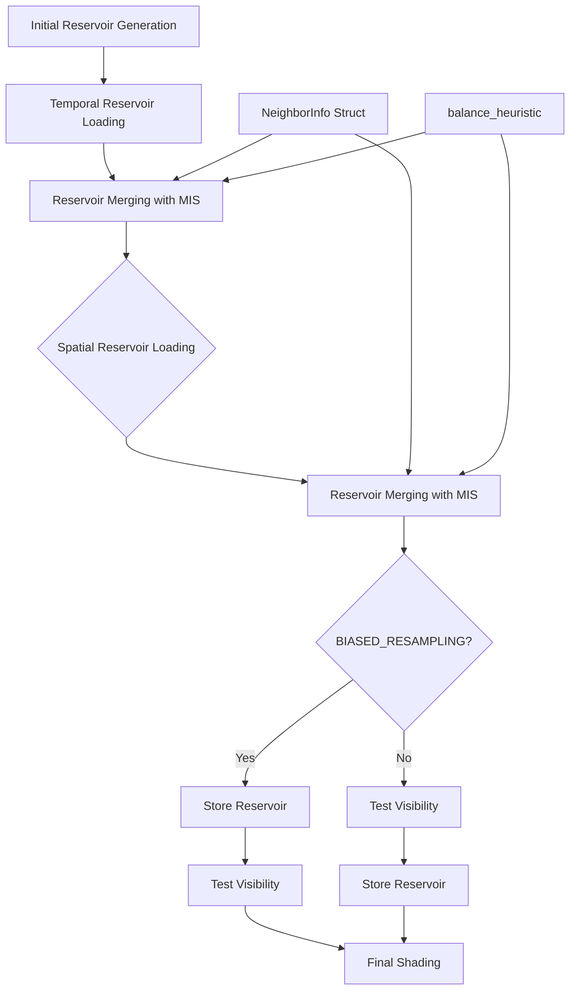

+++
title = "#22033 Solari: More accurate ReSTIR DI resampling"
date = "2025-12-09T00:00:00"
draft = false
template = "pull_request_page.html"
in_search_index = true

[taxonomies]
list_display = ["show"]

[extra]
current_language = "en"
available_languages = {"en" = { name = "English", url = "/pull_request/bevy/2025-12/pr-22033-en-20251209" }, "zh-cn" = { name = "中文", url = "/pull_request/bevy/2025-12/pr-22033-zh-cn-20251209" }}
labels = ["A-Rendering", "C-Refinement"]
+++

# Title: Solari: More accurate ReSTIR DI resampling

## Basic Information
- **Title**: Solari: More accurate ReSTIR DI resampling
- **PR Link**: https://github.com/bevyengine/bevy/pull/22033
- **Author**: JMS55
- **Status**: MERGED
- **Labels**: A-Rendering, S-Ready-For-Final-Review, C-Refinement
- **Created**: 2025-12-05T03:16:10Z
- **Merged**: 2025-12-09T18:40:55Z
- **Merged By**: alice-i-cecile

## Description Translation
This PR improves the accuracy of ReSTIR DI (Reservoir-based Spatio-Temporal Importance Resampling for Direct Illumination) in Bevy's Solari rendering system. The changes focus on two main areas:

1. Adds MIS (Multiple Importance Sampling) during reservoir merge which increases emissive light brightness, bringing it a little closer to the pathtraced reference.
2. Tests final reservoir visibility for shading, but *not* for resampling, which greatly improves shadow accuracy compared to the pathtraced reference, at the unfortunate cost of higher noise.

## The Story of This Pull Request

This PR addresses accuracy issues in the ReSTIR DI implementation for the Solari renderer. The core problem was that the reservoir merging process wasn't properly accounting for differences in geometry between neighboring pixels, leading to biased results that affected both shadow accuracy and emissive light brightness.

The existing implementation was performing reservoir merging using a simplified approach that assumed the same geometric context for all merged samples. In ReSTIR terminology, when merging reservoirs from neighboring pixels (temporal or spatial), the algorithm needs to evaluate how well each sample works in *both* the current pixel's context *and* the neighbor's context. This is crucial for proper Multiple Importance Sampling (MIS) weights.

The author refactored the reservoir merging logic to track geometric information alongside each reservoir. Previously, the `merge_reservoirs` function only received the reservoirs and a single set of geometric properties (world position, normal, BRDF). The new implementation introduced a `NeighborInfo` struct that bundles a reservoir with its associated geometric context:

```wgsl
struct NeighborInfo {
    reservoir: Reservoir,
    world_position: vec3<f32>,
    world_normal: vec3<f32>,
    diffuse_brdf: vec3<f32>,
}
```

This change enables proper MIS calculation during reservoir merging. Instead of evaluating samples only in the current pixel's context, the algorithm now evaluates each sample in *both* contexts:
- Canonical sample evaluated at canonical geometry
- Canonical sample evaluated at neighbor's geometry  
- Neighbor's sample evaluated at canonical geometry
- Neighbor's sample evaluated at neighbor's geometry

This symmetrical evaluation allows for correct balance heuristic MIS weights:

```wgsl
// Resampling weight for canonical sample
let canonical_sample_mis_weight = balance_heuristic(
    canonical_reservoir.confidence_weight * canonical_contribution_canonical_sample.target_function,
    other_reservoir.confidence_weight * other_contribution_canonical_sample.target_function,
);

// Resampling weight for other sample
let other_sample_mis_weight = balance_heuristic(
    other_reservoir.confidence_weight * other_contribution_other_sample.target_function,
    canonical_reservoir.confidence_weight * canonical_contribution_other_sample.target_function,
);
```

The second major change involves visibility testing. Previously, visibility was tested during the resampling process, which introduced bias in shadow boundaries. The new implementation adds a compile-time flag `BIASED_RESAMPLING` that controls when visibility is tested:

- With `BIASED_RESAMPLING` defined (default for stability): Visibility is tested *after* reservoir merging, which extends shadows beyond their correct boundaries but reduces noise.
- Without `BIASED_RESAMPLING` (for accuracy): Visibility is tested only during final shading, producing more accurate shadows at the cost of higher noise.

The code structure reflects this trade-off clearly:

```wgsl
// More accuracy, less stability
#ifndef BIASED_RESAMPLING
    store_reservoir_a(global_id.xy, combined_reservoir);
#endif

if reservoir_valid(combined_reservoir) {
    let resolved_light_sample = resolve_light_sample(combined_reservoir.sample, light_sources[combined_reservoir.sample.light_id >> 16u]);
    combined_reservoir.unbiased_contribution_weight *= trace_light_visibility(surface.world_position, resolved_light_sample.world_position);
}

// More stability, less accuracy (shadows extend further out than they should)
#ifdef BIASED_RESAMPLING
    store_reservoir_a(global_id.xy, combined_reservoir);
#endif
```

Several supporting changes were also made:
- The `balance_heuristic` function was consolidated in `sampling.wgsl` and improved to return 0 when the sum is zero, preventing division by zero.
- World cache query jittering was made optional via `NO_JITTER_WORLD_CACHE`, giving developers control over this trade-off.
- The `power_heuristic` function was refactored to use the improved `balance_heuristic`.

The technical insight here is that ReSTIR's reservoir merging requires careful consideration of geometric context for proper MIS. Each sample's contribution depends not just on the light source properties, but also on the surface geometry where it's being evaluated. By tracking and using this geometric context during merging, the algorithm produces more accurate results, particularly for emissive materials and shadow boundaries.

The implementation demonstrates a common pattern in real-time rendering: trading between accuracy and stability. By making the visibility testing behavior configurable, the system allows developers to choose based on their specific needs - accuracy for reference comparisons or stability for real-time applications.

## Visual Representation



## Key Files Changed

### 1. `crates/bevy_solari/src/realtime/restir_di.wgsl` (+76/-41)

This is the main file containing the ReSTIR DI implementation. The changes introduce proper MIS during reservoir merging and configurable visibility testing.

**Key Changes:**
- Added `NeighborInfo` struct to bundle reservoirs with geometric context
- Refactored `merge_reservoirs` to accept two full geometric contexts
- Added proper MIS calculation using `balance_heuristic`
- Made visibility testing configurable via `BIASED_RESAMPLING` flag

```wgsl
// Before: Single geometric context for both reservoirs
fn merge_reservoirs(
    canonical_reservoir: Reservoir,
    other_reservoir: Reservoir,
    world_position: vec3<f32>,
    world_normal: vec3<f32>,
    diffuse_brdf: vec3<f32>,
    rng: ptr<function, u32>,
) -> ReservoirMergeResult

// After: Separate geometric contexts for each reservoir
fn merge_reservoirs(
    canonical_reservoir: Reservoir,
    canonical_world_position: vec3<f32>,
    canonical_world_normal: vec3<f32>,
    canonical_diffuse_brdf: vec3<f32>,
    other_reservoir: Reservoir,
    other_world_position: vec3<f32>,
    other_world_normal: vec3<f32>,
    other_diffuse_brdf: vec3<f32>,
    rng: ptr<function, u32>,
) -> ReservoirMergeResult
```

### 2. `crates/bevy_solari/src/realtime/world_cache_query.wgsl` (+8/-5)

Made world cache jittering optional to provide flexibility in the accuracy/stability trade-off.

```wgsl
// Added condition to disable jittering
#ifndef NO_JITTER_WORLD_CACHE
    let TBN = orthonormalize(world_normal);
    let offset = (rand_vec2f(rng) * 2.0 - 1.0) * cell_size * 0.5;
    world_position += offset.x * TBN[0] + offset.y * TBN[1];
    cell_size = get_cell_size(world_position, view_position);
#endif
```

### 3. `crates/bevy_solari/src/scene/sampling.wgsl` (+6/-2)

Improved the `balance_heuristic` function to handle edge cases and ensure non-negative results.

```wgsl
// Before: Simple division with potential for division by zero
fn balance_heuristic(f: f32, g: f32) -> f32 {
    return f / (f + g);
}

// After: Safe division with zero check and non-negative guarantee
fn balance_heuristic(f: f32, g: f32) -> f32 {
    let sum = f + g;
    if sum == 0.0 {
        return 0.0;
    }
    return max(0.0, f / sum);
}
```

### 4. `crates/bevy_solari/src/realtime/restir_gi.wgsl` (+1/-9)

Removed duplicate `balance_heuristic` implementation now that it's properly defined in `sampling.wgsl`.

### 5. `crates/bevy_solari/src/realtime/specular_gi.wgsl` (+1/-1)

Updated to use the improved `power_heuristic` which now uses the safe `balance_heuristic`.

```wgsl
// Changed from potentially negative result to guaranteed non-negative
// Before: return max(0.0, power_heuristic(p_light, p_bounce));
// After: return power_heuristic(p_light, p_bounce);
```

## Further Reading

1. **ReSTIR Paper**: "Spatiotemporal reservoir resampling for real-time ray tracing with dynamic direct lighting" (Bitterli et al., 2020)
2. **Multiple Importance Sampling**: Chapter 9.2 of "Physically Based Rendering: From Theory to Implementation"
3. **Bevy Solari Documentation**: The Solari renderer's architecture and design decisions
4. **WGSL Specification**: WebGPU Shading Language for understanding the shader code structure
5. **Real-Time Rendering**: Chapter 11 on "Global Illumination" for context on ReSTIR's place in real-time rendering