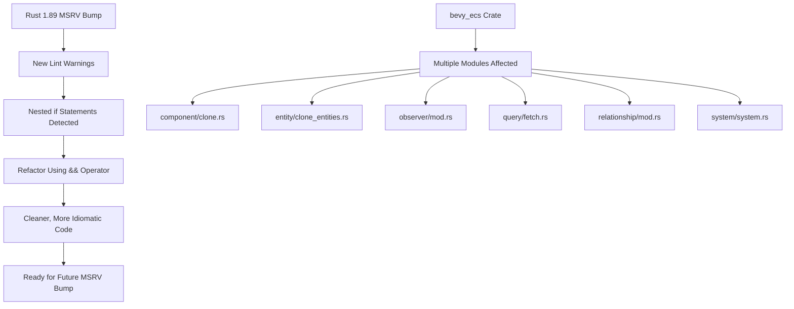

+++
title = "#22034 Fix some lints from rust 1.89 bump"
date = "2025-12-05T00:00:00"
draft = false
template = "pull_request_page.html"
in_search_index = true

[taxonomies]
list_display = ["show"]

[extra]
current_language = "en"
available_languages = {"en" = { name = "English", url = "/pull_request/bevy/2025-12/pr-22034-en-20251205" }, "zh-cn" = { name = "中文", url = "/pull_request/bevy/2025-12/pr-22034-zh-cn-20251205" }}
labels = ["D-Trivial", "A-ECS", "C-Code-Quality"]
+++

# Title

## Basic Information
- **Title**: Fix some lints from rust 1.89 bump
- **PR Link**: https://github.com/bevyengine/bevy/pull/22034
- **Author**: hymm
- **Status**: MERGED
- **Labels**: D-Trivial, A-ECS, C-Code-Quality, S-Ready-For-Final-Review, X-Uncontroversial
- **Created**: 2025-12-05T06:25:05Z
- **Merged**: 2025-12-05T08:27:28Z
- **Merged By**: mockersf

## Description Translation
No translation needed - the PR description is already in English.

# Objective

- In #21822 the MSRV bump triggers some new lint warnings, so this pr fixes them.

## Solution

- Bumped the msrv in bevy_ecs and fixed the lints. But this pr does not actually bump the msrv. These fixes are all for combining nested if's together.

## The Story of This Pull Request

This PR addresses lint warnings introduced by a Rust 1.89 Minimum Supported Rust Version (MSRV) bump in PR #21822. The warnings stem from Rust's evolving linting capabilities, specifically around code patterns that can be expressed more concisely. The author doesn't actually bump the MSRV in this PR - they only fix the lints that would appear when the MSRV is eventually bumped.

The core issue is that Rust 1.89 introduces or enhances lints that detect nested `if` statements that can be combined using the `&&` operator with `let` patterns. This is part of Rust's ongoing effort to promote cleaner, more idiomatic code. The pattern being flagged is when you have an `if let` statement immediately followed by another condition check in a nested `if`, which can be combined into a single `if let` with an additional condition.

The solution is straightforward: rewrite nested `if` statements into combined conditions using `&&`. This is a mechanical refactoring that doesn't change the logic or behavior of the code, only its structure. The changes are all in the `bevy_ecs` crate, which is Bevy's Entity Component System implementation.

These changes improve code readability by reducing nesting depth. They also align with Rust's evolving best practices for control flow. The refactoring is safe because it's purely syntactic - the execution order and logic remain identical.

The implementation shows a consistent pattern across multiple files. Each instance follows the same transformation: take an `if let` that contains another `if` statement checking a condition on the bound value, and combine them using `&&`. This pattern works because Rust's `if let` syntax allows chaining additional conditions after pattern matching.

One technical consideration is that this refactoring can sometimes make code less readable if the combined condition becomes too complex. However, in all cases here, the conditions are simple enough that the combined form is clear and concise.

The impact is minimal in terms of runtime performance - these are purely syntactic changes that compile to identical machine code. The real benefit is in code quality and maintainability. By addressing these lints proactively, the Bevy project avoids accumulating technical debt that would need to be addressed later when the MSRV is actually bumped.

## Visual Representation



## Key Files Changed

### `crates/bevy_ecs/src/component/clone.rs` (+20/-21)
This file handles component cloning via reflection. The change refactors a nested if structure in the `component_clone_via_reflect` function to use combined conditions.

```rust
// Before:
if let Some(reflect_from_reflect) =
    registry.get_type_data::<bevy_reflect::ReflectFromReflect>(type_id)
{
    if let Some(mut component) =
        reflect_from_reflect.from_reflect(source_component_reflect.as_partial_reflect())
    {
        // ... rest of the code
    }
}

// After:
if let Some(reflect_from_reflect) =
    registry.get_type_data::<bevy_reflect::ReflectFromReflect>(type_id)
    && let Some(mut component) =
        reflect_from_reflect.from_reflect(source_component_reflect.as_partial_reflect())
{
    // ... rest of the code
}
```

### `crates/bevy_ecs/src/entity/clone_entities.rs` (+5/-5)
This file manages entity cloning operations. The change simplifies a conditional check in the `filter_deny` method.

```rust
// Before:
if self.attach_required_by_components {
    if let Some(required_by) = world.components().get_required_by(id) {
        self.deny.extend(required_by.iter());
    };
}

// After:
if self.attach_required_by_components
    && let Some(required_by) = world.components().get_required_by(id)
{
    self.deny.extend(required_by.iter());
};
```

### `crates/bevy_ecs/src/observer/mod.rs` (+12/-12)
This file implements the observer pattern for ECS. The change refactors observer cleanup logic to reduce nesting.

```rust
// Before:
if let Some(flag) = Observers::is_archetype_cached(event_key) {
    if let Some(by_component) = archetypes.by_component.get(component) {
        // ... loop and logic
    }
}

// After:
if let Some(flag) = Observers::is_archetype_cached(event_key)
    && let Some(by_component) = archetypes.by_component.get(component)
{
    // ... loop and logic
}
```

### `crates/bevy_ecs/src/query/fetch.rs` (+4/-4)
This file handles query fetching logic. The change simplifies a test assertion pattern.

```rust
// Before:
if let Some(c) = entity_ref.get_ref::<C>() {
    if !c.is_added() {
        panic!("Expected C to be added");
    }
}

// After:
if let Some(c) = entity_ref.get_ref::<C>()
    && !c.is_added()
{
    panic!("Expected C to be added");
}
```

### `crates/bevy_ecs/src/relationship/mod.rs` (+20/-21)
This file manages entity relationships. The change refactors relationship removal logic to use combined conditions.

```rust
// Before:
if let Ok(mut target_entity_mut) = world.get_entity_mut(target_entity) {
    if let Some(mut relationship_target) =
        target_entity_mut.get_mut::<Self::RelationshipTarget>()
    {
        // ... relationship cleanup logic
    }
}

// After:
if let Ok(mut target_entity_mut) = world.get_entity_mut(target_entity)
    && let Some(mut relationship_target) =
        target_entity_mut.get_mut::<Self::RelationshipTarget>()
{
    // ... relationship cleanup logic
}
```

### `crates/bevy_ecs/src/system/system.rs` (+4/-4)
This file contains system implementation details. The change simplifies error handling in system parameter validation.

```rust
// Before:
if let Some(err) = any.downcast_mut::<SystemParamValidationError>() {
    if err.skipped {
        return Self::Skipped(core::mem::replace(err, SystemParamValidationError::EMPTY));
    }
}

// After:
if let Some(err) = any.downcast_mut::<SystemParamValidationError>()
    && err.skipped
{
    return Self::Skipped(core::mem::replace(err, SystemParamValidationError::EMPTY));
}
```

## Further Reading

1. **Rust RFC 2497 - if-let guards**: The original proposal for `if let` pattern matching in guards
2. **Rust Reference - if expressions**: Official documentation on Rust's `if` expressions and pattern matching
3. **Rust Clippy Lints**: Documentation on Rust's linter and common code quality checks
4. **Bevy ECS Architecture**: Understanding how Bevy's Entity Component System works to better understand the context of these changes
5. **Rust Edition Guides**: How Rust's evolution introduces new idioms and best practices over time