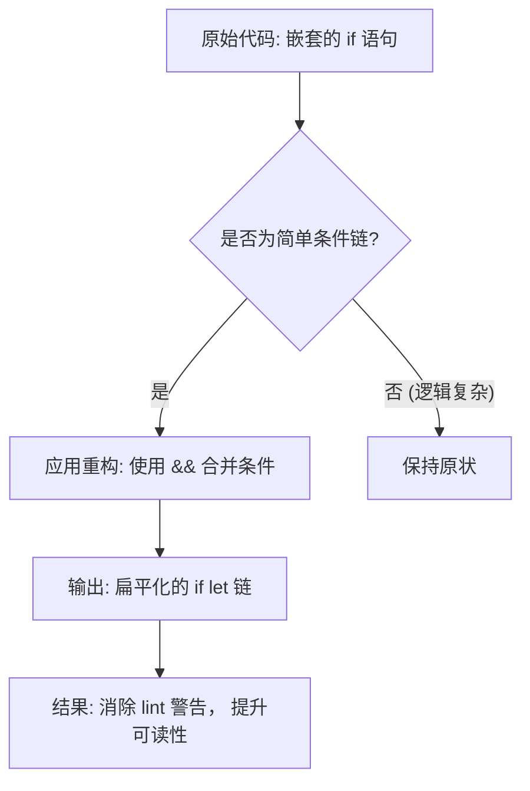

+++
title = "#22034 Fix some lints from rust 1.89 bump"
date = "2025-12-05T00:00:00"
draft = false
template = "pull_request_page.html"
in_search_index = false

[extra]
current_language = "zh-cn"
available_languages = {"en" = { name = "English", url = "/pull_request/bevy/2025-12/pr-22034-en-20251205" }, "zh-cn" = { name = "中文", url = "/pull_request/bevy/2025-12/pr-22034-zh-cn-20251205" }}
+++

# Title

## Basic Information
- **标题**: Fix some lints from rust 1.89 bump
- **PR链接**: https://github.com/bevyengine/bevy/pull/22034
- **作者**: hymm
- **状态**: 已合并
- **标签**: D-Trivial, A-ECS, C-Code-Quality, S-Ready-For-Final-Review, X-Uncontroversial
- **创建时间**: 2025-12-05T06:25:05Z
- **合并时间**: 2025-12-05T08:27:28Z
- **合并者**: mockersf

## Description Translation

### 目标 (Objective)
- 在 PR #21822 中，MSRV (Minimum Supported Rust Version，最低支持 Rust 版本) 的升级触发了一些新的 lint 警告，因此本 PR 旨在修复它们。

### 解决方案 (Solution)
- 在 bevy_ecs 中升级了 MSRV 并修复了 lint。但本 PR 实际上并未升级 MSRV。这些修复都是为了将嵌套的 if 语句合并在一起。

## The Story of This Pull Request

这是一个关于代码风格和维护的 PR。起因是项目计划将最低支持的 Rust 版本 (MSRV) 升级到 1.89。在准备升级的 PR (#21822) 中，新的 Rust 版本引入或启用了更严格的 lint 规则，导致代码库中出现了一些新的编译警告。

这类警告本身不会破坏构建，但会带来“代码噪音”，并且不符合现代 Rust 的最佳实践。尤其是在像 Bevy 这样的大型开源项目中，保持干净的编译输出和一致的代码风格非常重要。因此，开发者 `hymm` 在 MSRV 正式升级之前，预先提交了这个 PR 来修复这些问题。

具体到技术细节，这些新警告主要涉及一种特定的代码模式：多层嵌套的 `if let` 语句。在旧代码中，常见的模式是先检查一个 `Option` 或 `Result` 类型，然后在成功分支内部再检查另一个条件。例如：
```rust
if let Some(x) = foo {
    if let Some(y) = bar {
        // 使用 x 和 y
    }
}
```
从 Rust 1.65 开始，语言支持了 `let` 表达式在 `if` 条件中的链式使用。这意味着多个条件（包括模式匹配）可以用逻辑运算符 `&&` 连接在同一个 `if` 条件中。上述代码可以重构为：
```rust
if let Some(x) = foo && let Some(y) = bar {
    // 使用 x 和 y
}
```
这种重构带来了几个好处：
1.  **减少嵌套深度**：代码变得更扁平，更容易阅读和理解。
2.  **更清晰的意图**：它明确表达了“只有当两个条件同时满足时才执行”的逻辑。
3.  **符合现代惯例**：这是 Rust 社区鼓励的写法，新的 lint 规则就是为了推广这种模式。

这个 PR 的修改完全遵循了这个模式。开发者遍历了 `bevy_ecs` crate 中由新 MSRV 触发了相关 lint 警告的代码位置，并逐一将嵌套的 `if` 或 `if let` 语句合并为单个使用 `&&` 连接的条件表达式。重要的是，这些修改**只改变代码的语法结构，而不改变其运行时行为或逻辑**。这是一种纯粹的重构（refactoring）。

从实现角度来看，这个 PR 的挑战不大，但需要细心。开发者必须确保在转换过程中，原有的条件逻辑顺序和短路求值（short-circuit evaluation）特性保持不变。Rust 的 `&&` 运算符保证从左到右求值，并且如果左侧为 `false` 则跳过右侧，这与嵌套 `if` 语句的行为完全一致，因此这种转换是安全的。

此 PR 的另一个值得注意的点是它的范围控制得很好。它只修复了 `bevy_ecs` 模块中因 MSRV 提升而出现的新警告，没有盲目地重构整个代码库中所有类似的嵌套 `if` 模式。这遵循了最小化变更的原则，使得 PR 更容易被审查和合并，风险也更低。

最终，这个 PR 成功合并，为后续正式的 MSRV 升级 (#21822) 扫清了障碍，确保了代码库在新时代 Rust 编译器下依然保持“零警告”的整洁状态。这是一次典型的预防性代码维护，展示了在大型项目中管理依赖和代码质量的最佳实践。

## Visual Representation

这个 PR 的修改模式非常一致，可以用以下流程图表示其代码转换逻辑：



## Key Files Changed

以下是本 PR 中修改的关键文件列表，所有修改都遵循相同的“合并嵌套 if”模式：

1.  **`crates/bevy_ecs/src/component/clone.rs` (+20/-21)**
    *   **修改原因**：修复 `component_clone_via_reflect` 函数中嵌套的 `if let` 语句。
    *   **关键代码片段**：
        ```rust
        // 修改前：
        if let Some(reflect_from_reflect) = ... {
            if let Some(mut component) = ... {
                // ... 业务逻辑
            }
        }

        // 修改后：
        if let Some(reflect_from_reflect) = ...
            && let Some(mut component) = ...
        {
            // ... 业务逻辑 (缩进减少了一层)
        }
        ```
    *   **与 PR 目标的关系**：这是最复杂的修改之一，将三层逻辑（两个 `if let` 和一个外部 `if`）清晰地扁平化为一个条件链。

2.  **`crates/bevy_ecs/src/observer/mod.rs` (+12/-12)**
    *   **修改原因**：在观察者系统的清理逻辑中合并嵌套的条件检查。
    *   **关键代码片段**：
        ```rust
        // 修改后模式示例：
        if let Some(flag) = Observers::is_archetype_cached(event_key)
            && let Some(by_component) = archetypes.by_component.get(component)
        {
            // ... 循环逻辑
        }
        ```
    *   **与 PR 目标的关系**：简化了组件观察者缓存失效路径上的条件判断。

3.  **`crates/bevy_ecs/src/relationship/mod.rs` (+20/-21)**
    *   **修改原因**：在关系组件的移除逻辑中合并嵌套的 `if let`。
    *   **关键代码片段**：
        ```rust
        // 修改后：
        if let Ok(mut target_entity_mut) = world.get_entity_mut(target_entity)
            && let Some(mut relationship_target) = target_entity_mut.get_mut::<...>()
        {
            // ... 移除关系逻辑
        }
        ```
    *   **与 PR 目标的关系**：使实体关系解除的代码逻辑路径更清晰。

4.  **`crates/bevy_ecs/src/entity/clone_entities.rs` (+5/-5)**
5.  **`crates/bevy_ecs/src/query/fetch.rs` (+4/-4)**
6.  **`crates/bevy_ecs/src/system/system.rs` (+4/-4)**
    *   **修改原因**：这三处的修改模式与上述文件完全一致，都是将 `if let ... { if ... }` 或 `if ... { if let ... }` 的模式改为 `if let ... && ...` 的链式写法。
    *   **与 PR 目标的关系**：这些是分散在 ECS 模块各处的、符合 lint 警告条件的同类问题，被一并修复。

## Further Reading

1.  **Rust RFC 2497 与相关文档**：如果你想深入了解 `if let` 链的语法，可以查阅其 RFC 提案 ([RFC 2497](https://rust-lang.github.io/rfcs/2497-if-let-chains.html)) 和 Rust Reference 中的相关章节。这解释了该特性的设计动机和语法细节。
2.  **Clippy Lint: `collapsible_if`**：虽然本次警告可能直接来自 `rustc`，但 Rust 的官方代码检查工具 Clippy 有一个名为 `collapsible_if` 的 lint，它专门用于检测和建议合并这种可以折叠的 `if` 语句。了解 Clippy 有助于在本地开发中提前发现这类代码风格问题。
3.  **Bevy 项目的 MSRV 政策**：可以查看 Bevy 项目的贡献指南或相关讨论，了解其 MSRV 的维护和升级策略。这有助于理解为何此类“为未来版本做准备”的 PR 是重要的。
4.  **《重构：改善既有代码的设计》**：虽然这不是 Rust 特定书籍，但马丁·福勒的这本经典著作中关于“简化条件表达式”等章节所阐述的原则，与本次 PR 所做的修改在思想上是完全相通的。