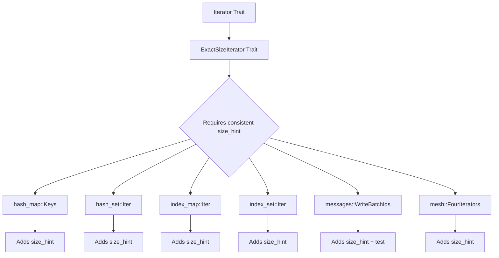

+++
title = "#22035 add missing `Iterator::size_hint` overrides, most of which cause `ExactSizeIterator::len` to panic"
date = "2025-12-07T00:00:00"
draft = false
template = "pull_request_page.html"
in_search_index = true

[taxonomies]
list_display = ["show"]

[extra]
current_language = "en"
available_languages = {"en" = { name = "English", url = "/pull_request/bevy/2025-12/pr-22035-en-20251207" }, "zh-cn" = { name = "中文", url = "/pull_request/bevy/2025-12/pr-22035-zh-cn-20251207" }}
labels = ["C-Code-Quality", "D-Straightforward"]
+++

# Title
add missing `Iterator::size_hint` overrides, most of which cause `ExactSizeIterator::len` to panic

## Basic Information
- **Title**: add missing `Iterator::size_hint` overrides, most of which cause `ExactSizeIterator::len` to panic
- **PR Link**: https://github.com/bevyengine/bevy/pull/22035
- **Author**: JonasJebing
- **Status**: MERGED
- **Labels**: C-Code-Quality, S-Ready-For-Final-Review, D-Straightforward
- **Created**: 2025-12-05T09:08:57Z
- **Merged**: 2025-12-07T18:44:44Z
- **Merged By**: mockersf

## Description Translation
# Objective

- Fixes `ExactSizeIterator::len` panic in a few of these iterators. Note: the std default impl of `ExactSizeIterator::len` has `assert_eq!(Some(lower), upper);`. I am facing this issue myself with `<index_set::Iter as ExactSizeIterator>::len`.
- Should slightly improve performance in some cases, where the more precise `size_hint` causes less allocations (for example when collecting into a `Vec`)

## Solution

- Add `size_hint` overrides that forward to inner iterators or an `ExactSizeIterator::len` override in one specific case.

## Testing

- Since the overrides are pretty simple, I mostly didn't add any tests.
- I didn't feel 100% confident in the `WriteBatchIds::size_hint` implementation, so I added a test there.

## The Story of This Pull Request

This PR addresses a subtle but important issue in Rust's iterator trait implementation. The developer encountered a panic when calling `ExactSizeIterator::len()` on certain iterator types in Bevy's Entity Component System (ECS). The root cause was missing `size_hint` implementations for several iterator structs.

The problem occurs because Rust's default implementation of `ExactSizeIterator::len()` contains an assertion: `assert_eq!(Some(lower), upper)`. This assertion requires that the iterator's `size_hint` method returns matching lower and upper bounds. When an iterator implements `ExactSizeIterator` but doesn't override `size_hint`, it inherits the default implementation from the base `Iterator` trait, which returns `(0, None)` - a lower bound of 0 and no upper bound. This mismatch triggers the assertion and causes a panic.

The developer's approach was straightforward: add explicit `size_hint` implementations that forward to the inner iterators' `size_hint` methods. This ensures that when an iterator claims to be `ExactSizeIterator`, its `size_hint` actually provides exact bounds that match its length.

Looking at the implementation patterns, we can see two approaches used:

1. For most iterator wrappers that delegate to an inner iterator, the solution was to add a `size_hint` method that simply calls `self.0.size_hint()`. This pattern appears in multiple files including `hash_map.rs`, `hash_set.rs`, `index_map.rs`, and `index_set.rs`.

2. For `WriteBatchIds`, the implementation was slightly different. Instead of delegating to an inner iterator, it calculates the hint based on its exact length: `let len = <Self as ExactSizeIterator>::len(self); (len, Some(len))`. This approach is appropriate because `WriteBatchIds` already has a custom `len` implementation, and the size hint should match that exact length.

The changes are technically simple but important for correctness. Each added `size_hint` method is only a few lines, but without them, calling `len()` on these iterators would panic. The developer added a test for the `WriteBatchIds::size_hint` implementation, which was the most complex of the additions and therefore warranted verification.

From an engineering perspective, this PR demonstrates good defensive programming. The iterator traits in Rust have subtle requirements, and ensuring that all implementations satisfy these requirements prevents hard-to-debug runtime panics. The changes also have a minor performance benefit: when collecting these iterators into containers like `Vec`, the allocator can pre-allocate the exact required capacity, avoiding unnecessary reallocations.

## Visual Representation



## Key Files Changed

### `crates/bevy_ecs/src/entity/hash_map.rs` (+24/-0)
Added `size_hint` implementations for `Keys` and `IntoKeys` iterator structs. These iterators wrap inner hash map iterators and need to forward their size hints.

```rust
// File: crates/bevy_ecs/src/entity/hash_map.rs
// Added to Keys iterator:
fn size_hint(&self) -> (usize, Option<usize>) {
    self.0.size_hint()
}

// Added to IntoKeys iterator:  
fn size_hint(&self) -> (usize, Option<usize>) {
    self.0.size_hint()
}
```

### `crates/bevy_ecs/src/entity/hash_set.rs` (+16/-0)
Added `size_hint` implementations for `Iter`, `IntoIter`, `Drain`, and `ExtractIf` iterator structs. These all delegate to inner hash set iterators.

```rust
// File: crates/bevy_ecs/src/entity/hash_set.rs
// Example from Iter iterator:
fn size_hint(&self) -> (usize, Option<usize>) {
    self.0.size_hint()
}
```

### `crates/bevy_ecs/src/entity/index_map.rs` (+24/-0)
Added `size_hint` implementations for `Iter`, `IterMut`, `IntoIter`, `Drain`, `Keys`, and `IntoKeys` iterator structs. These wrap index map iterators.

```rust
// File: crates/bevy_ecs/src/entity/index_map.rs
// Example from Iter iterator:
fn size_hint(&self) -> (usize, Option<usize>) {
    self.0.size_hint()
}
```

### `crates/bevy_ecs/src/entity/index_set.rs` (+12/-0)
Added `size_hint` implementations for `Iter`, `IntoIter`, and `Drain` iterator structs. The developer specifically mentioned encountering the panic with `index_set::Iter`.

```rust
// File: crates/bevy_ecs/src/entity/index_set.rs
// Example from Iter iterator:
fn size_hint(&self) -> (usize, Option<usize>) {
    self.0.size_hint()
}
```

### `crates/bevy_ecs/src/message/messages.rs` (+20/-0)
Added a `size_hint` implementation for `WriteBatchIds` and a corresponding test. This implementation differs from others because it uses the exact length rather than delegating to an inner iterator.

```rust
// File: crates/bevy_ecs/src/message/messages.rs
// Added to WriteBatchIds iterator:
fn size_hint(&self) -> (usize, Option<usize>) {
    let len = <Self as ExactSizeIterator>::len(self);
    (len, Some(len))
}

// Added test:
#[test]
fn write_batch_iter_size_hint() {
    #[derive(Message, Clone, Copy)]
    struct TestMessage;

    let mut test_messages = Messages::<TestMessage>::default();
    let write_batch_ids = test_messages.write_batch([TestMessage; 4]);
    let expected_len = 4;
    assert_eq!(write_batch_ids.len(), expected_len);
    assert_eq!(
        write_batch_ids.size_hint(),
        (expected_len, Some(expected_len))
    );
}
```

### `crates/bevy_mesh/src/index.rs` (+9/-0)
Added a `size_hint` implementation for `FourIterators`, an enum that can hold one of four different iterator types. This implementation uses pattern matching to delegate to the appropriate inner iterator.

```rust
// File: crates/bevy_mesh/src/index.rs
// Added to FourIterators:
fn size_hint(&self) -> (usize, Option<usize>) {
    match self {
        FourIterators::First(iter) => iter.size_hint(),
        FourIterators::Second(iter) => iter.size_hint(),
        FourIterators::Third(iter) => iter.size_hint(),
        FourIterators::Fourth(iter) => iter.size_hint(),
    }
}
```

## Further Reading

1. [Rust Iterator Documentation](https://doc.rust-lang.org/std/iter/trait.Iterator.html) - Official documentation for the Iterator trait
2. [Rust ExactSizeIterator Documentation](https://doc.rust-lang.org/std/iter/trait.ExactSizeIterator.html) - Documentation for the ExactSizeIterator trait and its requirements
3. [Rust Size Hint Explanation](https://doc.rust-lang.org/std/iter/trait.Iterator.html#method.size_hint) - Details on how size hints work and their purpose
4. [Bevy ECS Architecture](https://bevyengine.org/learn/book/plugins/ecs/) - Bevy's Entity Component System documentation
5. [Rust Iterator Adapter Patterns](https://rust-lang.github.io/rust-clippy/master/index.html#/iter_overeager_cloned) - Common patterns and best practices for implementing iterators in Rust