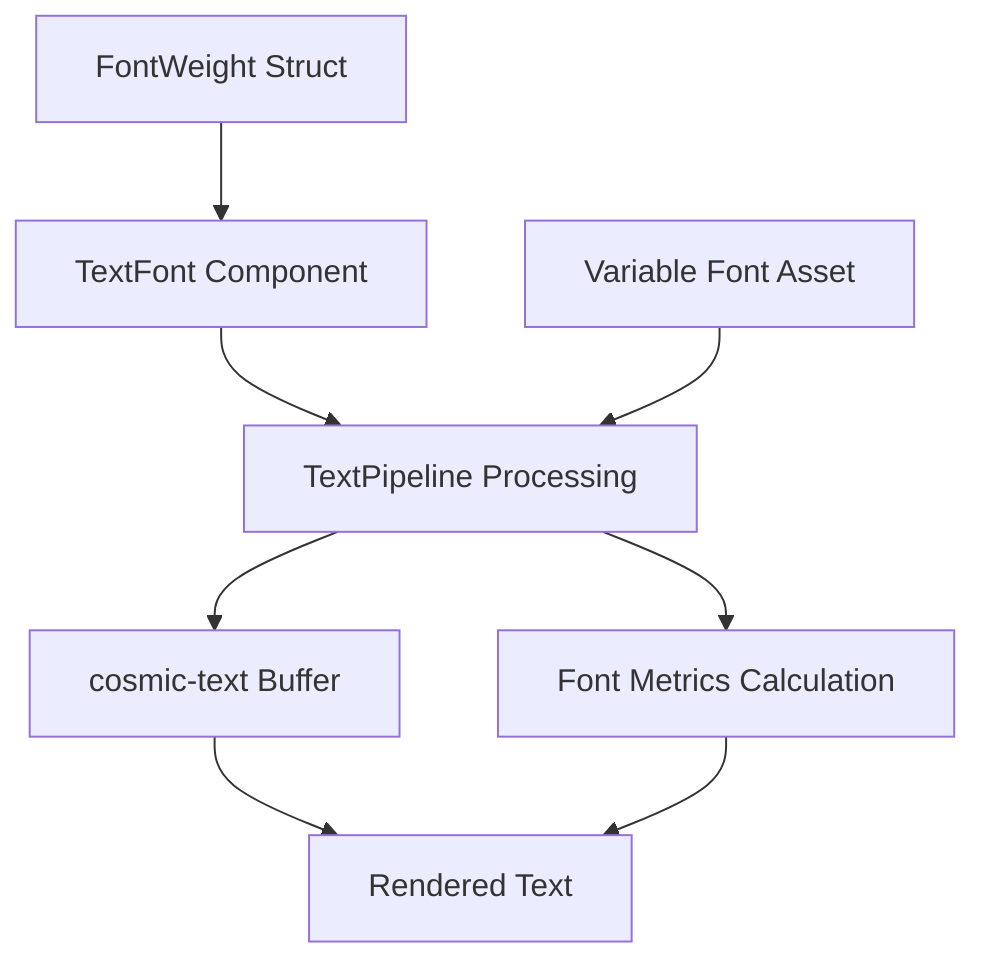

+++
title = "#22038 Font weight support"
date = "2025-12-16T00:00:00"
draft = false
template = "pull_request_page.html"
in_search_index = true

[taxonomies]
list_display = ["show"]

[extra]
current_language = "en"
available_languages = {"en" = { name = "English", url = "/pull_request/bevy/2025-12/pr-22038-en-20251216" }, "zh-cn" = { name = "中文", url = "/pull_request/bevy/2025-12/pr-22038-zh-cn-20251216" }}
labels = ["C-Feature", "A-Text", "M-Release-Note", "D-Modest"]
+++

# Font weight support

## Basic Information
- **Title**: Font weight support
- **PR Link**: https://github.com/bevyengine/bevy/pull/22038
- **Author**: ickshonpe
- **Status**: MERGED
- **Labels**: C-Feature, S-Ready-For-Final-Review, A-Text, M-Release-Note, D-Modest
- **Created**: 2025-12-05T16:39:32Z
- **Merged**: 2025-12-16T20:39:19Z
- **Merged By**: alice-i-cecile

## Description Translation

# Objective

Add font weight support.

## Solution

* New `FontWeight` struct that newtypes a `u16`.
* New `font: FontWeight` field on `TextFont`.
* The weight attribute for the cosmic text buffer is set in `TextPipeline` during text updates.
* Added a new font asset, `MonSans-VariableFont.ttf`. This needs a variable font for testing.

#

Doesn't support `lighter` and `bolder` as that would require text style inheritance, which we don't support yet.

I added stretch and slant as well, but split them off from this PR. Swash only has limited variable-font support and there's no way to demonstrate that they work without other changes.

## Testing

Added a basic example:
```cargo run --example font_weights```

## Showcase


## The Story of This Pull Request

The Bevy engine's text rendering system had a limitation: it didn't support font weights beyond what was defined in the font file itself. When working with variable fonts that offer a range of weights (from thin to black), developers couldn't programmatically adjust the weight of rendered text. This PR addresses that gap by introducing a comprehensive font weight system.

The core problem was that the existing text pipeline used a fixed weight from the font face information stored during font loading. The `FontFaceInfo` struct in the pipeline contained a `weight` field that was set once when the font was loaded and couldn't be changed per text section. This meant all text using a particular font would render with the same weight, regardless of any weight specifications in the text styling.

The solution involved three main changes. First, a new `FontWeight` struct was created to represent font weights as a newtype around a `u16`. This follows CSS conventions where font weights range from 1 to 1000, with common named constants like `THIN` (100), `NORMAL` (400), and `BOLD` (700). The struct includes validation logic to clamp values within the valid range and handle edge cases like zero values.

Second, the `TextFont` component was extended with a `weight` field, allowing each text section to specify its desired weight independently. This change required updates throughout the text rendering pipeline to pass the weight information through to the underlying cosmic-text library.

Third, the pipeline itself was refactored to use the weight from `TextFont` rather than from the cached font face information. This involved modifying the `glyph_info` buffer to include weight data and updating the font attribute calculations to use the specified weight when retrieving font metrics.

A key technical decision was to use cosmic-text's `Weight` type directly via conversion from `FontWeight`. This maintains compatibility with the existing text rendering backend while adding the new functionality. The implementation also handles font smoothing and metrics calculation based on the specified weight, ensuring proper rendering of text decorations like underlines and strikeouts at different weights.

The PR adds a new variable font asset (Mona Sans) to demonstrate the feature, as traditional static fonts typically only include a few discrete weights. Variable fonts can interpolate between weight values, making them ideal for testing the full range of weight support.

There are intentional limitations in this implementation. The `lighter` and `bolder` relative weight values from CSS aren't supported because they would require text style inheritance, which Bevy doesn't currently implement. Additionally, the author mentions that stretch and slant (italic/oblique) support were considered but split into separate PRs due to limitations in the underlying swash library's variable font support.

The changes are backward compatible through sensible defaults - existing code continues to work with `FontWeight::NORMAL` (400) as the default weight. The new system provides flexibility for UI design while maintaining performance by integrating cleanly with the existing text atlas generation and caching systems.

## Visual Representation



## Key Files Changed

1. **`crates/bevy_text/src/text.rs`** (+75/-0)
   - Added the `FontWeight` struct with constants for common weights (THIN=100, EXTRA_LIGHT=200, LIGHT=300, NORMAL=400, etc.)
   - Added `weight` field to `TextFont` struct with default value `FontWeight::NORMAL`
   - Implemented `From<FontWeight>` for cosmic_text::Weight to enable integration with the text rendering backend

   Key code snippet:
   ```rust
   #[derive(Debug, Copy, Clone, PartialEq, Eq, PartialOrd, Ord, Hash, Reflect)]
   pub struct FontWeight(pub u16);
   
   impl FontWeight {
       /// Weight 100.
       pub const THIN: FontWeight = FontWeight(100);
       
       /// Weight 400.
       pub const NORMAL: FontWeight = FontWeight(400);
       
       /// Weight 700.
       pub const BOLD: FontWeight = FontWeight(700);
       
       /// Clamp the weight value to between 1 and 1000.
       /// Values of 0 are mapped to `Weight::DEFAULT`.
       pub const fn clamp(mut self) -> Self {
           if self.0 == 0 {
               self = Self::DEFAULT;
           } else if 1000 < self.0 {
               self.0 = 1000;
           }
           Self(self.0)
       }
   }
   ```

2. **`crates/bevy_text/src/pipeline.rs`** (+13/-20)
   - Removed `weight` field from `FontFaceInfo` struct (weight is now per-text-section, not per-font)
   - Updated `glyph_info` buffer to include weight as the 7th element
   - Modified font attribute calculation to use weight from `TextFont` instead of cached font face weight
   - Simplified conditional logic for font metric calculations

   Key code snippet showing the updated glyph info and weight usage:
   ```rust
   // Before: 6-element tuple
   glyph_info: Vec<(AssetId<Font>, FontSmoothing, f32, f32, f32, f32)>
   
   // After: 7-element tuple with weight added
   glyph_info: Vec<(AssetId<Font>, FontSmoothing, f32, f32, f32, f32, u16)>
   
   // Weight is extracted from TextFont and stored
   self.glyph_info.push((
       section_font.id(),
       section_font.font_smoothing,
       section_font.font_size,
       0.0,
       0.0,
       0.0,
       text_font.weight.clamp().0,  // New: weight field
   ));
   ```

3. **`examples/ui/font_weights.rs`** (+128/-0)
   - New example demonstrating all available font weights from THIN (100) to BLACK (900)
   - Uses the new Mona Sans variable font to show smooth weight transitions
   - Shows how to set different weights on individual text elements

   Key code snippet showing weight usage:
   ```rust
   TextFont {
       font: font.clone(),
       font_size: 32.0,
       weight: FontWeight::BOLD, // 700
       ..default()
   },
   ```

4. **`assets/fonts/MonaSans-VariableFont.ttf`** (new binary file)
   - Variable font file added for testing weight support
   - Needed because traditional static fonts don't support continuous weight ranges

5. **`Cargo.toml`** (+11/-0)
   - Added new example configuration for `font_weights`

## Further Reading

1. **CSS Font Weight Specification**: https://developer.mozilla.org/en-US/docs/Web/CSS/font-weight
2. **Variable Fonts**: https://developer.mozilla.org/en-US/docs/Web/CSS/CSS_fonts/Variable_fonts_guide
3. **cosmic-text library**: https://github.com/pop-os/cosmic-text (the text rendering backend used by Bevy)
4. **OpenType Font Variations**: https://docs.microsoft.com/en-us/typography/opentype/spec/otvaroverview (technical specification for variable fonts)