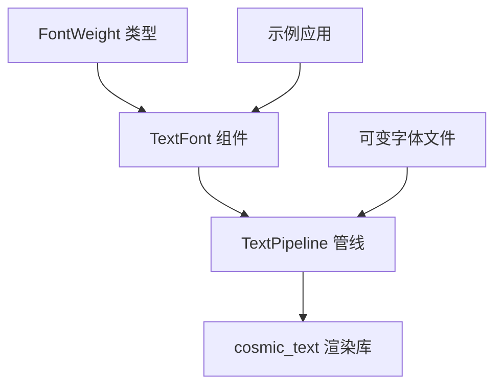

+++
title = "#22038 Font weight support"
date = "2025-12-16T00:00:00"
draft = false
template = "pull_request_page.html"
in_search_index = false

[extra]
current_language = "zh-cn"
available_languages = {"en" = { name = "English", url = "/pull_request/bevy/2025-12/pr-22038-en-20251216" }, "zh-cn" = { name = "中文", url = "/pull_request/bevy/2025-12/pr-22038-zh-cn-20251216" }}
+++

# Font weight support

## 基本信息
- **标题**: Font weight support
- **PR链接**: https://github.com/bevyengine/bevy/pull/22038
- **作者**: ickshonpe
- **状态**: 已合并
- **标签**: C-Feature, S-Ready-For-Final-Review, A-Text, M-Release-Note, D-Modest
- **创建时间**: 2025-12-05T16:39:32Z
- **合并时间**: 2025-12-16T20:39:19Z
- **合并者**: alice-i-cecile

## 描述翻译
### 目标
添加字体粗细支持。

### 解决方案
* 新建 `FontWeight` 结构体，将 `u16` 包装为新类型。
* 在 `TextFont` 上添加新的 `font: FontWeight` 字段。
* 在文本更新期间，在 `TextPipeline` 中设置 cosmic text 缓冲区的 weight 属性。
* 添加了一个新的字体资源 `MonSans-VariableFont.ttf`。这需要一个可变字体进行测试。

### 注意事项
不支持 `lighter` 和 `bolder`，因为这需要文本样式继承，而目前尚未支持。

我还添加了拉伸（stretch）和倾斜（slant）的支持，但将它们从这个 PR 中分离出去了。Swash 仅对可变字体有有限的支持，并且没有其他改动无法演示它们是否工作。

### 测试
添加了一个基础示例：```cargo run --example font_weights```

### 展示


## 这个 PR 的故事

这个 PR 解决了一个直接的文本渲染功能需求：Bevy 引擎之前缺少对字体粗细（font weight）的控制能力。在现代 UI 设计中，字体粗细是一个基本的排版属性，用于创建视觉层次和强调内容。此前，Bevy 的文本系统只能使用字体文件的默认粗细，这限制了开发者创建丰富视觉效果的能力。

从技术实现角度看，这个 PR 遵循了模块化的设计思路，将字体粗细抽象为一个独立的类型，并将其集成到现有的文本渲染管线中。整个实现分为三个主要部分：创建 `FontWeight` 类型、扩展 `TextFont` 组件、修改文本渲染管线以传递粗细信息到底层渲染库。

首先，在 `text.rs` 文件中添加了 `FontWeight` 结构体。这个设计采用新类型模式（newtype pattern），包装一个 `u16` 值来表示粗细程度。有效范围是 1 到 1000，遵循 CSS 标准。结构体还定义了常用的粗细常量，如 `THIN` (100)、`NORMAL` (400)、`BOLD` (700) 等，使开发者能使用语义化的名称而不是原始数值。

```rust
#[derive(Debug, Copy, Clone, PartialEq, Eq, PartialOrd, Ord, Hash, Reflect)]
pub struct FontWeight(pub u16);

impl FontWeight {
    pub const THIN: FontWeight = FontWeight(100);
    pub const NORMAL: FontWeight = FontWeight(400);
    pub const BOLD: FontWeight = FontWeight(700);
    // ... 其他常量
}
```

然后，这个类型被添加到 `TextFont` 组件中，作为新的 `weight` 字段，默认值为 `FontWeight::NORMAL`。这是一个直观的 API 设计，开发者可以像设置字体大小一样设置字体粗细：

```rust
TextFont {
    font: font.clone(),
    font_size: 32.0,
    weight: FontWeight::BOLD,
    ..default()
}
```

在底层实现层面，主要修改位于 `pipeline.rs` 中的 `TextPipeline`。这个管道负责将 Bevy 的文本组件转换为底层 `cosmic_text` 库能处理的格式。这里的关键变化是在 `queue_text` 方法中，原来用于存储字形信息的元组从 6 个字段扩展为 7 个字段，新增的最后一个字段存储字体粗细值。

在代码重构过程中，一个值得注意的设计决策是移除了 `FontFaceInfo` 结构体中的 `weight` 字段。这是因为字体文件的原始粗细信息不再直接从字体元数据中读取，而是从 `TextFont` 组件中获取。这使应用程序能动态控制文本粗细，而不受限于字体文件内置的固定粗细变体。

将粗细信息传递给 `cosmic_text` 的逻辑体现在两个地方：首先，在构建字形信息时存储粗细值；其次，在获取字体实例时使用该值：

```rust
// 存储粗细值
self.glyph_info.push((
    text_font.font.id(),
    text_font.font_smoothing,
    text_font.font_size,
    0.0,
    0.0,
    0.0,
    text_font.weight.clamp().0, // 新增字段
));

// 使用粗细值获取字体
if let Some((id, _)) = self.map_handle_to_font_id.get(&section_info.0)
    && let Some(font) = font_system.get_font(*id, cosmic_text::Weight(section_info.6))
{
    // 计算文本度量信息
}
```

这里使用了 Rust 1.78 引入的 `let`-链式模式（let-chains），使条件判断更清晰。`section_info.6` 访问元组的第七个元素，即之前存储的粗细值。

这个实现的一个重要技术细节是它依赖于可变字体（variable fonts）的支持。传统字体文件通常只包含少数几个离散的粗细变体（如常规和粗体），而可变字体能在单个文件中连续调整粗细值。这就是为什么 PR 中添加了 `MonaSans-VariableFont.ttf` 这个可变字体文件用于测试。对于非可变字体，`cosmic_text` 会选择最接近的可用粗细。

PR 作者提到他们最初还实现了拉伸（stretch）和倾斜（slant）支持，但将这些功能分离到独立的 PR 中。这是一个明智的工程决策，保持了每个 PR 的专注性和可审查性。此外，PR 明确说明了不支持 `lighter` 和 `bolder` 这两个 CSS 相对值，因为它们需要文本样式继承机制，这超出了当前 PR 的范围。

从架构角度看，这个 PR 展示了 Bevy 引擎中典型的特性添加模式：定义清晰的类型、集成到组件系统中、在渲染管线中与底层库对接。`FontWeight` 结构体实现了 `Reflect` trait，使其能用于 Bevy 的反射系统；还实现了 `From<FontWeight> for cosmic_text::Weight` 转换，确保类型安全的同时简化了类型转换。

## 视觉表示



## 关键文件变更

### 1. `crates/bevy_text/src/text.rs` (+75/-0)
**变更描述**：添加了 `FontWeight` 结构体定义，并在 `TextFont` 组件中添加 `weight` 字段。

**关键代码**：
```rust
// FontWeight 结构体定义
#[derive(Debug, Copy, Clone, PartialEq, Eq, PartialOrd, Ord, Hash, Reflect)]
pub struct FontWeight(pub u16);

impl FontWeight {
    pub const THIN: FontWeight = FontWeight(100);
    pub const EXTRA_LIGHT: FontWeight = FontWeight(200);
    pub const LIGHT: FontWeight = FontWeight(300);
    pub const NORMAL: FontWeight = FontWeight(400);
    pub const MEDIUM: FontWeight = FontWeight(500);
    pub const SEMIBOLD: FontWeight = FontWeight(600);
    pub const BOLD: FontWeight = FontWeight(700);
    pub const EXTRA_BOLD: FontWeight = FontWeight(800);
    pub const BLACK: FontWeight = FontWeight(900);
    pub const EXTRA_BLACK: FontWeight = FontWeight(950);
    
    pub const DEFAULT: FontWeight = Self::NORMAL;
    
    pub const fn clamp(mut self) -> Self {
        if self.0 == 0 {
            self = Self::DEFAULT;
        } else if 1000 < self.0 {
            self.0 = 1000;
        }
        Self(self.0)
    }
}

// TextFont 组件添加 weight 字段
pub struct TextFont {
    pub font: Handle<Font>,
    pub font_size: f32,
    pub weight: FontWeight, // 新增字段
    pub font_features: FontFeatures,
    pub font_smoothing: FontSmoothing,
}
```

### 2. `crates/bevy_text/src/pipeline.rs` (+13/-20)
**变更描述**：修改文本渲染管线以支持字体粗细，更新字形信息存储和字体获取逻辑。

**关键代码**：
```rust
// 之前: glyph_info 有 6 个字段
// 之后: glyph_info 有 7 个字段，最后一个存储字体粗细
self.glyph_info.push((
    text_font.font.id(),
    text_font.font_smoothing,
    text_font.font_size,
    0.0,
    0.0,
    0.0,
    text_font.weight.clamp().0, // 新增
));

// 字体获取逻辑更新，使用存储的粗细值
if let Some((id, _)) = self.map_handle_to_font_id.get(&section_info.0)
    && let Some(font) = font_system.get_font(*id, cosmic_text::Weight(section_info.6))
{
    let swash = font.as_swash();
    let metrics = swash.metrics(&[]);
    let upem = metrics.units_per_em as f32;
    let scalar = section_info.2 * scale_factor as f32 / upem;
    section_info.3 = (metrics.strikeout_offset * scalar).round();
    section_info.4 = (metrics.stroke_size * scalar).round().max(1.);
    section_info.5 = (metrics.underline_offset * scalar).round();
}
```

### 3. `examples/ui/font_weights.rs` (+128/-0)
**变更描述**：新增示例程序，展示如何使用不同的字体粗细。

**关键代码**：
```rust
// 示例展示了 9 种不同的字体粗细
children![
    (
        Text::new("Weight 100 (Thin)"),
        TextFont {
            font: font.clone(),
            font_size: 32.0,
            weight: FontWeight::THIN,
            ..default()
        },
    ),
    (
        Text::new("Weight 400 (Normal)"),
        TextFont {
            font: font.clone(),
            font_size: 32.0,
            weight: FontWeight::NORMAL,
            ..default()
        },
    ),
    (
        Text::new("Weight 700 (Bold)"),
        TextFont {
            font: font.clone(),
            font_size: 32.0,
            weight: FontWeight::BOLD,
            ..default()
        },
    ),
    // ... 其他粗细示例
]
```

### 4. `assets/fonts/MonaSans-VariableFont.ttf` (新增二进制文件)
**变更描述**：添加可变字体文件用于测试字体粗细功能。

### 5. `assets/fonts/OFL.txt` (+93/-0)
**变更描述**：添加字体许可文件。

### 6. `Cargo.toml` (+11/-0)
**变更描述**：注册新的示例程序到项目配置中。

## 进一步阅读
- [CSS font-weight 属性规范](https://developer.mozilla.org/en-US/docs/Web/CSS/font-weight)
- [可变字体指南](https://developer.mozilla.org/en-US/docs/Web/CSS/CSS_Fonts/Variable_Fonts_Guide)
- [Bevy 文本系统文档](https://docs.rs/bevy_text/latest/bevy_text/)
- [cosmic_text 库](https://github.com/pop-os/cosmic-text) - Bevy 使用的底层文本渲染库