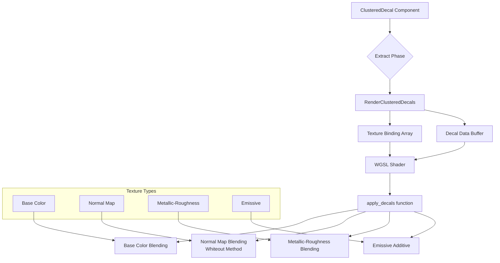

+++
title = "#22039 Add support for normal maps, metallic-roughness maps, and emissive maps to clustered decals."
date = "2025-12-09T00:00:00"
draft = false
template = "pull_request_page.html"
in_search_index = true

[taxonomies]
list_display = ["show"]

[extra]
current_language = "en"
available_languages = {"en" = { name = "English", url = "/pull_request/bevy/2025-12/pr-22039-en-20251209" }, "zh-cn" = { name = "中文", url = "/pull_request/bevy/2025-12/pr-22039-zh-cn-20251209" }}
labels = ["C-Feature", "A-Rendering", "M-Release-Note"]
+++

# Title

## Basic Information
- **Title**: Add support for normal maps, metallic-roughness maps, and emissive maps to clustered decals.
- **PR Link**: https://github.com/bevyengine/bevy/pull/22039
- **Author**: pcwalton
- **Status**: MERGED
- **Labels**: C-Feature, A-Rendering, S-Ready-For-Final-Review, M-Release-Note
- **Created**: 2025-12-05T18:14:03Z
- **Merged**: 2025-12-09T18:40:55Z
- **Merged By**: alice-i-cecile

## Description Translation

This commit expands the number of textures associated with each clustered decal from 1 to 4. The additional 3 textures apply normal maps, metallic-roughness maps, and emissive maps respectively to the surfaces onto which decals are projected.

Normal maps are combined using the [*Whiteout* blending method] from SIGGRAPH 2007. This approach was chosen because, subjectively, it appeared better than the more complex [*reoriented normal mapping* (RNM)] approach. Additionally, *Whiteout* normal map blending is commutative and associative, unlike RNM, which is a useful property for our decals, which are currently applied in an unspecified order. (The fact that the order in which our decals are applied is unspecified is unfortunate, but is a long-standing issue and should probably be fixed in a followup.) In particular, commutativity is desirable because otherwise one must specify which normal map is the *base* normal map and which normal map is the *detail* normal map, but that's not a policy decision that Bevy can unconditionally make, as decals aren't necessary more detailed than the base normal map. (For instance, consider a bullet hole decal embedded in a wall with a subtle rough texture; one might reasonably argue that the base material's normal map is the detail map and the bullet hole is the base map, even though the bullet hole's normal map comes from a decal.)

Note that, with a custom material shader, it's possible for application code to use the decal images for arbitrary other purposes. For example, with a custom shader an application might use the metallic-roughness map as a clearcoat map instead if it has no need for a metallic-roughness map on a decal. And, of course, a custom material shader could adopt RNM blending for decals if it wishes.

A new example, `clustered_decal_maps`, has been added. This example demonstrates the new maps by spawning clustered decals with maps randomly over time and projecting them onto a wall.


## The Story of This Pull Request

The PR addresses a limitation in Bevy's clustered decals system, which previously supported only a single base color texture. This constrained the visual complexity that could be achieved with decals. In practice, realistic surface details often require modifying surface normals (for depth and detail), material properties (like metallic and roughness), and even emissive properties (for glowing effects).

The core problem was straightforward: clustered decals needed to support more texture types to match the capabilities of modern PBR materials. However, the implementation required careful consideration of several technical aspects. The `ClusteredDecal` component was redesigned from having a single required `image` field to having four optional texture handles: `base_color_texture`, `normal_map_texture`, `metallic_roughness_texture`, and `emissive_texture`. This approach maintains backward compatibility through the `Default` trait and allows users to specify only the textures they need.

A key decision involved normal map blending. The developer considered two approaches: reoriented normal mapping (RNM) and the Whiteout method. RNM, while more sophisticated, is neither commutative nor associative, which presents problems because Bevy's decals are applied in an unspecified order. The Whiteout method, despite being simpler, offers both commutativity and associativity, making it more suitable for a system where multiple decals can overlap unpredictably. This property ensures consistent results regardless of application order, which is critical when the rendering engine doesn't guarantee a specific ordering.

The implementation required changes across multiple layers of the rendering system. The extract phase in `clustered.rs` was restructured to handle arrays of optional texture IDs, converting them to indices in the bindless texture array (or `-1` to indicate no texture). The shader code in `clustered.wgsl` saw the most significant changes, with the `ClusteredDecalIterator` expanding from a single `texture_index` to four separate indices. A new `apply_decals` function replaced the old `apply_decal_base_color`, performing comprehensive PBR material modifications.

Shader changes were carefully designed to maintain performance. Texture sampling occurs only for slots with valid indices (checked via `>= 0` conditions). The normal map blending uses the Whiteout formula: `Nt = vec3(Nt.xy + Nd.xy, Nt.z * Nd.z)`. Metallic and roughness values are blended using the base color's alpha channel as the blend factor, following the Porter-Duff OVER operator logic. Emissive values are additively combined.

The PR also introduced a new example, `clustered_decal_maps`, which demonstrates the feature by spawning animated decals onto a textured plane. This example not only shows the visual results but also provides a reference implementation for users. The example loads specialized textures from a remote repository, including normal maps and metallic-roughness maps in non-sRGB color space, demonstrating proper asset configuration.

From an architectural perspective, this change enhances the clustered decals system to be more feature-complete while maintaining flexibility. The use of optional textures allows for efficient memory usage, and the clear separation of concerns between the Rust systems and WGSL shader code maintains Bevy's modular design. The implementation also properly handles edge cases, such as ensuring at least one texture exists in the binding array to satisfy WGSL constraints.

## Visual Representation



## Key Files Changed

### `examples/3d/clustered_decal_maps.rs` (+445/-0)
This new example demonstrates the enhanced decal system by spawning decals with all four texture types onto a plane. The example includes animation systems for decal appearance/disappearance and UI controls for toggling emissive effects.

```rust
// Key code showing the updated ClusteredDecal usage:
ClusteredDecal {
    base_color_texture: Some(app_textures.decal_base_color_texture.clone()),
    normal_map_texture: Some(app_textures.decal_normal_map_texture.clone()),
    metallic_roughness_texture: Some(app_textures.decal_metallic_roughness_map_texture.clone()),
    emissive_texture: if app_status.emissive_decals {
        Some(app_textures.decal_emissive_texture.clone())
    } else {
        None
    },
    ..ClusteredDecal::default()
}
```

### `crates/bevy_pbr/src/decal/clustered.wgsl` (+112/-30)
The shader code was significantly expanded to support multiple texture types and implement the Whiteout normal blending method.

```wgsl
// Before (simplified):
fn apply_decal_base_color(world_position: vec3<f32>, frag_coord: vec2<f32>, initial_base_color: vec4<f32>) -> vec4<f32> {
    // Only handled base color
}

// After:
fn apply_decals(pbr_input: ptr<function, PbrInput>) {
    // Handles all four texture types
    if (iterator.normal_map_texture_index >= 0) {
        let Nd = textureSampleLevel(...).rgb * 2.0 - 1.0;
        // Whiteout normal map blending
        Nt = vec3(Nt.xy + Nd.xy, Nt.z * Nd.z);
    }
}
```

### `crates/bevy_pbr/src/decal/clustered.rs` (+117/-24)
The extraction system was refactored to handle arrays of optional textures instead of single required textures.

```rust
// Before:
pub fn insert_decal(&mut self, entity: Entity, image: &AssetId<Image>, ...)

// After:
pub fn insert_decal(
    &mut self,
    entity: Entity,
    images: [Option<AssetId<Image>>; IMAGES_PER_DECAL],
    ...
) {
    let image_indices = images.map(|maybe_image_id| match maybe_image_id {
        Some(ref image_id) => self.get_or_insert_image(image_id),
        None => -1,
    });
}
```

### `crates/bevy_light/src/cluster/mod.rs` (+52/-7)
The `ClusteredDecal` component was completely redesigned to support four optional texture fields instead of one required field.

```rust
// Before:
pub struct ClusteredDecal {
    pub image: Handle<Image>,
    pub tag: u32,
}

// After:
pub struct ClusteredDecal {
    pub base_color_texture: Option<Handle<Image>>,
    pub normal_map_texture: Option<Handle<Image>>,
    pub metallic_roughness_texture: Option<Handle<Image>>,
    pub emissive_texture: Option<Handle<Image>>,
    pub tag: u32,
}
```

### `Cargo.toml` (+12/-0)
Added the new example to the workspace configuration with appropriate feature flags.

## Further Reading

- [*Blending in Detail* article](https://blog.selfshadow.com/publications/blending-in-detail/) - Comprehensive discussion of normal map blending techniques including Whiteout and RNM methods.
- [SIGGRAPH 2007: Whiteout Normal Blending](https://dl.acm.org/doi/10.1145/1275808.1276485) - Original paper describing the Whiteout blending method.
- [glTF Material Specification](https://github.com/KhronosGroup/glTF/tree/main/specification/2.0#materials) - Reference for metallic-roughness texture channel conventions (metallic in blue, roughness in green).
- [Porter-Duff Compositing Operators](https://keithp.com/~keithp/porterduff/) - Mathematical foundation for alpha compositing used in base color blending.