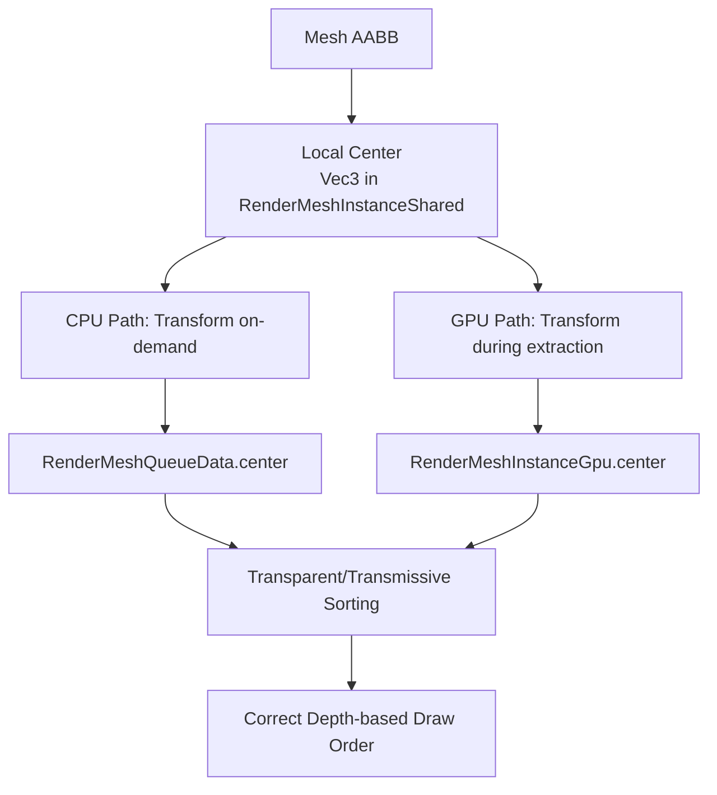

+++
title = "#22041 Use mesh bounds center for transparent/transmissive sorting"
date = "2025-12-15T00:00:00"
draft = false
template = "pull_request_page.html"
in_search_index = true

[taxonomies]
list_display = ["show"]

[extra]
current_language = "en"
available_languages = {"en" = { name = "English", url = "/pull_request/bevy/2025-12/pr-22041-en-20251215" }, "zh-cn" = { name = "中文", url = "/pull_request/bevy/2025-12/pr-22041-zh-cn-20251215" }}
labels = ["A-Rendering", "D-Modest"]
+++

# Use mesh bounds center for transparent/transmissive sorting

## Basic Information
- **Title**: Use mesh bounds center for transparent/transmissive sorting
- **PR Link**: https://github.com/bevyengine/bevy/pull/22041
- **Author**: venhelhardt
- **Status**: MERGED
- **Labels**: A-Rendering, S-Ready-For-Final-Review, D-Modest
- **Created**: 2025-12-05T23:14:50Z
- **Merged**: 2025-12-14T22:32:54Z
- **Merged By**: alice-i-cecile

## Description

Transparent and transmissive phases previously used the instance translation from GlobalTransform as the sort position. This breaks down when mesh geometry is authored in "world-like" coordinates and the instance transform is identity or near-identity (common in building/CAD-style content). In such cases multiple transparent instances end up with the same translation and produce incorrect draw order.

This change introduces sorting based on the world-space center of the mesh bounds instead of the raw translation. The local bounds center is stored per mesh/instance and transformed by the instance's world transform when building sort keys. This adds a small amount of per-mesh/instance data but produces much more correct transparent and transmissive rendering in real-world scenes.

# Objective

Currently, transparent and transmissive render phases in Bevy sort instances using the translation from GlobalTransform. This works only if the mesh origin is a good proxy for the geometry position. In many real-world cases (especially CAD/architecture-like content), the mesh data is authored in "world-like" coordinates and the instance `Transform` is identity. In such setups, sorting by translation produces incorrect draw order for transparent/transmissive objects.

I propose switching the sorting key from `GlobalTransform.translation` to the world-space center of the mesh bounds for each instance.

## Solution

Instead of using `GlobalTransform.translation` as the sort position for transparent/transmissive phases, use the world-space center of the mesh bounds:

1. Store the local-space bounds center for each render mesh (e.g. in something like `RenderMeshInstanceShared` as `center: Vec3` derived from the mesh `Aabb`).
2. For each instance, compute the world-space center by applying the instance transform.
3. Use this world-space center as the position for distance / depth computation in view space when building sort keys for transparent and transmissive phases.

This way:
- Sorting respects the actual spatial position of the geometry
- Instances with baked-in "world-like" coordinates inside the mesh are handled correctly
- Draw order for transparent objects becomes much more stable and visually correct in real scenes

The main trade-offs:
- Adding a Vec3 center in `RenderMeshInstanceShared` (typically +12 or +16 bytes depending on alignment),
- For each instance, we need to transform the local bounds center into world space to compute the sort key.

### Alternative approach and its drawbacks

In theory, this could be fixed by **baking** meshes so that:

- The mesh is recentered around its local bounding box center, and
- The instance `Transform` is adjusted to move it back into place.

However, this has several drawbacks:

- Requires modifying vertex data for each mesh (expensive and error-prone)
- Requires either duplicating meshes or introducing one-off edits, which is bad for instancing and memory
- Complicates asset workflows (tools, exporters, pipelines)
- Still does not address dynamic or procedurally generated content

In practice, this is not a scalable or convenient solution.

### Secondary issue: unstable ordering when depth is equal

There is another related problem with the current sorting: when two transparent/transmissive instances end up with the same view-space depth (for example, their centers project onto the same depth plane), the resulting draw order becomes unstable. This leads to visible flickering, because the internal order of `RenderEntity` items is not guaranteed to be
stable between frames.

In practice this happens quite easily, especially when multiple transparent instances share the same or very similar sort depth, and
their relative order in the extracted render list can change frame to frame.

To address this, I suggest extending the sort key with a deterministic tie-breaker, for example the entity's main index. Conceptually, the sort key would become:

- primary: view-space depth (or distance), 
- secondary: stable per-entity index

This ensures that instances with the same depth keep a consistent draw order across frames, removing flickering while preserving the intended depth-based sorting behavior.

## Testing

- Did you test these changes? If so, how?
```sh
cargo run -p ci -- test
cargo run -p ci -- doc
cargo run -p ci -- compile
```
- Are there any parts that need more testing? Not sure
- How can other people (reviewers) test your changes? Is there anything specific they need to know?
Run this "example"
```rust
use bevy::{
    camera_controller::free_camera::{FreeCamera, FreeCameraPlugin},
    prelude::*,
};

fn main() {
    App::new()
        .add_plugins(DefaultPlugins)
        .add_plugins(FreeCameraPlugin)
        .add_systems(Startup, setup)
        .add_systems(Update, view_orient)
        .run();
}

fn setup(
    mut commands: Commands,
    mut meshes: ResMut<Assets<Mesh>>,
    mut materials: ResMut<Assets<StandardMaterial>>,
) {
    let material = materials.add(StandardMaterial {
        base_color: Color::srgb_u8(150, 250, 150).with_alpha(0.7),
        alpha_mode: AlphaMode::Blend,
        ..default()
    });
    let mesh = Cuboid::new(3., 3., 1.)
        .mesh()
        .build()
        .translated_by(Vec3::new(1.5, 1.5, 0.5));

    // Cuboids grids
    for k in -1..=0 {
        let z_offset = k as f32 * 3.;

        for i in 0..3 {
            let x_offset = i as f32 * 3.25;

            for j in 0..3 {
                let y_offset = j as f32 * 3.25;

                commands.spawn((
                    Mesh3d(
                        meshes.add(
                            mesh.clone()
                                .translated_by(Vec3::new(x_offset, y_offset, z_offset)),
                        ),
                    ),
                    MeshMaterial3d(material.clone()),
                ));
            }
        }
    }

    // Cuboids at the center share the same position and are equidistant from the camera
    {
        commands.spawn((
            Mesh3d(meshes.add(mesh.clone().translated_by(Vec3::new(3.25, 3.25, 3.)))),
            MeshMaterial3d(material.clone()),
        ));
        commands.spawn((
            Mesh3d(meshes.add(mesh.clone().translated_by(Vec3::new(3.25, 3.25, 3.)))),
            MeshMaterial3d(materials.add(StandardMaterial {
                base_color: Color::srgb_u8(150, 150, 250).with_alpha(0.6),
                alpha_mode: AlphaMode::Blend,
                ..default()
            })),
        ));
        commands.spawn((
            Mesh3d(meshes.add(mesh.clone().translated_by(Vec3::new(3.25, 3.25, 3.)))),
            MeshMaterial3d(materials.add(StandardMaterial {
                base_color: Color::srgb_u8(250, 150, 150).with_alpha(0.5),
                alpha_mode: AlphaMode::Blend,
                ..default()
            })),
        ));
    }

    commands.spawn((PointLight::default(), Transform::from_xyz(-3., 10., 4.5)));
    commands.spawn((
        Camera3d::default(),
        Transform::from_xyz(-3., 12., 15.).looking_at(Vec3::new(4.75, 4.75, 0.), Vec3::Y),
        FreeCamera::default(),
    ));
    commands.spawn((
        Node {
            position_type: PositionType::Absolute,
            padding: UiRect::all(px(10)),
            ..default()
        },
        GlobalZIndex(i32::MAX),
        children![(
            Text::default(),
            children![
                (TextSpan::new("1 - 3D view\n")),
                (TextSpan::new("2 - Front view\n")),
                (TextSpan::new("3 - Top view\n")),
                (TextSpan::new("4 - Right view\n")),
            ]
        )],
    ));
}

fn view_orient(
    input: Res<ButtonInput<KeyCode>>,
    mut camera_xform: Single<&mut Transform, With<Camera>>,
) {
    let xform = if input.just_pressed(KeyCode::Digit1) {
        Some(Transform::from_xyz(-3., 12., 15.).looking_at(Vec3::new(4.75, 4.75, 0.), Vec3::Y))
    } else if input.just_pressed(KeyCode::Digit2) {
        Some(Transform::from_xyz(4.75, 4.75, 15.).looking_at(Vec3::new(4.75, 4.75, 0.), Vec3::Y))
    } else if input.just_pressed(KeyCode::Digit3) {
        Some(Transform::from_xyz(4.75, 18., -1.).looking_at(Vec3::new(4.75, 0., -1.), Vec3::NEG_Z))
    } else if input.just_pressed(KeyCode::Digit4) {
        Some(Transform::from_xyz(-15., 4.75, -1.).looking_at(Vec3::new(0., 4.75, -1.), Vec3::Y))
    } else {
        None
    };

    if let Some(xform) = xform {
        camera_xform.set_if_neq(xform);
    }
}
```
- If relevant, what platforms did you test these changes on, and are there any important ones you can't test? MacOS

---

## Showcase

In my tests with building models (windows, glass, etc.), switching from translation-based sorting to bounds-center-based sorting noticeably improves the visual result. Transparent surfaces that were previously fighting or blending incorrectly now render in a much more expected order.

### Current:
https://youtu.be/WjDjPAoKK6w

### Sort by aabb center:
https://youtu.be/-Sl4GOXp_vQ

### Sort by aabb center + tie breaker:
https://youtu.be/0aQhkSKxECo

## The Story of This Pull Request

This PR addresses a specific but important problem in Bevy's rendering pipeline: transparent and transmissive rendering phases were sorting objects based on the translation component of their transform, which doesn't work correctly for meshes that are authored with their geometry already positioned in world space.

The core issue occurs in common workflows like CAD or architectural modeling, where meshes are often authored with their geometry already positioned in world coordinates. In these cases, multiple mesh instances might have identity transforms (or transforms that only handle rotation/scale), causing them to share the same translation value. When Bevy sorts transparent objects by translation alone, these meshes get arbitrary draw order, leading to visual artifacts where transparent surfaces blend incorrectly.

The solution changes the sorting key from the raw translation to the world-space center of the mesh's axis-aligned bounding box (AABB). This approach better represents the actual position of the geometry in the scene, rather than relying on the transform's translation component which may not correlate with the mesh's visual position.

The implementation follows a clear path through the codebase:

First, the `RenderMeshInstanceShared` struct needed to store the local-space center of the mesh bounds. This is computed from the mesh's AABB and stored as a `Vec3`:

```rust
// In crates/bevy_pbr/src/render/mesh.rs
pub struct RenderMeshInstanceShared {
    // ... existing fields
    pub center: Vec3,
}
```

The center is computed when creating the shared instance data. The constructor now takes an optional AABB parameter:

```rust
pub fn new(
    // ... other parameters
    aabb: Option<&Aabb>,
) -> Self {
    // ... existing code
    center: aabb.map_or(Vec3::ZERO, |aabb| aabb.center.into()),
}
```

For CPU-side rendering, the world-space center is computed on demand when building render queue data by transforming the local center through the instance's world transform:

```rust
fn render_mesh_queue_data(&self, entity: MainEntity) -> Option<RenderMeshQueueData<'_>> {
    self.get(&entity).map(|render_mesh_instance| {
        let world_from_local = &render_mesh_instance.transforms.world_from_local;
        let center = world_from_local
            .matrix3
            .mul_vec3(render_mesh_instance.shared.center)
            + world_from_local.translation;

        RenderMeshQueueData {
            shared: &render_mesh_instance.shared,
            center,
            current_uniform_index: InputUniformIndex::default(),
        }
    })
}
```

For GPU-side rendering, the world-space center is computed during mesh extraction and stored directly in the GPU instance data:

```rust
let world_from_local = &self.world_from_local;
let center =
    world_from_local.matrix3.mul_vec3(self.shared.center) + world_from_local.translation;

// Later used when creating RenderMeshInstanceGpu
RenderMeshInstanceGpu {
    shared: self.shared,
    center,
    // ... other fields
}
```

The rangefinder utility is simplified to work with any world-space position, not just translations or full transforms:

```rust
// Before: two methods for different inputs
pub fn distance_translation(&self, translation: &Vec3) -> f32
pub fn distance(&self, transform: &Mat4) -> f32

// After: one method for world-space positions
pub fn distance(&self, position: &Vec3) -> f32 {
    self.view_from_world_row_2.dot(position.extend(1.0))
}
```

Finally, the material queueing systems are updated to use the new center field instead of translation:

```rust
// In crates/bevy_pbr/src/material.rs
// Before:
let distance = rangefinder.distance_translation(&mesh_instance.translation)

// After:
let distance = rangefinder.distance(&mesh_instance.center)
```

The changes also update two example files that were using the old `distance_translation` method, demonstrating that external code using the rangefinder needs to adapt to the new API.

An important consideration in this PR is the trade-off between accuracy and memory/performance. Storing an additional `Vec3` per mesh instance adds 12-16 bytes of memory overhead, and computing the world-space center requires a matrix transformation. However, for transparent and transmissive rendering where correct sorting is visually critical, this is a reasonable trade-off.

The PR also mentions a secondary issue: when multiple transparent objects have the same depth value, their draw order becomes unstable between frames, causing flickering. While not implemented in this PR, the author suggests adding a deterministic tie-breaker (like entity index) to the sort key as a future improvement.

From an architectural perspective, this change improves the separation of concerns: the rendering system now uses a geometrically meaningful position for sorting rather than relying on a transform component that may not correspond to visual position. This makes the system more robust to different asset authoring workflows.

The testing approach is thorough, with the author providing a complete example that demonstrates both the problem and solution. The YouTube links in the PR description show clear visual improvements, with transparent objects rendering in the correct depth order after the changes.

## Visual Representation



## Key Files Changed

### `crates/bevy_pbr/src/render/mesh.rs` (+41/-13)
This file contains the core structural changes. The main modifications include:
- Adding `center: Vec3` field to `RenderMeshInstanceShared` to store local-space bounds center
- Replacing `translation: Vec3` with `center: Vec3` in `RenderMeshInstanceGpu` and `RenderMeshQueueData`
- Updating constructors to compute and store the center from mesh AABB
- Modifying data extraction paths to compute world-space center for both CPU and GPU rendering

Key code changes:
```rust
// Before in RenderMeshInstanceGpu:
pub struct RenderMeshInstanceGpu {
    pub shared: RenderMeshInstanceShared,
    pub translation: Vec3,  // Only translation kept for sorting
    // ...
}

// After:
pub struct RenderMeshInstanceGpu {
    pub shared: RenderMeshInstanceShared,
    pub center: Vec3,  // World-space center for sorting
    // ...
}
```

### `crates/bevy_render/src/render_phase/rangefinder.rs` (+8/-19)
This file simplifies the rangefinder API to work with world-space positions:
- Removes `distance_translation` and the `distance` method that took a `Mat4`
- Adds a single `distance` method that takes a `Vec3` (world position)

```rust
// Before: two methods
pub fn distance_translation(&self, translation: &Vec3) -> f32
pub fn distance(&self, transform: &Mat4) -> f32

// After: one unified method
pub fn distance(&self, position: &Vec3) -> f32 {
    self.view_from_world_row_2.dot(position.extend(1.0))
}
```

### `crates/bevy_pbr/src/material.rs` (+2/-2)
Updates the transparent and transmissive material queueing to use the new center-based sorting:

```rust
// Before:
let distance = rangefinder.distance_translation(&mesh_instance.translation)

// After:
let distance = rangefinder.distance(&mesh_instance.center)
```

### `examples/shader_advanced/custom_render_phase.rs` (+1/-1)
### `examples/shader_advanced/custom_shader_instancing.rs` (+1/-1)
These example files are updated to use the new `distance` method with the `center` field instead of the old `distance_translation` method with `translation`.

## Further Reading

- [Bevy Rendering Pipeline Documentation](https://bevyengine.org/learn/book/rendering/) - Understand Bevy's render graph and phases
- [Depth Sorting in Computer Graphics](https://en.wikipedia.org/wiki/Z-order) - Background on depth-based rendering
- [Transparency Sorting Algorithms](https://www.khronos.org/opengl/wiki/Transparency_Sorting) - Common approaches to transparent object rendering
- [Axis-Aligned Bounding Boxes](https://en.wikipedia.org/wiki/Bounding_volume) - Using AABBs for spatial calculations
- [View-Projection Matrices](https://www.scratchapixel.com/lessons/3d-basic-rendering/perspective-and-orthographic-projection-matrix/) - How view-space depth is calculated from world positions