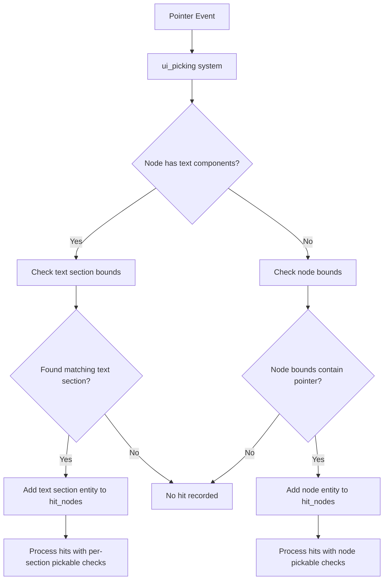

+++
title = "#22047 UI per text section picking"
date = "2025-12-11T00:00:00"
draft = false
template = "pull_request_page.html"
in_search_index = true

[taxonomies]
list_display = ["show"]

[extra]
current_language = "en"
available_languages = {"en" = { name = "English", url = "/pull_request/bevy/2025-12/pr-22047-en-20251211" }, "zh-cn" = { name = "中文", url = "/pull_request/bevy/2025-12/pr-22047-zh-cn-20251211" }}
labels = ["C-Feature", "A-UI", "M-Migration-Guide", "A-Text", "M-Release-Note", "D-Modest", "A-Picking"]
+++

# UI per text section picking

## Basic Information
- **Title**: UI per text section picking
- **PR Link**: https://github.com/bevyengine/bevy/pull/22047
- **Author**: ickshonpe
- **Status**: MERGED
- **Labels**: C-Feature, A-UI, S-Ready-For-Final-Review, M-Migration-Guide, A-Text, M-Release-Note, D-Modest, A-Picking
- **Created**: 2025-12-06T20:20:52Z
- **Merged**: 2025-12-11T02:16:28Z
- **Merged By**: alice-i-cecile

## Description
Allow picking text per section.

Fixes #17477

## Solution

In `ui_picking` whenever a node with text components is below a pointer, don't add the `Text` node's entity to the `hit_nodes` list. Instead, iterate the list of text section bounding rects in its `TextLayoutInfo` component to find which text section the pointer is over, and add that section's entity id to the `hit_nodes` list.

* Add optional text components to `NodeQuery`.
* New helper function, `pick_ui_text`. Finds if a text section is hovered and returns its id.
* Add the entities of text sections to `hit_nodes` when hovered.
* Add the target camera entity to `hit_nodes`, instead of querying for it a  second time.
* When a picked node is a text node and `require_markers` is enabled, check if the hit section entity has a `Pickable` component, instead of the text node.

#

This design might need to be changed later to allow for text selection and copying. But there doesn't seem any need to overcomplicate things for now by considering it.

## Testing

I added observers to the `TextBackgroundColors` example's text entities. The observers turn a text section's text color to white when the pointer hovers them.

```
cargo run --example text_background_colors
```

## The Story of This Pull Request

This pull request addresses a specific limitation in Bevy's UI picking system where text nodes were treated as monolithic clickable areas. The issue #17477 highlighted that developers needed finer-grained control over text interaction, wanting to make individual text sections within a single text node respond to pointer events separately.

The core problem was straightforward: when a UI text node contained multiple sections (like different colored words or styled phrases), the entire rectangular area of the text node would register as pickable, even areas that didn't contain actual text. This made it impossible to create interactive text elements where only the text itself was clickable, not the surrounding empty space in the text node's bounds.

The solution modifies the `ui_picking` system to examine the actual bounding rectangles of individual text sections rather than treating the entire text node as a single pickable area. This required several coordinated changes to the picking backend.

First, the `NodeQuery` needed to be extended to optionally include text layout information:

```rust
pub struct NodeQuery {
    pickable: Option<&'static Pickable>,
    inherited_visibility: Option<&'static InheritedVisibility>,
    target_camera: &'static ComputedUiTargetCamera,
    text_node: Option<(&'static TextLayoutInfo, &'static ComputedTextBlock)>,
}
```

This change allows the picking system to detect when it's dealing with a text node and access the necessary layout data. The `TextLayoutInfo` contains the geometric information about where each text section is rendered, while `ComputedTextBlock` holds the entity relationships for text sections.

The main picking logic in `ui_picking` was restructured to handle text nodes differently. Previously, when a pointer was over a text node, the entire node's entity would be added to the hit list. Now, the system checks if the node has text components and, if so, uses a new helper function `pick_ui_text_section` to determine which specific text section is under the pointer:

```rust
if let Some((text_layout_info, text_block)) = node.text_node {
    if let Some(text_entity) = pick_ui_text_section(
        node.node,
        node.transform,
        *cursor_position,
        text_layout_info,
        text_block,
    ) {
        if settings.require_markers && !pickable_query.contains(text_entity) {
            continue;
        }

        hit_nodes
            .entry((camera_entity, *pointer_id))
            .or_default()
            .push((
                text_entity,
                camera_entity,
                node.transform.inverse().transform_point2(*cursor_position)
                    / node.node.size(),
            ));
    }
}
```

The `pick_ui_text_section` function performs the critical work of mapping pointer coordinates to individual text sections:

```rust
fn pick_ui_text_section(
    uinode: &ComputedNode,
    global_transform: &UiGlobalTransform,
    point: Vec2,
    text_layout_info: &TextLayoutInfo,
    text_block: &ComputedTextBlock,
) -> Option<Entity> {
    let local_point = global_transform
        .try_inverse()
        .map(|transform| transform.transform_point2(point) + 0.5 * uinode.size())?;

    for run in text_layout_info.run_geometry.iter() {
        if run.bounds.contains(local_point) {
            return text_block.entities().get(run.span_index).map(|e| e.entity);
        }
    }
    None
}
```

This function converts the pointer position from global coordinates to the text node's local coordinate system, then iterates through the text layout runs to find which one contains the point. If found, it returns the entity of that specific text section.

An important architectural change was modifying the data structure of `hit_nodes` from `Vec<(Entity, Vec2)>` to `Vec<(Entity, Entity, Vec2)>`. This change stores the camera entity alongside each hit entity, eliminating the need to query for it again later. This is a small but meaningful optimization that reduces redundant work.

The PR also includes necessary adjustments to handle the `Pickable` component correctly. When `require_markers` is enabled (which requires entities to have a `Pickable` component to be pickable), the system now checks if the individual text section entity has a `Pickable` component, not the parent text node. This allows for per-section control over pickability.

The example update demonstrates the practical utility of this feature. The `text_background_colors` example now attaches observers to each text section that change the text color when hovered:

```rust
.observe(
    |event: On<Pointer<Over>>, mut query: Query<&mut TextColor>| {
        if let Ok(mut text_color) = query.get_mut(event.entity) {
            text_color.0 = Color::WHITE;
        }
    },
)
.observe(
    |event: On<Pointer<Out>>, mut query: Query<&mut TextColor>| {
        if let Ok(mut text_color) = query.get_mut(event.entity) {
            text_color.0 = Color::BLACK;
        }
    },
);
```

This creates a hover effect where individual colored text sections change to white when the pointer is over them, providing immediate visual feedback for the picking behavior.

The PR acknowledges that this implementation might need refinement for future features like text selection and copying, but correctly prioritizes solving the immediate need without overengineering. The migration guide and release notes properly document the breaking change: non-text areas of UI text nodes are no longer pickable, and developers needing the old behavior can use an intermediate parent node to intercept pointer hits.

## Visual Representation



## Key Files Changed

1. **`crates/bevy_ui/src/picking_backend.rs` (+55/-15)**
   - This is the core file where the picking logic was modified to support per-text-section picking.
   - Added text components to `NodeQuery` to detect text nodes.
   - Changed `hit_nodes` data structure to store camera entity alongside hit entity.
   - Added `pick_ui_text_section` helper function for text section picking.
   - Modified picking logic to handle text nodes specially.

   Key changes:
   ```rust
   // Before: Simple node-only picking
   if node.node.contains_point(*node.transform, *cursor_position) {
       hit_nodes
           .entry((camera_entity, *pointer_id))
           .or_default()
           .push((node_entity, position));
   }
   
   // After: Text-aware picking
   if let Some((text_layout_info, text_block)) = node.text_node {
       if let Some(text_entity) = pick_ui_text_section(...) {
           hit_nodes
               .entry((camera_entity, *pointer_id))
               .or_default()
               .push((text_entity, camera_entity, position));
       }
   } else if node.node.contains_point(*node.transform, *cursor_position) {
       hit_nodes
           .entry((camera_entity, *pointer_id))
           .or_default()
           .push((node_entity, camera_entity, position));
   }
   ```

2. **`examples/ui/text_background_colors.rs` (+24/-9)**
   - Updated to demonstrate the new per-text-section picking feature.
   - Added observers to each text section entity that change color on hover.
   - Shows practical use of the feature for interactive text elements.

   Key addition:
   ```rust
   .observe(
       |event: On<Pointer<Over>>, mut query: Query<&mut TextColor>| {
           if let Ok(mut text_color) = query.get_mut(event.entity) {
               text_color.0 = Color::WHITE;
           }
       },
   )
   ```

3. **`release-content/migration-guides/the_non_text_areas_of_text_nodes_are_no_longer_pickable.md` (+7/-0)**
   - New migration guide explaining the breaking change.
   - Documents that only text-containing areas are now pickable.
   - Provides workaround using intermediate parent nodes for old behavior.

4. **`release-content/release-notes/per_text_section_picking.md` (+7/-0)**
   - Release note announcing the new feature.
   - Credits the author and links to the PR.

## Further Reading

- [Bevy Picking System Documentation](https://docs.rs/bevy_picking/latest/bevy_picking/) - For understanding Bevy's picking architecture
- [Bevy UI Text System](https://docs.rs/bevy_text/latest/bevy_text/) - For details on text layout and section management
- [Observer Pattern in Bevy](https://bevyengine.org/learn/quick-start/observers/) - For understanding how observers work with picking events
- [Coordinate Systems in Bevy UI](https://bevyengine.org/learn/quick-start/ui/) - For understanding UI coordinate transformations used in the picking calculations