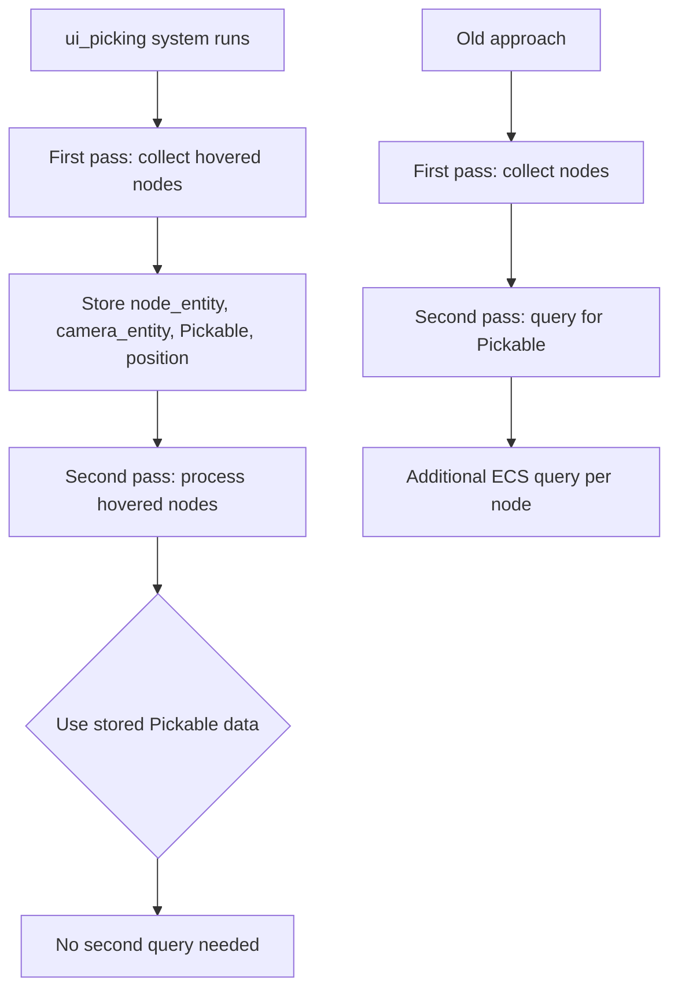

+++
title = "#22049 single query per node in UI picking backend"
date = "2025-12-15T00:00:00"
draft = false
template = "pull_request_page.html"
in_search_index = true

[taxonomies]
list_display = ["show"]

[extra]
current_language = "en"
available_languages = {"en" = { name = "English", url = "/pull_request/bevy/2025-12/pr-22049-en-20251215" }, "zh-cn" = { name = "中文", url = "/pull_request/bevy/2025-12/pr-22049-zh-cn-20251215" }}
labels = ["D-Trivial", "A-UI", "C-Code-Quality", "A-Picking"]
+++

# Title
single query per node in UI picking backend

## Basic Information
- **Title**: single query per node in UI picking backend 
- **PR Link**: https://github.com/bevyengine/bevy/pull/22049
- **Author**: ickshonpe
- **Status**: MERGED
- **Labels**: D-Trivial, A-UI, C-Code-Quality, S-Ready-For-Final-Review, A-Picking
- **Created**: 2025-12-06T21:53:59Z
- **Merged**: 2025-12-15T02:13:04Z
- **Merged By**: alice-i-cecile

## Description Translation
# Objective

The UI picking backend queries twice for the node data. Simplify `ui_picking` by storing the camera entity and picking data in `hit_nodes` instead of the second query.

## Solution

Store the camera entity and picking data in `hit_nodes` instead of querying for them again.

## The Story of This Pull Request

The PR addresses a straightforward optimization in Bevy's UI picking system. The `ui_picking` function, responsible for determining which UI elements are under the cursor, was performing redundant work: it was querying for the same node data twice during its execution. This inefficiency was identified and corrected with a minimal change to the function's data flow.

The core problem was in how the function processed hovered UI nodes. During the initial pass, the function collected nodes that contained the cursor position. For each of these nodes, it stored the node entity and camera entity in a `hit_nodes` hash map. Later, when processing these hovered nodes to create `HitData` structures, the function needed to check each node's `Pickable` component to determine if it should block interaction with nodes beneath it. This check required a second query:

```rust
if let Ok(pickable) = pickable_query.get(*hovered_node) {
    if pickable.should_block_lower {
        break;
    }
}
```

The solution eliminated this redundant query by modifying the data structure to store the `Pickable` component data alongside the node and camera entities during the initial collection phase. The change modified the type of `hit_nodes` from storing tuples of `(Entity, Entity, Vec2)` to `(Entity, Entity, Option<Pickable>, Vec2)`. During the initial pass, when a node is determined to be under the cursor, the function now clones the node's `Pickable` component (if it exists) and stores it:

```rust
hit_nodes
    .entry((camera_entity, pointer))
    .or_default()
    .push((
        node_entity,
        camera_entity,
        node.pickable.cloned(),  // New: store the Pickable data
        node.transform.inverse().transform_point2(*cursor_position)
            / node.node.size(),
    ));
```

This change allows the second processing pass to use the stored `Pickable` data directly without performing an additional query:

```rust
for (hovered_node, camera_entity, pickable, position) in hovered {
    // ...
    if let Some(pickable) = pickable {
        if pickable.should_block_lower {
            break;
        }
    }
}
```

The implementation is a classic example of trading memory for computation time. By storing an additional `Option<Pickable>` (which is a relatively small component containing just a boolean flag) for each hovered node, the function avoids a potentially expensive ECS query per node. This optimization becomes more significant when many UI nodes are under the cursor simultaneously, as it reduces the number of queries from O(n) to O(1) for the second pass.

The change also improves code clarity by making the data dependencies more explicit. The second processing loop now receives all the data it needs as parameters, rather than fetching it from the ECS world. This makes the code easier to reason about and maintains better separation of concerns.

This type of optimization is particularly valuable in Bevy's ECS architecture, where minimizing queries can significantly improve performance. Each query involves iterating through archetypes and checking component matches, so reducing query count is a common optimization pattern in ECS-based systems.

## Visual Representation



## Key Files Changed

### `crates/bevy_ui/src/picking_backend.rs` (+6/-3)

This file contains the main implementation of the UI picking backend. The changes modify the `ui_picking` function to store `Pickable` component data during the initial collection phase, eliminating a redundant query.

**Key changes:**

1. **Modified data structure type**:
```rust
// Before:
let mut hit_nodes = HashMap::<(Entity, PointerId), Vec<(Entity, Entity, Vec2)>>::default();

// After:
let mut hit_nodes = HashMap::<(Entity, PointerId), Vec<(Entity, Entity, Option<Pickable>, Vec2)>>::default();
```

2. **Updated data collection** (for text nodes):
```rust
// Before:
.push((
    text_entity,
    camera_entity,
    node.transform.inverse().transform_point2(*cursor_position)
        / node.node.size(),
));

// After:
.push((
    text_entity,
    camera_entity,
    node.pickable.cloned(),  // New field
    node.transform.inverse().transform_point2(*cursor_position)
        / node.node.size(),
));
```

3. **Updated data processing**:
```rust
// Before:
for (hovered_node, camera_entity, position) in hovered {
    // ...
    if let Ok(pickable) = pickable_query.get(*hovered_node) {
        if pickable.should_block_lower {
            break;
        }
    }
}

// After:
for (hovered_node, camera_entity, pickable, position) in hovered {
    // ...
    if let Some(pickable) = pickable {
        if pickable.should_block_lower {
            break;
        }
    }
}
```

The changes eliminate the `pickable_query` lookup in the second pass by using the stored `Pickable` data from the initial collection phase.

## Further Reading

1. **Bevy ECS System Optimization**: The official Bevy book section on system optimization discusses patterns for minimizing queries and improving performance: https://bevyengine.org/learn/quick-start/ecs-intro/

2. **ECS Architecture Patterns**: For a deeper understanding of Entity Component System architecture and optimization techniques, the "ECS Back and Forth" series provides comprehensive coverage: https://skypjack.github.io/2019-03-07-ecs-baf-part-1/

3. **Rust HashMap Usage**: The Rust standard library documentation for HashMap provides details on the data structure used in this PR: https://doc.rust-lang.org/std/collections/struct.HashMap.html

4. **Bevy Picking System**: The Bevy UI picking system documentation explains how picking works in the engine: https://github.com/bevyengine/bevy/tree/main/crates/bevy_ui/src/picking

# Full Code Diff
diff --git a/crates/bevy_ui/src/picking_backend.rs b/crates/bevy_ui/src/picking_backend.rs
index 1028cfb6b0e5a..d3648ced54f90 100644
--- a/crates/bevy_ui/src/picking_backend.rs
+++ b/crates/bevy_ui/src/picking_backend.rs
@@ -149,7 +149,8 @@ pub fn ui_picking(
     }
 
     // The list of node entities hovered for each (camera, pointer) combo
-    let mut hit_nodes = HashMap::<(Entity, PointerId), Vec<(Entity, Entity, Vec2)>>::default();
+    let mut hit_nodes =
+        HashMap::<(Entity, PointerId), Vec<(Entity, Entity, Option<Pickable>, Vec2)>>::default();
 
     // prepare an iterator that contains all the nodes that have the cursor in their rect,
     // from the top node to the bottom one. this will also reset the interaction to `None`
@@ -222,6 +223,7 @@ pub fn ui_picking(
                             .push((
                                 text_entity,
                                 camera_entity,
+                                node.pickable.cloned(),
                                 node.transform.inverse().transform_point2(*cursor_position)
                                     / node.node.size(),
                             ));
@@ -240,6 +242,7 @@ pub fn ui_picking(
                         .push((
                             node_entity,
                             camera_entity,
+                            node.pickable.cloned(),
                             node.transform.inverse().transform_point2(*cursor_position)
                                 / node.node.size(),
                         ));
@@ -254,13 +257,13 @@ pub fn ui_picking(
         let mut picks = Vec::new();
         let mut depth = 0.0;
 
-        for (hovered_node, camera_entity, position) in hovered {
+        for (hovered_node, camera_entity, pickable, position) in hovered {
             picks.push((
                 *hovered_node,
                 HitData::new(*camera_entity, depth, Some(position.extend(0.0)), None),
             ));
 
-            if let Ok(pickable) = pickable_query.get(*hovered_node) {
+            if let Some(pickable) = pickable {
                 // If an entity has a `Pickable` component, we will use that as the source of truth.
                 if pickable.should_block_lower {
                     break;