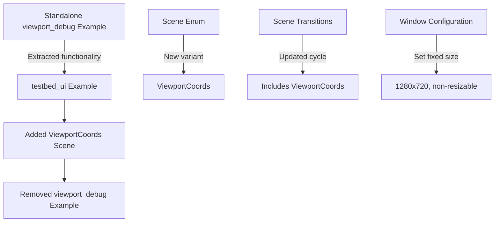

+++
title = "#22050 Adds ViewportCoords Scene to examples/testbed/ui, Removes viewport_debug example"
date = "2025-12-16T00:00:00"
draft = false
template = "pull_request_page.html"
in_search_index = true

[taxonomies]
list_display = ["show"]

[extra]
current_language = "en"
available_languages = {"en" = { name = "English", url = "/pull_request/bevy/2025-12/pr-22050-en-20251216" }, "zh-cn" = { name = "中文", url = "/pull_request/bevy/2025-12/pr-22050-zh-cn-20251216" }}
labels = ["C-Examples", "A-UI", "C-Testing", "D-Straightforward", "M-Deliberate-Rendering-Change"]
+++

# Title

## Basic Information
- **Title**: Adds ViewportCoords Scene to examples/testbed/ui, Removes viewport_debug example
- **PR Link**: https://github.com/bevyengine/bevy/pull/22050
- **Author**: kfc35
- **Status**: MERGED
- **Labels**: C-Examples, A-UI, S-Ready-For-Final-Review, C-Testing, X-Uncontroversial, D-Straightforward, M-Deliberate-Rendering-Change
- **Created**: 2025-12-06T22:04:35Z
- **Merged**: 2025-12-16T17:17:37Z
- **Merged By**: alice-i-cecile

## Description Translation
This is already in English, so I'll include the original description exactly as-is:

# Objective

- Closes #21806

## Solution

- Copies the setup contained in `spawn_with_viewport_coords` from `viewport_debug` into its own scene in the ui testbed. The testbed spawns a 1280 x 720 resolution window by default, so it looks the same. I explicitly set the size anyway and set resizeable to false to accommodate this new scene
- Removes the `viewport_debug` example (Although, tbh, I’m wondering if it’s actually worth keeping around since it might be useful for debugging for whatever reason. **Second opinions welcome** on the deletion of `viewport_debug`)

## Testing

Ran `cargo run --example testbed_ui` and compared the new `ViewportCoords` scene via screenshot to the `viewport_debug` example (`cargo run --example viewport_debug`). They look the same.

---

## Showcase

To see the scene, checkout the branch and run `cargo run --example testbed_ui`. Hit the Spacebar 12x to see the new scene.


## The Story of This Pull Request

This PR addresses a straightforward consolidation of example code in the Bevy game engine. The developer was responding to a GitHub issue (#21806) that identified redundant functionality between two examples. The `viewport_debug` example was a standalone demonstration of viewport coordinates, while the `testbed_ui` example served as a comprehensive collection of UI demonstrations that users could cycle through.

The problem was one of code organization and maintainability. Having two separate examples that demonstrated similar concepts creates maintenance overhead and dilutes the example library. Users looking for UI examples might need to run multiple separate examples instead of finding everything in one place. The developer recognized this and proposed integrating the viewport coordinate demonstration into the existing UI testbed.

The solution approach was direct: extract the core functionality from the standalone example and add it as a new scene in the testbed. The developer made a deliberate choice to include only the viewport coordinates demonstration (not the pixel coordinates comparison) since the testbed is focused on demonstrating individual UI features rather than debugging comparisons.

The implementation involved three main changes. First, the developer modified the `testbed_ui` example to add a new `ViewportCoords` variant to the `Scene` enum and updated the state transition logic to include it. This required adding the new scene to the `Next` trait implementation so users could cycle to it.

Second, they added a new `viewport_coords` module containing the setup function. This function was adapted from the `spawn_with_viewport_coords` function in the original example, with minor adjustments to color usage and component setup. The developer used viewport-relative units (vw, vh, vmin, vmax) to create a responsive layout that adjusts to the window size.

Third, the developer needed to ensure the testbed window had consistent dimensions for the viewport calculations to work correctly. They modified the window configuration to explicitly set a 1280x720 resolution and disable resizing. This was necessary because viewport units (vw, vh) are relative to the window size, and the example's layout depends on specific proportions.

An important technical consideration was the removal of the `UiScale` resource that was present in the original `viewport_debug` example. The testbed doesn't use UI scaling, so the developer omitted it, keeping the demonstration focused on viewport units themselves.

The developer also considered whether to keep the original `viewport_debug` example for debugging purposes but ultimately decided to remove it. This decision simplifies the codebase by eliminating redundancy. If users need to debug viewport coordinates, they can still access the functionality through the testbed.

Testing was straightforward: the developer verified visual equivalence between the new scene in the testbed and the original standalone example. This validation ensured the migration didn't break the demonstration's educational value.

The impact of these changes is primarily organizational. The Bevy example library becomes more cohesive, with related UI demonstrations grouped together. This makes it easier for developers to explore UI features without running multiple separate examples. The reduction in code duplication also simplifies maintenance.

## Visual Representation



## Key Files Changed

1. **`examples/ui/viewport_debug.rs` (+0/-222)** - This file was completely removed. It contained a standalone example that demonstrated viewport coordinates versus pixel coordinates with a switching mechanism.

2. **`examples/testbed/ui.rs` (+113/-16)** - This is the main file modified in the PR. Key changes include:
   - Window configuration updated to fixed 1280x720 resolution
   - New `ViewportCoords` variant added to the `Scene` enum
   - Updated `Next` trait implementation to include the new scene
   - New `viewport_coords` module with setup function

```rust
// File: examples/testbed/ui.rs
// Before (window configuration):
app.add_plugins((DefaultPlugins,))
    .init_state::<Scene>()
    // ... scene setups

// After:
app.add_plugins(DefaultPlugins.set(WindowPlugin {
    primary_window: Some(Window {
        resolution: (1280, 720).into(),
        resizable: false,
        ..Default::default()
    }),
    ..Default::default()
}))
.init_state::<Scene>()
// ... scene setups including ViewportCoords
```

```rust
// File: examples/testbed/ui.rs
// Before (Scene enum):
enum Scene {
    Image,
    Text,
    // ... other scenes
    Transformations,
    #[cfg(feature = "bevy_ui_debug")]
    DebugOutlines,
}

// After:
enum Scene {
    Image,
    Text,
    // ... other scenes
    Transformations,
    #[cfg(feature = "bevy_ui_debug")]
    DebugOutlines,
    ViewportCoords,  // New variant
}
```

```rust
// File: examples/testbed/ui.rs
// Before (Next trait implementation):
impl Next for Scene {
    fn next(&self) -> Self {
        match self {
            Scene::Image => Scene::Text,
            // ... other transitions
            Scene::RadialGradient => Scene::Transformations,
            Scene::Transformations => Scene::Image,
        }
    }
}

// After:
impl Next for Scene {
    fn next(&self) -> Self {
        match self {
            Scene::Image => Scene::Text,
            // ... other transitions
            Scene::Transformations => Scene::ViewportCoords,
            Scene::ViewportCoords => Scene::Image,
        }
    }
}
```

3. **`Cargo.toml` (+0/-11)** - Removed the `viewport_debug` example from the examples list.

4. **`examples/README.md` (+0/-1)** - Removed the documentation entry for the deleted example.

## Further Reading

For developers interested in learning more about the concepts demonstrated in this PR:

1. **Bevy UI System Documentation**: The official Bevy book's UI chapter covers the fundamentals of Bevy's UI system including nodes, styles, and layout.
2. **Viewport Units in CSS**: While Bevy's implementation differs, the concept of viewport-relative units (vw, vh, vmin, vmax) is similar to CSS. Understanding how these work in web development can help with Bevy UI layout.
3. **Bevy Examples**: The `ui` folder in Bevy's examples directory contains numerous other UI demonstrations that showcase different aspects of the UI system.
4. **Bevy State Management**: The testbed example uses Bevy's state system for scene management, which is documented in the Bevy book's state chapter.